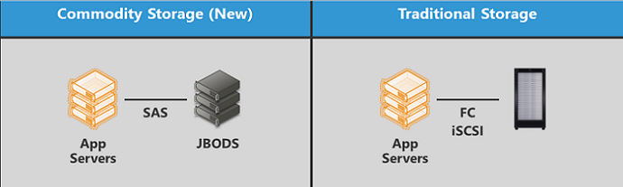

# Choosing Storage for Storage Subsystem Performance

The most important considerations in choosing storage systems include the following:

-   Understanding the characteristics of current and future storage workloads.

-   Understanding that application behavior is essential for storage subsystem planning and performance analysis.

-   Providing necessary storage space, bandwidth, and latency characteristics for current and future needs.

-   Selecting a data layout scheme (such as striping), redundancy architecture (such as mirroring), and backup strategy.

-   Using a procedure that provides the required performance and data recovery capabilities.

-   Using power guidelines; that is, calculating the expected average power required in total and per-unit volume (such as watts per rack).

For example, when compared to 3.5-inch disks, 2.5-inch disks have greatly reduced power requirements; however, they can also be packed more compactly into racks or servers, which can increase cooling requirements per rack or per server chassis.

The better you understand the workloads on a specific server or set of servers, the more accurately you can plan. The following are some important workload characteristics:

-   Read vs. write ratio

-   Sequential vs. random access

-   Typical request sizes

-   Request concurrency, interarrival rates, and patterns of request arrival rates

**In this topic:**

-   [Estimating the amount of data to be stored](#amountdata)

-   [Choosing a storage solution](#storagesol)

-   [Understanding hardware array capabilities](#bkmk-hardwarearray)

-   [Choosing the right resiliency scheme](#resiliency)

-   [Selecting a stripe unit size](#stripe)

-   [Determining the volume layout](#volume)

-   [Choosing and designing storage tiers](#tiers)

## Estimating the amount of data to be stored

When you estimate how much data will be stored on a new server, consider these issues:

-   How much data you will move to the new server from any existing servers

-   How much data you will store on the server in the future

A general guideline is to assume that growth will be faster in the future than it was in the past. Investigate whether your organization plans to hire many employees, whether any groups in your organization are planning large projects that will require additional storage, and so on.

You must also consider how much space is used by operating system files, applications, redundancy, log files, and other factors. The following describes some factors that affect server storage capacity:

<table>
<colgroup>
<col width="50%" />
<col width="50%" />
</colgroup>
<thead>
<tr class="header">
<th>Factor</th>
<th>Required storage capacity</th>
</tr>
</thead>
<tbody>
<tr class="odd">
<td>
Operating system files
</td>
<td>
At least 15GB of space.

To provide space for optional components, future service packs, and other items, plan for an additional 3 GB – 5 GB for the operating system volume. A Windows Server installation can require even more space for temporary files.
</td>
</tr>
<tr class="even">
<td>
Page file
</td>
<td>
A page file managed by the system is usually good enough.

If you want to be sure that full memory dumps can be generated without configuring a dedicated dump file you can set both minimum and maximum size of the pagefile to the size of physical RAM + 50 MB and place the pagefile on any partition. Kernel memory dump requires less space and actual size varies and can be determine through trial and error.

If size of the page file is too small, system generates a minidump and will log an event in the System event log during boot to let you know about this condition.

For more on how to determine a page file size, see [How to determine the appropriate page file size for 64-bit versions of Windows Server 2008 and Windows Server 2008 R2](http://support.microsoft.com/kb/2860880).
</td>
</tr>
<tr class="odd">
<td>
Memory dump
</td>
<td>
In Windows 7 and Windows Server 2008 R2 and later, the paging file does not have to be on the same partition as the partition on which the operating system is installed to get a memory dump. The requirement for a successful dump file creation is to have either a page file present on any partition or dedicated dump file configured if system runs with small page or without page file at all. For more info, see [How to generate a kernel or a complete memory dump file in Windows Server 2008 and Windows Server 2008 R2](http://support.microsoft.com/kb/969028).

In Windows Server 2012 and later, you can enable a dump creation log file to troubleshoot issues with creating a dump file by using the following registry setting: HKLM\SYSTEM\CurrentControlSet\Control\CrashControl\EnableLogFile to 1 (DWORD)
</td>
</tr>
<tr class="even">
<td>
Applications
</td>
<td>
Varies according to the application.

Example applications include backup and disk quota software, database applications, and optional components.
</td>
</tr>
<tr class="odd">
<td>
Log files
</td>
<td>
Varies according to the applications that create the log file.

Some apps let you configure a maximum log file size. You must make sure that you have enough free space to store the log files.
</td>
</tr>
<tr class="even">
<td>
Data layout and redundancy
</td>
<td>
Varies depending on cost, performance, reliability, availability, and power goals.

For more info, see [Performance Tuning for Subsystems](performance-tuning-for-subsystems.md#bkmk-hardwarearray).
</td>
</tr>
<tr class="odd">
<td>
Shadow copies
</td>
<td>
10 percent of the volume, by default, but we recommend increasing this size based on frequency of snapshots and rate of disk data updates.
</td>
</tr>
</tbody>
</table>

 

## Choosing a storage solution

There are many considerations in choosing a storage solution that matches the expected workload. The range of storage solutions that are available to enterprises is immense.

Some administrators will choose to deploy a traditional storage array, backed by SAS or SATA hard drives and directly attached or accessed through a separately managed Fibre Channel or iSCSI fabric. The storage array typically manages the redundancy and performance characteristics internally. The following figure illustrates some storage deployment models that are available in Windows Server 2012 R2.

Alternatively, Windows Server 2012 introduced a new technology called Storage Spaces, which provides platform storage virtualization and is further enhanced in Windows Server 2012 R2. This enables customers to deploy storage solutions that are cost-efficient, highly-available, resilient, and performance by using commodity SAS/SATA hard drives and JBOD enclosures. For more info, see [Using Storage Spaces for Storage Subsystem Performance](using-storage-spaces-for-storage-subsystem-performance.md).

The following table describes some of the options and considerations for a traditional storage array solution.

<table>
<colgroup>
<col width="50%" />
<col width="50%" />
</colgroup>
<thead>
<tr class="header">
<th>Option</th>
<th>Description</th>
</tr>
</thead>
<tbody>
<tr class="odd">
<td>
SAS or SATA
</td>
<td>
These serial protocols improve performance, reduce cable length limitations, and reduce cost. SAS and SATA drives are replacing much of the SCSI market. In general, SATA drives are built with higher capacity and lower cost targets than SAS drives. The premium benefit associated with SAS is typically attributed to performance.
</td>
</tr>
<tr class="even">
<td>
Hardware RAID capabilities
</td>
<td>
For maximum performance and reliability, enterprise storage controllers should offer resiliency capabilities.
</td>
</tr>
<tr class="odd">
<td>
Maximum storage capacity
</td>
<td>
Total usable storage space.
</td>
</tr>
<tr class="even">
<td>
Storage bandwidth
</td>
<td>
The maximum peak and sustained bandwidths at which storage can be accessed are determined by the number of physical disks in the array, the speed of the controllers, the type of bus protocol (such as SAS or SATA), the hardware-managed or software-managed RAID, and the adapters that are used to connect the storage array to the system. The more important values are the achievable bandwidths for the specific workloads to be run on servers that access the storage. The mix of read and write operations as well as the IO size may also affect storage bandwidth. For example, a storage array may provide a higher I/O rate with a mix of 10% read operations compared to a mix of 50% read and 50% write operations. I/O size can also affect bandwidth with larger I/Os generally providing more bandwidth than smaller I/Os.
</td>
</tr>
</tbody>
</table>

 

## Understanding hardware array capabilities

Most storage solutions provide some resiliency and performance-enhancing capabilities. In particular, storage arrays may contain varying types and capacities of caches that can serve to boost performance by servicing reads and writes at memory speeds rather than storage speeds. In some cases, the addition of uninterruptible power supplies or batteries is required to keep the additional performance from coming at a reliability cost.

A hardware-managed array is presented to the operating system as a single drive, which can be termed a logical unit number (LUN), virtual disk, or any number of other names for a single contiguously addressed block storage device.

The following table lists some common storage array options.

<table>
<colgroup>
<col width="50%" />
<col width="50%" />
</colgroup>
<thead>
<tr class="header">
<th>Option</th>
<th>Description</th>
</tr>
</thead>
<tbody>
<tr class="odd">
<td>
Just a bunch of disks (JBOD)
</td>
<td>
This is not a RAID level. It provides a baseline for measuring the performance, reliability, availability, cost, capacity, and energy consumption of various resiliency and performance configurations. Individual disks are referenced separately, not as a combined entity

In some scenarios, a JBOD configuration actually provides better performance than striped data layout schemes. For example, when serving multiple lengthy sequential streams, performance is best when a single disk services each stream. Also, workloads that are composed of small, random requests do not experience performance improvements when they are moved from a JBOD configuration to a striped data layout.

A JBOD configuration is susceptible to static and dynamic hot spots (frequently accessed ranges of disk blocks) that reduce available storage bandwidth due to the resulting load imbalance between the physical drives.

Any physical disk failure results in data loss in a JBOD configuration. However, the loss is limited to the failed drives. In some scenarios, a JBOD configuration provides a level of data isolation that can be interpreted as offering greater reliability than striped configurations.
</td>
</tr>
<tr class="even">
<td>
Spanning
</td>
<td>
This is not a RAID level. Spanning is the concatenation of multiple physical disks into a single logical disk. Each disk contains one continuous set of sequential logical blocks. Spanning has the same performance and reliability characteristics as a JBOD configuration.
</td>
</tr>
<tr class="odd">
<td>
Striping (RAID 0)
</td>
<td>
Striping is a data layout scheme in which sequential logical blocks of a specified size (the stripe unit) are distributed in a circular fashion across multiple disks. It presents a combined logical disk that stripes disk accesses over a set of physical disks. The overall storage load is balanced across all physical drives.

For most workloads, a striped data layout provides better performance than a JBOD configuration if the stripe unit is appropriately selected based on server workload and storage hardware characteristics. The overall storage load is balanced across all physical drives.

This is the least expensive RAID configuration because all of the disk capacity is available for storing the single copy of data.

Because no capacity is allocated for redundant data, striping does not provide data recovery mechanisms such as those provided in the other resiliency schemes. Also, the loss of any disk results in data loss on a larger scale than a JBOD configuration because the entire file system or raw volume spread across <em>n</em> physical disks is disrupted; every <em>n</em>th block of data in the file system is missing.
</td>
</tr>
<tr class="even">
<td>
Mirroring (RAID 1)
</td>
<td>
Mirroring is a data layout scheme in which each logical block exists on multiple physical disks (typically two, but sometimes three in mission-critical environments). It presents a virtual disk that consists of a set of two or more mirrored disks.

Mirroring often has worse bandwidth and latency for write operations when compared to striping or JBOD. This is because data from each write request must be written to a pair of physical disks. Request latency is based on the slowest of the two (or more) write operations that are necessary to update all copies of the updated data blocks. In more complex implementations, write latencies may be reduced by write logging or battery-backed write caching, or by relaxing the requirement for dual write completions before returning the I/O completion notification.

Mirroring has the potential to provide faster read operations than striping because it can (with a sufficiently intelligent controller) read from the least busy physical disk of the mirrored pair, or the disk that will experience the shortest mechanical positioning delays.

Mirroring is the most expensive resiliency scheme in terms of physical disks because half (or more) of the disk capacity stores redundant data copies. A mirrored array can survive the loss of any single physical disk. In larger configurations, it can survive multiple disk failures if the failures do not involve all the disks of a specific mirrored disk set.

Mirroring has greater power requirements than a non-mirrored storage configuration. It doubles the number of disks; therefore, it doubles the required amount of idle power. Also, mirroring performs duplicate write operations that require twice the power of non-mirrored write operations.

In the simplest implementations, mirroring is the fastest of the resiliency schemes in terms of recovery time after a physical disk failure. Only a single disk (the other part of the broken mirror pair) must participate in bringing up the replacement drive. The second disk is typically still available to service data requests throughout the rebuilding process. In more complex implementations, multiple drives may participate in the recovery phase to help spread out the load for the duration of the rebuild.
</td>
</tr>
<tr class="odd">
<td>
Striped mirroring (RAID 0+1 or 10)
</td>
<td>
The combination of striping and mirroring is intended to provide the performance benefits of striping and the redundancy benefits of mirroring.

The cost and power characteristics are similar to those of mirroring.
</td>
</tr>
<tr class="even">
<td>
Rotated parity or parity disks (RAID 5)
</td>
<td>
An array with rotated parity (denoted as RAID 5 for expediency) presents a logical disk that is composed of multiple physical disks that have data striped across the disks in sequential blocks (stripe units) in a manner similar to simple striping (RAID 0). However, the underlying physical disks have parity information spread throughout the disk array, as in the example shown in the figure below.

For read requests, RAID 5 has characteristics that resemble those of striping. However, small RAID 5 writes are much slower than those of other resiliency schemes because each parity block that corresponds to the modified data blocks must also be updated. This process requires three additional disk requests in the simplest implementation, regardless of the size of the array. Each small write requires two reads (old data and old parity) and two writes (new data and new parity). Because multiple physical disk requests are generated for every logical write, bandwidth is reduced by up to 75 percent.

RAID 5 arrays provide data recovery capabilities because data can be reconstructed from the parity. Such arrays can survive the loss of any one physical disk, as opposed to mirroring, which can survive the loss of multiple disks if the mirrored pair (or triplet) is not lost.

RAID 5 requires additional time to recover from a lost physical disk compared to mirroring because the data and parity from the failed disk can be re-created only by reading all the other disks in their entirety. In a basic implementation, performance during the rebuilding period is severely reduced due to the rebuilding traffic and because the reads and writes that target the data that was stored on the failed disk must read all the disks (an entire stripe) to re-create the missing data. More complex implementations incorporating multiple arrays may take advantage of more parallelism from other disks to help speed up recovery time.

RAID 5 is more cost efficient than mirroring because it requires only an additional single disk per array, instead of double (or more) the total number of disks in an array.

Power guidelines: RAID 5 might consume more or less energy than a mirrored configuration, depending on the number of drives in the array, the characteristics of the drives, and the characteristics of the workload. RAID 5 might use less energy if it uses significantly fewer drives. The additional disk adds to the required amount of idle power as compared to a JBOD array, but it requires less additional idle power versus a full mirrored set of drives. However, RAID 5 requires four accesses for every random write request (in the basic implementation) to read the old data, read the old parity, compute the new parity, write the new data, and write the new parity.

This means that the power needed beyond idle to perform the write operations is up to four times that of a JBOD configuration or two times that of a mirrored configuration. (Depending on the workload, there may be only two seeks, not four, that require moving the disk actuator.) Thus, although unlikely in most configurations, RAID 5 might have greater energy consumption. This might happen if a heavy workload is being serviced by a small array or an array of disks with idle power that is significantly lower than their active power.
</td>
</tr>
<tr class="odd">
<td>
Double rotated parity, or double parity disks (RAID 6)
</td>
<td>
Traditional RAID 6 is basically RAID 5 with additional redundancy built in. Instead of a single block of parity per stripe of data, two blocks of redundancy are included. The second block uses a different redundancy code (instead of parity), which enables data to be reconstructed after the loss of any two disks. More complex implementations may take advantage of algorithmic or hardware optimizations to reduce the overhead that is associated with maintaining the extra redundant data.

As far as power and performance, the same general statements can be made for RAID 6 that were made for RAID 5, but to a larger magnitude.
</td>
</tr>
</tbody>
</table>

 

Rotated redundancy schemes (such as RAID 5 and RAID 6) are the most difficult to understand and plan for. The following figure shows a RAID 5 example, where the sequence of logical blocks presented to the host is A0, B0, C0, D0, A1, B1, C1, E1, and so on.

## Choosing the right resiliency scheme

Each RAID level involves a trade-off between the following factors:

-   Performance

-   Reliability

-   Availability

-   Cost

-   Capacity

-   Power

To determine the best array configuration for your servers, evaluate the read and write loads of all data types and then decide how much you can spend to achieve the performance, availability, and reliability that your organization requires. The following table describes common configurations and their relative performance, reliability, availability, cost, capacity, and energy consumption.

<table>
<colgroup>
<col width="20%" />
<col width="20%" />
<col width="20%" />
<col width="20%" />
<col width="20%" />
</colgroup>
<thead>
<tr class="header">
<th>Configuration</th>
<th>Performance</th>
<th>Reliability</th>
<th>Availability</th>
<th>Cost, capacity, and power</th>
</tr>
</thead>
<tbody>
<tr class="odd">
<td>
JBOD
</td>
<td>
<strong>Pros</strong>

<ul>
<li>
Concurrent sequential streams to separate disks
</li>
</ul>

<strong>Cons</strong>

<ul>
<li>
Susceptibility to load imbalance
</li>
</ul></td>
<td>
<strong>Pros</strong>

<ul>
<li>
Data isolation; single loss affects one disk
</li>
</ul>

<strong>Cons</strong>

<ul>
<li>
Data loss after one failure
</li>
</ul></td>
<td>
<strong>Pros</strong>

<ul>
<li>
Single loss does not prevent access to other disks
</li>
</ul></td>
<td>
<strong>Pros</strong>

<ul>
<li>
Minimum cost
</li>
<li>
Minimum power
</li>
</ul></td>
</tr>
<tr class="even">
<td>
Striping (RAID 0)

<strong>Requirements</strong>

<ul>
<li>
Two-disk minimum
</li>
</ul></td>
<td>
<strong>Pros</strong>

<ul>
<li>
Balanced load
</li>
<li>
Potential for better response times, throughput, and concurrency
</li>
</ul>

<strong>Cons</strong>

<ul>
<li>
Difficult stripe unit size choice
</li>
</ul></td>
<td>
<strong>Cons</strong>

<ul>
<li>
Data loss after one failure unless workload has replication or resiliency mechanism
</li>
<li>
Single loss affects the entire array
</li>
</ul></td>
<td>
<strong>Cons</strong>

<ul>
<li>
Single loss prevents access to entire array unless workload has replication or resiliency mechanism
</li>
</ul></td>
<td>
<strong>Pros</strong>

<ul>
<li>
Minimum cost
</li>
<li>
Minimum power
</li>
</ul></td>
</tr>
<tr class="odd">
<td>
Mirroring (RAID 1)

<strong>Requirements</strong>

<ul>
<li>
Two-disk minimum
</li>
</ul></td>
<td>
<strong>Pros</strong>

<ul>
<li>
Two data sources for every read request (up to 100% performance improvement)
</li>
</ul>

<strong>Cons</strong>

<ul>
<li>
Writes must update all mirrors (simplest implementation)
</li>
</ul></td>
<td>
<strong>Pros</strong>

<ul>
<li>
Single loss and often multiple losses (in large configurations) are survivable
</li>
</ul></td>
<td>
<strong>Pros</strong>

<ul>
<li>
Single loss and often multiple losses (in large configurations) do not prevent access
</li>
</ul></td>
<td>
<strong>Cons</strong>

<ul>
<li>
Twice the cost of RAID 0 or JBOD
</li>
<li>
Up to twice the power
</li>
</ul></td>
</tr>
<tr class="even">
<td>
Striped mirroring (RAID 0+1 or 10)

<strong>Requirements</strong>

<ul>
<li>
Four-disk minimum
</li>
</ul></td>
<td>
<strong>Pros</strong>

<ul>
<li>
Two data sources for every read request (up to 100% performance improvement)
</li>
<li>
Balanced load
</li>
<li>
Potential for better response times, throughput, and concurrency
</li>
</ul>

<strong>Cons</strong>

<ul>
<li>
Writes must update mirrors
</li>
<li>
Difficult stripe unit size choice
</li>
</ul></td>
<td>
<strong>Pros</strong>

<ul>
<li>
Single loss and often multiple losses (in large configurations) are survivable
</li>
</ul></td>
<td>
<strong>Pros</strong>

<ul>
<li>
Single loss and often multiple losses (in large configurations) do not prevent access
</li>
</ul></td>
<td>
<strong>Cons</strong>

<ul>
<li>
Twice the cost of RAID 0 or JBOD
</li>
<li>
Up to twice the power
</li>
</ul></td>
</tr>
<tr class="odd">
<td>
Rotated parity or parity disks (RAID 5)

<strong>Requirements</strong>

<ul>
<li>
One additional disk
</li>
<li>
Three-disk minimum
</li>
</ul></td>
<td>
<strong>Pros</strong>

<ul>
<li>
Balanced load
</li>
<li>
Potential for better read response times, throughput, and concurrency
</li>
<li>
Good performance when used with a write-back cache
</li>
</ul>

<strong>Cons</strong>

<ul>
<li>
Up to 75% write performance reduction compared to RAID 0 because of read-modify-write
</li>
<li>
Decreased read performance in failure mode
</li>
<li>
All sectors must be read for reconstruction; potential major slowdown
</li>
<li>
Danger of data in invalid state after power loss and recovery if not carefully implemented or battery used
</li>
</ul></td>
<td>
<strong>Pros</strong>

<ul>
<li>
Single loss survivable; active write requests might still become corrupted
</li>
</ul>

<strong>Cons</strong>

<ul>
<li>
Multiple losses affect entire array
</li>
<li>
After a single loss, array is vulnerable until reconstructed
</li>
</ul></td>
<td>
<strong>Pros</strong>

<ul>
<li>
Single loss does not prevent access
</li>
</ul>

<strong>Cons</strong>

<ul>
<li>
Multiple losses prevent access to entire array
</li>
<li>
To speed reconstruction, application access might be slowed or stopped
</li>
</ul></td>
<td>
<strong>Pros</strong>

<ul>
<li>
Only one more disk to power
</li>
</ul>

<strong>Cons</strong>

<ul>
<li>
Up to four times the power for write requests (excluding the idle power)
</li>
</ul></td>
</tr>
<tr class="even">
<td>
Multiple parity or double parity disks (RAID 6)

<strong>Requirements</strong>

<ul>
<li>
Two additional disks
</li>
<li>
Five-disk minimum
</li>
</ul></td>
<td>
<strong>Pros</strong>

<ul>
<li>
Balanced load
</li>
<li>
Potential for better read response times, throughput, and concurrency
</li>
<li>
Good performance when used with a write-back cache
</li>
</ul>

<strong>Cons</strong>

<ul>
<li>
Up to 83% write performance reduction compared to RAID 0 because of multiple read-modify-write
</li>
<li>
Decreased read performance in failure mode
</li>
<li>
All sectors must be read for reconstruction; potential for major slowdown
</li>
<li>
Danger of data in invalid state after power loss and recovery if not carefully implemented or battery used
</li>
</ul></td>
<td>
<strong>Pros</strong>

<ul>
<li>
Single loss survivable; active write requests might still be corrupted
</li>
</ul>

<strong>Cons</strong>

<ul>
<li>
More than two losses affect entire array
</li>
<li>
After two losses, an array is vulnerable until reconstructed
</li>
</ul></td>
<td>
<strong>Pros</strong>

<ul>
<li>
Single loss does not prevent access
</li>
</ul>

<strong>Cons</strong>

<ul>
<li>
More than two losses prevent access to entire array
</li>
<li>
To speed reconstruction, application access might be slowed or stopped
</li>
</ul></td>
<td>
<strong>Pros</strong>

<ul>
<li>
Only two more disks to power
</li>
</ul>

<strong>Cons</strong>

<ul>
<li>
Up to six times the power for write requests (excluding the idle power)
</li>
</ul></td>
</tr>
</tbody>
</table>

 

The following are sample uses for various RAID levels:

-   JBOD configuration: concurrent video streaming

-   Striping (RAID 0): Temporary or reconstructable data, workloads that can develop hot spots in the data, and workloads with high degrees of unrelated concurrency. Also helpful for other workloads with their own resiliency or replication mechanisms, such as some Microsoft Exchange Server configurations.

-   Mirroring (RAID 1): It is always recommended to use striped mirroring (RAID 10) for workloads that involve more than 2 spindles. For only 2 spindles, RAID 1 is necessary, and can be used for database logs, critical data, and concurrent sequential streams.

-   Striped mirroring (RAID 0+1): A general purpose combination of performance and reliability for critical data, workloads with hot spots, database logs and high-concurrency workloads.

-   Rotated parity or parity disks (RAID 5): Web pages, data archives, semi-critical data, workloads without small writes, scenarios in which capital and operating costs are an overriding factor, and read-dominated workloads.

-   Multiple rotated parity or double parity disks (RAID 6): Data mining, data archives, critical data (assuming quick replacement or hot spares), workloads without small writes, scenarios in which cost or power is a major factor, and read-dominated workloads. RAID 6 might also be appropriate for massive datasets, where the cost of mirroring is high and double-disk failure is a real concern (due to the time required to complete an array parity rebuild for disk drives greater than 1 TB).

To determine the number of physical disks that you should include in an array, consider the following information:

-   Bandwidth (and often response time) improves as you add disks. You may need to add more HBAs in the system as throughput may exceed the capability of an individual storage or network HBA.

-   Reliability (in terms of mean time to failure for the array) decreases as you add disks.

-   Usable storage capacity increases as you add disks, but so does cost.

-   For striped arrays, the trade-off is between data isolation (small arrays) and better load balancing (large arrays). For mirrored arrays, the trade-off is between better cost per capacity (for basic mirrors, which is a depth of two physical disks) and the ability to withstand multiple disk failures (for depths of three or four physical disks). Read and Write performance issues can also affect mirrored array size. For arrays with rotated parity (RAID 5), the trade-off is between better data isolation and mean time between failures (MTBF) for small arrays, versus better cost, capacity, and power for large arrays

-   Because hard disk failures are not independent, array sizes must be limited when the array is made up of actual physical disks (that is, a bottom-tier array). The exact amount of this limit is very difficult to determine.

The following is the array size guideline with no available hardware reliability data:

-   Bottom-tier RAID 5 arrays should not extend beyond a single desk-side storage tower or a single row in a rack-mount configuration. This means approximately 8 to 14 physical disks for 3.5-inch storage enclosures. Smaller 2.5-inch disks can be racked more densely; therefore, they might require being divided into multiple arrays per enclosure.

-   Bottom-tier mirrored arrays should not extend beyond two towers or rack-mount rows, with data being mirrored between towers or rows when possible. These guidelines help avoid or reduce the decrease in time between catastrophic failures that is caused by using multiple buses, power supplies, and so on from separate storage enclosures.

## Selecting a stripe unit size

Hardware-managed arrays allow stripe unit sizes ranging from 4 KB to more than 1 MB. The ideal stripe unit size maximizes the disk activity without unnecessarily breaking up requests by requiring multiple disks to service a single request. For example, consider the following:

-   One long stream of sequential requests on a JBOD configuration uses only one disk at a time. To keep all striped disks in use for such a workload, the stripe unit should be at least 1/*n* where *n* is the request size.

-   For *n* streams of small serialized random requests, if *n* is significantly greater than the number of disks and if there are no hot spots, striping does not increase performance over a JBOD configuration. However, if hot spots exist, the stripe unit size must maximize the possibility that a request will not be split while it minimizes the possibility of a hot spot falling entirely within one or two stripe units. You might choose a low multiple of the typical request size, such as five times or ten times, especially if the requests are aligned on some boundary (for example, 4 KB or 8 KB).

-   If requests are large, and the average or peak number of outstanding requests is smaller than the number of disks, you might need to split some requests across disks so that all disks are being used. You can interpolate an appropriate stripe unit size from the previous two examples. For example, if you have 10 disks and 5 streams of requests, split each request in half (that is, use a stripe unit size equal to half the request size). Note that this assumes some consistency in alignment between the request boundaries and the stripe unit boundaries.

-   Optimal stripe unit size increases with concurrency and typical request sizes.

-   Optimal stripe unit size decreases with sequentially and with good alignment between data boundaries and stripe unit boundaries.

## Determining the volume layout

Placing individual workloads into separate volumes has advantages. For example, you can use one volume for the operating system or paging space and one or more volumes for shared user data, applications, and log files. The benefits include fault isolation, easier capacity planning, and easier performance analysis.

You can place different types of workloads into separate volumes on different physical disks. Using separate disks is especially important for any workload that creates heavy sequential loads (such as log files), where a single set of physical disks can be dedicated to handling the updates to the log files. Placing the page file on a separate virtual disk might provide some improvements in performance during periods of high paging.

There is also an advantage to combining workloads on the same physical disks, if the disks do not experience high activity over the same time period. This is basically the partnering of hot data with cold data on the same physical drives.

The first partition on a volume that is utilizing hard disks usually uses the outermost tracks of the underlying disks, and therefore it provides better performance. This guidance does not apply to solid-state storage.

## Choosing and designing storage tiers

With the cost of solid-state devices dropping, it is important to consider including multiple tiers of devices into a storage deployment to achieve better balance between performance, cost, and energy consumption. Traditional storage arrays offer the ability to aggregate and tier heterogeneous storage, but Storage Spaces provides a more robust implementation.

## Related topics

[Performance Tuning for Storage Subsystems](performance-tuning-for-storage-subsystems.md)
