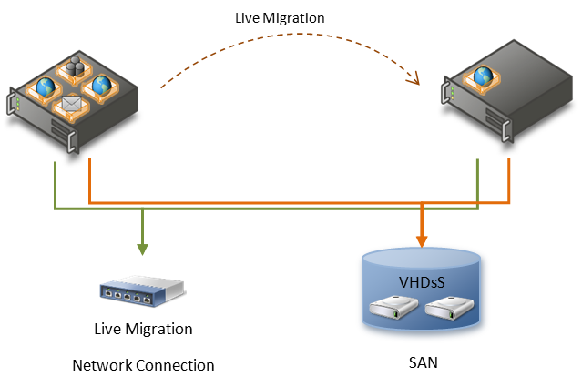

# Performance Tuning for Hyper-V Servers


Hyper-V is the virtualization server role in Windows Server 2012 R2. Virtualization servers can host multiple virtual machines that are isolated from each other but share the underlying hardware resources by virtualizing the processors, memory, and I/O devices. By consolidating servers onto a single machine, virtualization can improve resource usage and energy efficiency and reduce the operational and maintenance costs of servers. In addition, virtual machines and the management APIs offer more flexibility for managing resources, balancing load, and provisioning systems.

**In this topic:**

-   [Hyper-V terminology](#terminology)

-   [Hyper-V architecture](#arch)

-   [Hyper-V server configuration](#serverconfig)

-   [Hyper-V processor performance](#cpu)

-   [Hyper-V memory performance](#memory)

-   [Hyper-V storage I/O performance](#storageio)

-   [Hyper-V network I/O performance](#netio)

-   [Detecting bottlenecks in a virtualized environment](#bottle)

## <a href="" id="terminology"></a>Hyper-V terminology


This section summarizes key terminology specific to virtual machine technology that is used throughout this performance tuning topic:

-   **child partition**

    Any virtual machine that is created by the root partition.

-   **device virtualization**

    A mechanism that lets a hardware resource be abstracted and shared among multiple consumers.

-   **emulated device**

    A virtualized device that mimics an actual physical hardware device so that guests can use the typical drivers for that hardware device.

-   **enlightenment**

    An optimization to a guest operating system to make it aware of virtual machine environments and tune its behavior for virtual machines.

-   **guest**

    Software that is running in a partition. It can be a full-featured operating system or a small, special-purpose kernel. The hypervisor is guest-agnostic.

-   **hypervisor**

    A layer of software that sits above the hardware and below one or more operating systems. Its primary job is to provide isolated execution environments called partitions. Each partition has its own set of virtualized hardware resources (central processing unit or CPU, memory, and devices). The hypervisor controls and arbitrates access to the underlying hardware.

-   **logical processor**

    A processing unit that handles one thread of execution (instruction stream). There can be one or more logical processors per processor core and one or more cores per processor socket.

-   **passthrough disk access**

    A representation of an entire physical disk as a virtual disk within the guest. The data and commands are passed through to the physical disk (through the root partition’s native storage stack) with no intervening processing by the virtual stack.

-   **root partition**

    The root partition that is created first and owns all the resources that the hypervisor does not, including most devices and system memory. The root partition hosts the virtualization stack and creates and manages the child partitions.

-   **Hyper-V-specific device**

    A virtualized device with no physical hardware analog, so guests may need a driver (virtualization service client) to that Hyper-V-specific device. The driver can use virtual machine bus (VMBus) to communicate with the virtualized device software in the root partition.

-   **virtual machine**

    A virtual computer that was created by software emulation and has the same characteristics as a real computer.

-   **virtual network switch**

    (also referred to as a virtual switch) A virtual version of a physical network switch. A virtual network can be configured to provide access to local or external network resources for one or more virtual machines.

-   **virtual processor**

    A virtual abstraction of a processor that is scheduled to run on a logical processor. A virtual machine can have one or more virtual processors.

-   **virtualization service client (VSC)**

    A software module that a guest loads to consume a resource or service. For I/O devices, the virtualization service client can be a device driver that the operating system kernel loads.

-   **virtualization service provider (VSP)**

    A provider exposed by the virtualization stack in the root partition that provides resources or services such as I/O to a child partition.

-   **virtualization stack**

    A collection of software components in the root partition that work together to support virtual machines. The virtualization stack works with and sits above the hypervisor. It also provides management capabilities.

-   **VMBus**

    Channel-based communication mechanism used for inter-partition communication and device enumeration on systems with multiple active virtualized partitions. The VMBus is installed with Hyper-V Integration Services.

-   **Virtual machine queue (VMQ)**

    Virtual machine queue (VMQ) is a feature available to computers running Windows Server 2008 R2 or later with the Hyper-V server role installed, that have VMQ-capable network hardware. VMQ uses hardware packet filtering to deliver packet data from an external virtual machine network directly to virtual machines, which reduces the overhead of routing packets and copying them from the management operating system to the virtual machine.

## <a href="" id="arch"></a>Hyper-V architecture


Hyper-V features a Type 1 hypervisor-based architecture. The hypervisor virtualizes processors and memory and provides mechanisms for the virtualization stack in the root partition to manage child partitions (virtual machines) and expose services such as I/O devices to the virtual machines.

The root partition owns and has direct access to the physical I/O devices. The virtualization stack in the root partition provides a memory manager for virtual machines, management APIs, and virtualized I/O devices. It also implements emulated devices such as the integrated device electronics (IDE) disk controller and PS/2 input device port, and it supports Hyper-V-specific synthetic devices for increased performance and reduced overhead.


The Hyper-V-specific I/O architecture consists of virtualization service providers (VSPs) in the root partition and virtualization service clients (VSCs) in the child partition. Each service is exposed as a device over VMBus, which acts as an I/O bus and enables high-performance communication between virtual machines that use mechanisms such as shared memory. The guest operating system’s Plug and Play manager enumerates these devices, including VMBus, and loads the appropriate device drivers (virtual service clients). Services other than I/O are also exposed through this architecture.

Starting with Windows Server 2008, the operating system features enlightenments to optimize its behavior when it is running in virtual machines. The benefits include reducing the cost of memory virtualization, improving multicore scalability, and decreasing the background CPU usage of the guest operating system.

The following sections suggest best practices that yield increased performance on servers running Hyper-V role. Tuning guidance that can yield increased performance on servers running Hyper-V, based on a live system state, is also available in the Hyper-V Advisor Pack that is included with Server Performance Advisor.

## <a href="" id="serverconfig"></a>Hyper-V server configuration


### Hardware selection

The hardware considerations for servers running Hyper-V generally resemble those of non-virtualized servers, but servers running Hyper-V can exhibit increased CPU usage, consume more memory, and need larger I/O bandwidth because of server consolidation. For more info, see [Performance Tuning for Server Hardware](performance-tuning-for-server-hardware.md).

-   **Processors**

    Hyper-V in Windows Server 2012 R2 presents the logical processors as one or more virtual processors to each active virtual machine. You can achieve additional run-time efficiency by using processors that support Second Level Address Translation (SLAT) technologies such as Extended Page Tables (EPT) or Nested Page Tables (NPT).

-   **Cache**

    Hyper-V can benefit from larger processor caches, especially for loads that have a large working set in memory and in virtual machine configurations in which the ratio of virtual processors to logical processors is high.

-   **Memory**

    The physical server requires sufficient memory for the both the root and child partitions. The root partition requires memory to efficiently perform I/Os on behalf of the virtual machines and operations such as a virtual machine snapshot. Hyper-V ensures that sufficient memory is available to the root partition, and allows remaining memory to be assigned to child partitions. Child partitions should be sized based on the needs of the expected load for each virtual machine.

-   **Networking**

    If the expected loads are network intensive, the virtualization server can benefit from having multiple network adapters or multiport network adapters. Each network adapter is assigned to its own virtual switch, which enables each virtual switch to service a subset of virtual machines. For the teamed NICs just one virtual switched is assigned. When you host multiple virtual machines, using multiple network adapters enables distribution of the network traffic among the adapters for better overall performance.

    To reduce the CPU usage of network I/Os from virtual machines, Hyper-V can use hardware offloads such as Large Send Offload (LSOv1, LSOv2), TCP checksum offload (TCPv4, TCPv6), virtual machine queue (VMQ) and SR-IOV.

    For more info about hardware considerations, see [Performance Tuning for Server Hardware](performance-tuning-for-server-hardware.md).

-   **Storage**

    The storage hardware should have sufficient I/O bandwidth and capacity to meet the current and future needs of the virtual machines that the physical server hosts. Consider these requirements when you select storage controllers and disks and choose the RAID configuration. Placing virtual machines with highly disk-intensive workloads on different physical disks will likely improve overall performance. For example, if four virtual machines share a single disk and actively use it, each virtual machine can yield only 25 percent of the bandwidth of that disk. For details about storage hardware considerations and discussion on sizing and RAID selection, see [Performance Tuning for Network Subsystems](performance-tuning-for-network-subsystems.md).

### Server Core installation option

Windows Server 2012 R2, Windows Server 2012, Windows Server 2008 R2, and Windows Server 2008 feature the Server Core installation option. Server Core offers a minimal environment for hosting a select set of server roles including Hyper-V. It features a smaller disk footprint for the host OS, and a smaller attack and servicing surface. Therefore, we highly recommend that Hyper-V virtualization servers use the Server Core installation option.

A Server Core installation offers a console window only when the user is logged on, but Hyper-V exposes management features by using [Windows Powershell](http://technet.microsoft.com/library/hh848559.aspx) so administrators can manage it remotely.

### Dedicated server role

The root partition should be dedicated to Hyper-V. Running additional server roles on a server running Hyper-V can adversely affect the performance of the virtualization server, especially if they consume significant CPU, memory, or I/O bandwidth. Minimizing the server roles in the root partition has additional benefits such as reducing the attack surface.

System administrators should consider carefully what software is installed in the root partition because some software can adversely affect the overall performance of the server running Hyper-V.

### Guest operating systems

Hyper-V supports and has been tuned for a number of different guest operating systems. The number of virtual processors that are supported per guest depends on the guest operating system. For a list of the supported guest operating systems, see [Hyper-V Overview](http://technet.microsoft.com/library/hh831531.aspx).

You should consider carefully what options get added by using the **bcdedit** command in the guest operating system. Some options may adversely impact the performance of the guest operating system.

### CPU statistics

Hyper-V publishes performance counters to help characterize the behavior of the virtualization server and report the resource usage. The standard set of tools for viewing performance counters in Windows includes Performance Monitor and Logman.exe, which can display and log the Hyper-V performance counters. The names of the relevant counter objects are prefixed with **Hyper-V**.

You should always measure the CPU usage of the physical system by using the Hyper-V Hypervisor Logical Processor performance counters. The CPU utilization counters that Task Manager and Performance Monitor report in the root and child partitions do not reflect the actual physical CPU usage. Use the following performance counters to monitor performance:

-   **Hyper-V Hypervisor Logical Processor (\*)\\% Total Run Time** The total non-idle time of the logical processors

-   **Hyper-V Hypervisor Logical Processor (\*)\\% Guest Run Time** The time spent running cycles within a guest or within the host

-   **Hyper-V Hypervisor Logical Processor (\*)\\% Hypervisor Run Time** The time spent running within the hypervisor

-   **Hyper-V Hypervisor Root Virtual Processor (\*)\\\*** Measures the CPU usage of the root partition

-   **Hyper-V Hypervisor Virtual Processor (\*)\\\*** Measures the CPU usage of guest partitions

## <a href="" id="cpu"></a>Hyper-V processor performance


### Virtual machine integration services

The Virtual Machine Integration Services include enlightened drivers for the Hyper-V-specific I/O devices, which significantly reduces CPU overhead for I/O compared to emulated devices. You should install the latest version of the Virtual Machine Integration Services in every supported virtual machine. The services decrease the CPU usage of the guests, from idle guests to heavily used guests, and improves the I/O throughput. This is the first step in tuning performance in a server running Hyper-V. For a list of supported guest operating systems, see [Hyper-V Overview](http://technet.microsoft.com/library/hh831531.aspx).

### Use enlightened guest operating systems

The operating system kernels in Windows Server 2012 R2, Windows Server 2012, Windows Server 2008 R2, Windows Server 2008, Windows 8, and Windows 8.1, Windows 7, and Windows Vista with SP1 feature enlightenments that optimize their operation for virtual machines.

The enlightenments present in Windows Server 2012 R2, Windows Server 2012, Windows Server 2008 R2, and Windows Server 2008 decrease the CPU overhead of the Windows operating system that is running in a virtual machine. The Virtual Machine Integration Services provide additional enlightenments for I/O. Depending on the server load, it can be appropriate to host a server application in a Windows Server virtual machine for improved performance.

### Virtual processors

Hyper-V in Windows Server 2012 R2 supports a maximum of 64 virtual processors per virtual machine. Virtual machines that have loads that are not CPU intensive should be configured to use one virtual processor. This is because of the additional overhead that is associated with multiple virtual processors, such as additional synchronization costs in the guest operating system.

Increase the number of virtual processors if the virtual machine requires more than one CPU of processing under peak load. For a list of supported guest operating systems, see [Hyper-V Overview](http://technet.microsoft.com/library/hh831531.aspx).

Enlightenments in Windows Server 2012 and Windows Server 2012 R2 improve scalability in multiprocessor virtual machines, like for example database workloads running in a virtual machine with up to 64 virtual processors.

### Background activity

Minimizing the background activity in idle virtual machines releases CPU cycles that can be used elsewhere by other virtual machines. Windows guests typically use less than one percent of one CPU when they are idle. The following are several best practices for minimizing the background CPU usage of a virtual machine:

-   Install the latest version of the Virtual Machine Integration Services.

-   Remove the emulated network adapter through the virtual machine settings dialog box (use the Microsoft Hyper-V-specific adapter).

-   Remove unused devices such as the CD-ROM and COM port, or disconnect their media.

-   Keep the Windows guest operating system on the sign-in screen when it is not being used and disable the screen saver.

-   Review the scheduled tasks and services that are enabled by default.

-   Review the ETW trace providers that are on by default by running **logman.exe query -ets**

-   Improve server applications to reduce periodic activity (such as timers).

-   Close Server Manager on both the host and guest operating systems.

-   Don’t leave Hyper-V Manager running since it constantly refreshes the virtual machine’s thumbnail.

The following are additional best practices for configuring a *client version* of Windows in a virtual machine to reduce the overall CPU usage:

-   Disable background services such as SuperFetch and Windows Search.

-   Disable scheduled tasks such as Scheduled Defrag.

-   Disable Aero glass and other user interface effects.

### Virtual NUMA

To enable virtualizing large scale-up workloads, Hyper-V in Windows Server 2012 introduced expanded virtual machine scale limits. A single virtual machine can be assigned up to 64 virtual processors and 1 TB of memory. When creating such large virtual machines, memory from multiple NUMA nodes on the host system will likely be utilized. In such virtual machine configuration, if virtual processors and memory are not allocated from the same NUMA node, workloads may have bad performance due to the inability to take advantage of NUMA optimizations.

In Windows Server 2012 R2 and Windows Server 2012, Hyper-V presents a virtual NUMA topology to virtual machines. By default, this virtual NUMA topology is optimized to match the NUMA topology of the underlying host computer. Exposing a virtual NUMA topology into a virtual machine allows the guest operating system and any NUMA-aware applications running within it to take advantage of the NUMA performance optimizations, just as they would when running on a physical computer.

There is no distinction between a virtual and a physical NUMA from the workload’s perspective. Inside a virtual machine, when a workload allocates local memory for data, and accesses that data in the same NUMA node, fast local memory access results on the underlying physical system. Performance penalties due to remote memory access are successfully avoided. Only NUMA-aware applications can benefit of vNUMA.

Microsoft SQL Server is an example of NUMA aware application. For more info, see [Understanding Non-uniform Memory Access](http://technet.microsoft.com/library/ms178144.aspx).

Virtual NUMA and Dynamic Memory features cannot be used at the same time. A virtual machine that has Dynamic Memory enabled effectively has only one virtual NUMA node, and no NUMA topology is presented to the virtual machine regardless of the virtual NUMA settings.

For more info on Virtual NUMA, see [Hyper-V Virtual NUMA Overview](http://technet.microsoft.com/library/dn282282.aspx).

## <a href="" id="memory"></a>Hyper-V memory performance


The hypervisor virtualizes the guest physical memory to isolate virtual machines from each other and to provide a contiguous, zero-based memory space for each guest operating system, just as on non-virtualized systems. To ensure that you get maximum performance use SLAT-based hardware to minimize the performance cost of memory virtualization.

### Correct memory sizing for child partitions

You should size virtual machine memory as you typically do for server applications on a physical computer. You must size it to reasonably handle the expected load at ordinary and peak times because insufficient memory can significantly increase response times and CPU or I/O usage.

You can enable Dynamic Memory to allow Windows to size virtual machine memory dynamically. The recommended initial memory size for Windows Server 2012 R2 guests is at least 512 MB. With Dynamic Memory, if applications in the virtual machine experience problems making large sudden memory allocations, you can increase the page file size for the virtual machine to ensure temporary backing while Dynamic Memory responds to the memory pressure.

For more info on Dynamic Memory, see [Hyper-V Dynamic Memory Overview](http://technet.microsoft.com/library/hh831766.aspx) and [Hyper-V Dynamic Memory Configuration Guide](http://technet.microsoft.com/library/ff817651(WS.10).aspx).

When running Windows in the child partition, you can use the following performance counters within a child partition to identify whether the child partition is experiencing memory pressure and is likely to perform better with a higher virtual machine memory size.

<table>
<colgroup>
<col width="50%" />
<col width="50%" />
</colgroup>
<thead>
<tr class="header">
<th>Performance counter</th>
<th>Suggested threshold value</th>
</tr>
</thead>
<tbody>
<tr class="odd">
<td><p>Memory – Standby Cache Reserve Bytes</p></td>
<td><p>Sum of Standby Cache Reserve Bytes and Free and Zero Page List Bytes should be 200 MB or more on systems with 1 GB, and 300 MB or more on systems with 2 GB or more of visible RAM.</p></td>
</tr>
<tr class="even">
<td><p>Memory – Free &amp; Zero Page List Bytes</p></td>
<td><p>Sum of Standby Cache Reserve Bytes and Free and Zero Page List Bytes should be 200 MB or more on systems with 1 GB, and 300 MB or more on systems with 2 GB or more of visible RAM.</p></td>
</tr>
<tr class="odd">
<td><p>Memory – Pages Input/Sec</p></td>
<td><p>Average over a 1-hour period is less than 10.</p></td>
</tr>
</tbody>
</table>

 

### Correct memory sizing for root partition

The root partition must have sufficient memory to provide services such as I/O virtualization, virtual machine snapshot, and management to support the child partitions.

Hyper-V in Windows Server 2012 R2 monitors the runtime health of the root partition’s management operating system to determine how much memory can safely be allocated to child partitions, while still ensuring high performance and reliability of the root partition.

## <a href="" id="storageio"></a>Hyper-V storage I/O performance


This section describes the different options and considerations for tuning storage I/O performance in a virtual machine. The storage I/O path extends from the guest storage stack, through the host virtualization layer, to the host storage stack, and then to the physical disk. Following are explanations about how optimizations are possible at each of these stages.

### Virtual controllers

Hyper-V offers three types of virtual controllers: IDE, SCSI, and Virtual host bus adapters (HBAs).

### IDE

IDE controllers expose IDE disks to the virtual machine. The IDE controller is emulated, and it is the only controller that is available when the Virtual Machine Integration Services are not installed on the guest operating system. Disk I/O that is performed by using the IDE filter driver that is provided with the Virtual Machine Integration Services is significantly better than the disk I/O performance that is provided with the emulated IDE controller. We recommend that IDE disks be used only for the operating system disks because they have performance limitations due to the maximum I/O size that can be issued to these devices.

### SCSI (SAS controller)

SCSI controllers expose SCSI disks to the virtual machine, and each virtual SCSI controller can support up to 64 devices. For optimal performance, we recommend that you attach multiple disks to a single virtual SCSI controller and create additional controllers only as they are required to scale the number of disks connected to the virtual machine. SCSI path is not emulated which makes it the preferred controller for any disk other than the operating system disk. In fact with Generation 2 VMs, it is the only type of controller possible. Introduced in Windows Server 2012 R2, this controller is reported as SAS to support shared VHDX.

### Virtual HBAs

Virtual HBAs can be configured to allow direct access for virtual machines to Fibre Channel and Fibre Channel over Ethernet (FCoE) LUNs. Virtual Fibre Channel disks bypass the NTFS file system in the root partition, which reduces the CPU usage of storage I/O.

Large data drives and drives that are shared between multiple virtual machines (for guest clustering scenarios) are prime candidates for virtual Fibre Channel disks.

Virtual Fibre Channel disks require one or more Fibre Channel host bus adapters (HBAs) to be installed on the host. Each host HBA is required to use an HBA driver that supports the Windows Server 2012 R2 Virtual Fibre Channel/NPIV capabilities. The SAN fabric should support NPIV, and the HBA port(s) that are used for the virtual Fibre Channel should be set up in a Fibre Channel topology that supports NPIV.

To maximize throughput on hosts that are installed with more than one HBA, we recommend that you configure multiple virtual HBAs inside the Hyper-V virtual machine (up to four HBAs can be configured for each virtual machine). Hyper-V will automatically make a best effort to balance virtual HBAs to host HBAs that access the same virtual SAN.

### Virtual disks

Disks can be exposed to the virtual machines through the virtual controllers. These disks could be virtual hard disks that are file abstractions of a disk or a pass-through disk on the host.

### Virtual hard disks

There are two virtual hard disk formats, VHD and VHDX. Each of these formats supports three types of virtual hard disk files.

### VHD format

The VHD format was the only virtual hard disk format that was supported by Hyper-V in past releases. Introduce in Windows Server 2012, the VHD format has been modified to allow better alignment, which results in significantly better performance on new large sector disks.

Any new VHD that is created on a Windows Server 2012 R2 and Windows Server 2012 server has the optimal 4 KB alignment. This aligned format is completely compatible with previous Windows Server operating systems. However, the alignment property will be broken for new allocations from parsers that are not 4 KB alignment-aware (such as a VHD parser from a previous version of Windows Server or a non-Microsoft parser).

Any VHD that is moved from a previous release does not automatically get converted to this new improved VHD format.

To convert to new VHD format, run the following Windows PowerShell command:

``` syntax
Convert-VHD –Path E:\vms\testvhd\test.vhd –DestinationPath E:\vms\testvhd\test-converted.vhd
```

You can check the alignment property for all the VHDs on the system, and it should be converted to the optimal 4 KB alignment. You create a new VHD with the data from the original VHD by using the **Create-from-Source** option.

To check for alignment by using Windows Powershell, examine the Alignment line, as shown below:

``` syntax
Get-VHD –Path E:\vms\testvhd\test.vhd

Path                    : E:\vms\testvhd\test.vhd
VhdFormat               : VHD
VhdType                 : Dynamic
FileSize                : 69245440
Size                    : 10737418240
MinimumSize             : 10735321088
LogicalSectorSize       : 512
PhysicalSectorSize      : 512
BlockSize               : 2097152
ParentPath              :
FragmentationPercentage : 10
Alignment               : 0
Attached                : False
DiskNumber              :
IsDeleted               : False
Number                  :
```

To verify alignment by using Windows PowerShell, examine the Alignment line, as shown below:

``` syntax
Get-VHD –Path E:\vms\testvhd\test-converted.vhd

Path                    : E:\vms\testvhd\test-converted.vhd
VhdFormat               : VHD
VhdType                 : Dynamic
FileSize                : 69369856
Size                    : 10737418240
MinimumSize             : 10735321088
LogicalSectorSize       : 512
PhysicalSectorSize      : 512
BlockSize               : 2097152
ParentPath              :
FragmentationPercentage : 0
Alignment               : 1
Attached                : False
DiskNumber              :
IsDeleted               : False
Number                  :
```

### VHDX format

VHDX is a new virtual hard disk format introduced in Windows Server 2012, which allows you to create resilient high-performance virtual disks up to 64 terabytes. Benefits of this format include:

-   Support for virtual hard disk storage capacity of up to 64 terabytes.

-   Protection against data corruption during power failures by logging updates to the VHDX metadata structures.

-   Ability to store custom metadata about a file, which a user might want to record, such as operating system version or patches applied.

The VHDX format also provides the following performance benefits:

-   Improved alignment of the virtual hard disk format to work well on large sector disks.

-   Larger block sizes for dynamic and differential disks, which allows these disks to attune to the needs of the workload.

-   4 KB logical sector virtual disk that allows for increased performance when used by applications and workloads that are designed for 4 KB sectors.

-   Efficiency in representing data, which results in smaller file size and allows the underlying physical storage device to reclaim unused space. (Trim requires pass-through or SCSI disks and trim-compatible hardware.)

When you upgrade to Windows Server 2012, we recommend that you convert all VHD files to the VHDX format due to these benefits. The only scenario where it would make sense to keep the files in the VHD format is when a virtual machine has the potential to be moved to a previous release of Hyper-V that does not support the VHDX format.

### Types of virtual hard disk files

There are three types of VHD files. The following sections are the performance characteristics and trade-offs between the types.

The following recommendations should be taken into consideration with regards to selecting a VHD file type:

-   When using the VHD format, we recommend that you use the fixed type because it has better resiliency and performance characteristics compared to the other VHD file types.

-   When using the VHDX format, we recommend that you use the dynamic type because it offers resiliency guarantees in addition to space savings that are associated with allocating space only when there is a need to do so.

-   The fixed type is also recommended, irrespective of the format, when the storage on the hosting volume is not actively monitored to ensure that sufficient disk space is present when expanding the VHD file at run time.

-   Snapshots of a virtual machine create a differencing VHD to store writes to the disks. Having only a few snapshots can elevate the CPU usage of storage I/Os, but might not noticeably affect performance except in highly I/O-intensive server workloads. However, having a large chain of snapshots can noticeably affect performance because reading from the VHD can require checking for the requested blocks in many differencing VHDs. Keeping snapshot chains short is important for maintaining good disk I/O performance.

### Fixed virtual hard disk type

Space for the VHD is first allocated when the VHD file is created. This type of VHD file is less likely to fragment, which reduces the I/O throughput when a single I/O is split into multiple I/Os. It has the lowest CPU overhead of the three VHD file types because reads and writes do not need to look up the mapping of the block.

### Dynamic virtual hard disk type

Space for the VHD is allocated on demand. The blocks in the disk start as zeroed blocks, but they are not backed by any actual space in the file. Reads from such blocks return a block of zeros. When a block is first written to, the virtualization stack must allocate space within the VHD file for the block, and then update the metadata. This increases the number of necessary disk I/Os for the Write and increases CPU usage. Reads and writes to existing blocks incur disk access and CPU overhead when looking up the blocks’ mapping in the metadata.

### Differencing virtual hard disk type

The VHD points to a parent VHD file. Any writes to blocks not written to result in space being allocated in the VHD file, as with a dynamically expanding VHD. Reads are serviced from the VHD file if the block has been written to. Otherwise, they are serviced from the parent VHD file. In both cases, the metadata is read to determine the mapping of the block. Reads and Writes to this VHD can consume more CPU and result in more I/Os than a fixed VHD file.

### Block size considerations

Block size can significantly impact performance. It is optimal to match the block size to the allocation patterns of the workload that is using the disk. For example, if an application is allocating in chunks of 16 MB, it would be optimal to have a virtual hard disk block size of 16 MB. A block size of &gt;2 MB is possible only on virtual hard disks with the VHDX format. Having a larger block size than the allocation pattern for a random I/O workload will significantly increase the space usage on the host.

### Sector size implications

Most of the software industry has depended on disk sectors of 512 bytes, but the standard is moving to 4 KB disk sectors. To reduce compatibility issues that might arise from a change in sector size, hard drive vendors are introducing a transitional size referred to as 512 emulation drives (512e).

These emulation drives offer some of the advantages that are offered by 4 KB disk sector native drives, such as improved format efficiency and an improved scheme for error correction codes (ECC). They come with fewer compatibility issues that would occur by exposing a 4 KB sector size at the disk interface.

### Support for 512e disks

A 512e disk can perform a write only in terms of a physical sector—that is, it cannot directly write a 512byte sector that is issued to it. The internal process in the disk that makes these writes possible follows these steps:

-   The disk reads the 4 KB physical sector to its internal cache, which contains the 512-byte logical sector referred to in the write.

-   Data in the 4 KB buffer is modified to include the updated 512-byte sector.

-   The disk performs a write of the updated 4 KB buffer back to its physical sector on the disk.

This process is called read-modify-write (RMW). The overall performance impact of the RMW process depends on the workloads. The RMW process causes performance degradation in virtual hard disks for the following reasons:

-   Dynamic and differencing virtual hard disks have a 512-byte sector bitmap in front of their data payload. In addition, footer, header, and parent locators align to a 512-byte sector. It is common for the virtual hard disk driver to issue 512-byte write commands to update these structures, resulting in the RMW process described earlier.

-   Applications commonly issue reads and writes in multiples of 4 KB sizes (the default cluster size of NTFS). Because there is a 512-byte sector bitmap in front of the data payload block of dynamic and differencing virtual hard disks, the 4 KB blocks are not aligned to the physical 4 KB boundary. The following figure shows a VHD 4 KB block (highlighted) that is not aligned with physical 4 KB boundary.


Each 4 KB write command that is issued by the current parser to update the payload data results in two reads for two blocks on the disk, which are then updated and subsequently written back to the two disk blocks. Hyper-V in Windows Server 2012 and Windows Server 2012 R2 mitigates some of the performance effects on 512e disks on the VHD stack by preparing the previously mentioned structures for alignment to 4 KB boundaries in the VHD format. This avoids the RMW effect when accessing the data within the virtual hard disk file and when updating the virtual hard disk metadata structures.

As mentioned earlier, VHDs that are copied from previous versions of Windows Server will not automatically be aligned to 4 KB. You can manually convert them to optimally align by using the **Copy from Source** disk option that is available in the VHD interfaces.

By default, VHDs are exposed with a physical sector size of 512 bytes. This is done to ensure that physical sector size dependent applications are not impacted when the application and VHDs are moved from a previous version of Windows Server to Windows Server 2012 or Windows Server 2012 R2.

By default, disks with the VHDX format are created with the 4 KB physical sector size to optimize their performance profile regular disks and large sector disks. To make full use of 4 KB sectors it’s recommended to use VHDX format.

### Support for native 4 KB disks

Hyper-V in Windows Server 2012 R2 supports 4 KB native disks. But it is still possible to store VHD disk on 4 KB native disk. This is done by implementing a software RMW algorithm in the virtual storage stack layer that converts 512-byte access and update requests to corresponding 4 KB accesses and updates.

Because VHD file can only expose themselves as 512-byte logical sector size disks, it is very likely that there will be applications that issue 512-byte I/O requests. In these cases, the RMW layer will satisfy these requests and cause performance degradation. This is also true for a disk that is formatted with VHDX that has a logical sector size of 512 bytes.

It is possible to configure a VHDX file to be exposed as a 4 KB logical sector size disk, and this would be an optimal configuration for performance when the disk is hosted on a 4 KB native physical device. Care should be taken to ensure that the guest and the application that is using the virtual disk are backed by the 4 KB logical sector size. The VHDX formatting will work correctly on a 4 KB logical sector size device.

### Pass-through disks

The VHD in a virtual machine can be mapped directly to a physical disk or logical unit number (LUN), instead of to a VHD file. The benefit is that this configuration bypasses the NTFS file system in the root partition, which reduces the CPU usage of storage I/O. The risk is that physical disks or LUNs can be more difficult to move between machines than VHD files.

Pass-through disks should be avoided due to the limitations introduced with virtual machine migration scenarios.

### Advanced storage features

### I/O balancer controls

The virtualization stack balances storage I/O streams from different virtual machines so that each virtual machine has similar I/O response times when the system’s I/O bandwidth is saturated. The following registry entries can be used to adjust the balancing algorithm, but the virtualization stack tries to fully use the I/O device’s throughput while providing reasonable balance. The first path should be used for storage scenarios, and the second path should be used for networking scenarios:

Storage and networking have three registry entries at the **StorVsp** and **VmSwitch** paths, respectively. Each value is a DWORD and operates as explained in the following list.

**Note**  
We do not recommend this advanced tuning option unless you have a specific reason to use it. These registry entries may be removed in future releases.

 

-   **IOBalance\_Enabled**

    ``` syntax
    HKLM\System\CurrentControlSet\Services\StorVsp\IOBalance_Enabled (REG_DWORD)
    ```

    The balancer is enabled when it is set to a nonzero value, and it is disabled when set to 0. The default is enabled for virtual hard disks on local storage and disabled for virtual hard disks on remote SMB storage and networking. Enabling the balancing for networking can add significant CPU overhead in some scenarios.

-   **IOBalance\_KeepHwBusyLatencyTarget\_Microseconds**

    ``` syntax
    HKLM\System\CurrentControlSet\Services\StorVsp\IOBalance_KeepHwBusyLatencyTarget_Microseconds (REG_DWORD)
    ```

    This controls how much work, represented by a latency value, the balancer allows to be issued to the hardware before throttling to provide better balance. The default is 83 ms for storage and 2 ms for networking. Lowering this value can improve balance, but it will reduce some throughput. Lowering it too much significantly affects overall throughput. Storage systems with high throughput and high latencies can show added overall throughput with a higher value for this parameter.

-   **IOBalance\_AllowedPercentOverheadDueToFlowSwitching**

    ``` syntax
    HKLM\System\CurrentControlSet\Services\StorVsp\IOBalance_AllowedPercentOverheadDueToFlowSwitching (REG_DWORD)
    ```

    This controls how much work the balancer issues from a virtual machine before switching to another virtual machine. This setting is primarily for storage where finely interleaving I/Os from different virtual machines can increase the number of disk seeks. The default is 8 percent for both storage and networking.

### Storage Quality of Service (QoS)

Starting in Windows Server 2012 R2, Hyper-V includes the ability to set certain quality-of-service (QoS) parameters for storage on the virtual machines. Storage QoS provides storage performance isolation in a multitenant environment and mechanisms to notify you when the storage I/O performance does not meet the defined threshold to efficiently run your virtual machine workloads.

Storage QoS provides the ability to specify a maximum input/output operations per second (IOPS) value for your virtual hard disk. An administrator can throttle the storage I/O to stop a tenant from consuming excessive storage resources that may impact another tenant.

You can also set a minimum IOPS value. They will be notified when the IOPS to a specified virtual hard disk is below a threshold that is needed for its optimal performance.

The virtual machine metrics infrastructure is also updated, with storage related parameters to allow the administrator to monitor the performance and chargeback related parameters.

Maximum and minimum values are specified in terms of normalized IOPS where every 8 KB of data is counted as an I/O.

Some of the limitations are as follows:

-   Only for virtual disks

-   Differencing disk cannot have parent virtual disk on a different volume

-   Replica - QoS for replica site configured separately from primary site

-   Shared VHDX is not supported

For more info on Storage Quality of Service, see [Storage Quality of Service for Hyper-V](http://technet.microsoft.com/library/dn282281.aspx).

### NUMA I/O

Windows Server 2012 R2 and Windows Server 2012 supports large virtual machines, and any large virtual machine configuration (for example, a configuration with Microsoft SQL Server running with 64 virtual processors) will also need scalability in terms of I/O throughput.

The following key improvements in the Windows Server 2012 R2 and Windows Server 2012 storage stack and Hyper-V provide the I/O scalability needs of large virtual machines:

-   An increase in the number of communication channels created between the guest devices and host storage stack.

-   A more efficient I/O completion mechanism involving interrupt distribution amongst the virtual processors to avoid expensive interprocessor interruptions.

Introduced in Windows Server 2012, there are a few registry entries, located at HKLM\\System\\CurrentControlSet\\Enum\\VMBUS\\{device id}\\{instance id}\\StorChannel, that allow the number of channels to be adjusted. They also align the virtual processors that handle the I/O completions to the virtual CPUs that are assigned by the application to be the I/O processors. The registry settings are configured on a per-adapter basis on the device’s hardware key.

-   **ChannelCount (DWORD)** The total number of channels to use, with a maximum of 16. It defaults to a ceiling, which is the number of virtual processors/16.

-   **ChannelMask (QWORD)** The processor affinity for the channels. If it is not set or is set to 0, it defaults to the existing channel distribution algorithm that you use for normal storage or for networking channels. This ensures that your storage channels won’t conflict with your network channels.

### Offloaded Data Transfer integration

Crucial maintenance tasks for VHDs, such as merge, move, and compact, depend copying large amounts of data. The current method of copying data requires data to be read in and written to different locations, which can be a time-consuming process. It also uses CPU and memory resources on the host, which could have been used to service virtual machines.

Storage area network (SAN) vendors are working to provide near-instantaneous copy operations of large amounts of data. This storage is designed to allow the system above the disks to specify the move of a specific data set from one location to another. This hardware feature is known as an Offloaded Data Transfer.

Hyper-V in Windows Server 2012 R2 and Windows Server 2012 supports Offload Data Transfer (ODX) operations so that these operations can be passed from the guest operating system to the host hardware. This ensures that the workload can use ODX-enabled storage as it would if it were running in a non-virtualized environment. The Hyper-V storage stack also issues ODX operations during maintenance operations for VHDs such as merging disks and storage migration meta-operations where large amounts of data are moved.

### Unmap integration

Virtual hard disk files exist as files on a storage volume, and they share available space with other files. Because the size of these files tends to be large, the space that they consume can grow quickly. Demand for more physical storage affects the IT hardware budget. It’s important to optimize the use of physical storage as much as possible.

Before Windows Server 2012, when applications delete content within a virtual hard disk, which effectively abandoned the content’s storage space, the Windows storage stack in the guest operating system and the Hyper-V host had limitations that prevented this information from being communicated to the virtual hard disk and the physical storage device. This prevented the Hyper-V storage stack from optimizing the space usage by the VHD-based virtual disk files. It also prevented the underlying storage device from reclaiming the space that was previously occupied by the deleted data.

Starting from Windows Server 2012, Hyper-V supports unmap notifications, which allow VHDX files to be more efficient in representing that data within it. This results in smaller files size, and it allows the underlying physical storage device to reclaim unused space.

Only Hyper-V-specific SCSI, enlightened IDE, and Virtual Fibre Channel controllers allow the unmap command from the guest to reach the host virtual storage stack. On the virtual hard disks, only virtual disks formatted as VHDX support unmap commands from the guest.

For these reasons, we recommend that you use VHDX files attached to a SCSI controller when not using Virtual Fibre Channel disks.

## <a href="" id="netio"></a>Hyper-V network I/O performance


Hyper-V supports Hyper-V-specific and emulated network adapters in the virtual machines, but the Hyper-V-specific devices offer significantly better performance and reduced CPU overhead. Each of these adapters is connected to a virtual network switch, which can be connected to a physical network adapter if external network connectivity is needed.

For info on how to tune the network adapter in the root partition, including interrupt moderation, see [Performance Tuning for Network Subsystems](performance-tuning-for-network-subsystems.md). The TCP tunings in that section should be applied, if required, to the child partitions.

### Hyper-V specific network adapter

Hyper-V features a Hyper-V-specific network adapter that is designed specifically for virtual machines to achieve significantly reduced CPU overhead on network I/O when it is compared to the emulated network adapter that mimics existing hardware. The Hyper-V-specific network adapter communicates between the child and root partitions over VMBus by using shared memory for more efficient data transfer.

The emulated network adapter should be removed through the settings dialog box in the virtual machine and replaced with a Hyper-V-specific network adapter. The guest requires that the virtual machine Virtual Machine Integration Services be installed.

Performance Monitors counters that represent the network statistics for the installed Hyper-V-specific network adapters are available under the following counter set: \\Hyper-V Virtual Network Adapter (\*) \\ \*.

### Offload hardware

As with the native scenario, offload capabilities in the physical network adapter reduce the CPU usage of network I/Os in virtual machine scenarios. Hyper-V currently supports LargeSend Offload (LSOv1, LSOv2) and TCP checksum offload (TCPv4, TCPv6). The offload capabilities must be enabled in the driver for the physical network adapter in the root partition.

Drivers for certain network adapters disable LSOv1, and they enable LSOv2 by default. System administrators must explicitly enable LSOv1 by using the **Properties** dialog box for the driver in Device Manager.

### Network switch topology

Hyper-V supports creating multiple virtual network switches, each of which can be attached to a physical network adapter if needed. Each network adapter in a virtual machine can be connected to a virtual network switch. If the physical server has multiple network adapters, virtual machines with network-intensive loads can benefit from being connected to different virtual switches to better use the physical network adapters.

Performance Monitor counters that represents the network statistics for the installed Hyper-V-specific switches are available under the following counter set: \\Hyper-V Virtual Switch (\*) \\ \*.

### VLAN performance

The Hyper-V-specific network adapter supports VLAN tagging. It provides significantly better network performance if the physical network adapter supports NDIS\_ENCAPSULATION\_IEEE\_802\_3\_P\_AND\_Q\_IN\_OOB encapsulation for Large Send Offload and checksum offload. Without this support, Hyper-V cannot use hardware offload for packets that require VLAN tagging, and network performance can be decreased.

### Dynamic VMQ

Dynamic virtual machine queue (VMQ or dVMQ) is a performance optimization of VMQ in Windows Server 2012 R2 and Windows Server 2012 that automatically scales the number of processors that are in use for VMQ, based on the traffic volume. This section provides guidance about how to configure the system to take full advantage of dVMQ.

The configuration of dVMQ is controlled by the same settings as RSS. It uses the following standard keywords in the registry for the base CPU number and the maximum number of CPUs to use: \*RssBaseProcNumber and \*MaxRssProcessors.

When NIC is connected to vSwitch, RSS is automatically disabled and VMQ mechanism has to be used to direct network processing to logical CPUs.

Some Intel multi-core processors may use Intel Hyper-Threading technology. When Hyper-Threading is enabled, the actual number of cores that are used by dVMQ should be half the total number of logical processors that are available in the system. This is because dVMQ spreads the processing across individual physical cores only, and it will not use hyper-threaded sibling cores. As an example, if the machine has an Intel processor with four physical cores, and Hyper-Threading is enabled, it will show a total of eight logical processors. Only four logical processors are available to VMQ. VMQ will use cores 0, 2, 4, and 6.

There may be situations where starting with logical processor 0 (which corresponds to core 0) as the RssBaseProcNumber is acceptable. However, general guidance is to avoid using core 0 as the base CPU because it is generally used for default network queues and workload processing in the root partition.

Based on the root virtual processor utilization, the RSS base and maximum logical processors for a physical network adapter can be configured to define the set of root virtual processors that are available for VMQ processing. Selecting the set of VMQ processors can better isolate latency-centric or cache-sensitive virtual machines or workloads from root network processing. Use the Windows PowerShell cmdlet, **Set-NetAdapterVmq**, to set the correct base processor number and the maximum processor number.

There are limited hardware queues available, so you can use the Hyper-V WMI API to ensure that the virtual machines using the network bandwidth are assigned a hardware queue. To disable VMQ for specific virtual network adapters, open Hyper-V Manager, and then open the settings for a virtual machine. For the virtual network adapter on which you want to disable VMQ, expand the port settings, and in the **Hardware Acceleration** section, clear the **Enable Virtual Machine Queue** check box.

When a host has multiple network adapters, each for a different virtual switch instance, and it is using dVMQ, do not configure dVMQ to use overlapping processor sets. Ensure that each network adapter that is configured for dVMQ has its own set of cores. Otherwise performance results may be impaired and unpredictable.

There are two separate dVMQ configuration recommendations, based on the type of NIC teaming in Windows Server 2012 R2 with Hyper-V. For more info on NIC teaming, see [Performance Tuning for Subsystems](performance-tuning-for-subsystems.md#bkmk-networksubsystem). If the team is configured by using switch dependent-mode or address hashing, each network adapter in the team should have identical values for \*RssBaseProcNumber and \*MaxRssProcessors. This mode is referred to as Min mode in the following table.

<table>
<colgroup>
<col width="25%" />
<col width="25%" />
<col width="25%" />
<col width="25%" />
</colgroup>
<thead>
<tr class="header">
<th>Teaming mode</th>
<th>Address hash modes</th>
<th>HyperVPort</th>
<th>Dynamic</th>
</tr>
</thead>
<tbody>
<tr class="odd">
<td><p>Switch independent</p></td>
<td><p>Min-Queues</p></td>
<td><p>Sum-of-Queues</p></td>
<td><p>Sum-of-Queues</p></td>
</tr>
<tr class="even">
<td><p>Switch dependent</p></td>
<td><p>Min-Queues</p></td>
<td><p>Min-Queues</p></td>
<td><p>Min-Queues</p></td>
</tr>
</tbody>
</table>

 

If the team is configured by using switch independent mode and the load distribution is set to Dynamic mode or Hyper-V switch port addressing, each network adapter in the team should be configured by using non-overlapped processor sets as earlier described for multiple network adapters. This is referred to as the Sum-of-queues mode in the above table. For more info, see the [Windows Server 2012 R2 NIC Teaming (LBFO) Deployment and Management Guide](http://www.microsoft.com/download/details.aspx?id=40319). Dynamic mode algorithm takes the best aspects of each of the other two modes and combines them into a single mode. Outbound loads are distributed based on a hash of the TCP ports and IP addresses. Dynamic mode also rebalances loads in real-time so that a given outbound flow may move back and forth between team members. Inbound loads are distributed as though the Hyper-V port mode was in use. Dynamic mode was added in Windows Server 2012 R2.

The following table compares dVMQ settings (RssBaseProcNumber, MaxRssProcNumber) for two virtual machines that use the Min and Sum configurations.

<table>
<colgroup>
<col width="33%" />
<col width="33%" />
<col width="33%" />
</colgroup>
<thead>
<tr class="header">
<th>*RssBaseProcNumber, *MaxRssProcessors</th>
<th>8-core HT, 3 network adapters</th>
<th>16-core HT4 network adapters</th>
</tr>
</thead>
<tbody>
<tr class="odd">
<td><p>Min example configuration</p></td>
<td><p>Each NIC=2, 3</p></td>
<td><p>Each NIC=2,7</p></td>
</tr>
<tr class="even">
<td><p>Sum example configuration</p></td>
<td><p>NIC1=2,1</p>
<p>NIC2=4,1</p>
<p>NIC3=6,1</p></td>
<td><p>NIC1=2,2</p>
<p>NIC2=6,2</p>
<p>NIC3=10,2</p>
<p>NIC4=14,1</p></td>
</tr>
</tbody>
</table>

 

The following formula can be used to compute even distribution of cores among network adapters for a team. It is assumed that the first core is skipped; that is, RssBaseProcNumber starts at 2.

The maximum number of cores per virtual machine that dVMQ will use is 16.

Ct = total number of cores

Nt = total number of network adapters in the team

The general case assumes hyper-threading is in use on cores: MaxRssProcessors = min((Ct-2)/2/Nt, 16)

In the event that hyper-threading is disabled or unavailable: MaxRssProcessors=min((Ct-1)/Nt, 16)

If the link speed is less than 10 GB, VMQ is disabled by default by the vmSwitch even though it will still show as enabled in the Windows PowerShell cmdlet **Get-NetAdapterVmq**. One way to verify that VMQ is disabled is to use the Windows PowerShell cmdlet **Get-NetAdapterVmqQueue**. This will show that there is not a QueueID assigned to the virtual machine or host vNIC. There shouldn’t be a reason for VMQ usage for lower link speeds.

If you must enable the feature, you can do it by using the following registry entry:

``` syntax
HKLM\SYSTEM\CurrentControlSet\Services\VMSMP\Parameters\BelowTenGigVmqEnabled
```

For more info about VMQ, see the VQM Deep Dive series:

-   [VMQ Deep Dive, 1 of 3](http://blogs.technet.com/b/networking/archive/2013/09/10/vmq-deep-dive-1-of-3.aspx)

-   [VMQ Deep Dive, 2 of 3](http://blogs.technet.com/b/networking/archive/2013/09/10/vmq-deep-dive-2-of-3.aspx)

-   [VMQ Deep Dive, 3 of 3](http://blogs.technet.com/b/networking/archive/2013/10/22/vmq-deep-dive-3-of-3.aspx)

### MAC spoofing guidance

By default, each virtual machine has MAC address protection, so traffic on a MAC address (other than the one assigned in the host) is blocked. To allow a virtual machine to set its own MAC address, MAC Address Spoofing must be enabled by using Windows Powershell:

``` syntax
Get-VM “MyVM” | Set- VMNetworkAdapter –MacAddressSpoofing On
```

**Note**  
If MAC spoofing is enabled on a virtual machine that is connected to an SR-IOV mode virtual switch, traffic will still be blocked. MAC spoofing should only be enabled for a virtual machine on a non-SR-IOV mode virtual switch. If Enable MAC Spoofing is selected, the SR-IOV virtual function is removed and traffic is routed through the virtual switch.

 

### Single root I/O virtualization

Windows Server 2012 introduced support for single root I/O virtualization (SR-IOV), which allows the direct assignment of network resources (virtual functions) to individual virtual machines when specialized hardware is available. SR-IOV can be enabled for networking and CPU intensive workloads to reduce virtualization overhead for networking I/O.

The number of virtual functions available for assignment is defined by the network adapter, and they can be queried by using the Windows PowerShell cmdlet, **Get-NetAdapterSriov**. Other IOV operations that are exposed through Windows PowerShell include:

-   **Enable-NetAdapterSriov** Enable IOV on the physical network adapter

-   **Disable-NetAdapterSriov** Disable IOV on the physical network adapter

-   **New-VMSwitch** Use with the **–EnableIov** parameter to create an IOV switch.

When networking virtual machine-to-virtual machine, the virtual function bandwidth is limited by the bandwidth of the physical adapter. In cases where the virtual function bandwidth is saturated, switching to the Hyper-V-specific network adapter for inter-virtual machine communication can improve throughput by decoupling virtual machine-to-virtual machine network I/O traffic from the physical adapter bandwidth.

SR-IOV is ideal for high I/O workloads that do not require port policies, QoS, or network virtualization enforced at the host virtual switch. These features are not supported for SR-IOV because traffic doesn’t go through virtual switch.

SR-IOV is not compatible with LBFO on the host but can be used in conjunction with LBFO inside a virtual machine. If the NIC doesn’t support VF RSS, workloads that are network intensive, such as a Web server might benefit of greater parallelism in the virtual network stack if a second Hyper-V-specific network adapter is installed in a virtual machine.

When SR-IOV is enabled, any policy that is added to the switch will turn SR-IOV off for that virtual machine, reverting the network path back through the vSwitch. This guarantees that policies are enforced.

To be able to use RSS with SR-IOV, VF RSS has to be supported by NIC, and the following conditions must be true:

-   The virtual machine must be created with multiple cores.

-   The SR-IOV network adapter must support VF RSS. This means that the network adapter has multiple RSS tables; one for each VF that uses RSS.

-   The network adapter driver must also advertise that the network adapter supports VF RSS.

-   RSS must be enabled in the virtual machine.

### Virtual Receive Side Scaling

Virtual Receive Side Scaling (vRSS), introduced in Windows Server 2012 R2, enables the software processing of inbound (received) networking traffic to be shared across multiple processors inside the host and virtual machine. vRSS can dynamically balance the inbound network traffic load.

vRSS works by scaling a virtual machine’s receive side traffic to multiple virtual processors, so that the incoming traffic spreads over the total number of cores available to that virtual machine. vRSS also spreads send side traffic from a virtual machine onto multiple processors, so that virtual switch processing does not generate bottlenecks on a single physical processor when sending large amounts of outgoing traffic.

### Configuring vRSS

Before you enable vRSS in a virtual machine, you must do the following:

-   Verify that the network adapter is VMQ-capable and has a link speed of at least 10 GB. Also, verify that VMQ is enabled on the host machine. vRSS will not work if the host does not support VMQ.

-   Verify that an SR-IOV Virtual Function (VF) is not attached to the virtual machine’s network adapter. This can be done by using the **Get-NetAdapterSriov** Windows PowerShell cmdlet. If a VF driver is loaded, vRSS will use the vRSS settings exposed from this driver. If the VF driver does not expose RSS, vRSS is disabled.

-   If you are using NIC Teaming, you must properly configure VMQ to work with the NIC Teaming settings. For more info on deploying and managing NIC Teaming, see [Windows Server 2012 R2 NIC Teaming (LBFO) Deployment and Management Guide](http://www.microsoft.com/download/details.aspx?id=40319).

You can enable vRSS a few different ways:

1.  Run the following Windows PowerShell as an administrator inside the virtual machine: **AdapterName** should be replaced with the name of the vmNIC adapter that RSS should be enabled on.

    ``` syntax
    Enable-NetAdapterRSS -Name "AdapterName"
    ```

2.  Run the following Windows PowerShell as an administrator inside the virtual machine: **AdapterName** should be replaced with the name of the vmNIC adapter that RSS should be enabled on.

    ``` syntax
    Set-NetAdapterRSS -Name "AdapterName" -Enabled $True
    ```

3.  From the **Advanced** tab in the settings of the network adapter.

The vRSS settings in the virtual machine are configured by using the same Windows PowerShell cmdlets as native RSS.

### Live Migration

Live Migration lets you to transparently move running virtual machines from one node of a failover cluster to another node in the same cluster without a dropped network connection or perceived downtime.

**Note**  
Failover Clustering requires shared storage for the cluster nodes.

 

The process of moving a running virtual machine can be divided into two major phases. The first phase copies the memory of the virtual machine from the current host to the new host. The second phase transfers the virtual machine state from the current host to the new host. The durations of both phases is greatly determined by the speed at which data can be transferred from the current host to the new host.

Providing a dedicated network for live migration traffic helps minimize the time that is required to complete a live migration, and it ensures consistent migration times.



Additionally, increasing the number of send and receive buffers on each network adapter that is involved in the migration can improve migration performance. For more info, see [Performance Tuning for Subsystems](performance-tuning-for-subsystems.md#bkmk-networksubsystem).

Windows Server 2012 R2 introduced an option to speed up Live Migration by compressing memory before transferring over the network or use Remote Direct Memory Access (RDMA), if your hardware supports it.

## <a href="" id="bottle"></a>Detecting bottlenecks in a virtualized environment


This section should give you some hints on what to monitor by using Performance Monitor and how to identify where the problem might be when either the host or some of the virtual machines do not perform as you would have expected.

### Processor bottlenecks

Here are some common scenarios that could cause processor bottlenecks:

-   One or more logical processors are loaded

-   One or more virtual processors are loaded

You can use the following performance counters from the host:

-   Logical Processor Utilization - \\Hyper-V Hypervisor Logical Processor(\*)\\% Total Run Time

-   Virtual Processor Utilization - \\Hyper-V Hypervisor Virtual Processor(\*)\\% Total Run Time

-   Root Virtual Processor Utilization - \\Hyper-V Hypervisor Root Virtual Processor(\*)\\% Total Run Time

If the **Hyper-V Hypervisor Logical Processor(\_Total)\\% Total Runtime** counter is over 90%, the host is overloaded. You should add more processing power or move some virtual machines to a different host.

If the **Hyper-V Hypervisor Virtual Processor(VM Name:VP x)\\% Total Runtime** counter is over 90% for all virtual processors, you should do the following:

-   Verify that the host is not overloaded

-   Find out if the workload can leverage more virtual processors

-   Assign more virtual processors to the virtual machine

If **Hyper-V Hypervisor Virtual Processor(VM Name:VP x)\\% Total Runtime** counter is over 90% for some, but not all, of the virtual processors, you should do the following:

-   If your workload is receive network-intensive, you should consider using vRSS.

-   If the virtual machines are not running Windows Server 2012 R2, you should add more network adapters.

-   If your workload is storage-intensive, you should enable virtual NUMA and add more virtual disks.

If the **Hyper-V Hypervisor Root Virtual Processor (Root VP x)\\% Total Runtime** counter is over 90% for some, but not all, virtual processors and the **Processor (x)\\% Interrupt Time and Processor (x)\\% DPC Time** counter approximately adds up to the value for the **Root Virtual Processor(Root VP x)\\% Total Runtime** counter, you should ensure enable VMQ on the network adapters.

### Memory bottlenecks

Here are some common scenarios that could cause memory bottlenecks:

-   The host is not responsive.

-   Virtual machines cannot be started.

-   Virtual machines run out of memory.

You can use the following performance counters from the host:

-   Memory\\Available Mbytes

-   Hyper-V Dynamic Memory Balancer (\*)\\Available Memory

You can use the following performance counters from the virtual machine:

-   Memory\\Available Mbytes

If the **Memory\\Available Mbytes** and **Hyper-V Dynamic Memory Balancer (\*)\\Available Memory** counters are low on the host, you should stop non-essential services and migrate one or more virtual machines to another host.

If the **Memory\\Available Mbytes** counter is low in the virtual machine, you should assign more memory to the virtual machine. If you are using Dynamic Memory, you should increase the maximum memory setting.

### Network bottlenecks

Here are some common scenarios that could cause network bottlenecks:

-   The host is network bound.

-   The virtual machine is network bound.

You can use the following performance counters from the host:

-   Network Interface(*network adapter name*)\\Bytes/sec

You can use the following performance counters from the virtual machine:

-   Hyper-V Virtual Network Adapter (*virtual machine name name&lt;GUID&gt;*)\\Bytes/sec

If the **Physical NIC Bytes/sec** counter is greater than or equal to 90% of capacity, you should add additional network adapters, migrate virtual machines to another host, and configure Network QoS.

If the **Hyper-V Virtual Network Adapter Bytes/sec** counter is greater than or equal to 250 MBps, you should add additional teamed network adapters in the virtual machine, enable vRSS, and use SR-IOV.

If your workloads can’t meet their network latency, enable SR-IOV to present physical network adapter resources to the virtual machine.

### Storage bottlenecks

Here are some common scenarios that could cause storage bottlenecks:

-   The host and virtual machine operations are slow or time out.

-   The virtual machine is sluggish.

You can use the following performance counters from the host:

-   Physical Disk(*disk letter*)\\Avg. disk sec/Read

-   Physical Disk(*disk letter*)\\Avg. disk sec/Write

-   Physical Disk(*disk letter*)\\Avg. disk read queue length

-   Physical Disk(*disk letter*)\\Avg. disk write queue length

If latencies are consistently greater than 50ms, you should do the following:

-   Spread virtual machines across additional storage

-   Consider purchasing faster storage

-   Consider Tiered Storage Spaces, which was introduced in Windows Server 2012 R2

-   Consider using Storage QoS, which was introduced in Windows Server 2012 R2

-   Use VHDX

## Related topics


[Performance Tuning for Server Roles](performance-tuning-for-server-roles.md)
