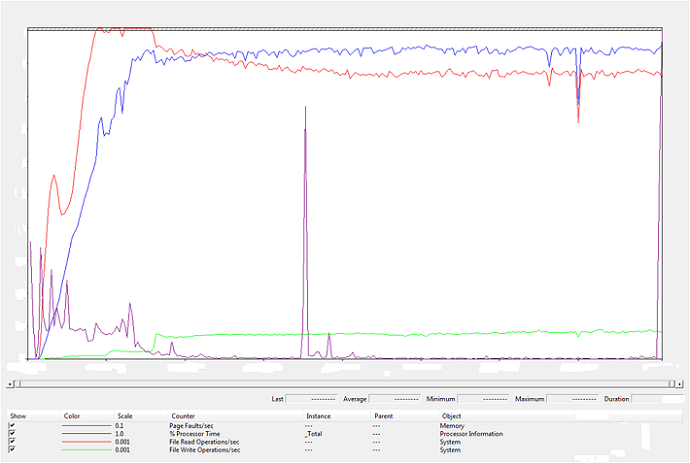

# Performance Tuning for Online Transaction Processing (OLTP)


This topic describes performance tuning methods and recommendations for Online Transaction Processing (OLTP).

**In this topic:**

-   [Server under test tunings](#sut)

-   [SQL Server tunings](#sql)

-   [Disk storage tunings](#disk)

-   [Client tunings](#client)

-   [Monitoring and data collection](#monitoring)

-   [Root counters](#root)

## <a href="" id="sut"></a>Server under test tunings


The following are general tunings that are applicable across native and virtualized server root configurations for the database server:

-   Set the power plan to **High Performance**.

-   Enable SQL Server to use large pages by enabling the **Lock pages in memory** user right assignment for the account that will run the SQL Server in Group Policy.

The following are settings that are recommended for the native, non-virtualized configurations only:

-   Configure the page files

    -   Under the **Performance** heading, click **Settings**, click **Advanced**, and then click **Change**. Set one or more fixed-size page files where the **Initial Size** equals **Maximum Size**. The page file size should meet the total virtual memory requirements of the workload. Make sure that no system-managed page files are in virtual memory on the application server.

    -   Under the **Performance** heading, click **Settings**, click **Visual Effects**, and then click the **Adjust for best performance** option.

-   Configure network adapters.

    -   Enable VMQ and dynamic VMQ for virtualized environments.

    -   Disable unused network devices by using Device Manager.

    -   For advanced network tuning information, see [Performance Tuning for Network Subsystems](performance-tuning-for-network-subsystems.md).

-   Configure storage devices.

    -   Disable low priority I/O. For each logical volume in HKLM\\SYSTEM\\CurrentControlSet\\Enum\\SCSI under Device Parameters\\ClassPnp, create a REG\_DWROD registry entry named **IdlePrioritySupported** and set the value to 0.

    -   For advanced storage tuning information, see [Performance Tuning for Storage Subsystems](performance-tuning-for-storage-subsystems.md).

-   Configure the disks for advanced performance by using Disk Management. Right-click each disk, click **Properties**, click **Policies**, and then click **Advanced Performance**.

    **Note**  
    This setting is for direct attached storage only.

     

## <a href="" id="sql"></a>SQL Server tunings


The following SQL Server tunings can improve performance and scalability for workloads characterized by large memory usage, high transaction rates, and high CPU utilization.

**Important**  
The tunings in this section are specifically for OLTP benchmarking and should not be perceived as general SQL tuning guidance.

 

-   Use the **-T834** start flag to enable SQL Server to use large pages.

-   Start SQL Server as a process instead of a service and use the -x flag for native operating system configurations to disable SQL Server performance counters and avoid potential overhead:

    -   From the Services MMC snap-in (Services.msc), stop and disable SQL Server services.

    -   Run the following command from the SQL Server binn directory: **sqlservr.exe –c –x –T661 –T834**

For virtualized setups, leave SQL Server to run as a service with the **Manual** startup type as follows:

``` syntax
net start MSSQLSERVER /x /T661 /T834
```

The purpose of each parameter is as follows:

-   **-x** Disable SQL Server performance monitor counters

-   **-T661** Disable the ghost record removal process

-   **-T834** Use Microsoft Windows large-page allocations for the buffer pool

Other parameters that are sometimes used are as follows:

-   Enable the TCP/IP protocol to allow communication with client systems:

    In Server Configuration Manager, navigate to **SQL Server Network Configuration** &gt; **Protocols for MSSQL Server**, right-click **TCP/IP**, and click **Enable**.

-   Configure SQL Server according to the guidance in the following list. You can configure SQL Server by using the *sp\_configure* stored procedure. Set the Show advanced options value to 1 to display more available configuration options. For detailed information about the *sp\_configure* stored procedure, see [Server Configuration Options](http://msdn.microsoft.com/library/ms189631.aspx) in the MSDN Library.

-   Set the SQL processor affinity mask option to isolate system resources for the SQL Server instance from other SQL Server instances or other applications running on the same system. You can also set the SQL processor affinity mask option to not use a set of logical processors that handle I/O interrupt traffic for the network and the disk.

    You can set the SQL processor affinity mask option as follows, depending on processor count:

    -   Partition SQL process to run on specific cores, up to 32 logical processors.

    -   To set affinity on more than 32 logical processors, but fewer than 64, processors, use affinity64 mask.

    -   In SQL Server 2008 R2 and SQL Server 2012, you can apply equivalent settings to configure CPU affinity on as many as 640 logical processors by using the ALTER SERVER CONFIGURATION Transact-SQL statement because the *sp\_configure* affinity mask options are announced for deprecation.

    -   Use the alter server configuration set process affinity cpu =’ command to set affinity to the desired range or ranges of processors, separated by commas.

    For more information about best practices for installations on native operating system configurations with more than 64 logical processors, see [ALTER SERVER CONFIGURATION (Transact-SQL)](http://msdn.microsoft.com/library/ee210585.aspx).

    **Note**  
    Windows Server 2012 supports guests with no more than 64 virtual processors, thus any SQL affinity masks for a virtualized SQL Server instance should be set accordingly.

     

-   Set a fixed amount of memory for the SQL Server process to use. About 3% of the total available memory is used for the system, and another 1% is used for memory management structures. SQL Server can use the remaining available memory, but not more.

    Use the following equation to calculate the total memory to be used by SQL Server: TotalMemory – (1%memory \* (numa\_nodes)) – 3%memory – 1GB memory

-   Leave the lightweight pooling value set to the default of 0. This enables SQL Server to run in thread mode. Thread mode performance is comparable to fiber mode.

-   Set the maximum worker threads value to approximately the number of connected users if it appears that the default settings do not allow sufficient concurrent transactions based on a throughput value lower than expected for the system and benchmark configuration. Monitor the sys.dm\_os\_schedulers Dynamic Management Views to determine whether you need to increase the number of worker threads.

-   Set the priority boost value to 1.

-   Consider partitioning the entire system so that dedicated NUMA nodes perform storage and/or network I/O processings and the remaining the NUMA nodes run SQL Server process for the largest scale systems. (This is for native systems only, and it does not apply in a virtualized environment.)

    -   For network I/O, choose the number of network adapters to use and number of RSS processors for each network adapter. Find the smallest number of NUMA nodes that can satisfy the RSS requirement. Assign RSS processors to these nodes. For more information, see [Performance Tuning for Network Subsystems](performance-tuning-for-network-subsystems.md).

    -   For storage I/O, choose the number of processors to handle the interrupt for each storage host bus adapters (HBA). Each storage HBA will have its own dedicated interrupt target processor. Find the smallest number of NUMA nodes that can act as the interrupt targets for all storage HBAs. Assign the interrupt affinity of each HBA to processors in the chosen NUMA nodes.

    -   For each network adapter or storage HBA, ideally, the chosen NUMA node to handle its I/O processing is local to the device.

    -   For the rest of the NUMA node in the system, assign the SQL affinity.

## <a href="" id="disk"></a>Disk storage tunings


Tune the disk storage as follows:

-   For disk storage redundancy, if you have enough storage capacity, you should use RAID 1+0. If you do not have enough capacity, you should use RAID 5.

-   If you use rotational disks, configure logical drives so that all spindles are used for database disks, if possible. Additional spindles improve overall disk subsystem performance.

-   You can improve performance with proper write caching in the case of battery-backed write caching, which is able to avoid data loss in the case of power failure. Enable 100% write caching for the log disk.

## <a href="" id="client"></a>Client tunings


Tune the clients as follows:

-   Configure client systems the same way that the server under test is configured.

-   In addition to tuning the client systems, you should monitor client performance and eliminate any bottlenecks. Follow these client performance guidelines:

    -   CPU utilization on clients should not be higher than 80% to accommodate activity bursts.

    -   If any of the logical processors has high CPU utilization, consider using CPU affinity for benchmark processes to even out CPU utilization. If CPU utilization is still high, consider upgrading clients to the latest processors, or add more clients.

    -   Verify that the time is synchronized between the master client and the server under test.

## <a href="" id="monitoring"></a>Monitoring and data collection


The following list of performance counters is considered a base set of counters when you monitor the resource usage of the database server OLTP workload. Log the performance counters to a local (.blg) performance counter log. It is less expensive to collect all instances by using the wildcard character (\*), and then extract particular instances while post-processing by using Relog.exe or Performance Monitor.

-   IPv4\\\*

-   Memory\\\*

-   Network Interface(\*)\\\*

-   PhysicalDisk(\*)\\\*

-   Processor Information(\*)\\\*

-   Synchronization(\*)\\\* for Windows Server 2008 R2

-   SynchronizationNUMA(\*)\\\* for Windows Server 2012 and WS12 R2

-   System\\\*

-   TCPv4\\\*

-   NUMA Node Memory(\*)\\\* for Windows Server 2012

**Note**  
If applicable, add the \\IPv6\\\* and \\TCPv6\\\* objects.

 

To monitor overall performance, you can use the performance counter chart that is displayed in the figure below. The first part of the run in that figure represents the warm-up stage where I/O consists of mostly reads. As the run progresses, the lazy writer starts flushing caches to the disks and as write I/O increases, read I/O decreases. The beginning of steady state for the run is when the read I/O and write I/O curves seem to be parallel to each other.



You can use other tools, such as Windows Performance Analyzer (WPA), to perform additional analysis.

## <a href="" id="root"></a>Root counters


For virtualized configurations of the OLTP workload, use the following list of performance counters to monitor the Hyper-V root:

-   Cache\\\*

-   Hyper-V Hypervisor Logical Processor(\*)\\\*

-   Hyper-V Hypervisor Partition(\*)\\\*

-   Hyper-V Hypervisor Root Partition(\*)\\\*

-   Hyper-V Hypervisor Root Virtual Processor(\*)\\\*

-   Hyper-V Hypervisor Virtual Processor(\*)\\\*

-   Hyper-V Hypervisor\\\*

-   Hyper-V Virtual IDE Controller (Emulated)(\*)\\\*

-   Hyper-V Virtual Machine Bus\\\*

-   Hyper-V Virtual Storage Device(\*)\\\*

-   Hyper-V Virtual Switch Port(\*)\\\*

-   Hyper-V VM Vid Numa Node(\*)\\\*

-   IPv4\\\*

-   Hyper-V VM Vid Partition(\*)\\\*

-   NUMA Node Memory(\*)\\\*

-   Memory\\\*

-   Network Interface(\*)\\\*

-   Per Processor Network Activity Cycles(\*)\\\*

-   Per Processor Network Interface Card Activity(\*)\\\*

-   PhysicalDisk(\*)\\\*

-   Processor Information(\*)\\\*

-   SynchronizationNuma(\*)\\\*

-   System\\\*

-   \\TCPv4\\\*

If needed, you can collect the following info from the guest operating system:

-   SQL Server performance counters

-   Memory utilization

-   Physical disk size

## Related topics


[Performance Tuning for Workloads](performance-tuning-for-workloads.md)
