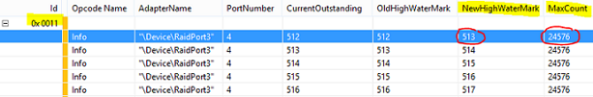

# Using Storage Drivers for Storage Subsystem Performance

Beginning with Windows Server 2003, storport.sys is the storage port driver model that is especially suitable for use with high-performance buses, such as Fibre Channel buses, and RAID adapters.

The Storport driver is utilized by mini-port drivers developed by various vendors and provides the following [capabilities](http://msdn.microsoft.com/library/windows/hardware/ff551359.aspx) to mini-port drivers:

It is vital that the storport and mini-port drivers always be considered as a couple and when updating any of these, the vendor of the storage and/or the vendor of the HBA should be consulted for the latest supported combination of these two drivers.

If performance of the storage is not as expected, the following are some areas to investigate to determine whether the issue is in the operating system or lies outside of the operating system and needs to be investigated by HBA/storage/fabric vendors.

**In this topic:**

-   [Storage latency (also known as slow I/O)](#latency)

-   [I/O completions](#iocomp)

-   [Storport miniports supporting MSI-X interrupts](#msix)

-   [Determining bottlenecks in storport queues](#queues)

## Storage latency (also known as slow I/O)

On configurations using Storport mini-port driver, the system has ETW events that helps track down poor hardware response time. For info on how to configure the ETW tracing, see [Tracing with Storport in Windows 2012 and Windows 8 with KB2819476 hotfix](http://blogs.technet.com/b/askcore/archive/2013/04/25/tracing-with-storport-in-windows-2012-and-windows-8-with-kb2819476-hotfix.aspx).

When troubleshooting disk performance issues, Storport traces capture data from the last layer of software in Windows that an I/O Request Packet (IRP) will pass through before being handed off to hardware. It is an excellent tool for checking if slow disk performance is hardware related.

## I/O completions

Storport mini-port drivers do batch I/O completions. This approach has a potential drawback in that it may cause the system to crash with a stop code of 0x133, DPC\_WATCHDOG\_VIOLATION, if Storport takes too long to process completed I/Os in a DPC routine. If this occurs, you can adjust the value of the registry entry HKLM\\System\\CurrentControlSet\\Control\\Storport\\DpcCompletionLimit (REG\_DWROD) to a lower value. The default value used with Windows Server 2012 R2 is 128 I/O requests. You can also adjust the registry entry to a larger value if you believe you will not run into 0x133 bugchecks in your configuration.

## Storport miniports supporting MSI-X interrupts

For the best storage performance, make sure your configuration is using storage HBAs that support multiple MSI-X interrupts. Determine whether your storage HBA supports multiple MSI-X interrupts by using Device Manager. In Device Manager, find your storage HBA under the **Storage controllers** group. Right-click the storage HBA, and then select **Properties**. On the **Resource** tab, if you see multiple IRQ resource types, then the storage HBA supports multiple MSI-X interrupts.

## Determining bottlenecks in storport queues

Storport supports both a LUN and adapter queue that is based on the hardware capabilities and system resources. Storport will not issue requests above the outstanding limits supported by the storage LUN, adapter, and Storport mini-port driver. To determine whether you may be hitting these limits, the Config keyword events in Storport’s ETW provider can be enabled in the same way as described in [Tracing with Storport in Windows 2012 and Windows 8 with KB2819476 hotfix](http://blogs.technet.com/b/askcore/archive/2013/04/25/tracing-with-storport-in-windows-2012-and-windows-8-with-kb2819476-hotfix.aspx) except you should select the Config keyword instead of IO\_Performance keyword.

For the Config events, look for the following:

-   LUN queue depth

-   Adapter queue depth

Data can be interpreted by using xperfview.

### To interpret ETL data - LUN queue depth (Event ID = 0xf)

This is only logged if there are changes in LUN queue depth.

MaxQueueDepth is the outstanding commands to a LUN limit that Storport will enforce. To determine which miniport is used for AdapterName, look at HKLM\\Hardware\\Devicemap\\Scsi\\Scsi Port X\\Driver. The X should match the “\\Device\\RaidPortX” for AdapterName.

### To interpret ETL data - Adapter queue depth (Event ID = 0x11)

This is only logged if there are changes in the adapter queue depth.

MaxCount is the limit on outstanding IOs to an adapter. If NewHighWaterMark equals MaxCount, it means that the adapter is the bottleneck as we’ve hit the adapter outstanding I/O limit. If you don’t see any of these events logged, it can mean one of 2 things: the system cannot generate I/Os fast enough or system has ran out of memory resource.

## Related topics

[Performance Tuning for Storage Subsystems](performance-tuning-for-storage-subsystems.md)
