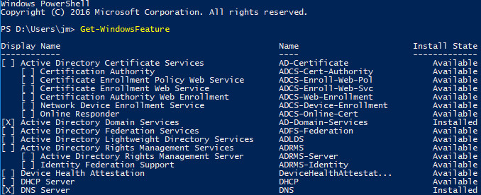
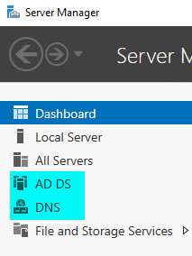
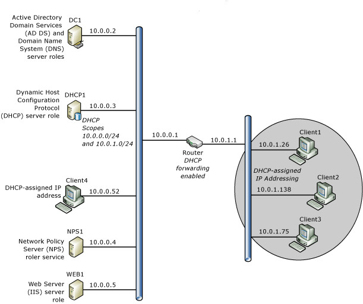

# Core network components

>Applies to: Windows Server (Semi-Annual Channel), Windows Server 2016

This guide provides instructions on how to plan and deploy the core components required for a fully functioning network and a new Active Directory domain in a new forest.

> [!NOTE]
> This guide is available for download in Microsoft Word format from TechNet Gallery. For more information, see [Core Network Guide for  Windows Server 2016](https://gallery.technet.microsoft.com/Core-Network-Guide-for-9da2e683).

This guide contains the following sections.

- [About this guide](#BKMK_about)

- [Core Network Overview](#BKMK_overview)

- [Core Network Planning](#BKMK_planning)

- [Core Network Deployment](#BKMK_deployment)

- [Additional Technical Resources](#BKMK_resources)

- [Appendices A through E](#BKMK_appendix)

## <a name="BKMK_about"></a>About this guide
This guide is designed for network and system administrators who are installing a new network or who want to create a domain-based network to replace a network that consists of workgroups. The deployment scenario provided in this guide is particularly useful if you foresee the need to add more services and features to your network in the future.

It is recommended that you review design and deployment guides for each of the technologies used in this deployment scenario to assist you in determining whether this guide provides the services and configuration that you need.

A core network is a collection of network hardware, devices, and software that provides the fundamental services for your organization's information technology (IT) needs.

A Windows Server core network provides you with many benefits, including the following.

-   Core protocols for network connectivity between computers and other Transmission Control Protocol/Internet Protocol (TCP/IP) compatible devices. TCP/IP is a suite of standard protocols for connecting computers and building networks. TCP/IP is network protocol software provided with Microsoft Windows operating systems that implements and supports the TCP/IP protocol suite.

-   Dynamic Host Configuration Protocol (DHCP) automatic IP address assignment to computers and other devices that are configured as DHCP clients. Manual configuration of IP addresses on all computers on your network is time-consuming and less flexible than dynamically providing computers and other devices with IP address configurations using a DHCP server.

-   Domain Name System (DNS) name resolution service. DNS allows users, computers, applications, and services to find the IP addresses of computers and devices on the network by using the Fully Qualified Domain Name of the computer or device.

-   A forest, which is one or more Active Directory domains that share the same class and attribute definitions (schema), site and replication information (configuration), and forest-wide search capabilities (global catalog).

-   A forest root domain, which is the first domain created in a new forest. The Enterprise Admins and Schema Admins groups, which are forest-wide administrative groups, are located in the forest root domain. In addition, a forest root domain, as with other domains, is a collection of computer, user, and group objects that are defined by the administrator in Active Directory Domain Services (AD DS). These objects share a common directory database and security policies. They can also share security relationships with other domains if you add domains as your organization grows. The directory service also stores directory data and allows authorized computers, applications, and users to access the data.

-   A user and computer account database. The directory service provides a centralized user accounts database that allows you to create user and computer accounts for people and computers that are authorized to connect to your network and access network resources, such as applications, databases, shared files and folders, and printers.

A core network also allows you to scale your network as your organization grows and IT requirements change. For example, with a core network you can add domains, IP subnets, remote access services, wireless services, and other features and server roles provided by  Windows Server 2016.

### Network hardware requirements
To successfully deploy a core network, you must deploy network hardware, including the following:

-   Ethernet, Fast Ethernet, or Gigabyte Ethernet cabling

-   A hub, Layer 2 or 3 switch, router, or other device that performs the function of relaying network traffic between computers and devices.

-   Computers that meet the minimum hardware requirements for their respective client and server operating systems.

## What this guide does not provide
This guide does not provide instructions for deploying the following:

-   Network hardware, such as cabling, routers, switches, and hubs

-   Additional network resources, such as printers and file servers

-   Internet connectivity

-   Remote access

-   Wireless access

-   Client computer deployment

> [!NOTE]
> Computers running Windows client operating systems are configured by default to receive IP address leases from the DHCP server. Therefore, no additional DHCP or Internet Protocol version 4 (IPv4) configuration of client computers is required.

## Technology Overviews
The following sections provide brief overviews of the required technologies that are deployed to create a core network.

### Active Directory Domain Services
A directory is a hierarchical structure that stores information about objects on the network, such as users and computers. A directory service, such as AD DS, provides the methods for storing directory data and making this data available to network users and administrators. For example, AD DS stores information about user accounts, including names, email addresses, passwords, and phone numbers, and enables other authorized users on the same network to access this information.

### DNS
DNS is a name resolution protocol for TCP/IP networks, such as the Internet or an organization network. A DNS server hosts the information that enables client computers and services to resolve easily recognized, alphanumeric DNS names to the IP addresses that computers use to communicate with each other.

### DHCP
DHCP is an IP standard for simplifying the management of host IP configuration. The DHCP standard provides for the use of DHCP servers as a way to manage dynamic allocation of IP addresses and other related configuration details for DHCP-enabled clients on your network.

DHCP allows you to use a DHCP server to dynamically assign an IP address to a computer or other device, such as a printer, on your local network. Every computer on a TCP/IP network must have a unique IP address, because the IP address and its related subnet mask identify both the host computer and the subnet to which the computer is attached. By using DHCP, you can ensure that all computers that are configured as DHCP clients receive an IP address that is appropriate for their network location and subnet, and by using DHCP options, such as default gateway and DNS servers, you can automatically provide DHCP clients with the information that they need to function correctly on your network.

For TCP/IP-based networks, DHCP reduces the complexity and amount of administrative work involved in reconfiguring computers.

### TCP/IP
TCP/IP in Windows Server 2016 is the following:

-   Networking software based on industry-standard networking protocols.

-   A routable enterprise networking protocol that supports the connection of your Windows-based computer to both local area network (LAN) and wide area network (WAN) environments.

-   Core technologies and utilities for connecting your Windows-based computer with dissimilar systems for the purpose of sharing information.

-   A foundation for gaining access to global Internet services, such as the World Wide Web and File Transfer Protocol (FTP) servers.

-   A robust, scalable, cross-platform, client/server framework.

TCP/IP provides basic TCP/IP utilities that enable Windows-based computers to connect and share information with other Microsoft and non-Microsoft systems, including:

-    Windows Server 2016

-   Windows 10

-    Windows Server 2012 R2

-   Windows 8.1

-    Windows Server 2012

-   Windows 8

-    Windows Server 2008 R2

-    Windows 7

-    Windows Server 2008

-   Windows Vista

-   Internet hosts

-   Apple Macintosh systems

-   IBM mainframes

-   UNIX and Linux systems

-   Open VMS systems

-   Network-ready printers

-   Tablets and cellular telephones with wired Ethernet or wireless 802.11 technology enabled

## <a name="BKMK_overview"></a>Core Network Overview
The following illustration shows the Windows Server Core Network topology.


> [!NOTE]
> This guide also includes instructions for adding optional Network Policy Server (NPS) and Web Server (IIS) servers to your network topology to provide the foundation for secure network access solutions, such as 802.1X wired and wireless deployments that you can implement using Core Network Companion guides. For more information, see [Deploying optional features for network access authentication and Web services](#BKMK_optionalfeatures).

### Core Network Components
Following are the components of a core network.

##### Router
This deployment guide provides instructions for deploying a core network with two subnets separated by a router that has DHCP forwarding enabled. You can, however, deploy a Layer 2 switch, a Layer 3 switch, or a hub, depending on your requirements and resources. If you deploy a switch, the switch must be capable of DHCP forwarding or you must place a DHCP server on each subnet. If you deploy a hub, you are deploying a single subnet and do not need DHCP forwarding or a second scope on your DHCP server.

##### Static TCP/IP configurations
The servers in this deployment are configured with static IPv4 addresses. Client computers are configured by default to receive IP address leases from the DHCP server.

##### Active Directory Domain Services global catalog and DNS server DC1
Both Active Directory Domain Services (AD DS) and Domain Name System (DNS) are installed on this server, named DC1, which provides directory and name resolution services to all computers and devices on the network.

##### DHCP server DHCP1
The DHCP server, named DHCP1, is configured with a scope that provides Internet Protocol (IP) address leases to computers on the local subnet. The DHCP server can also be configured with additional scopes to provide IP address leases to computers on other subnets if DHCP forwarding is configured on routers.

##### Client computers
Computers running Windows client operating systems are configured by default as DHCP clients, which obtain IP addresses and DHCP options automatically from the DHCP server.

## <a name="BKMK_planning"></a>Core Network Planning
Before you deploy a core network, you must plan the following items.

-   [Planning subnets](#bkmk_NetFndtn_Pln_Subnt)

-   [Planning basic configuration of all servers](#bkmk_NetFndtn_Pln_AllSrvrs)

-   [Planning the deployment of DC1](#bkmk_NetFndtn_Pln_AD-DNS-01)

-   [Planning domain access](#bkmk_NetFndtn_Pln_DomAccess)

-   [Planning the deployment of DHCP1](#bkmk_NetFndtn_Pln_DHCP-01)

The following sections provide more detail on each of these items.

> [!NOTE]
> For assistance with planning your deployment, also see [Appendix E - Core Network Planning Preparation Sheet](#BKMK_E).

### <a name="bkmk_NetFndtn_Pln_Subnt"></a>Planning subnets
In Transmission Control Protocol/Internet Protocol (TCP/IP) networking, routers are used to interconnect the hardware and software used on different physical network segments called subnets. Routers are also used to forward IP packets between each of the subnets. Determine the physical layout of your network, including the number of routers and subnets you need, before proceeding with the instructions in this guide.

In addition, to configure the servers on your network with static IP addresses, you must determine the IP address range that you want to use for the subnet where your core network servers are located. In this guide, the private IP address ranges 10.0.0.1 - 10.0.0.254 and 10.0.1.1 - 10.0.1.254 are used as examples, but you can use any private IP address range that you prefer.

> [!IMPORTANT]
> After you select the IP address ranges that you want to use for each subnet, ensure that you configure your routers with an IP address from the same IP address range as that used on the subnet where the router is installed. For example, if your router is configured by default with an IP address of 192.168.1.1, but you are installing the router on a subnet with an IP address range of 10.0.0.0/24, you must reconfigure the router to use an IP address from the 10.0.0.0/24 IP address range.

The following recognized private IP address ranges are specified by Internet Request for Comments (RFC) 1918:

-   10.0.0.0 - 10.255.255.255

-   172.16.0.0 - 172.31.255.255

-   192.168.0.0 - 192.168.255.255

When you use the private IP address ranges as specified in RFC 1918, you cannot connect directly to the Internet using a private IP address because requests going to or from these addresses are automatically discarded by Internet service provider (ISP) routers. To add Internet connectivity to your core network later, you must contract with an ISP to obtain a public IP address.

> [!IMPORTANT]
> When using private IP addresses, you must use some type of proxy or network address translation (NAT) server to convert the private IP address ranges on your local network to a public IP address that can be routed on the Internet. Most routers provide NAT services, so selecting a router that is NAT-capable should be fairly simple.

For more information, see [Planning the deployment of DHCP1](#bkmk_NetFndtn_Pln_DHCP-01).

### <a name="bkmk_NetFndtn_Pln_AllSrvrs"></a>Planning basic configuration of all servers
For each server in the core network, you must rename the computer and assign and configure a static IPv4 address and other TCP/IP properties for the computer.

#### Planning naming conventions for computers and devices
For consistency across your network, it is a good idea to use consistent names for servers, printers, and other devices. Computer names can be used to help users and administrators easily identify the purpose and location of the server, printer, or other device. For example, if you have three DNS servers, one in San Francisco, one in Los Angeles, and one in Chicago, you might use the naming convention *server function*-*location*-*number*:

-   DNS-DEN-01. This name represents the DNS server in Denver, Colorado. If additional DNS servers are added in Denver, the numeric value in the name can be incremented, as in DNS-DEN-02 and DNS-DEN-03.

-   DNS-SPAS-01. This name represents the DNS server in South Pasadena, California.

-   DNS-ORL-01. This name represents the DNS server in Orlando, Florida.

For this guide, the server naming convention is very simple, and consists of the primary server function and a number. For example, the domain controller is named DC1 and the DHCP server is named DHCP1.

It is recommended that you choose a naming convention before you install your core network using this guide.

#### Planning static IP addresses
Before configuring each computer with a static IP address, you must plan your subnets and IP address ranges. In addition, you must determine the IP addresses of your DNS servers. If you plan to install a router that provides access to other networks, such as additional subnets or the Internet, you must know the IP address of the router, also called a default gateway, for static IP address configuration.

The following table provides example values for static IP address configuration.

|Configuration items|Example values|
|-----------------------|------------------|
|IP address|10.0.0.2|
|Subnet mask|255.255.255.0|
|Default gateway (Router IP address)|10.0.0.1|
|Preferred DNS server|10.0.0.2|

> [!NOTE]
> If you plan on deploying more than one DNS server, you can also plan the Alternate DNS Server IP address.

### <a name="bkmk_NetFndtn_Pln_AD-DNS-01"></a>Planning the deployment of DC1
Following are key planning steps before installing Active Directory Domain Services (AD DS) and DNS on DC1.

#### Planning the name of the forest root domain
A first step in the AD DS design process is to determine how many forests your organization requires. A forest is the top-level AD DS container, and consists of one or more domains that share a common schema and global catalog. An organization can have multiple forests, but for most organizations, a single forest design is the preferred model and the simplest to administer.

When you create the first domain controller in your organization, you are creating the first domain (also called the forest root domain) and the first forest. Before you take this action using this guide, however, you must determine the best domain name for your organization. In most cases, the organization name is used as the domain name, and in many cases this domain name is registered. If you are planning to deploy external-facing Internet based Web servers to provide information and services for your customers or partners, choose a domain name that is not already in use, and then register the domain name so that your organization owns it.

#### Planning the forest functional level
While installing AD DS, you must choose the forest functional level that you want to use. Domain and forest functionality, introduced in Windows Server 2003 Active Directory, provides a way to enable domain- or forest-wide Active Directory features within your network environment. Different levels of domain functionality and forest functionality are available, depending on your environment.

Forest functionality enables features across all the domains in your forest. The following forest functional levels are available:

-    Windows Server 2008 . This forest functional level supports only domain controllers that are running  Windows Server 2008  and later versions of the Windows Server operating system.

-    Windows Server 2008 R2 . This forest functional level supports  Windows Server 2008 R2  domain controllers and domain controllers that are running later versions of the Windows Server operating system.

-    Windows Server 2012 . This forest functional level supports  Windows Server 2012  domain controllers and domain controllers that are running later versions of the Windows Server operating system.

-    Windows Server 2012 R2 . This forest functional level supports  Windows Server 2012 R2  domain controllers and domain controllers that are running later versions of the Windows Server operating system.

-    Windows Server 2016. This forest functional level supports only  Windows Server 2016 domain controllers and domain controllers that are running later versions of the Windows Server operating system.

If you are deploying a new domain in a new forest and all of your domain controllers will be running  Windows Server 2016, it is recommended that you configure AD DS with the  Windows Server 2016 forest functional level during AD DS installation.

> [!IMPORTANT]
> After the forest functional level is raised, domain controllers that are running earlier operating systems cannot be introduced into the forest. For example, if you raise the forest functional level to  Windows Server 2016, domain controllers running  Windows Server 2012 R2  or  Windows Server 2008  cannot be added to the forest.

Example configuration items for AD DS are provided in the following table.

|Configuration items:|Example values:|
|------------------------|-------------------|
|Full DNS name|Examples:<br /><br />-   corp.contoso.com<br />-   example.com|
|Forest functional level|-    Windows Server 2008 <br />-    Windows Server 2008 R2 <br />-    Windows Server 2012 <br />-    Windows Server 2012 R2 <br />-    Windows Server 2016|
|Active Directory Domain Services Database folder location|E:\Configuration\\<br /><br />Or accept the default location.|
|Active Directory Domain Services Log files folder location|E:\Configuration\\<br /><br />Or accept the default location.|
|Active Directory Domain Services SYSVOL folder location|E:\Configuration\\<br /><br />Or accept the default location|
|Directory Restore Mode Administrator Password|**J\*p2leO4$F**|
|Answer file name (optional)|**AD DS_AnswerFile**|

#### Planning DNS zones
On primary, Active Directory-integrated DNS servers, a forward lookup zone is created by default during installation of the DNS Server role. A forward lookup zone allows computers and devices to query for another computer's or device's IP address based on its DNS name. In addition to a forward lookup zone, it is recommended that you create a DNS reverse lookup zone. With a DNS reverse lookup query, a computer or device can discover the name of another computer or device using its IP address. Deploying a reverse lookup zone typically improves DNS performance and greatly increases the success of DNS queries.

When you create a reverse lookup zone, the in-addr.arpa domain, which is defined in the DNS standards and reserved in the Internet DNS namespace to provide a practical and reliable way to perform reverse queries, is configured in DNS. To create the reverse namespace, subdomains within the in-addr.arpa domain are formed, using the reverse ordering of the numbers in the dotted-decimal notation of IP addresses.

The in-addr.arpa domain applies to all TCP/IP networks that are based on Internet Protocol version 4 (IPv4) addressing. The New Zone Wizard automatically assumes that you are using this domain when you create a new reverse lookup zone.

While you are running the New Zone Wizard, the following selections are recommended:

|Configuration Items|Example values|
|-----------------------|------------------|
|Zone type|**Primary zone**, and **Store the zone in Active Directory** is selected|
|Active Directory Zone Replication Scope|**To all DNS servers in this domain**|
|First Reverse Lookup Zone Name wizard page|**IPv4 Reverse Lookup Zone**|
|Second Reverse Lookup Zone Name wizard page|Network ID = 10.0.0.|
|Dynamic Updates|**Allow only secure dynamic updates**|

### <a name="bkmk_NetFndtn_Pln_DomAccess"></a>Planning domain access
To log on to the domain, the computer must be a domain member computer and the user account must be created in AD DS before the logon attempt.

> [!NOTE]
> Individual computers that are running Windows have a local users and groups user account database that is called the Security Accounts Manager (SAM) user accounts database. When you create a user account on the local computer in the SAM database, you can log onto the local computer, but you cannot log on to a domain. Domain user accounts are created with the Active Directory Users and Computers Microsoft Management Console (MMC) on a domain controller, not with local users and groups on the local computer.

After the first successful logon with domain logon credentials, the logon settings persist unless the computer is removed from the domain or the logon settings are manually changed.

Before you log on to the domain:

-   Create user accounts in Active Directory Users and Computers. Each user must have an Active Directory Domain Services user account in Active Directory Users and Computers. For more information, see [Create a User Account in Active Directory Users and Computers](#BKMK_createUA).

-   Ensure the correct IP address configuration. To join a computer to the domain, the computer must have an IP address. In this guide, servers are configured with static IP addresses and client computers receive IP address leases from the DHCP server. For this reason, the DHCP server must be deployed before you join clients to the domain. For more information, see [Deploying DHCP1](#BKMK_deployDHCP01).

-   Join the computer to the domain. Any computer that provides or accesses network resources must be joined to the domain. For more information, see [Joining Server Computers to the Domain and Logging On](#BKMK_joinlogserver) and [Joining Client Computers to the Domain and Logging On](#BKMK_joinlogclients).

### <a name="bkmk_NetFndtn_Pln_DHCP-01"></a>Planning the deployment of DHCP1
Following are key planning steps before installing the DHCP server role on DHCP1.

#### Planning DHCP servers and DHCP forwarding
Because DHCP messages are broadcast messages, they are not forwarded between subnets by routers. If you have multiple subnets and want to provide DHCP service for each subnet, you must do one of the following:

-   Install a DHCP server on each subnet

-   Configure routers to forward DHCP broadcast messages across subnets and configure multiple scopes on the DHCP server, one scope per subnet.

In most cases, configuring routers to forward DHCP broadcast messages is more cost effective than deploying a DHCP server on each physical segment of the network.

#### Planning IP address ranges
Each subnet must have its own unique IP address range. These ranges are represented on a DHCP server with scopes.

A scope is an administrative grouping of IP addresses for computers on a subnet that use the DHCP service. The administrator first creates a scope for each physical subnet and then uses the scope to define the parameters used by clients.

A scope has the following properties:

-   A range of IP addresses from which to include or exclude addresses used for DHCP service lease offerings.

-   A subnet mask, which determines the subnet prefix for a given IP address.

-   A scope name assigned when it is created.

-   Lease duration values, which are assigned to DHCP clients that receive dynamically allocated IP addresses.

-   Any DHCP scope options configured for assignment to DHCP clients, such as DNS server IP address and router/default gateway IP address.

-   Reservations are optionally used to ensure that a DHCP client always receives the same IP address.

Before deploying your servers, list your subnets and the IP address range you want to use for each subnet.

#### Planning subnet masks
Network IDs and host IDs within an IP address are distinguished by using a subnet mask. Each subnet mask is a 32-bit number that uses consecutive bit groups of all ones (1) to identify the network ID and all zeroes (0) to identify the host ID portions of an IP address.

For example, the subnet mask normally used with the IP address 131.107.16.200 is the following 32-bit binary number:

```
11111111 11111111 00000000 00000000
```

This subnet mask number is 16 one-bits followed by 16 zero-bits, indicating that the network ID and host ID sections of this IP address are both 16 bits in length. Normally, this subnet mask is displayed in dotted decimal notation as 255.255.0.0.

The following table displays subnet masks for the Internet address classes.

|Address class|Bits for subnet mask|Subnet mask|
|-----------------|------------------------|---------------|
|Class A|11111111 00000000 00000000 00000000|255.0.0.0|
|Class B|11111111 11111111 00000000 00000000|255.255.0.0|
|Class C|11111111 11111111 11111111 00000000|255.255.255.0|

When you create a scope in DHCP and you enter the IP address range for the scope, DHCP provides these default subnet mask values. Typically, default subnet mask values are acceptable for most networks with no special requirements and where each IP network segment corresponds to a single physical network.

In some cases, you can use customized subnet masks to implement IP subnetting. With IP subnetting, you can subdivide the default host ID portion of an IP address to specify subnets, which are subdivisions of the original class-based network ID.

By customizing the subnet mask length, you can reduce the number of bits that are used for the actual host ID.

To prevent addressing and routing problems, you should make sure that all TCP/IP computers on a network segment use the same subnet mask and that each computer or device has an unique IP address.

#### Planning exclusion ranges
When you create a scope on a DHCP server, you specify an IP address range that includes all of the IP addresses that the DHCP server is allowed to lease to DHCP clients, such as computers and other devices. If you then go and manually configure some servers and other devices with static IP addresses from the same IP address range that the DHCP server is using, you can accidentally create an IP address conflict, where you and the DHCP server have both assigned the same IP address to different devices.

To solve this problem, you can create an exclusion range for the DHCP scope. An exclusion range is a contiguous range of IP addresses within the scope's IP address range that the DHCP server is not allowed to use. If you create an exclusion range, the DHCP server does not assign the addresses in that range, allowing you to manually assign these addresses without creating an IP address conflict.

You can exclude IP addresses from distribution by the DHCP server by creating an exclusion range for each scope. You should use exclusions for all devices that are configured with a static IP address. The excluded addresses should include all IP addresses that you assigned manually to other servers, non-DHCP clients, diskless workstations, or Routing and Remote Access and PPP clients.

It is recommended that you configure your exclusion range with extra addresses to accommodate future network growth. The following table provides an example exclusion range for a scope with an IP address range of 10.0.0.1 - 10.0.0.254 and a subnet mask of 255.255.255.0.

|Configuration items|Example values|
|-----------------------|------------------|
|Exclusion range Start IP Address|10.0.0.1|
|Exclusion range End IP Address|10.0.0.25|

#### Planning TCP/IP static configuration
Certain devices, such as routers, DHCP servers, and DNS servers, must be configured with a static IP address. In addition, you might have additional devices, such as printers, that you want to ensure always have the same IP address. List the devices that you want to configure statically for each subnet, and then plan the exclusion range you want to use on the DHCP server to ensure that the DHCP server does not lease the IP address of a statically configured device. An exclusion range is a limited sequence of IP addresses within a scope, excluded from DHCP service offerings. Exclusion ranges assure that any addresses in these ranges are not offered by the server to DHCP clients on your network.

For example, if the IP address range for a subnet is 192.168.0.1 through 192.168.0.254 and you have ten devices that you want to configure with a static IP address, you can create an exclusion range for the 192.168.0.*x* scope that includes ten or more IP addresses: 192.168.0.1 through 192.168.0.15.

In this example, you use ten of the excluded IP addresses to configure servers and other devices with static IP addresses and five additional IP addresses are left available for static configuration of new devices that you might want to add in the future. With this exclusion range, the DHCP server is left with an address pool of 192.168.0.16 through 192.168.0.254.

Additional example configuration items for AD DS and DNS are provided in the following table.

|Configuration items|Example values|
|-----------------------|------------------|
|Network Connect Bindings|Ethernet|
|DNS Server Settings|DC1.corp.contoso.com|
|Preferred DNS server IP address|10.0.0.2|
|Add Scope dialog box values<br /><br />1.  Scope Name<br />2.  Starting IP Address<br />3.  Ending IP Address<br />4.  Subnet Mask<br />5.  Default Gateway (optional)<br />6.  Lease duration|1.  Primary Subnet<br />2.  10.0.0.1<br />3.  10.0.0.254<br />4.  255.255.255.0<br />5.  10.0.0.1<br />6.  8 days|
|IPv6 DHCP Server Operation Mode|Not enabled|

## <a name="BKMK_deployment"></a>Core Network Deployment
To deploy a core network, the basic steps are as follows:

1.  [Configuring All Servers](#BKMK_configuringAll)

2.  [Deploying DC1](#BKMK_deployADDNS01)

3.  [Joining Server Computers to the Domain and Logging On](#BKMK_joinlogserver)

4.  [Deploying DHCP1](#BKMK_deployDHCP01)

5.  [Joining Client Computers to the Domain and Logging On](#BKMK_joinlogclients)

6.  [Deploying optional features for network access authentication and Web services](#BKMK_optionalfeatures)

> [!NOTE]
> -   Equivalent Windows PowerShell commands are provided for most procedures in this guide. Before running these cmdlets in Windows PowerShell, replace example values with values that are appropriate for your network deployment. In addition, you must enter each cmdlet on a single line in Windows PowerShell. In this guide, individual cmdlets might appear on several lines due to formatting constraints and the display of the document by your browser or other application.
> -   The procedures in this guide do not include instructions for those cases in which the **User Account Control** dialog box opens to request your permission to continue. If this dialog box opens while you are performing the procedures in this guide, and if the dialog box was opened in response to your actions, click **Continue**.

### <a name="BKMK_configuringAll"></a>Configuring All Servers
Before installing other technologies, such as Active Directory Domain Services or DHCP, it is important to configure the following items.

-   [Rename the computer](#BKMK_rename)

-   [Configure a static IP address](#BKMK_ip)

You can use the following sections to perform these actions for each server.

Membership in **Administrators**, or equivalent, is the minimum required to perform these procedures.

#### <a name="BKMK_rename"></a>Rename the computer
You can use the procedure in this section to change the name of a computer. Renaming the computer is useful for circumstances in which the operating system has automatically created a computer name that you do not want to use.

> [!NOTE]
> To perform this procedure by using Windows PowerShell, open PowerShell and type the following cmdlets on separate lines, and then press ENTER. You must also replace *ComputerName* with the name that you want to use.
>
> `Rename-Computer`*ComputerName*
>
> `Restart-Computer`

###### To rename computers running Windows Server 2016, Windows Server 2012 R2, and Windows Server 2012

1.  In Server Manager, click **Local Server**. The computer **Properties** are displayed in the details pane.

2.  In **Properties**, in **Computer name**, click the existing computer name. The **System Properties** dialog box opens. Click **Change**. The **Computer Name/Domain Changes** dialog box opens.

3.  In the **Computer Name/Domain Changes** dialog box, in **Computer name**, type a new name for your computer. For example, if you want to name the computer DC1, type **DC1**.

4.  Click **OK** twice, and then click **Close**. If you want to restart the computer immediately to complete the name change, click **Restart Now**. Otherwise, click **Restart Later**.

> [!NOTE]
> For information on how to rename computers that are running other Microsoft operating systems, see [Appendix A - Renaming computers](#BKMK_A).

#### <a name="BKMK_ip"></a>Configure a static IP address
You can use the procedures in this topic to configure the Internet Protocol version 4 (IPv4) properties of a network connection with a static IP address for computers running  Windows Server 2016.

> [!NOTE]
> To perform this procedure by using Windows PowerShell, open PowerShell and type the following cmdlets on separate lines, and then press ENTER. You must also replace interface names and IP addresses in this example with the values that you want to use to configure your computer.
>
> `New-NetIPAddress -IPAddress 10.0.0.2 -InterfaceAlias "Ethernet" -DefaultGateway 10.0.0.1 -AddressFamily IPv4 -PrefixLength 24`
>
> `Set-DnsClientServerAddress -InterfaceAlias "Ethernet" -ServerAddresses 127.0.0.1`

###### To configure a static IP address on computers running Windows Server 2016, Windows Server 2012 R2, and Windows Server 2012

1.  In the task bar, right-click the Network icon, and then click **Open Network and Sharing Center**.

2.  In  **Network and Sharing Center**, click **Change adapter settings**. The **Network Connections** folder opens and displays the available network connections.

3.  In **Network Connections**, right-click the connection that you want to configure, and then click **Properties**. The network connection **Properties** dialog box opens.

4.  In the network connection **Properties** dialog box, in **This connection uses the following items**, select **Internet Protocol Version 4 (TCP/IPv4)**, and then click **Properties**. The **Internet Protocol Version 4 (TCP/IPv4) Properties** dialog box opens.

5.  In **Internet Protocol Version 4 (TCP/IPv4) Properties**, on the **General** tab, click **Use the following IP address**. In **IP address**, type the IP address that you want to use.

6.  Press tab to place the cursor in **Subnet mask**. A default value for subnet mask is entered automatically. Either accept the default subnet mask, or type the subnet mask that you want to use.

7.  In **Default gateway**, type the IP address of your default gateway.

    > [!NOTE]
    > You must configure **Default gateway** with the same IP address that you use on the local area network (LAN) interface of your router. For example, if you have a router that is connected to a wide area network (WAN) such as the Internet as well as to your LAN, configure the LAN interface with the same IP address that you will then specify as the **Default gateway**. In another example, if you have a router that is connected to two LANs, where LAN A uses the address range 10.0.0.0/24 and LAN B uses the address range 192.168.0.0/24, configure the LAN A router IP address with an address from that address range, such as 10.0.0.1. In addition, in the DHCP scope for this address range, configure **Default gateway** with the IP address 10.0.0.1. For the LAN B, configure the LAN B router interface with an address from that address range, such as 192.168.0.1, and then configure the LAN B scope 192.168.0.0/24 with a **Default gateway** value of 192.168.0.1.

8.  In **Preferred DNS server**, type the IP address of your DNS server. If you plan to use the local computer as the preferred DNS server, type the IP address of the local computer.

9. In **Alternate DNS Server**, type the IP address of your alternate DNS server, if any. If you plan to use the local computer as an alternate DNS server, type the IP address of the local computer.

10. Click **OK**, and then click **Close**.

> [!NOTE]
> For information on how to configure a static IP address on computers that are running other Microsoft operating systems, see [Appendix B - Configuring static IP addresses](#BKMK_B).

#### <a name="BKMK_deployADDNS01"></a>Deploying DC1
To deploy DC1, which is the computer running Active Directory Domain Services (AD DS) and DNS, you must complete these steps in the following order:

-   Perform the steps in the section [Configuring All Servers](#BKMK_configuringAll).

-   [Install AD DS and DNS for a New Forest](#BKMK_installAD-DNS)

-   [Create a User Account in Active Directory Users and Computers](#BKMK_createUA)

-   [Assign Group Membership](#BKMK_assigngroup)

-   [Configure a DNS Reverse Lookup Zone](#BKMK_reverse)

**Administrative privileges**

If you are installing a small network and are the only administrator for the network, it is recommended that you create a user account for yourself, and then add your user account as a member of both Enterprise Admins and Domain Admins. Doing so will make it easier for you to act as the administrator for all network resources. It is also recommended that you log on with this account only when you need to perform administrative tasks, and that you create a separate user account for performing non-IT related tasks.

If you have a larger organization with multiple administrators, refer to AD DS documentation to determine the best group membership for organization employees.

**Differences between domain user accounts and user accounts on the local computer**

One of the advantages of a domain-based infrastructure is that you do not need to create user accounts on each computer in the domain. This is true whether the computer is a client computer or a server.

Because of this, you should not create user accounts on each computer in the domain. Create all user accounts in Active Directory Users and Computers and use the preceding procedures to assign group membership. By default, all user accounts are members of the Domain Users group.

All members of the Domain Users group can log on to any client computer after it is joined to the domain.

You can configure user accounts to designate the days and times that the user is allowed to log on to the computer. You can also designate which computers each user is allowed to use. To configure these settings, open Active Directory Users and Computers, locate the user account that you want to configure, and double-click the account. In the user account **Properties**, click the **Account** tab, and then click either **Logon Hours** or **Log On To**.

#### <a name="BKMK_installAD-DNS"></a>Install AD DS and DNS for a New Forest

You can use one of the following procedures to install Active Directory Domain Services (AD DS) and DNS and to create a new domain in a new forest. 

The first procedure provides instructions on performing these actions by using Windows PowerShell, while the second procedure shows you how to install AD DS and DNS by using Server Manager.

>[!IMPORTANT]
>After you finish performing the steps in this procedure, the computer is automatically restarted.

**Install AD DS and DNS Using Windows PowerShell**

You can use the following commands to install and configure AD DS and DNS. You must replace the domain name in this example with the value that you want to use for your domain.

>[!NOTE]
>For more information about these Windows PowerShell commands, see the following reference topics.
>- [Install-WindowsFeature](https://docs.microsoft.com/powershell/module/servermanager/install-windowsfeature?view=win10-ps)
>- [Install-ADDSForest](https://docs.microsoft.com/powershell/module/addsdeployment/install-addsforest?view=win10-ps)

Membership in **Administrators** is the minimum required to perform this procedure.

- Run Windows PowerShell as an Administrator, type the following command, and then press ENTER:  

`Install-WindowsFeature AD-Domain-Services -IncludeManagementTools`

When installation has successfully completed, the following message is displayed in Windows PowerShell.


    Success Restart Needed  Exit Code   Feature Result
    ------- --------------  ---------   --------------
    True    No              Success     {Active Directory Domain Services, Group P...


- In Windows PowerShell, type the following command, replacing the text **corp.contoso.com** with your domain name, and then press ENTER:

````
Install-ADDSForest -DomainName "corp.contoso.com"
````

- During the installation and configuration process, which is visible at the top of the Windows PowerShell window, the following prompt appears. After it appears, type a password and then press ENTER.

    **SafeModeAdministratorPassword:**

- After you type a password and press ENTER, the following confirmation prompt appears. Type the same password and then press ENTER.

    **Confirm SafeModeAdministratorPassword:**

- When the following prompt appears, type the letter **Y** and then press ENTER.


~~~
The target server will be configured as a domain controller and restarted when this operation is complete.
Do you want to continue with this operation?
[Y] Yes  [A] Yes to All  [N] No  [L] No to All  [S] Suspend  [?] Help (default is "Y"):
~~~

- If you want to, you can read the warning messages that are displayed during normal, successful installation of AD DS and DNS. These messages are normal and are not an indication of install failure.

- After installation succeeds, a message appears stating that you are about to be logged off of the computer so that the computer can restart. If you click **Close**, you are immediately logged off the computer, and the computer restarts. If you do not click **Close**, the computer restarts after a default period of time.

- After the server is restarted, you can verify successful installation of Active Directory Domain Services and DNS. Open Windows PowerShell, type the following command, and press ENTER.

````
Get-WindowsFeature
````

The results of this command are displayed in Windows PowerShell, and should be similar to the results in the image below. For installed technologies, the brackets to the left of the technology name contain the character **X**, and the value of **Install State** is **Installed**.



**Install AD DS and DNS Using Server Manager**

1.  On DC1, in **Server Manager**, click **Manage**, and then click **Add Roles and Features**. The Add Roles and Features Wizard opens.

2.  In **Before You Begin**, click **Next**.

    > [!NOTE]
    > The **Before You Begin** page of the Add Roles and Features Wizard is not displayed if you have previously selected **Skip this page by default** when the Add Roles and Features Wizard was run.

3.  In **Select Installation Type**, ensure that **Role-Based or feature-based installation** is selected, and then click **Next**.

4.  In **Select destination server**, ensure that **Select a server from the server pool** is selected. In **Server Pool**, ensure that the local computer is selected. Click **Next**.

5.  In **Select server roles**, in **Roles**, click **Active Directory Domain Services**. In **Add features that are required for Active Directory Domain Services**, click **Add Features**. Click **Next**.

6.  In **Select features**, click **Next**, and in **Active Directory Domain Services**, review the information that is provided, and then click **Next**.

7.  In **Confirm installation selections**, click **Install**. The Installation progress page displays status during the installation process. When the process completes, in the message details, click **Promote this server to a domain controller**. The Active Directory Domain Services Configuration Wizard opens.

8.  In **Deployment Configuration**, select **Add a new forest**. In **Root domain name**, type the fully qualified domain name (FQDN) for your domain. For example, if your FQDN is corp.contoso.com, type **corp.contoso.com**. Click **Next**.

9. In **Domain Controller Options**, in **Select functional level of the new forest and root domain**, select the forest functional level and domain functional level that you want to use. In **Specify domain controller capabilities**, ensure that **Domain Name System (DNS) server** and **Global Catalog (GC)** are selected. In **Password** and **Confirm password**, type the Directory Services Restore Mode (DSRM) password that you want to use. Click **Next**.

10. In **DNS Options**, click **Next**.

11. In **Additional Options**, verify the NetBIOS name that is assigned to the domain, and change it only if necessary. Click **Next**.

12. In **Paths**, in **Specify the location of the AD DS database, log files, and SYSVOL**, do one of the following:

    -   Accept the default values.

    -   Type folder locations that you want to use for **Database folder**, **Log files folder**, and **SYSVOL folder**.

13. Click **Next**.

14. In **Review Options**, review your selections.

15. If you want to export settings to a Windows PowerShell script, click **View script**. The script opens in Notepad, and you can save it to the folder location that you want. Click **Next**. In **Prerequisites Check**, your selections are validated. When the check completes, click **Install**. When prompted by Windows, click **Close**. The server restarts to complete installation of AD DS and DNS.

16. To verify successful installation, view the Server Manager console after the server restarts. Both AD DS and DNS should appear in the left pane, like the highlighted items in the image below.



##### <a name="BKMK_createUA"></a>Create a User Account in Active Directory Users and Computers
You can use this procedure to create a new domain user account in Active Directory Users and Computers Microsoft Management Console (MMC).

Membership in **Domain Admins**, or equivalent, is the minimum required to perform this procedure.

> [!NOTE]
> To perform this procedure by using Windows PowerShell, open PowerShell and type the following cmdlet on one line, and then press ENTER. You must also replace the user account name in this example with the value that you want to use.
>
> `New-ADUser -SamAccountName User1 -AccountPassword (read-host "Set user password" -assecurestring) -name "User1" -enabled $true -PasswordNeverExpires $true -ChangePasswordAtLogon $false`
>
> After you press ENTER, type the password for the user account. The account is created and, by default, is granted membership to the Domain Users group.
>
> With the following cmdlet, you can assign additional group memberships for the new user account. The example below adds User1 to the Domain Admins and Enterprise Admins groups. Ensure before running this command that you change the user account name, domain name, and groups to match your requirements.
>
> `Add-ADPrincipalGroupMembership -Identity "CN=User1,CN=Users,DC=corp,DC=contoso,DC=com" -MemberOf "CN=Enterprise Admins,CN=Users,DC=corp,DC=contoso,DC=com","CN=Domain Admins,CN=Users,DC=corp,DC=contoso,DC=com"`

###### To create a user account

1.  On DC1, in Server Manager, click **Tools**, and then click **Active Directory Users and Computers**. The Active Directory Users and Computers MMC opens. If it is not already selected, click the node for your domain. For example, if your domain is corp.contoso.com, click **corp.contoso.com**.

2.  In the details pane, right-click the folder in which you want to add a user account.

    **Where?**

    -   Active Directory Users and Computers/*domain node*/*folder*

3.  Point to **New**, and then click **User**. The **New Object - User** dialog box opens.

4.  In **First name**, type the user's first name.

5.  In **Initials**, type the user's initials.

6.  In **Last name**, type the user's last name.

7.  Modify **Full name** to add initials or reverse the order of first and last names.

8.  In **User logon name**, type the user logon name. Click **Next**.

9. In **New Object - User**, in **Password** and **Confirm password**, type the user's password, and then select the appropriate password options.

10. Click **Next**, review the new user account settings, and then click **Finish**.

##### <a name="BKMK_assigngroup"></a>Assign Group Membership
You can use this procedure to add a user, computer, or group to a group in Active Directory Users and Computers Microsoft Management Console (MMC).

Membership in **Domain Admins**, or equivalent is the minimum required to perform this procedure.

###### To assign group membership

1.  On DC1, in Server Manager, click **Tools**, and then click **Active Directory Users and Computers**. The Active Directory Users and Computers MMC opens. If it is not already selected, click the node for your domain. For example, if your domain is corp.contoso.com, click **corp.contoso.com**.

2.  In the details pane, double-click the folder that contains the group to which you want to add a member.

    Where?

    -   **Active Directory Users and Computers**/*domain node*/*folder that contains the group*

3.  In the details pane, right-click the object that you want to add to a group, such as a user or computer, and then click **Properties**. The object's **Properties** dialog box opens. Click the **Member of** tab.

4.  On the **Member of** tab, click **Add**.

5.  In **Enter the object names to select**, type the name of the group to which you want to add the object, and then click **OK**.

6.  To assign group membership to other users, groups or computers, repeat steps 4 and 5 of this procedure.

##### <a name="BKMK_reverse"></a>Configure a DNS Reverse Lookup Zone
You can use this procedure to configure a reverse lookup zone in Domain Name System (DNS).

Membership in **Domain Admins** is the minimum required to perform this procedure.

> [!NOTE]
> -   For medium and large organizations, it's recommended that you configure and use the DNSAdmins group in Active Directory Users and Computers. For more information, see [Additional Technical Resources](#BKMK_resources)
> -   To perform this procedure by using Windows PowerShell, open PowerShell and type the following cmdlet on one line, and then press ENTER. You must also replace the DNS reverse lookup zone and zonefile names in this example with the values that you want to use. Ensure that you reverse the network ID for the reverse zone name. For example, if the network ID is 192.168.0, create the reverse lookup zone name **0.168.192.in-addr.arpa**.
>
> `Add-DnsServerPrimaryZone 0.0.10.in-addr.arpa -ZoneFile 0.0.10.in-addr.arpa.dns`

###### To configure a DNS reverse lookup zone

1.  On DC1, in Server Manager, click **Tools**, and then click **DNS**. The DNS MMC opens.

2.  In DNS, if it is not already expanded, double-click the server name to expand the tree. For example, if the DNS server name is DC1, double-click **DC1**.

3.  Select **Reverse Lookup Zones**, right-click **Reverse Lookup Zones**, and then click **New Zone**. The New Zone Wizard opens.

4.  In **Welcome to the New Zone Wizard**, click **Next**.

5.  In **Zone Type**, select **Primary zone**.

6.  If your DNS server is a writeable domain controller, ensure that **Store the zone in Active Directory** is selected. Click **Next**.

7.  In **Active Directory Zone Replication Scope**, select **To all DNS servers running on domain controllers in this domain**, unless you have a specific reason to choose a different option. Click **Next**.

8.  In the first **Reverse Lookup Zone Name** page, select **IPv4 Reverse Lookup Zone**. Click **Next**.

9. In the second **Reverse Lookup Zone Name** page, do one of the following:

    -   In **Network ID**, type the network ID of your IP address range. For example, if your IP address range is 10.0.0.1 through 10.0.0.254, type **10.0.0**.

    -   In **Reverse lookup zone name**, your IPv4 reverse lookup zone name is automatically added. Click **Next**.

10. In **Dynamic Update**, select the type of dynamic updates that you want to allow. Click **Next**.

11. In **Completing the New Zone Wizard**, review your choices, and then click **Finish**.

#### <a name="BKMK_joinlogserver"></a>Joining Server Computers to the Domain and Logging On
After you have installed Active Directory Domain Services (AD DS) and created one or more user accounts that have permissions to join a computer to the domain, you can join core network servers to the domain and log on to the servers in order to install additional technologies, such as Dynamic Host Configuration Protocol (DHCP).

On all servers that you are deploying, except for the server running AD DS, do the following:

1.  Complete the procedures provided in [Configuring All Servers](#BKMK_configuringAll).

2.  Use the instructions in the following two procedures to join your servers to the domain and to log on to the servers to perform additional deployment tasks:

> [!NOTE]
> To perform this procedure by using Windows PowerShell, open PowerShell and type the following cmdlet, and then press ENTER. You must also replace the domain name with the name that you want to use.
>
> `Add-Computer -DomainName corp.contoso.com`
>
> When you are prompted to do so, type the user name and password for an account that has permission to join a computer to the domain. To restart the computer, type the following command and press ENTER.
>
> `Restart-Computer`

###### To join computers running  Windows Server 2016,  Windows Server 2012 R2 , and  Windows Server 2012  to the domain

1.  In Server Manager, click **Local Server**. In the details pane, click **WORKGROUP**. The **System Properties** dialog box opens.

2.  In the **System Properties** dialog box, click **Change**. The **Computer Name/Domain Changes** dialog box opens.

3.  In **Computer Name**, in **Member of**, click **Domain**, and then type the name of the domain that you want to join. For example, if the domain name is corp.contoso.com, type **corp.contoso.com**.

4.  Click **OK**. The **Windows Security** dialog box opens.

5.  In **Computer Name/Domain Changes**, in **User name**, type the user name, and in **Password**, type the password, and then click **OK**. The **Computer Name/Domain Changes** dialog box opens, welcoming you to the domain. Click **OK**.

6.  The **Computer Name/Domain Changes** dialog box displays a message indicating that you must restart the computer to apply the changes. Click **OK**.

7.  On the **System Properties** dialog box, on the **Computer Name** tab, click **Close**. The **Microsoft Windows** dialog box opens, and displays a message, again indicating that you must restart the computer to apply the changes. Click **Restart Now**.

> [!NOTE]
> For information on how to join computers that are running other Microsoft operating systems to the domain, see [Appendix C - Joining computers to the domain](#BKMK_C).

###### To log on to the domain using computers running Windows Server 2016

1.  Log off the computer, or restart the computer.

2.  Press CTRL + ALT + DELETE. The logon screen appears.

3.  In the lower left corner, click **Other User**.

4.  In **User name**, type your user name.

5.  In **Password**, type your domain password, and then click the arrow, or press ENTER.

> [!NOTE]
> For information on how to log on to the domain using computers that are running other Microsoft operating systems, see [Appendix D - Log on to the domain](#BKMK_D).

#### <a name="BKMK_deployDHCP01"></a>Deploying DHCP1
Before deploying this component of the core network, you must do the following:

-   Perform the steps in the section [Configuring All Servers](#BKMK_configuringAll).

-   Perform the steps in the section [Joining Server Computers to the Domain and Logging On](#BKMK_joinlogserver).

To deploy DHCP1, which is the computer running the Dynamic Host Configuration Protocol (DHCP) server role, you must complete these steps in the following order:

-   [Install Dynamic Host Configuration Protocol (DHCP)](#BKMK_installDHCP)

-   [Create and Activate a New DHCP Scope](#BKMK_newscopeDHCP)

> [!NOTE]
> To perform these procedures by using Windows PowerShell, open PowerShell and type the following cmdlets on separate lines, and then press ENTER. You must also replace the scope name, IP address start and end ranges, subnet mask, and other values in this example with the values that you want to use.
>
> `Install-WindowsFeature DHCP -IncludeManagementTools`
>
> `Add-DhcpServerv4Scope -name "Corpnet" -StartRange 10.0.0.1 -EndRange 10.0.0.254 -SubnetMask 255.255.255.0 -State Active`
>
> `Add-DhcpServerv4ExclusionRange -ScopeID 10.0.0.0 -StartRange 10.0.0.1 -EndRange 10.0.0.15`
>
> `Set-DhcpServerv4OptionValue -OptionID 3 -Value 10.0.0.1 -ScopeID 10.0.0.0 -ComputerName DHCP1.corp.contoso.com`
>
> `Add-DhcpServerv4Scope -name "Corpnet2" -StartRange 10.0.1.1 -EndRange 10.0.1.254 -SubnetMask 255.255.255.0 -State Active`
>
> `Add-DhcpServerv4ExclusionRange -ScopeID 10.0.1.0 -StartRange 10.0.1.1 -EndRange 10.0.1.15`
>
> `Set-DhcpServerv4OptionValue -OptionID 3 -Value 10.0.1.1 -ScopeID 10.0.1.0 -ComputerName DHCP1.corp.contoso.com`
>
> `Set-DhcpServerv4OptionValue -DnsDomain corp.contoso.com -DnsServer 10.0.0.2`
>
> `Add-DhcpServerInDC -DnsName DHCP1.corp.contoso.com`

##### <a name="BKMK_installDHCP"></a>Install Dynamic Host Configuration Protocol (DHCP)
You can use this procedure to install and configure the DHCP Server role using the Add Roles and Features Wizard.

Membership in **Domain Admins**, or equivalent, is the minimum required to perform this procedure.

###### To install DHCP

1.  On DHCP1, in Server Manager, click **Manage**, and then click **Add Roles and Features**. The Add Roles and Features Wizard opens.

2.  In **Before You Begin**, click **Next**.

    > [!NOTE]
    > The **Before You Begin** page of the Add Roles and Features Wizard is not displayed if you have previously selected **Skip this page by default** when the Add Roles and Features Wizard was run.

3.  In **Select Installation Type**, ensure that **Role-Based or feature-based installation** is selected, and then click **Next**.

4.  In **Select destination server**, ensure that **Select a server from the server pool** is selected. In **Server Pool**, ensure that the local computer is selected. Click **Next**.

5.  In **Select Server Roles**, in **Roles**, select **DHCP Server**. In **Add features that are required for DHCP Server**, click **Add Features**. Click **Next**.

6.  In **Select features**, click **Next**, and in **DHCP Server**, review the information that is provided, and then click **Next**.

7.  In **Confirm installation selections**, click **Restart the destination server automatically if required**. When you are prompted to confirm this selection, click **Yes**, and then click **Install**. The **Installation progress** page displays status during the installation process. When the process completes, the message "Configuration required. Installation succeeded on *ComputerName*" is displayed, where *ComputerName* is the name of the computer upon which you installed DHCP Server. In the message window, click **Complete DHCP configuration**. The DHCP Post-Install configuration wizard opens. Click **Next**.

8.  In **Authorization**, specify the credentials that you want to use to authorize the DHCP server in Active Directory Domain Services, and then click **Commit**. After authorization is complete, click **Close**.

##### <a name="BKMK_newscopeDHCP"></a>Create and Activate a New DHCP Scope
You can use this procedure to create a new DHCP scope using the DHCP Microsoft Management Console (MMC). When you complete the procedure, the scope is activated and the exclusion range that you create prevents the DHCP server from leasing the IP addresses that you use to statically configure your servers and other devices that require a static IP address.

Membership in **DHCP Administrators**, or equivalent, is the minimum required to perform this procedure.

###### To create and activate a new DHCP Scope

1.  On DHCP1, in Server Manager, click **Tools**, and then click **DHCP**. The DHCP MMC opens.

2.  In **DHCP**, expand the server name. For example, if the DHCP server name is DHCP1.corp.contoso.com, click the down arrow next to **DHCP1.corp.contoso.com**.

3.  Beneath the server name, right-click **IPv4**, and then click **New Scope**. The New Scope Wizard opens.

4.  In **Welcome to the New Scope Wizard**, click **Next**.

5.  In **Scope Name**, in **Name**, type a name for the scope. For example, type **Subnet 1**.

6.  In **Description**, type a description for the new scope, and then click **Next**.

7.  In **IP Address Range**, do the following:

    1.  In **Start IP address**, type the IP address that is the first IP address in the range. For example, type **10.0.0.1**.

    2.  In **End IP address**, type the IP address that is the last IP address in the range. For example, type **10.0.0.254**. Values for **Length** and **Subnet mask** are entered automatically, based on the IP address you entered for **Start IP address**.

    3.  If necessary, modify the values in **Length** or **Subnet mask**, as appropriate for your addressing scheme.

    4.  Click **Next**.

8.  In **Add Exclusions**, do the following:

    1.  In **Start IP address**, type the IP address that is the first IP address in the exclusion range. For example, type **10.0.0.1**.

    2.  In **End IP address**, type the IP address that is the last IP address in the exclusion range, For example, type **10.0.0.15**.

9. Click **Add**, and then click **Next**.

10. In **Lease Duration**, modify the default values for **Days**, **Hours**, and **Minutes**, as appropriate for your network, and then click **Next**.

11. In **Configure DHCP Options**, select **Yes, I want to configure these options now**, and then click **Next**.

12. In **Router (Default Gateway)**, do one of the following:

    -   If you do not have routers on your network, click **Next**.

    -   In **IP address**, type the IP address of your router or default gateway. For example, type **10.0.0.1**. Click **Add**, and then click **Next**.

13. In **Domain Name and DNS Servers**, do the following:

    1.  In **Parent domain**, type the name of the DNS domain that clients use for name resolution. For example, type **corp.contoso.com**.

    2.  In **Server name**, type the name of the DNS computer that clients use for name resolution. For example, type **DC1**.

    3.  Click **Resolve**. The IP address of the DNS server is added in **IP address**. Click **Add**, wait for DNS server IP address validation to complete, and then click **Next**.

14. In **WINS Servers**, because you do not have WINS servers on your network, click **Next**.

15. In **Activate Scope**, select **Yes, I want to activate this scope now**.

16. Click **Next**, and then click **Finish**.

> [!IMPORTANT]
> To create new scopes for additional subnets, repeat this procedure. Use a different IP address range for each subnet that you plan to deploy, and ensure that DHCP message forwarding is enabled on all routers that lead to other subnets.

### <a name="BKMK_joinlogclients"></a>Joining Client Computers to the Domain and Logging On

> [!NOTE]
> To perform this procedure by using Windows PowerShell, open PowerShell and type the following cmdlet, and then press ENTER. You must also replace the domain name with the name that you want to use.
>
> `Add-Computer -DomainName corp.contoso.com`
>
> When you are prompted to do so, type the user name and password for an account that has permission to join a computer to the domain. To restart the computer, type the following command and press ENTER.
>
> `Restart-Computer`

##### To join computers running Windows 10 to the domain

1.  Log on to the computer with the local Administrator account.

2.  In **Search the web and Windows**, type **System**. In search results, click **System (Control panel)**. The **System** dialog box opens.

3.  In **System**, click **Advanced system settings**. The **System Properties** dialog box opens. Click the **Computer Name** tab.

4.  In **Computer Name**, click **Change**. The **Computer Name/Domain Changes** dialog box opens.

5.  In **Computer Name/Domain Changes** , In **Member of**, click **Domain**, and then type the name of the domain you want to join. For example, if the domain name is corp.contoso.com, type **corp.contoso.com**.

6.  Click **OK**. The **Windows Security** dialog box opens.

7.  In **Computer Name/Domain Changes**, in **User name**, type the user name, and in **Password**, type the password, and then click **OK**. The **Computer Name/Domain Changes** dialog box opens, welcoming you to the domain. Click **OK**.

8.  The **Computer Name/Domain Changes** dialog box displays a message indicating that you must restart the computer to apply the changes. Click **OK**.

9. On the **System Properties** dialog box, on the **Computer Name** tab, click **Close**. The **Microsoft Windows** dialog box opens, and displays a message, again indicating that you must restart the computer to apply the changes. Click **Restart Now**.

##### To join computers running Windows 8.1 to the domain

1.  Log on to the computer with the local Administrator account.

2.  Right-click **Start**, and then click **System**. The **System** dialog box opens.

3.  In **System**, click **Advanced system settings**. The **System Properties** dialog box opens. Click the **Computer Name** tab.

4.  In **Computer Name**, click **Change**. The **Computer Name/Domain Changes** dialog box opens.

5.  In **Computer Name/Domain Changes** , In **Member of**, click **Domain**, and then type the name of the domain you want to join. For example, if the domain name is corp.contoso.com, type **corp.contoso.com**.

6.  Click **OK**. The **Windows Security** dialog box opens.

7.  In **Computer Name/Domain Changes**, in **User name**, type the user name, and in **Password**, type the password, and then click **OK**. The **Computer Name/Domain Changes** dialog box opens, welcoming you to the domain. Click **OK**.

8.  The **Computer Name/Domain Changes** dialog box displays a message indicating that you must restart the computer to apply the changes. Click **OK**.

9. On the **System Properties** dialog box, on the **Computer Name** tab, click **Close**. The **Microsoft Windows** dialog box opens, and displays a message, again indicating that you must restart the computer to apply the changes. Click **Restart Now**.

##### To log on to the domain using computers running Windows 10

1.  Log off the computer, or restart the computer.

2.  Press CTRL + ALT + DELETE. The logon screen appears.

3.  In the lower left, click **Other User**.

4.  In **User name**, type your domain and user name in the format *domain\user*. For example, to log on to the domain corp.contoso.com with an account named **User-01**, type **CORP\User-01**.

5.  In **Password**, type your domain password, and then click the arrow, or press ENTER.

### <a name="BKMK_optionalfeatures"></a>Deploying optional features for network access authentication and Web services
If you intend to deploy network access servers, such as wireless access points or VPN servers, after installing your core network, it is recommended that you deploy both an NPS and a Web server. For network access deployments, the use of secure certificate-based authentication methods is recommended. You can use NPS to manage network access policies and to deploy secure authentication methods. You can use a Web server to publish the certificate revocation list (CRL) of your certification authority (CA) that provides certificates for secure authentication.

> [!NOTE]
> You can deploy server certificates and other additional features by using Core Network Companion Guides. For more information, see [Additional Technical Resources](#BKMK_resources).

The following illustration shows the Windows Server Core Network topology with added NPS and Web servers.



The following sections provide information on adding NPS and Web servers to your network.

-   [Deploying NPS1](#BKMK_deployNPS1)

-   [Deploying WEB1](#BKMK_IIS)

#### <a name="BKMK_deployNPS1"></a>Deploying NPS1
The Network Policy Server (NPS) server is installed as a preparatory step for deploying other network access technologies, such as virtual private network (VPN) servers, wireless access points, and 802.1X authenticating switches.

Network Policy Server (NPS) allows you to centrally configure and manage network policies with the following features: Remote Authentication Dial-In User Service (RADIUS) server and RADIUS proxy.

NPS is an optional component of a core network, but you should install NPS if any of the following are true:

-   You are planning to expand your network to include remote access servers that are compatible with the RADIUS protocol, such as a computer running Windows Server 2016, Windows Server 2012 R2, Windows Server 2012,  Windows Server 2008 R2 or Windows Server 2008 and Routing and Remote Access service, Terminal Services Gateway, or Remote Desktop Gateway.


-   You plan to deploy 802.1X authentication for wired or wireless  access.

Before deploying this role service, you must perform the following steps on the computer you are configuring as an NPS.

-   Perform the steps in the section [Configuring All Servers](#BKMK_configuringAll).

-   Perform the steps in the section [Joining Server Computers to the Domain and Logging On](#BKMK_joinlogserver)

To deploy NPS1, which is the computer running the Network Policy Server (NPS) role service of the Network Policy and Access Services server role, you must complete this step:

-   [Planning the deployment of NPS1](#bkmk_NetFndtn_Pln_NPS-01)

-   [Install Network Policy Server (NPS)](#BKMK_installNPS)

-   [Register the NPS in the Default Domain](#BKMK_registerNPS)

> [!NOTE]
> This guide provides instructions for deploying NPS on a standalone server or VM named NPS1.  Another recommended deployment model is the installation of NPS on a domain controller. If you prefer installing NPS on a domain controller instead of on a standalone server, install NPS on DC1.

##### <a name="bkmk_NetFndtn_Pln_NPS-01"></a>Planning the deployment of NPS1
If you intend to deploy network access servers, such as wireless access points or VPN servers, after deploying your core network, it is recommended that you deploy NPS.

When you use NPS as a Remote Authentication Dial-In User Service (RADIUS) server, NPS performs authentication and authorization for connection requests through your network access servers. NPS also allows you to centrally configure and manage network policies that determine who can access the network, how they can access the network, and when they can access the network.

Following are key planning steps before installing NPS.

- Plan the user accounts database. By default, if you join the server running NPS to an Active Directory domain, NPS performs authentication and authorization using the AD DS user accounts database. In some cases, such as with large networks that use NPS as a RADIUS proxy to forward connection requests to other RADIUS servers, you might want to install NPS on a non-domain member computer.

- Plan RADIUS accounting. NPS allows you to log accounting data to a SQL Server database or to a text file on the local computer. If you want to use SQL Server logging, plan the installation and configuration of your server running SQL Server.

##### <a name="BKMK_installNPS"></a>Install Network Policy Server (NPS)
You can use this procedure to install Network Policy Server (NPS) by using the Add Roles and Features Wizard. NPS is a role service of the Network Policy and Access Services server role.

> [!NOTE]
> By default, NPS listens for RADIUS traffic on ports 1812, 1813, 1645, and 1646 on all installed network adapters. If Windows Firewall with Advanced Security is enabled when you install NPS, firewall exceptions for these ports are automatically created during the installation process for both Internet Protocol version 6 \(IPv6\) and IPv4 traffic. If your network access servers are configured to send RADIUS traffic over ports other than these defaults, remove the exceptions created in Windows Firewall with Advanced Security during NPS installation, and create exceptions for the ports that you do use for RADIUS traffic.

**Administrative Credentials**

To complete this procedure, you must be a member of the **Domain Admins** group.

> [!NOTE]
> To perform this procedure by using Windows PowerShell, open PowerShell and type the following, and then press ENTER.
>
> `Install-WindowsFeature NPAS -IncludeManagementTools`

###### To install NPS

1.  On NPS1, in Server Manager, click **Manage**, and then click **Add Roles and Features**. The Add Roles and Features Wizard opens.

2.  In **Before You Begin**, click **Next**.

    > [!NOTE]
    > The **Before You Begin** page of the Add Roles and Features Wizard is not displayed if you have previously selected **Skip this page by default** when the Add Roles and Features Wizard was run.

3.  In **Select Installation Type**, ensure that **Role-Based or feature-based installation** is selected, and then click **Next**.

4.  In **Select destination server**, ensure that **Select a server from the server pool** is selected. In **Server Pool**, ensure that the local computer is selected. Click **Next**.

5.  In **Select Server Roles**, in **Roles**, select **Network Policy and Access Services**. A dialog box opens asking if it should add features that are required for Network Policy and Access Services. Click **Add Features**, and then click **Next**.

6.  In **Select features**, click **Next**, and in **Network Policy and Access Services**, review the information that is provided, and then click **Next**.

7.  In **Select role services**, click **Network Policy Server**.  In **Add features that are required for Network Policy Server**, click **Add Features**. Click **Next**.

8.  In **Confirm installation selections**, click **Restart the destination server automatically if required**. When you are prompted to confirm this selection, click **Yes**, and then click **Install**. The Installation progress page displays status during the installation process. When the process completes, the message "Installation succeeded on *ComputerName*" is displayed, where *ComputerName* is the name of the computer upon which you installed Network Policy Server. Click **Close**.

##### <a name="BKMK_registerNPS"></a>Register the NPS in the Default Domain
You can use this procedure to register an NPS in the domain where the server is a domain member.

NPSs must be registered in Active Directory so that they have permission to read the dial-in properties of user accounts during the authorization process. Registering an NPS adds the server to the **RAS and IAS Servers** group in Active Directory.

**Administrative credentials**

To complete this procedure, you must be a member of the **Domain Admins** group.

> [!NOTE]
> To perform this procedure by using network shell (Netsh) commands within Windows PowerShell, open PowerShell and type the following, and then press ENTER.
>
> `netsh nps add registeredserver domain=corp.contoso.com server=NPS1.corp.contoso.com`

###### To register an NPS in its default domain

1.  On NPS1, in Server Manager, click Tools, and then click **Network Policy Server**. The Network Policy Server MMC opens.

2.  Right-click **NPS (Local)**, and then click **Register server in Active Directory**. The **Network Policy Server** dialog box opens.

3.  In **Network Policy Server**, click **OK**, and then click **OK** again.

For more information about Network Policy Server, see [Network Policy Server (NPS)](../technologies/nps/nps-top.md).

#### <a name="BKMK_IIS"></a>Deploying WEB1

The Web Server (IIS) role in  Windows Server 2016 provides a secure, easy-to-manage, modular and extensible platform for reliably hosting web sites, services, and applications. With Internet Information Services (IIS), you can share information with users on the Internet, an intranet, or an extranet. IIS  is a unified web platform that integrates IIS, ASP.NET, FTP services, PHP, and Windows Communication Foundation (WCF).

In addition to allowing you to publish a CRL for access by domain member computers, the Web Server (IIS) server role allows you to set up and manage multiple web sites, web applications, and FTP sites. IIS also provides the following benefits:

-   Maximize web security through a reduced server foot print and automatic application isolation.

-   Easily deploy and run ASP.NET, classic ASP, and PHP web applications on the same server.

-   Achieve application isolation by giving worker processes a unique identity and sandboxed configuration by default, further reducing security risks.

-   Easily add, remove, and even replace built-in IIS components with custom modules, suited for customer needs.

-   Speed up your website through built-in dynamic caching and enhanced compression.

To deploy WEB1, which is the computer that is running the Web Server (IIS) server role, you must do the following:

-   Perform the steps in the section [Configuring All Servers](#BKMK_configuringAll).

-   Perform the steps in the section [Joining Server Computers to the Domain and Logging On](#BKMK_joinlogserver)

-   [Install the Web Server (IIS) server role](#BKMK_install_IIS)

##### <a name="BKMK_install_IIS"></a>Install the Web Server (IIS) server role
To complete this procedure, you must be a member of the **Administrators** group.

> [!NOTE]
> To perform this procedure by using Windows PowerShell, open PowerShell and type the following, and then press ENTER.
>
> `Install-WindowsFeature Web-Server -IncludeManagementTools`

1.  In **Server Manager**, click **Manage**, and then click **Add Roles and Features**. The Add Roles and Features Wizard opens.

2.  In **Before You Begin**, click **Next**.

    > [!NOTE]
    > The **Before You Begin** page of the Add Roles and Features Wizard is not displayed if you have previously selected **Skip this page by default** when the Add Roles and Features Wizard was run.

3.  On the **Select Installation Type** page, click **Next**.

4.  On the **Select destination server** page, ensure that the local computer is selected, and then click **Next**.

5.  On the **Select server roles** page, scroll to and select **Web Server (IIS)**. The **Add features that are required for Web Server (IIS)** dialog box opens. Click **Add Features**, and then click **Next**.

6.  Click **Next** until you have accepted all of the default web server settings, and then click **Install**.

7.  Verify that all installations were successful, and then click **Close**.

## <a name="BKMK_resources"></a>Additional Technical Resources
For more information about the technologies in this guide, see the following resources:

 Windows Server 2016,  Windows Server 2012 R2 , and  Windows Server 2012  Technical Library Resources

-   [What's new in Active Directory Domain Services (AD DS) in Windows Server 2016](https://technet.microsoft.com/library/mt163897.aspx)

-   [Active Directory Domain Services overview](https://technet.microsoft.com/library/hh831484.aspx) at https://technet.microsoft.com/library/hh831484.aspx.

-   [Domain Name System (DNS) overview](https://technet.microsoft.com/library/hh831667.aspx) at https://technet.microsoft.com/library/hh831667.aspx.

-   [Implementing the DNS Admins Role](https://technet.microsoft.com/library/cc756152(WS.10).aspx)

-   [Dynamic Host Configuration Protocol (DHCP) overview](https://technet.microsoft.com/library/hh831825.aspx) at https://technet.microsoft.com/library/hh831825.aspx.

-   [Network Policy and Access Services overview](https://technet.microsoft.com/library/hh831683.aspx) at https://technet.microsoft.com/library/hh831683.aspx.

-   [Web Server (IIS) overview](https://technet.microsoft.com/library/hh831725.aspx) at https://technet.microsoft.com/library/hh831725.aspx.

## <a name="BKMK_appendix"></a>Appendices A through E
The following sections contain additional configuration information for computers that are running operating systems other than  Windows Server 2016, Windows 10,  Windows Server 2012 , and Windows 8. In addition, a network preparation worksheet is provided to assist you with your deployment.

1.  [Appendix A - Renaming computers](#BKMK_A)

2.  [Appendix B - Configuring static IP addresses](#BKMK_B)

3.  [Appendix C - Joining computers to the domain](#BKMK_C)

4.  [Appendix D - Log on to the domain](#BKMK_D)

5.  [Appendix E - Core Network Planning Preparation Sheet](#BKMK_E)

## <a name="BKMK_A"></a>Appendix A - Renaming computers
You can use the procedures in this section to provide computers running Windows Server 2008 R2, Windows 7,  Windows Server 2008 , and Windows Vista with a different computer name.

-   [Windows Server 2008 R2 and Windows 7](#bkmk_NetFndtn_Pln_rename_R2)

-   [Windows Server 2008 and Windows Vista](#bkmk_NetFndtn_Pln_Renam08)

### <a name="bkmk_NetFndtn_Pln_rename_R2"></a>Windows Server 2008 R2 and Windows 7
Membership in **Administrators**, or equivalent, is the minimum required to perform these procedures.

##### To rename computers running Windows Server 2008 R2 and Windows 7

1.  Click **Start**, right-click **Computer**, and then click **Properties**. The **System** dialog box opens.

2.  In **Computer name, domain, and workgroup settings**, click **Change settings**. The **System Properties** dialog box opens.

    > [!NOTE]
    > On computers running Windows 7, before the **System Properties** dialog box opens, the **User Account Control** dialog box opens, requesting permission to continue. Click **Continue** to proceed.

3.  Click **Change**. The **Computer Name/Domain Changes** dialog box opens.

4.  In **Computer Name**, type the name for your computer. For example, if you want to name the computer DC1, type **DC1**.

5.  Click **OK** twice, click **Close**, and then click **Restart Now** to restart the computer.

### <a name="bkmk_NetFndtn_Pln_Renam08"></a>Windows Server 2008 and Windows Vista
Membership in **Administrators**, or equivalent, is the minimum required to perform these procedures.

##### To rename computers running Windows Server 2008 and Windows Vista

1.  Click **Start**, right-click **Computer**, and then click **Properties**. The **System** dialog box opens.

2.  In **Computer name, domain, and workgroup settings**, click **Change settings**. The **System Properties** dialog box opens.

    > [!NOTE]
    > On computers running Windows Vista, before the **System Properties** dialog box opens, the **User Account Control** dialog box opens, requesting permission to continue. Click **Continue** to proceed.

3.  Click **Change**. The **Computer Name/Domain Changes** dialog box opens.

4.  In **Computer Name**, type the name for your computer. For example, if you want to name the computer DC1, type **DC1**.

5.  Click **OK** twice, click **Close**, and then click **Restart Now** to restart the computer.

## <a name="BKMK_B"></a>Appendix B - Configuring static IP addresses
This topic provides procedures for configuring static IP addresses on computers running the following operating systems:

-   [Windows Server 2008 R2](#bkmk_R2Cng_WS08R2IP)

-   [Windows Server 2008](#bkmk_NetFndtn_Pln_CfgStatic08)

### <a name="bkmk_R2Cng_WS08R2IP"></a>Windows Server 2008 R2
Membership in **Administrators**, or equivalent, is the minimum required to perform this procedure.

##### To configure a static IP address on a computer running Windows Server 2008 R2

1.  Click **Start**, and then click **Control Panel**.

2.  In **Control Panel**, click **Network and Internet**. **Network and Internet** opens.

    In **Network and Internet**, click **Network and Sharing Center**. **Network and Sharing Center** opens.

3.  In **Network and Sharing Center**, click **Change adapter settings**. **Network Connections** opens.

4.  In **Network Connections**, right-click the network connection that you want to configure, and then click **Properties**.

5.  In **Local Area Connection Properties**, in **This connection uses the following items**, select **Internet Protocol Version 4 (TCP/IPv4)**, and then click **Properties**. The **Internet Protocol Version 4 (TCP/IPv4) Properties** dialog box opens.

6.  In **Internet Protocol Version 4 (TCP/IPv4) Properties**, on the **General** tab, click **Use the following IP address**. In **IP address**, type the IP address that you want to use.

7.  Press tab to place the cursor in **Subnet mask**. A default value for subnet mask is entered automatically. Either accept the default subnet mask, or type the subnet mask that you want to use.

8.  In **Default gateway**, type the IP address of your default gateway.

9. In **Preferred DNS server**, type the IP address of your DNS server. If you plan to use the local computer as the preferred DNS server, type the IP address of the local computer.

10. In **Alternate DNS Server**, type the IP address of your alternate DNS server, if any. If you plan to use the local computer as an alternate DNS server, type the IP address of the local computer.

11. Click **OK**, and then click **Close**.

### <a name="bkmk_NetFndtn_Pln_CfgStatic08"></a>Windows Server 2008
Membership in **Administrators**, or equivalent, is the minimum required to perform these procedures.

##### To configure a static IP address on a computer running Windows Server 2008

1.  Click **Start**, and then click **Control Panel**.

2.  In **Control Panel**, verify that **Classic View** is selected, and then double-click **Network and Sharing Center**.

3.  In **Network and Sharing Center**, in **Tasks**, click **Manage Network Connections**.

4.  In **Network Connections**, right-click the network connection that you want to configure, and then click **Properties**.

5.  In **Local Area Connection Properties**, in **This connection uses the following items**, select **Internet Protocol Version 4 (TCP/IPv4)**, and then click **Properties**. The **Internet Protocol Version 4 (TCP/IPv4) Properties** dialog box opens.

6.  In **Internet Protocol Version 4 (TCP/IPv4) Properties**, on the **General** tab, click **Use the following IP address**. In **IP address**, type the IP address that you want to use.

7.  Press tab to place the cursor in **Subnet mask**. A default value for subnet mask is entered automatically. Either accept the default subnet mask, or type the subnet mask that you want to use.

8.  In **Default gateway**, type the IP address of your default gateway.

9. In **Preferred DNS server**, type the IP address of your DNS server. If you plan to use the local computer as the preferred DNS server, type the IP address of the local computer.

10. In **Alternate DNS Server**, type the IP address of your alternate DNS server, if any. If you plan to use the local computer as an alternate DNS server, type the IP address of the local computer.

11. Click **OK**, and then click **Close**.

## <a name="BKMK_C"></a>Appendix C - Joining computers to the domain
You can use these procedures to join computers running Windows Server 2008 R2, Windows 7,  Windows Server 2008 ,  and Windows Vista to the domain.

-   [Windows Server 2008 R2 and Windows 7](#BKMK_c1)

-   [Windows Server 2008 and Windows Vista](#BKMK_c2)

> [!IMPORTANT]
> To join a computer to a domain, you must be logged on to the computer with the local Administrator account or, if you are logged on to the computer with a user account that does not have local computer administrative credentials, you must provide the credentials for the local Administrator account during the process of joining the computer to the domain. In addition, you must have a user account in the domain to which you want to join the computer. During the process of joining the computer to the domain, you will be prompted for your domain account credentials (user name and password).

### <a name="BKMK_c1"></a>Windows Server 2008 R2 and Windows 7
Membership in **Domain Users**, or equivalent, is the minimum required to perform this procedure.

##### To join computers running Windows Server 2008 R2 and Windows 7 to the domain

1.  Log on to the computer with the local Administrator account.

2.  Click **Start**, right-click **Computer**, and then click **Properties**. The **System** dialog box opens.

3.  In **Computer name, domain, and workgroup settings**, click **Change settings**. The **System Properties** dialog box opens.

    > [!NOTE]
    > On computers running Windows 7, before the **System Properties** dialog box opens, the **User Account Control** dialog box opens, requesting permission to continue. Click **Continue** to proceed.

4.  Click **Change**. The **Computer Name/Domain Changes** dialog box opens.

5.  In **Computer Name**, in **Member of**, select **Domain**, and then type the name of the domain you want to join. For example, if the domain name is corp.contoso.com, type **corp.contoso.com**.

6.  Click **OK**. The **Windows Security** dialog box opens.

7.  In **Computer Name/Domain Changes**, in **User name**, type the user name, and in **Password**, type the password, and then click **OK**. The **Computer Name/Domain Changes** dialog box opens, welcoming you to the domain. Click **OK**.

8.  The **Computer Name/Domain Changes** dialog box displays a message indicating that you must restart the computer to apply the changes. Click **OK**.

9. On the **System Properties** dialog box, on the **Computer Name** tab, click **Close**. The **Microsoft Windows** dialog box opens, and displays a message, again indicating that you must restart the computer to apply the changes. Click **Restart Now**.

### <a name="BKMK_c2"></a>Windows Server 2008 and Windows Vista
Membership in **Domain Users**, or equivalent, is the minimum required to perform this procedure.

##### To join computers running Windows Server 2008 and Windows Vista to the domain

1.  Log on to the computer with the local Administrator account.

2.  Click **Start**, right-click **Computer**, and then click **Properties**. The **System** dialog box opens.

3.  In **Computer name, domain, and workgroup settings**, click **Change settings**. The **System Properties** dialog box opens.

4.  Click **Change**. The **Computer Name/Domain Changes** dialog box opens.

5.  In **Computer Name**, in **Member of**, select **Domain**, and then type the name of the domain you want to join. For example, if the domain name is corp.contoso.com, type **corp.contoso.com**.

6.  Click **OK**. The **Windows Security** dialog box opens.

7.  In **Computer Name/Domain Changes**, in **User name**, type the user name, and in **Password**, type the password, and then click **OK**. The **Computer Name/Domain Changes** dialog box opens, welcoming you to the domain. Click **OK**.

8.  The **Computer Name/Domain Changes** dialog box displays a message indicating that you must restart the computer to apply the changes. Click **OK**.

9. On the **System Properties** dialog box, on the **Computer Name** tab, click **Close**. The **Microsoft Windows** dialog box opens, and displays a message, again indicating that you must restart the computer to apply the changes. Click **Restart Now**.

## <a name="BKMK_D"></a>Appendix D - Log on to the domain
You can use these procedures to log on to the domain using computers running Windows Server 2008 R2, Windows 7,  Windows Server 2008 , and Windows Vista.

-   [Windows Server 2008 R2 and Windows 7](#BKMK_d1)

-   [Windows Server 2008 and Windows Vista](#BKMK_d2)

### <a name="BKMK_d1"></a>Windows Server 2008 R2 and Windows 7
Membership in **Domain Users**, or equivalent, is the minimum required to perform this procedure.

##### Log on to the domain using computers running Windows Server 2008 R2 and Windows 7

1.  Log off the computer, or restart the computer.

2.  Press CTRL + ALT + DELETE. The logon screen appears.

3.  Click **Switch User**, and then click **Other User**.

4.  In **User name**, type your domain and user name in the format *domain\user*. For example, to log on to the domain corp.contoso.com with an account named **User-01**, type **CORP\User-01**.

5.  In **Password**, type your domain password, and then click the arrow, or press ENTER.

### <a name="BKMK_d2"></a>Windows Server 2008 and Windows Vista
Membership in **Domain Users**, or equivalent, is the minimum required to perform this procedure.

##### Log on to the domain using computers running Windows Server 2008 and Windows Vista

1.  Log off the computer, or restart the computer.

2.  Press CTRL + ALT + DELETE. The logon screen appears.

3.  Click **Switch User**, and then click **Other User**.

4.  In **User name**, type your domain and user name in the format *domain\user*. For example, to log on to the domain corp.contoso.com with an account named **User-01**, type **CORP\User-01**.

5.  In **Password**, type your domain password, and then click the arrow, or press ENTER.

## <a name="BKMK_E"></a>Appendix E - Core Network Planning Preparation Sheet
You can use this Network Planning Preparation Sheet to gather the information required to install a core network. This topic provides tables that contain the individual configuration items for each server computer for which you must supply information or specific values during the installation or configuration process. Example values are provided for each configuration item.

For planning and tracking purposes, spaces are provided in each table for you to enter the values used for your deployment. If you log security-related values in these tables, you should store the information in a secure location.

The following links lead to the sections in this topic that provide configuration items and example values that are associated with the deployment procedures presented in this guide.

1.  [Installing Active Directory Domain Services and DNS](#BKMK_FndtnPrep_InstallAD)

    -   [Configuring a DNS Reverse Lookup Zone](#BKMK_FndtnPrep_DNSRevrsLook)

2.  [Installing DHCP](#BKMK_FndtnPrep_InstallDHCP)

    -   [Creating an exclusion range in DHCP](#BKMK_FndtnPrep_DHCP_Exclusn)

    -   [Creating a new DHCP scope](#bkmk_NetFndtn_Pln_DHCP_NewScope)

3.  [Installing Network Policy Server (optional)](#BKMK_FndtnPrep_InstallNPS)

### <a name="BKMK_FndtnPrep_InstallAD"></a>Installing Active Directory Domain Services and DNS
The tables in this section list configuration items for pre-installation and installation of Active Directory Domain Services (AD DS) and DNS.

##### Pre-installation configuration items for AD DS and DNS
The following tables list pre-installation configuration items as described in [Configuring All Servers](#BKMK_configuringAll):

-   [Configure a Static IP Address](#BKMK_ip)

|Configuration items|Example values|Values|
|-----------------------|------------------|----------|
|IP address|10.0.0.2||
|Subnet mask|255.255.255.0||
|Default gateway|10.0.0.1||
|Preferred DNS server|127.0.0.1||
|Alternate DNS server|10.0.0.15||

-   [Rename the Computer](#BKMK_rename)

|Configuration item|Example value|Value|
|----------------------|-----------------|---------|
|Computer name|DC1||

##### AD DS and DNS installation configuration items
Configuration items for the Windows Server Core Network deployment procedure [Install AD DS and DNS for a New Forest](#BKMK_installAD-DNS):

|Configuration items|Example values|Values|
|-----------------------|------------------|----------|
|Full DNS name|corp.contoso.com||
|Forest functional level|Windows Server 2003||
|Active Directory Domain Services database folder location|E:\Configuration\\<br /><br />Or accept the default location.||
|Active Directory Domain Services log files folder location|E:\Configuration\\<br /><br />Or accept the default location.||
|Active Directory Domain Services SYSVOL folder location|E:\Configuration\\<br /><br />Or accept the default location||
|Directory Restore Mode Administrator password|J*p2leO4$F||
|Answer file name (optional)|AD DS_AnswerFile||

#### <a name="BKMK_FndtnPrep_DNSRevrsLook"></a>Configuring a DNS Reverse Lookup Zone

|Configuration items|Example values|Values|
|-----------------------|------------------|----------|
|Zone type:|-   Primary zone<br />-   Secondary zone<br />-   Stub zone||
|Zone type<br /><br />**Store the zone in Active Directory**|-   Selected<br />-   Not selected||
|Active Directory zone replication scope|-   To all DNS servers in this forest<br />-   To all DNS servers in this domain<br />-   To all domain controllers in this domain<br />-   To all domain controllers specified in the scope of this directory partition||
|Reverse lookup zone name<br /><br />(IP type)|-   IPv4 Reverse Lookup Zone<br />-   IPv6 Reverse Lookup Zone||
|Reverse lookup zone name<br /><br />(network ID)|10.0.0||

### <a name="BKMK_FndtnPrep_InstallDHCP"></a>Installing DHCP
The tables in this section list configuration items for pre-installation and installation of DHCP.

##### Pre-installation configuration items for DHCP
The following tables list pre-installation configuration items as described in [Configuring All Servers](#BKMK_configuringAll):

-   [Configure a Static IP Address](#BKMK_ip)

|Configuration items|Example values|Values|
|-----------------------|------------------|----------|
|IP address|10.0.0.3||
|Subnet mask|255.255.255.0||
|Default gateway|10.0.0.1||
|Preferred DNS server|10.0.0.2||
|Alternate DNS server|10.0.0.15||

-   [Rename the Computer](#BKMK_rename)

|Configuration item|Example value|Value|
|----------------------|-----------------|---------|
|Computer name|DHCP1||

##### DHCP installation configuration items
Configuration items for the Windows Server Core Network deployment procedure [Install Dynamic Host Configuration Protocol (DHCP)](#BKMK_installDHCP):

|Configuration items|Example values|Values|
|-----------------------|------------------|----------|
|Network connect bindings|Ethernet||
|DNS server settings|DC1||
|Preferred DNS server IP address|10.0.0.2||
|Alternate DNS server IP address|10.0.0.15||
|Scope name|Corp1||
|Starting IP address|10.0.0.1||
|Ending IP address|10.0.0.254||
|Subnet mask|255.255.255.0||
|Default gateway (optional)|10.0.0.1||
|Lease duration|8 days||
|IPv6 DHCP server operation mode|Not enabled||

#### <a name="BKMK_FndtnPrep_DHCP_Exclusn"></a>Creating an exclusion range in DHCP
Configuration items to create an exclusion range while creating a scope in DHCP.

|Configuration items|Example values|Values|
|-----------------------|------------------|----------|
|Scope name|Corp1||
|Scope description|Main office subnet 1||
|Exclusion range start IP address|10.0.0.1||
|Exclusion range end IP address|10.0.0.15||

#### <a name="bkmk_NetFndtn_Pln_DHCP_NewScope"></a>Creating a new DHCP scope
Configuration items for the Windows Server Core Network deployment procedure [Create and Activate a New DHCP Scope](#BKMK_newscopeDHCP):

|Configuration items|Example values|Values|
|-----------------------|------------------|----------|
|New scope name|Corp2||
|Scope description|Main office subnet 2||
|(IP address range)<br /><br />Start IP address|10.0.1.1||
|(IP address range)<br /><br />End IP address|10.0.1.254||
|Length|8||
|Subnet mask|255.255.255.0||
|(Exclusion range) Start IP address|10.0.1.1||
|Exclusion range end IP address|10.0.1.15||
|Lease duration<br /><br />Days<br /><br />Hours<br /><br />Minutes|-   8<br />-   0<br />-   0||
|Router (default gateway)<br /><br />IP address|10.0.1.1||
|DNS parent domain|corp.contoso.com||
|DNS server<br /><br />IP address|10.0.0.2||

### <a name="BKMK_FndtnPrep_InstallNPS"></a>Installing Network Policy Server (optional)
The tables in this section list configuration items for pre-installation and installation of NPS.

##### Pre-installation configuration items
The following three tables list pre-installation configuration items as described in [Configuring All Servers](#BKMK_configuringAll):

-   [Configure a Static IP Address](#BKMK_ip)

|Configuration items|Example values|Values|
|-----------------------|------------------|----------|
|IP address|10.0.0.4||
|Subnet mask|255.255.255.0||
|Default gateway|10.0.0.1||
|Preferred DNS server|10.0.0.2||
|Alternate DNS server|10.0.0.15||

-   [Rename the Computer](#BKMK_rename)

|Configuration item|Example value|Value|
|----------------------|-----------------|---------|
|Computer name|NPS1||

##### Network Policy Server installation configuration items
Configuration items for the Windows Server Core Network NPS deployment procedures [Install Network Policy Server (NPS)](#BKMK_installNPS) and [Register the NPS in the Default Domain](#BKMK_registerNPS).

-   No additional configuration items are required to install and register NPS.

