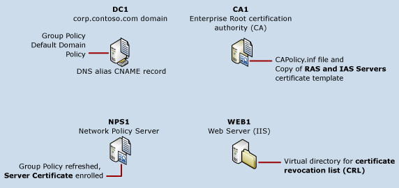

# Server Certificate Deployment Overview

>Applies to: Windows Server (Semi-Annual Channel), Windows Server 2016

This topic contains the following sections.  
  
-   [Server certificate deployment components](#bkmk_components)
  
-   [Server certificate deployment process overview](#bkmk_process)
  
## Server certificate deployment components
You can use this guide to install Active Directory Certificate Services (AD CS) as an Enterprise root certification authority (CA) and to enroll server certificates to servers that are running Network Policy Server (NPS), Routing and Remote Access service (RRAS), or both NPS and RRAS.

If you deploy SDN with certificate-based authentication, servers are required to use a server certificate to prove their identities to other servers so that they achieve secure communications.
  
The following illustration shows the components that are required to deploy server certificates to servers in your SDN infrastructure.
  
  
  
> [!NOTE]  
> In the illustration above, multiple servers are depicted: DC1, CA1, WEB1, and many SDN servers. This guide provides instructions for deploying and configuring CA1 and WEB1, and for configuring DC1, which this guide assumes you have already installed on your network. If you have not already installed your Active Directory domain, you can do so by using the [Core Network Guide](https://technet.microsoft.com/library/mt604042.aspx) for Windows Server 2016.  
  
For more information on each item depicted in the illustration above, see the following:  
  
-   [CA1](#bkmk_ca1)  
  
-   [WEB1](#bkmk_web1)  
  
-   [DC1](#bkmk_dc1)  
  
-   [NPS1](#bkmk_nps1)  
  
### CA1 running the AD CS server role  
In this scenario, the Enterprise Root certification authority (CA) is also an issuing CA. The CA issues certificates to server computers that have the correct security permissions to enroll a certificate. Active Directory Certificate Services (AD CS) is installed on CA1.  
  
For larger networks or where security concerns provide justification, you can separate the roles of root CA and issuing CA, and deploy subordinate CAs that are issuing CAs.  
  
In the most secure deployments, the Enterprise Root CA is taken offline and physically secured.   
  
#### CAPolicy.inf  
Before you install AD CS, you configure the CAPolicy.inf file with specific settings for your deployment.  
  
#### Copy of the **RAS and IAS servers** certificate template  
When you deploy server certificates, you make one copy of the **RAS and IAS servers** certificate template and then configure the template according to your requirements and the instructions in this guide.   
  
You utilize a copy of the template rather than the original template so that the configuration of the original template is preserved for possible future use. You configure the copy of the **RAS and IAS servers** template so that the CA can create server certificates that it issues to the groups in Active Directory Users and Computers that you specify.  
  
#### Additional CA1 configuration  
The CA publishes a certificate revocation list (CRL) that computers must check to ensure that certificates that are presented to them as proof of identity are valid certificates and have not been revoked. You must configure your CA with the correct location of the CRL so that computers know where to look for the CRL during the authentication process.  
  
### WEB1 running the Web Services (IIS) server role  
On the computer that is running the Web Server (IIS) server role, WEB1, you must create a folder in Windows Explorer for use as the location for the CRL and AIA.  
  
#### Virtual directory for the CRL and AIA  
After you create a folder in Windows Explorer, you must configure the folder as a virtual directory in Internet Information Services (IIS) Manager, as well as configuring the access control list for the virtual directory to allow computers to access the AIA and CRL after they are published there.  
  
### DC1 running the AD DS and DNS server roles  
DC1 is the domain controller and DNS server on your network.  
  
#### Group Policy default domain policy  
After you configure the certificate template on the CA, you can configure the default domain policy in Group Policy so that certificates are autoenrolled to NPS and RAS servers. Group Policy is configured in AD DS on the server DC1.  
  
#### DNS alias (CNAME) resource record  
You must create an alias (CNAME) resource record for the Web server to ensure that other computers can find the server, as well as the AIA and the CRL that are stored on the server. In addition, using an alias CNAME resource record provides flexibility so that you can use the Web server for other purposes, such as hosting Web and FTP sites.  
  
### NPS1 running the Network Policy Server role service of the Network Policy and Access Services server role  
The NPS is installed when you perform the tasks in the Windows Server 2016 Core Network Guide, so before you perform the tasks in this guide, you should already have one or more NPSs installed on your network.  
  
#### Group Policy applied and certificate enrolled to servers  
After you have configured the certificate template and autoenrollment, you can refresh Group Policy on all target servers. At this time, the servers enroll the server certificate from CA1.  
  
### Server certificate deployment process overview  
  
> [!NOTE]  
> The details of how to perform these steps are provided in the section [Server Certificate Deployment](../../../core-network-guide/cncg/server-certs/Server-Certificate-Deployment.md).  
  
The process of configuring server certificate enrollment occurs in these stages:  
  
1.  On WEB1, install the Web Server (IIS) role.  
  
2.  On DC1, create an alias (CNAME) record for your Web server, WEB1.  
  
3.  Configure your Web server to host the CRL from the CA, then publish the CRL and copy the Enterprise Root CA certificate into the new virtual directory.  
  
4.  On the computer where you are planning to install AD CS, assign the computer a static IP address, rename the computer, join the computer to the domain, and then log on to the computer with a user account that is a member of the Domain Admins and Enterprise Admins groups.  
  
5.  On the computer where you are planning to install AD CS, configure the CAPolicy.inf file with settings that are specific to your deployment.  
  
6.  Install the AD CS server role and perform additional configuration of the CA.  
  
7.  Copy the CRL and CA certificate from CA1 to the share on the Web server WEB1.  
  
8.  On the CA, configure a copy of the RAS and IAS Servers certificate template. The CA issues certificates based on a certificate template, so you must configure the template for the server certificate before the CA can issue a certificate.  
  
9.  Configure server certificate autoenrollment in Group Policy. When you configure autoenrollment, all  servers that you have specified with Active Directory group memberships automatically receive a server certificate when Group Policy on each server is refreshed. If you add more servers later, they will automatically receive a server certificate, too.  
  
10. Refresh Group Policy on servers. When Group Policy is refreshed, the servers receive the server certificate, which is based on the template that you configured in the previous step. This certificate is used by the server to prove its identity to client computers and other servers during the authentication process.  
  
    > [!NOTE]  
    > All domain member computers automatically receive the Enterprise Root CA's certificate without the configuration of autoenrollment. This certificate is different than the server certificate that you configure and distribute by using autoenrollment. The CA's certificate is automatically installed in the Trusted Root Certification Authorities certificate store for all domain member computers so that they will trust certificates that are issued by this CA.   
  
10. Verify that all servers have enrolled a valid server certificate.  
  

