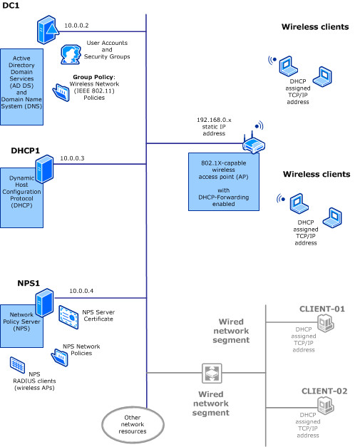

# Wireless Access Deployment Overview

>Applies to: Windows Server (Semi-Annual Channel), Windows Server 2016

The following illustration shows the components that are required to deploy 802.1X authenticated wireless access with PEAP\-MS\-CHAP v2.  

## Wireless access deployment components
The following infrastructure is required for this wireless access deployment:

### 802.1X\-capable Wireless access points
After the required network infrastructure services supporting your wireless local area network are in place, you can begin the design process for the location of the wireless APs. The wireless AP deployment design process involves these steps:

- Identify the areas of coverage for wireless users. While identifying the areas of coverage, be sure to identify whether you want to provide wireless service outside the building, and if so, determine specifically where those external areas are.

- Determine how many wireless APs to deploy to ensure adequate coverage.

- Determine where to place wireless APs.

- Select the channel frequencies for wireless APs.

### Active Directory Domain Services
The following elements of AD DS are required for wireless access deployment.

#### Users and Computers

Use the Active Directory Users and Computers snap\-in to create and manage user accounts, and to create a wireless security group that includes each domain member to whom you want to grant wireless access.

#### Wireless Network \(IEEE 802.11\) Policies

You can use the Wireless Network \(IEEE 802.11\) Policies extension of Group Policy Management to configure policies that are applied to wireless computers when they attempt to access the network.

In Group Policy Management Editor, when you right\-click **Wireless Network \(IEEE 802.11\) Policies**, you have the following two options for the type of wireless policy that you create.

- **Create a New Wireless Network Policy for Windows Vista and Later Releases**

- **Create a New Windows XP Policy**

>[!TIP]
>When configuring a new wireless network policy, you have the option to change the name and description of the policy. If you change the name of the policy, the change is reflected in the **Details** pane of Group Policy Management Editor and on the title bar of the wireless network policy dialog box. Regardless of how you rename your policies, the New XP Wireless Policy will always be listed in Group Policy Management Editor with the **Type** displaying **XP**. Other policies are listed with the **Type** showing **Vista and Later Releases**.  

The Wireless Network Policy for Windows Vista and Later Releases enables you to configure, prioritize, and manage multiple wireless profiles. A wireless profile is a collection of connectivity and security settings that are used to connect to a specific wireless network. When Group Policy is updated on your wireless client computers, the profiles you create in the  Wireless Network Policy are automatically added to the configuration on your wireless client computers to which the Wireless Network Policy applies.

##### Allowing connections to multiple wireless networks

If you have wireless clients that are moved across physical locations in your organization, such as between a main office and a branch office, you might want computers to connect to more than one wireless network. In this situation, you can configure a wireless profile that contains the specific connectivity and security settings for each network.

For example, assume your company has one wireless network for the main corporate office, with a service set identifier \(SSID\) WlanCorp.

Your branch office also has a wireless network to which you also want to connect. The branch office has the SSID configured as WlanBranch.

In this scenario, you can configure a profile for each network, and computers or other devices that are used at both the corporate office and branch office can connect to either of the wireless networks when they are physically in range of a network's coverage area.

##### Mixed\-mode wireless networks

Alternately, assume your network has a mixture of wireless computers and devices that support different security standards. Perhaps some older computers have wireless adapters that can only use WPA\-Enterprise, while newer devices can use the stronger WPA2\-Enterprise standard.

You can create two different profiles that use the same SSID and nearly identical connectivity and security settings.

In one profile, you can set the wireless authentication to WPA2\-Enterprise with AES, and in the other profile you can specify WPA\-Enterprise with TKIP.

This is commonly known as a mixed\-mode deployment, and it allows computers of different types and wireless capabilities to share the same wireless network.

### Network Policy Server \(NPS\)
NPS enables you to create and enforce network access policies for connection request authentication and authorization.

When you use NPS as a RADIUS server, you configure network access servers, such as wireless access points, as RADIUS clients in NPS. You also configure the network policies that NPS uses to authenticate access clients and authorize their connection requests.  

### Wireless client computers
For the purpose of this guide, wireless client computers are computers and other devices that are equipped with IEEE 802.11 wireless network adapters and that are running Windows client or Windows Server operating systems.

#### Server computers as wireless clients

By default, the functionality for 802.11 wireless is disabled on computers that are running Windows Server.

To enable wireless connectivity on computers running server operating systems, you must install and enable the Wireless LAN \(WLAN\) Service feature by using either Windows PowerShell or the Add Roles and Features Wizard in Server Manager.

When you install the **Wireless LAN Service** feature, the new service **WLAN AutoConfig** is installed in **Services**. When installation is complete, you must restart the server.

After the server is restarted, you can access WLAN AutoConfig when you click **Start**, **Windows Administrative Tools**, and **Services**.

After install and server restart, the WLAN AutoConfig service is in a stopped state with a startup type of **Automatic**. To start the service, double-click **WLAN AutoConfig**. On the **General** tab, click **Start**, and then click **OK**.

The WLAN AutoConfig service enumerates wireless adapters and manages both wireless connections and the wireless profiles that contain settings that are required to configure the server to connect to a wireless network.

For an overview of wireless access deployment, see [Wireless Access Deployment Process](c-wireless-access-deploy-process.md).
