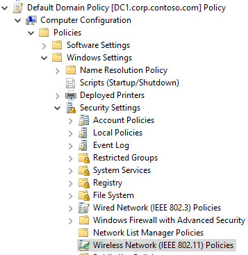
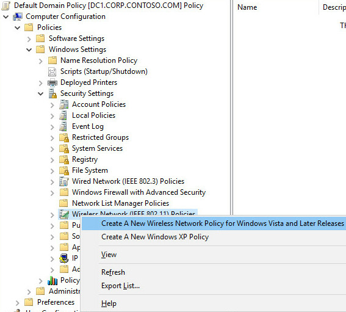
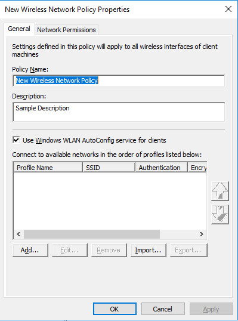

# Wireless Access Deployment

>Applies to: Windows Server (Semi-Annual Channel), Windows Server 2016

Follow these steps to deploy wireless access:

- [Deploy and Configure Wireless APs](#bkmk_aps)

- [Create a Wireless Users Security Group](#bkmk_groups)

- [Configure Wireless Network \(IEEE 802.11\) Policies](#bkmk_policies)

- [Configure NPSs](#bkmk_nps)

- [Join New Wireless Computers to the Domain](#bkmk_domain)

## Deploy and Configure Wireless APs

Follow these steps to deploy and configure your wireless APs:

- [Specify Wireless AP Channel Frequencies](#bkmk_channel)

- [Configure Wireless APs](#bkmk_wirelessaps)

>[!NOTE]
>The procedures in this guide do not include instructions for cases in which the **User Account Control** dialog box opens to request your permission to continue. If this dialog box opens while you are performing the procedures in this guide, and if the dialog box was opened in response to your actions, click **Continue**.

### Specify Wireless AP Channel Frequencies

When you deploy multiple wireless APs at a single geographical site, you must configure wireless APs that have overlapping signals to use unique channel frequencies to reduce interference between wireless APs.

You can use the following guidelines to assist you in choosing channel frequencies that do not conflict with other wireless networks at the geographical location of your wireless network.

- If there are other organizations that have offices in close proximity or in the same building as your organization, identify whether there are any wireless networks owned by those organizations. Find out both the placement and the assigned channel frequencies of their wireless AP's, because you need to assign different channel frequencies to your AP's and you need to determine the best location to install your AP's.

- Identify overlapping wireless signals on adjacent floors within your own organization. After identifying overlapping coverage areas outside and within your organization, assign channel frequencies for your wireless APs, ensuring that any two wireless APs with overlapping coverage are assigned different channel frequencies.

### Configure Wireless APs

Use the following information along with the product documentation provided by the wireless AP manufacturer to configure your wireless APs.

This procedure enumerates items commonly configured on a wireless AP. The item names can vary by brand and model and might be different from those in the following list. For specific details, see your wireless AP documentation.

#### To configure your wireless APs  

- **SSID**. Specify the name of the wireless network\(s\) \(for example, ExampleWLAN\). This is the name that is advertised to wireless clients.

- **Encryption**. Specify WPA2\-Enterprise \(preferred\) or WPA\-Enterprise, and either AES \(preferred\) or TKIP encryption cipher, depending on which versions are supported by your wireless client computer network adapters.

- **Wireless AP IP address \(static\)**. On each AP, configure a unique static IP address that falls within the exclusion range of the DHCP scope for the subnet. Using an address that is excluded from assignment by DHCP prevents the DHCP server from assigning the same IP address to a computer or other device.

- **Subnet mask**. Configure this to match the subnet mask settings of the LAN to which you have connected the wireless AP.  

- **DNS name**. Some wireless APs can be configured with a DNS name. The DNS service on the network can resolve DNS names to an IP address. On each wireless AP that supports this feature, enter a unique name for DNS resolution.  

- **DHCP service**. If your wireless AP has a built\-in DHCP service, disable it.  

- **RADIUS shared secret**. Use a unique RADIUS shared secret for each wireless AP unless you are planning to configure APs as RADIUS Clients in NPS by group. If you plan to configure APs by group in NPS, the shared secret must be the same for every member of the group. In addition, each shared secret you use should be a random sequence of at least 22 characters that mixes uppercase and lowercase letters, numbers, and punctuation. To ensure randomness, you can use a random character generator, such as the random character generator found in the NPS **Configure 802.1X** wizard, to create the shared secrets.

>[!TIP]
>Record the shared secret for each wireless AP and store it in a secure location, such as an office safe. You must know the shared secret for each wireless AP when you configure RADIUS clients in the NPS.  

- **RADIUS server IP address**. Type the IP address of the server running NPS.

- **UDP port\(s\)**. By default, NPS uses UDP ports 1812 and 1645 for authentication messages and UDP ports 1813 and 1646 for accounting messages. It is recommended that you use these same UDP ports on your APs, but if you have a valid reason to use different ports, ensure that you not only configure the APs with the new port numbers but also reconfigure all of your NPSs to use the same port numbers as the APs. If the APs and the NPSs are not configured with the same UDP ports, NPS cannot receive or process connection requests from the APs, and all wireless connection attempts on the network will fail.

- **VSAs**. Some wireless APs require vendor\-specific attributes \(VSAs\) to provide full wireless AP functionality. VSAs are added in NPS network policy.

- **DHCP filtering**. Configure wireless APs to block wireless clients from sending IP packets from UDP port 68 to the network, as documented by the wireless AP manufacturer.

- **DNS filtering**. Configure wireless APs to block wireless clients from sending IP packets from TCP or UDP port 53 to the network, as documented by the wireless AP manufacturer.

## Create Security Groups for Wireless Users

Follow these steps to create one or more wireless users security groups, and then add users to the appropriate wireless users security group:

- [Create a Wireless Users Security Group](#bkmk_groups)

- [Add Users to the Wireless Security Group](#bkmk_addusers)

### Create a Wireless Users Security Group

You can use this procedure to create a wireless security group in the Active Directory Users and Computers Microsoft Management Console \(MMC\) snap\-in.  

Membership in **Domain Admins**, or equivalent, is the minimum required to perform this procedure.

#### To create a wireless users security group

1. Click **Start**, click **Administrative Tools**, and then click **Active Directory Users and Computers**. The Active Directory Users and Computers snap\-in opens. If it is not already selected, click the node for your domain. For example, if your domain is example.com, click **example.com**.

2. In the details pane, right\-click the folder in which you want to add a new group \(for example, right\-click **Users**\), point to **New**, and then click **Group**.

3. In **New Object – Group**, in **Group name**, type the name of the new group. For example, type **Wireless Group**.

4. In **Group scope**, select one of the following options:

    - **Domain local**

    - **Global**

    - **Universal**

5. In **Group type**, select **Security**.

6. Click **OK**.

If you need more than one security group for wireless users, repeat these steps to create additional wireless users groups. Later you can create individual network policies in NPS to apply different conditions and constraints to each group, providing them with different access permissions and connectivity rules.

###  Add Users to the Wireless Users Security Group

You can use this procedure to add a user, computer, or group to your wireless security group in the Active Directory Users and Computers Microsoft Management Console \(MMC\) snap\-in.

Membership in **Domain Admins**, or equivalent is the minimum required to perform this procedure.

#### To add users to the wireless security group

1. Click **Start**, click **Administrative Tools**, and then click **Active Directory Users and Computers**. The Active Directory Users and Computers MMC opens. If it is not already selected, click the node for your domain. For example, if your domain is example.com, click **example.com**.

2. In the details pane, double\-click the folder that contains your wireless security group.

3. In the details pane, right\-click the wireless security group, and then click **Properties**. The **Properties** dialog box for the security group opens.

4. On the **Members** tab, click **Add**, and then complete one of the following procedures to either add a computer or add a user or group.

##### To add a user or group

1. In **Enter the object names to select**, type the name of the user or group that you want to add, and then click **OK**.

2. To assign group membership to other users or groups, repeat step 1 of this procedure.  

##### To add a computer

1. Click **Object Types**. The **Object Types** dialog box opens.

2. In **Object types**, select **Computers**, and then click **OK**.

3. In **Enter the object names to select**, type the name of the computer that you want to add, and then click **OK**.

4. To assign group membership to other computers, repeat steps 1\-3 of this procedure.

## Configure Wireless Network \(IEEE 802.11\) Policies

Follow these steps to configure Wireless Network \(IEEE 802.11\) Policies Group Policy extension:

- [Open or Add and Open a Group Policy Object](#bkmk_opengpme)

- [Activate Default Wireless Network \(IEEE 802.11\) Policies](#bkmk_activate)

- [Configure the New Wireless Network Policy](#bkmk_policyconfig)

### Open or Add and Open a Group Policy Object

By default, the Group Policy Management feature is installed on computers running Windows Server 2016 when the Active Directory Domain Services \(AD DS\) server role is installed and the server is configured as a domain controller. The following procedure that describes how to open the Group Policy Management Console \(GPMC\) on your domain controller. The procedure then describes how to either open an existing domain\-level Group Policy object \(GPO\) for editing, or create a new domain GPO and open it for editing.

Membership in **Domain Admins**, or equivalent, is the minimum required to perform this procedure.

#### To open or add and open a Group Policy object

1. On your domain controller, click **Start**, click **Windows Administrative Tools**, and then click **Group Policy Management**. The Group Policy Management Console opens.  

2. In the left pane, double\-click your forest. For example, double\-click **Forest: example.com**.  

3. In the left pane, double\-click **Domains**, and then double\-click the domain for which you want to manage a Group Policy object. For example, double\-click **example.com**.  

4. Do one of the following:

    -   **To open an existing domain\-level GPO for editing**, double click the domain that contains the Group Policy object that you want to manage, right\-click the domain policy you want to manage, such as the Default Domain Policy, and then click **Edit**. **Group Policy Management Editor** opens.

    -   **To create a new Group Policy object and open for editing**, right\-click the domain for which you want to create a new Group Policy object, and then click **Create a GPO in this domain, and Link it here**.

        In **New GPO**, in **Name**, type a name for the new Group Policy object, and then click **OK**.

        Right\-click your new Group Policy object, and then click **Edit**. **Group Policy Management Editor** opens.

In the next section you will use Group Policy Management Editor to create wireless policy.

### Activate Default Wireless Network \(IEEE 802.11\) Policies

This procedure describes how to activate the default Wireless Network \(IEEE 802.11\) Policies by using the Group Policy Management Editor \(GPME\).

>[!NOTE]
>After you activate the **Windows Vista and Later Releases** version of the Wireless Network \(IEEE 802.11\) Policies or the **Windows XP** version, the version option is automatically removed from the list of options when you right\-click **Wireless Network \(IEEE 802.11\) Policies**. This occurs because after you select a policy version, the policy is added in the details pane of the GPME when you select the **Wireless Network \(IEEE 802.11\) Policies** node. This state remains unless you delete the wireless policy, at which time the wireless policy version returns to the right\-click menu for **Wireless Network \(IEEE 802.11\) Policies** in the GPME. Additionally, the wireless policies are only listed in the GPME details pane when the **Wireless Network \(IEEE 802.11\) Policies** node is selected.

Membership in **Domain Admins**, or equivalent, is the minimum required to perform this procedure.

#### To activate default Wireless Network \(IEEE 802.11\) Policies  

1. Follow the previous procedure, **To open or add and open a Group Policy object** to open the GPME.

2. In the GPME, in the left pane, double\-click **Computer Configuration**, double\-click **Policies**, double\-click **Windows Settings**, and then double\-click **Security Settings**.

3. In **Security Settings**, right\-click **Wireless Network \(IEEE 802.11\) Policies**, and then click **Create a new Wireless Policy for Windows Vista and Later Releases**. 

4. The **New Wireless Network Policy Properties** dialog box opens. In **Policy Name**, type a new name for the policy or keep the default name. Click **OK** to save the policy. The default policy is activated and listed in the details pane of the GPME with the new name you provided or with the default name **New Wireless Network Policy**.

5. In the details pane, double\-click **New Wireless Network Policy** to open it.

In the next section you can perform policy configuration, policy processing preference order, and network permissions.

### Configure the New Wireless Network Policy

You can use the procedures in this section to configure Wireless Network \(IEEE 802.11\) Policy. This policy enables you to configure security and authentication settings, manage wireless profiles, and specify permissions for wireless networks that are not configured as preferred networks.

- [Configure a Wireless Connection Profile for PEAP\-MS\-CHAP v2](#bkmk_configureprofile)  

- [Set the Preference Order for Wireless Connection Profiles](#bkmk_preferenceorder)  

- [Define Network Permissions](#bkmk_permissions)  

#### Configure a Wireless Connection Profile for PEAP\-MS\-CHAP v2

This procedure provides the steps required to configure a PEAP\-MS\-CHAP v2 wireless profile.  

Membership in **Domain Admins**, or equivalent, is the minimum required to complete this procedure.

##### To configure a wireless connection profile for PEAP\-MS\-CHAP v2

1. In GPME, in the wireless network properties dialog box for the policy that you just created, on the **General** tab and in **Description**, type a brief description for the policy.

2. To specify that WLAN AutoConfig is used to configure wireless network adapter settings, ensure that **Use Windows WLAN AutoConfig service for clients** is selected.  

3. In **Connect to available networks in the order of profiles listed below**, click **Add**, and then select **Infrastructure**. The **New Profile properties** dialog box opens.

4. In the**New Profile properties** dialog box, on the **Connection** tab, in the **Profile Name** field, type a new name for the profile. For example, type **Example.com WLAN Profile for Windows 10**.

5. In **Network Name\(s\) \(SSID\)**, type the SSID that corresponds to the SSID configured on your wireless APs, and then click **Add**.

    If your deployment uses multiple SSIDs and each wireless AP uses the same wireless security settings, repeat this step to add the SSID for each wireless AP to which you want this profile to apply.

    If your deployment uses multiple SSIDs and the security settings for each SSID do not match, configure a separate profile for each group of SSIDs that use the same security settings. For example, if you have one group of wireless APs configured to use WPA2\-Enterprise and AES, and another group of wireless APs to use WPA\-Enterprise and TKIP, configure a profile for each group of wireless APs.

6. If the default text **NEWSSID** is present, select it, and then click **Remove**.

7. If you deployed wireless access points that are configured to suppress the broadcast beacon, select **Connect even if the network is not broadcasting**.

    > [!NOTE]
    > Enabling this option can create a security risk because wireless clients will probe for and attempt connections to any wireless network. By default, this setting is not enabled.  

8. Click the **Security** tab, click **Advanced**, and then configure the following:

    1. To configure advanced 802.1X settings, in **IEEE 802.1X**, select **Enforce advanced 802.1X settings**.

        When the advanced 802.1X settings are enforced, the default values for **Max Eapol\-Start Msgs**, **Held Period**, **Start Period**, and **Auth Period** are sufficient for typical wireless deployments. Because of this, you do not need to change the defaults unless you have a specific reason for doing so.

    2. To enable Single Sign On, select **Enable Single Sign On for this network**.

    3. The remaining default values in **Single Sign On** are sufficient for typical wireless deployments.

    4. In **Fast Roaming**, if your wireless AP is configured for pre\-authentication, select **This network uses pre\-authentication**.

9. To specify that wireless communications meet FIPS 140\-2 standards, select **Perform cryptography in FIPS 140\-2 certified mode**.

10. Click **OK** to return to the **Security** tab. In **Select the security methods for this network**, in **Authentication**, select **WPA2\-Enterprise** if it is supported by your wireless AP and wireless client network adapters. Otherwise, select **WPA\-Enterprise**.

11. In **Encryption**, if supported by your wireless AP and wireless client network adapters, select **AES-CCMP**. If you are using access points and wireless network adapters that support 802.11ac, select **AES-GCMP**. Otherwise, select **TKIP**.

    > [!NOTE]  
    > The settings for both **Authentication** and **Encryption** must match the settings configured on your wireless APs. The default settings for **Authentication Mode**, **Max Authentication Failures**, and **Cache user information for subsequent connections to this network** are sufficient for typical wireless deployments.  

12. In **Select a network authentication method**, select **Protected EAP \(PEAP\)**, and then click **Properties**. The **Protected EAP Properties** dialog box opens.

13. In **Protected EAP Properties**, confirm that **Verify the server's identity by validating the certificate** is selected.

14. In **Trusted Root Certification Authorities**, select the trusted root certification authority \(CA\) that issued the server certificate to your NPS.

    > [!NOTE]  
    > This setting limits the root CAs that clients trust to the selected CAs. If no trusted root CAs are selected, then clients will trust all root CAs listed in their Trusted Root Certification Authorities certificate store.  

15. In the **Select Authentication Method** list, select **Secured password \(EAP\-MS\-CHAP v2\)**.

16. Click **Configure**. In the **EAP MSCHAPv2 Properties** dialog box, verify **Automatically use my Windows logon name and password \(and domain if any\)** is selected, and click **OK**.

17. To enable PEAP Fast Reconnect, ensure that **Enable Fast Reconnect** is selected.

18. To require server cryptobinding TLV on connection attempts, select **Disconnect if server does not present cryptobinding TLV**.

19. To specify that user identity is masked in phase one of authentication, select **Enable Identity Privacy**, and in the textbox, type an anonymous identity name, or leave the textbox blank.

    > [!NOTES]
    > - The NPS policy for 802.1X Wireless must be created by using NPS **Connection Request Policy**. If the NPS policy is created by using NPS **Network Policy**, then identity privacy will not work.
    > - EAP identity privacy is provided by certain EAP methods where an empty or an anonymous identity \(different from the actual identity\) is sent in response to the EAP identity request. PEAP sends the identity twice during the authentication. In the first phase, the identity is sent in plain text and this identity is used for routing purposes, not for client authentication. The real identity—used for authentication—is sent during the second phase of the authentication, within the secure tunnel that is established in the first phase. If **Enable Identity Privacy** checkbox is selected, the username is replaced with the entry specified in the textbox. For example, assume **Enable Identity Privacy** is selected and the identity privacy alias **anonymous** is specified in the textbox. For a user with a real identity alias <strong>jdoe@example.com</strong>, the identity sent in first phase of authentication will be changed to <strong>anonymous@example.com</strong>. The realm portion of the 1st phase identity is not modified as it is used for routing purposes.  

20. Click **OK** to close the **Protected EAP Properties** dialog box.
21. Click **OK** to close the **Security** tab.
22. If you want to create additional profiles, click **Add**, and then repeat the previous steps, making different choices to customize each profile for the wireless clients and network to which you want the profile applied. When you are done adding profiles, click **OK** to close the Wireless Network Policy Properties dialog box.

In the next section you can order the policy profiles for optimum security.

#### Set the Preference Order for Wireless Connection Profiles
You can use this procedure if you have created multiple wireless profiles in your wireless network policy and you want to order the profiles for optimal effectiveness and security.

To ensure that wireless clients connect with the highest level of security that they can support, place your most restrictive policies at the top of the list.

For example, if you have two profiles, one for clients that support WPA2 and one for clients that support WPA, place the WPA2 profile higher on the list. This ensures that the clients that support WPA2 will use that method for the connection rather than the less secure WPA.

This procedure provides the steps to specify the order in which wireless connection profiles are used to connect domain member wireless clients to wireless networks.

Membership in **Domain Admins**, or equivalent, is the minimum required to complete this procedure.

##### To set the preference order for wireless connection profiles

1. In GPME, in the wireless network properties dialog box for the policy that you just configured, click the **General** tab.

2. On the **General** tab, in **Connect to available networks in the order of profiles listed below**, select the profile that you want to move in the list, and then click either the "up arrow" button or “down arrow” button to move the profile to the desired location in the list.

3.  Repeat step 2 for each profile that you want to move in the list.  

4.  Click **OK** to save all changes.

In the following section, you can define network permissions for the wireless policy.

#### Define Network Permissions
You can configure settings on the **Network Permissions** tab for the domain members to which Wireless Network \(IEEE 802.11\) Policies apply.

You can only apply the following settings for wireless networks that are not configured on the **General** tab in the **Wireless Network Policy Properties** page:

- Allow or deny connections to specific wireless networks that you specify by network type and Service Set Identifier \(SSID\)

- Allow or deny connections to ad hoc networks

- Allow or deny connections to infrastructure networks

- Allow or deny users to view network types \(ad hoc or infrastructure\) to which they are denied access

- Allow or deny users to create a profile that applies to all users

- Users can only connect to allowed networks by using Group Policy profiles

Membership in **Domain Admins**, or equivalent, is the minimum required to complete these procedures.

##### To allow or deny connections to specific wireless networks

1. In GPME, in the wireless network properties dialog box, click the **Network Permissions** tab.

2. On the **Network Permissions** tab, click **Add**. The **New Permissions Entry** dialog box opens.

3. In the **New Permission Entry** dialog box, in the **Network Name \(SSID\)** field, type the network SSID of the network for which you want to define permissions.

4.  In **Network Type**, select **Infrastructure** or **Ad hoc**.

    > [!NOTE]  
    > If you are uncertain whether the broadcasting network is an infrastructure or ad hoc network, you can configure two network permission entries, one for each network type.

5. In **Permission**, select **Allow** or **Deny**.

6. Click **OK**, to return to the **Network Permissions** tab.

##### To specify additional network permissions \(Optional\)

1.  On the **Network Permissions** tab, configure any or all of the following:  

    -   To deny your domain members access to ad hoc networks, select **Prevent connections to ad\-hoc networks**.

    -   To deny your domain members access to infrastructure networks, select **Prevent connections to infrastructure networks**.  

    -   To allow your domain members to view network types \(ad hoc or infrastructure\) to which they are denied access, select **Allow user to view denied networks**.

    -   To allow users to create profiles that apply to all users, select **Allow everyone to create all user profiles**.

    -   To specify that your users can only connect to allowed networks by using Group Policy profiles, select **Only use Group Policy profiles for allowed networks**.

## Configure your NPSs
Follow these steps to configure NPSs to perform 802.1X authentication for wireless access:

- [Register NPS in Active Directory Domain Services](#bkmk_npsreg)

- [Configure a Wireless AP as an NPS RADIUS Client](#bkmk_radiusclient)

- [Create NPS Policies for 802.1X Wireless using a Wizard](#bkmk_npspolicy)

### Register NPS in Active Directory Domain Services
You can use this procedure to register a server running Network Policy Server \(NPS\) in Active Directory Domain Services \(AD DS\) in the domain where the NPS is a member. For NPSs to be granted permission to read the dial\-in properties of user accounts during the authorization process, each NPS must be registered in AD DS. Registering an NPS adds the server to the **RAS and IAS Servers** security group in AD DS.

>[!NOTE]
>You can install NPS on a domain controller or on a dedicated server. Run the following Windows PowerShell command to install NPS if you have not yet done so:
    
    Install-WindowsFeature NPAS -IncludeManagementTools
    
Membership in **Domain Admins**, or equivalent, is the minimum required to complete this procedure.

#### To register an NPS in its default domain

1. On your NPS, in **Server Manager**, click **Tools**, and then click **Network Policy Server**. The NPS snap\-in opens.

2. Right\-click **NPS \(Local\)**, and then click **Register Server in Active Directory**. The **Network Policy Server** dialog box opens.

3. In **Network Policy Server**, click **OK**, and then click **OK** again.

### Configure a Wireless AP as an NPS RADIUS Client
You can use this procedure to configure an AP, also known as a *network access server \(NAS\)*, as a Remote Authentication Dial\-In User Service \(RADIUS\) client by using the NPS snap\-in. 

>[!IMPORTANT]
>Client computers, such as wireless portable computers and other computers running client operating systems, are not RADIUS clients. RADIUS clients are network access servers—such as wireless access points, 802.1X\-capable switches, virtual private network \(VPN\) servers, and dial\-up servers—because they use the RADIUS protocol to communicate with RADIUS servers such as NPSs.

Membership in **Domain Admins**, or equivalent, is the minimum required to complete this procedure.

#### To add a network access server as a RADIUS client in NPS

1. On your NPS, in **Server Manager**, click **Tools**, and then click **Network Policy Server**. The NPS snap\-in opens.

2. In the NPS snap\-in, double\-click **RADIUS Clients and Servers**. Right\-click **RADIUS Clients**, and then click **New**.

3. In **New RADIUS Client**, verify that the **Enable this RADIUS client** check box is selected.

4. In **New RADIUS Client**, in **Friendly name**, type a display name for the wireless access point.

    For example, if you want to add a wireless access point \(AP\) named AP\-01, type **AP\-01**.

5. In **Address \(IP or DNS\)**, type the IP address or fully qualified domain name \(FQDN\) for the NAS.

    If you enter the FQDN, to verify that the name is correct and maps to a valid IP address, click **Verify**, and then in **Verify Address**, in the **Address** field, click **Resolve**. If the FQDN name maps to a valid IP address, the IP address of that NAS will automatically appear in **IP address**. If the FQDN does not resolve to an IP address you will receive a message indicating that no such host is known. If this occurs, verify that you have the correct AP name and that the AP is powered on and connected to the network.  

    Click **OK** to close **Verify Address**.  

6. In **New RADIUS Client**, in **Shared Secret**, do one of the following:  

    -   To manually configure a RADIUS shared secret, select **Manual**, and then in **Shared secret**, type the strong password that is also entered on the NAS. Retype the shared secret in **Confirm shared secret**.  

    -   To automatically generate a shared secret, select the **Generate** check box, and then click the **Generate** button. Save the generated shared secret, and then use that value to configure the NAS so that it can communicate with the NPS.  

        >[!IMPORTANT]
        >The RADIUS shared secret that you enter for your virtual AP's in NPS must exactly match the RADIUS shared secret that is configured on your actual wireless AP's. If you use the NPS option to generate a RADIUS shared secret, then you must configure the matching actual wireless AP with the RADIUS shared secret that was generated by NPS.

7. In **New RADIUS Client**, on the **Advanced** tab, in **Vendor name**, specify the NAS manufacturer name. If you are not sure of the NAS manufacturer name, select **RADIUS standard**.

8. In **Additional Options**, if you are using any authentication methods other than EAP and PEAP, and if your NAS supports the use of the message authenticator attribute, select **Access Request messages must contain the Message\-Authenticator attribute**.

9. Click **OK**. Your NAS appears in the list of RADIUS clients configured on the NPS.

### Create NPS Policies for 802.1X Wireless Using a Wizard
You can use this procedure to create the connection request policies and network policies required to deploy either 802.1X\-capable wireless access points as Remote Authentication Dial\-In User Service \(RADIUS\) clients to the RADIUS server running Network Policy Server \(NPS\).  
After you run the wizard, the following policies are created:

- One connection request policy

- One network policy

>[!NOTE]
>You can run the New IEEE 802.1X Secure Wired and Wireless Connections wizard every time you need to create new policies for 802.1X authenticated access.

Membership in **Domain Admins**, or equivalent, is the minimum required to complete this procedure.

#### Create policies for 802.1X authenticated wireless by using a wizard

1. Open the NPS snap\-in. If it is not already selected, click **NPS \(Local\)**. If you are running the NPS MMC snap\-in and want to create policies on a remote NPS, select the server.

2. In **Getting Started**, in **Standard Configuration**, select **RADIUS server for 802.1X Wireless or Wired Connections**. The text and links below the text change to reflect your selection.

3. Click **Configure 802.1X**. The Configure 802.1X wizard opens.

4.  On the **Select 802.1X Connections Type** wizard page, in **Type of 802.1X connections**, select **Secure Wireless Connections**, and in **Name**, type a name for your policy, or leave the default name **Secure Wireless Connections**. Click **Next**.

5.  On the **Specify 802.1X Switches** wizard page, in **RADIUS clients**, all 802.1X switches and wireless access points that you have added as RADIUS Clients in the NPS snap\-in are shown. Do any of the following:

    -   To add additional network access servers \(NASs\), such as wireless APs, in **RADIUS clients**, click **Add**, and then in **New RADIUS client**, enter the information for: **Friendly name**, **Address \(IP or DNS\)**, and **Shared Secret**.

    -   To modify the settings for any NAS, in **RADIUS clients**, select the AP for which you want to modify the settings, and then click **Edit**. Modify the settings as required.

    -   To remove a NAS from the list, in **RADIUS clients**, select the NAS, and then click **Remove**.

        >[!WARNING]
        >Removing a RADIUS client from within the **Configure 802.1X** wizard deletes the client from the NPS configuration. All additions, modifications, and deletions that you make within the **Configure 802.1X**  wizard to RADIUS clients are reflected in the NPS snap\-in, in the **RADIUS Clients** node under **NPS** \/ **RADIUS Clients and Servers**. For example, if you use the wizard to remove an 802.1X switch, the switch is also removed from the NPS snap\-in.

6. Click **Next**. On the **Configure an Authentication Method** wizard page, in **Type \(based on method of access and network configuration\)**, select **Microsoft: Protected EAP \(PEAP\)**, and then click **Configure**.

    >[!TIP]
    >If you receive an error message indicating that a certificate cannot be found for use with the authentication method, and you have configured Active Directory Certificate Services to automatically issue certificates to RAS and IAS servers on your network, first ensure that you have followed the steps to Register NPS in Active Directory Domain Services, then use the following steps to update Group Policy: Click **Start**, click **Windows System**, click **Run**, and in **Open**, type **gpupdate**, and then press ENTER. When the command returns results indicating that both user and computer Group Policy have updated successfully, select **Microsoft: Protected EAP \(PEAP\)** again, and then click **Configure**.
    >
    >If after refreshing Group Policy you continue to receive the error message indicating that a certificate cannot be found for use with the authentication method, the certificate is not being displayed because it does not meet the minimum server certificate requirements as documented in the Core Network Companion Guide: [Deploy Server Certificates for 802.1X Wired and Wireless Deployments](https://technet.microsoft.com/windows-server-docs/networking/core-network-guide/cncg/server-certs/deploy-server-certificates-for-802.1x-wired-and-wireless-deployments). If this happens, you must discontinue NPS configuration, revoke the certificate issued to your NPS\(s\), and then follow the instructions to configure a new certificate by using the server certificates deployment guide.

7.  On the **Edit Protected EAP Properties** wizard page, in **Certificate issued**, ensure that the correct NPS certificate is selected, and then do the following:

    >[!NOTE]
    >Verify that the value in **Issuer** is correct for the certificate selected in **Certificate issued**. For example, the expected issuer for a certificate issued by a CA running Active Directory Certificate Services \(AD CS\) named corp\DC1, in the domain contoso.com, is **corp\-DC1\-CA**.

    -   To allow users to roam with their wireless computers between access points without requiring them to reauthenticate each time they associate with a new AP, select **Enable Fast Reconnect**.

    -   To specify that connecting wireless clients will end the network authentication process if the RADIUS server does not present cryptobinding Type\-Length\-Value \(TLV\), select **Disconnect Clients without Cryptobinding**.  

    -   To modify the policy settings for the EAP type, in **EAP Types**, click **Edit**, in **EAP MSCHAPv2 Properties**, modify the settings as needed, and then click **OK**.  

8.  Click **OK**. The Edit Protected EAP Properties dialog box closes, returning you to the **Configure 802.1X** wizard. Click **Next**.

9. In **Specify User Groups**, click **Add**, and then type the name of the security group that you configured for your wireless clients in the Active Directory Users and Computers snap\-in. For example, if you named your wireless security group Wireless Group, type **Wireless Group**. Click **Next**.

10. Click **Configure** to configure RADIUS standard attributes and vendor\-specific attributes for virtual LAN \(VLAN\) as needed, and as specified by the documentation provided by your wireless AP hardware vendor. Click **Next**.

11. Review the configuration summary details, and then click **Finish**.

Your NPS policies are now created, and you can move on to joining wireless computers to the domain.

## Join New Wireless Computers to the Domain
The easiest method to join new wireless computers to the domain is to physically attach the computer to a segment of the wired LAN \(a segment not controlled by an 802.1X switch\) before joining the computer to the domain. This is easiest because wireless group policy settings are automatically and immediately applied and, if you have deployed your own PKI, the computer receives the CA certificate and places it in the Trusted Root Certification Authorities certificate store, allowing the wireless client to trust NPSs with server certs issued by your CA.

Likewise, after a new wireless computer is joined to the domain, the preferred method for users to log on to the domain is to perform log on by using a wired connection to the network.

### Other domain-join methods
In cases where it is not practical to join computers to the domain by using a wired Ethernet connection, or in cases where the user cannot log on to the domain for the first time by using a wired connection, you must use an alternate method.

- **IT Staff Computer Configuration**. A member of the IT staff joins a wireless computer to the domain and configures a Single Sign On bootstrap wireless profile. With this method, the IT administrator connects the wireless computer to the wired Ethernet network and joins the computer to the domain. Then the administrator distributes the computer to the user. When the user starts the computer without using a wired connection, the domain credentials that they manually specify for the user logon are used to both establish a connection to the wireless network and to log on to the domain.

For more information, see the section [Join the Domain and Log On by using the IT Staff Computer Configuration Method](#bkmk_itstaff)

-   **Bootstrap Wireless Profile Configuration by Users**. The user manually configures the wireless computer with a bootstrap wireless profile and joins the domain, based on instructions acquired from an IT administrator. The bootstrap wireless profile allows the user to establish a wireless connection and then join the domain. After joining the computer to the domain and restarting the computer, the user can log on to the domain by using a wireless connection and their domain account credentials.

For more information, see the section [Join the Domain and Log On by using Bootstrap Wireless Profile Configuration by Users](#bkmk_userbootstrap).

### Join the Domain and Log On by using the IT Staff Computer Configuration Method
Domain member users with domain\-joined wireless client computers can use a temporary wireless profile to connect to an 802.1X\-authenticated wireless network without first connecting to the wired LAN. This temporary wireless profile is called a *bootstrap wireless profile*.

A bootstrap wireless profile requires the user to manually specify their domain user account credentials, and does not validate the certificate of the Remote Authentication Dial\-In User Service \(RADIUS\) server running Network Policy Server \(NPS\).

After wireless connectivity is established, Group Policy is applied on the wireless client computer, and a new wireless profile is issued automatically. The new policy uses the computer and user account credentials for client authentication. 

Additionally, as part of the PEAP\-MS\-CHAP v2 mutual authentication using the new profile instead of the bootstrap profile, the client validates the credentials of the RADIUS server.

After you join the computer to the domain, use this procedure to configure a Single Sign On bootstrap wireless profile, before distributing the wireless computer to the domain\-member user.

#### To configure a Single Sign On bootstrap wireless profile

1. Create a bootstrap profile by using the procedure in this guide named [Configure a Wireless Connection Profile for PEAP\-MS\-CHAP v2](#bkmk_configureprofile), and use the following settings:

    - PEAP\-MS\-CHAP v2 authentication

    - Validate RADIUS server certificate disabled

    - Single Sign On enabled

2. In the properties of the Wireless Network Policy within which you created the new bootstrap profile, on the **General** tab, select the bootstrap profile, and then click **Export** to export the profile to a network share, USB flash drive, or other easily accessible location. The profile is saved as an *.xml file to the location that you specify.

3. Join the new wireless computer to the domain \(for example, through an Ethernet connection that does not require IEEE 802.1X authentication\) and add the bootstrap wireless profile to the computer by using the **netsh wlan add profile** command.

    >[!NOTE]
    >For more information, see Netsh Commands for Wireless Local Area Network \(WLAN\) at [http:\/\/technet.microsoft.com\/library\/dd744890.aspx](https://technet.microsoft.com/library/dd744890).

4. Distribute the new wireless computer to the user with the procedure to “Log on to the domain using computers running Windows 10.”

When the user starts the computer, Windows prompts the user to enter their domain user account name and password. Because Single Sign On is enabled, the computer uses the domain user account credentials to first establish a connection with the wireless network and then log on to the domain.

#### Log on to the domain using computers running Windows 10

1. Log off the computer, or restart the computer.

2. Press any key on your keyboard or click on the desktop. The logon screen appears with a local user account name displayed and a password entry field below the name. Do not log on with the local user account.

3. In the lower left corner of the screen, click **Other User**. The Other User log on screen appears with two fields, one for user name and one for password. Below the password field is the text **Sign on to:** and then the name of the domain where the computer is joined. For example, if your domain is named example.com, the text reads **Sign on to: EXAMPLE**.

4. In **User name**, type your domain user name.

5. In **Password**, type your domain password, and then click the arrow, or press ENTER.

>[!NOTE]
>If the **Other User** screen does not include the text **Sign on to:** and your domain name, you should enter your user name in the format *domain\\user*. For example, to log on to the domain example.com with an account named **User\-01**, type **example\\User\-01**.

### Join the Domain and Log On by using Bootstrap Wireless Profile Configuration by Users
With this method, you complete the steps in the General steps section, then you provide your domain\-member users with the instructions about how to manually configure a wireless computer  with a bootstrap wireless profile. The bootstrap wireless profile allows the user to establish a wireless connection and then join the domain. After the computer is joined to the domain and restarted, the user can log on to the domain through a wireless connection.

#### General steps

1. Configure a local computer administrator account, in **Control Panel**, for the user.

    >[!IMPORTANT]
    >To join a computer to a domain, the user must be logged on to the computer with the local Administrator account. Alternatively, the user must provide the credentials for the local Administrator account during the process of joining the computer to the domain. In addition, the user must have a user account in the domain to which the user wants to join the computer. During the process of joining the computer to the domain, the user will be prompted for domain account credentials \(user name and password\).

2. Provide your domain users with the instructions for configuring a bootstrap wireless profile, as documented in the following procedure **To configure a bootstrap wireless profile**.
3. Additionally, provide users with both the local computer credentials \(user name and password\), and domain credentials \(domain user account name and password\) in the form *DomainName\\UserName*, as well as the procedures to “Join the computer to the domain,” and to “Log on to the domain,” as documented in the Windows Server 2016 [Core Network Guide](https://technet.microsoft.com/windows-server-docs/networking/core-network-guide/core-network-guide).

#### To configure a bootstrap wireless profile

1. Use the credentials provided by your network administrator or IT support professional to log on to the computer with the local computer's Administrator account.

2. Right\-click the network icon on the desktop, and click **Open Network and Sharing Center**. **Network and Sharing Center** opens. In **Change your networking settings**, click  **Set up a new connection or network**. The **Set Up a Connection or Network** dialog box opens.

3. Click **Manually connect to a wireless network**, and then click **Next**.

4. In **Manually connect to a wireless network**, in **Network name**, type the SSID name of the AP.  

5. In **Security type**, select the setting provided by your administrator.

6. In **Encryption type** and **Security Key**, select or type the settings provided by your administrator.

7. Select **Start this connection automatically**, and then click **Next**.

8. In **Successfully added***Your Network SSID*, click **Change connection settings**.

9. Click **Change connection settings**. The *Your Network SSID* Wireless Network property dialog box opens.

10. Click the **Security** tab, and then in **Choose a network authentication method**, select **Protected EAP \(PEAP\)**.

11. Click **Settings**. The **Protected EAP \(PEAP\) Properties** page opens.

12. In the **Protected EAP \(PEAP\) Properties** page, ensure that **Validate server certificate** is not selected, click **OK** twice, and then click **Close**.

13. Windows then attempts to connect to the wireless network. The settings of the bootstrap wireless profile specify that you must provide your domain credentials. When Windows prompts you for an account name and password, type your domain account credentials as follows:  *Domain Name\\User Name*,  *Domain Password*.

##### To join a computer to the domain

1. Log on to the computer with the local Administrator account.

2. In the search text box, type **PowerShell**. In search results, right-click **Windows PowerShell**, and then click **Run as administrator**. Windows PowerShell opens with an elevated prompt.

3. In Windows PowerShell, type the following command, and then press ENTER. Ensure that you replace the variable DomainName with the name of the domain that you want to join.
    
    Add-Computer DomainName
    
4. When prompted, type your domain user name and password, and click **OK**.
5. Restart the computer.
6. Follow the instructions in the previous section [Log on to the domain using computers running Windows 10](#bkmk_w10).
