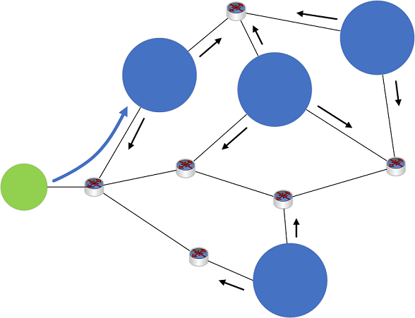

# Anycast DNS overview

>Applies to: Windows Server 2022, Windows Server 2016, Windows Server 2019

This topic provides information about how Anycast DNS works.

## What is Anycast?

Anycast is a technology that provides multiple routing paths to a group of endpoints that are each assigned the same IP address. Each device in the group advertises the same address on a network, and routing protocols are used to choose which is the best destination.

Anycast enables you to scale a stateless service, such as DNS or HTTP, by placing several nodes behind the same IP address and using equal-cost multi-path (ECMP) routing to direct traffic between these nodes. Anycast is different from unicast, in which each endpoint has its own, separate IP address.

## Why use Anycast with DNS?

With Anycast DNS, you can enable a DNS server, or a group of servers, to respond to DNS queries based on the geographical location of a DNS client. This can enhance DNS response time and simplify DNS client settings. Anycast DNS also provides an extra layer of redundancy and can help protect against DNS denial of service attacks.

### How Anycast DNS works

Anycast DNS works by using routing protocols such as Border Gateway Protocol (BGP) to send DNS queries to a preferred DNS server or group of DNS servers (for example: a group of DNS servers managed by a load balancer). This design can optimize DNS communications by obtaining DNS responses from a DNS server that is closest to a client.

With Anycast, servers that exist in multiple geographical locations each advertise a single, identical IP address to their local gateway (router). When a DNS client initiates a query to the Anycast address, the available routes are evaluated, and the DNS query is sent to the preferred location. In general, this location is the closest based on network topology. See the following example.



**Figure 1**: Example Anycast network
- Four DNS servers (blue circles), located at different sites on a network, each announce the same Anycast IP address to their local routing device (not shown).
- Routes are shared among devices on the network (black arrows).
- A DNS client device (green circle) sends out a DNS query to the Anycast IP address. 
- The client's DNS request is received by a routing device on the network (not shown).
- The routing device analyzes the available routes to the Anycast IP address, and routes the DNS query using the shortest available route.
- The DNS query is sent to the nearest DNS server (blue arrow).

Anycast DNS is used commonly today to route DNS traffic for many global DNS services. For example, the root DNS server system depends heavily on Anycast DNS. Anycast also works with many different routing protocols and can be used exclusively on intranets.

## Windows Server native BGP Anycast demo

The following procedure demonstrates how native BGP on Windows Server can be used with Anycast DNS.

### Requirements

- One physical device with the Hyper-V role installed.
  - Windows Server 2012 R2, Windows 10, or later.
- 2 client VMs (any operating system).
  - Installation of BIND tools for DNS such as dig are recommended.
- 3 server VMs (Windows Server 2016 or Windows Server 2019).
  - If the Windows PowerShell LoopbackAdapter module isn't already installed on server VMs (DC001, DC002), Internet access is temporarily required to install this module.

### Hyper-V setup

Configure your Hyper-V server as follows:

- 2 private virtual switch networks are configured
  - A mock Internet network 131.253.1.0/24
  - A mock intranet network 10.10.10.0/24
- 2 client VMs are attached to the 131.253.1.0/24 network
- 2 server VMs are attached to the 10.10.10.0/24 network
- 1 server is dual-homed and attached to both the 131.253.1.0/24 and 10.10.10.0/24 networks.

### Virtual machine network configuration

Configure network settings on virtual machines with the following settings:

1.	Client1, client2
  - Client1: 131.253.1.1
  - Client2: 131.253.1.2
  - Subnet mask: 255.255.255.0
  - DNS: 51.51.51.51
  - Gateway: 131.253.1.254
2.	Gateway (Windows Server)
  - NIC1: 131.253.1.254, subnet 255.255.255.0
  - NIC2: 10.10.10.254, subnet 255.255.255.0
  - DNS: 51.51.51.51
  - Gateway: 131.253.1.100 (can be ignored for the demo)
3.	DC001 (Windows Server)
  - NIC1: 10.10.10.1
  - Subnet: 255.255.255.0
  - DNS: 10.10.10.1
  - Gateway: 10.10.10.254
4.	DC002 (Windows Server)
  - NIC1: 10.10.10.2
  - Subnet 255.255.255.0
  - DNS: 10.10.10.2*
  - Gateway: 10.10.10.254

   *Use 10.10.10.1 for DNS initially when performing domain join for DC002 so that you can locate the Active Directory domain on DC001.

### Configure DNS

Use Server Manager and the DNS management console or Windows PowerShell to install the following server roles and create a static DNS zone on each of two servers.

1.	DC001, DC002
  - Install Active Directory Domain Services and promote to domain controller (optional)
  - Install the DNS role (required)
  - Create a static zone (non-AD integrated) named **zone.tst** on both DC001 and DC002
    - Add the single static record name **server** in the zone of type “TXT”
    - Data (text) for the TXT record on DC001 = **DC001**
    - Data (text) for the TXT record on DC002 = **DC002**

### Configure loopback adapters

Enter the following commands at an elevated Windows PowerShell prompt on DC001 and DC002 to configure loopback adapters.

> [!NOTE]
> The **Install-Module** command requires Internet access. This can be done by temporarily assigning the VM to an external network in Hyper-V.

```PowerShell
$primary_interface = (Get-NetAdapter |?{$_.Status -eq "Up" -and !$_.Virtual}).Name
$loopback_ipv4 = '51.51.51.51'
$loopback_ipv4_length = '32'
$loopback_name = 'Loopback'
Install-Module -Name LoopbackAdapter -MinimumVersion 1.2.0.0 -Force
Import-Module -Name LoopbackAdapter
New-LoopbackAdapter -Name $loopback_name -Force
$interface_loopback = Get-NetAdapter -Name $loopback_name
$interface_main = Get-NetAdapter -Name $primary_interface
Set-NetIPInterface -InterfaceIndex $interface_loopback.ifIndex -InterfaceMetric "254" -WeakHostReceive Enabled -WeakHostSend Enabled -DHCP Disabled
Set-NetIPInterface -InterfaceIndex $interface_main.ifIndex -WeakHostReceive Enabled -WeakHostSend Enabled
Set-NetIPAddress -InterfaceIndex $interface_loopback.ifIndex -SkipAsSource $True
Get-NetAdapter $loopback_name | Set-DNSClient –RegisterThisConnectionsAddress $False
New-NetIPAddress -InterfaceAlias $loopback_name -IPAddress $loopback_ipv4 -PrefixLength $loopback_ipv4_length -AddressFamily ipv4
Disable-NetAdapterBinding -Name $loopback_name -ComponentID ms_msclient
Disable-NetAdapterBinding -Name $loopback_name -ComponentID ms_pacer
Disable-NetAdapterBinding -Name $loopback_name -ComponentID ms_server
Disable-NetAdapterBinding -Name $loopback_name -ComponentID ms_lltdio
Disable-NetAdapterBinding -Name $loopback_name -ComponentID ms_rspndr
```

### Virtual machine routing configuration

Use the following Windows PowerShell commands on VMs to configure routing.

1.	Gateway
```PowerShell
Install-WindowsFeature RemoteAccess -IncludeManagementTools
Install-RemoteAccess -VpnType RoutingOnly
Add-BgpRouter -BgpIdentifier “10.10.10.254” -LocalASN 8075
Add-BgpPeer -Name "DC001" -LocalIPAddress 10.10.10.254 -PeerIPAddress 10.10.10.1 -PeerASN 65511 –LocalASN 8075
Add-BgpPeer -Name "DC002" -LocalIPAddress 10.10.10.254 -PeerIPAddress 10.10.10.2 -PeerASN 65511 –LocalASN 8075
```

2.	DC001
```PowerShell
Install-WindowsFeature RemoteAccess -IncludeManagementTools
Install-RemoteAccess -VpnType RoutingOnly
Add-BgpRouter -BgpIdentifier “10.10.10.1” -LocalASN 65511
Add-BgpPeer -Name "Labgw" -LocalIPAddress 10.10.10.1 -PeerIPAddress 10.10.10.254 -PeerASN 8075 –LocalASN 65511
Add-BgpCustomRoute -Network 51.51.51.0/24
```

3.	DC002
```PowerShell
Install-WindowsFeature RemoteAccess -IncludeManagementTools
Install-RemoteAccess -VpnType RoutingOnly
Add-BgpRouter -BgpIdentifier "10.10.10.2" -LocalASN 65511
Add-BgpPeer -Name "Labgw" -LocalIPAddress 10.10.10.2 -PeerIPAddress 10.10.10.254 -PeerASN 8075 –LocalASN 65511
Add-BgpCustomRoute -Network 51.51.51.0/24
```

### Summary diagram


**Figure 2**: Lab setup for native BGP Anycast DNS demo

## Anycast DNS demonstration


1.	Verify BGP routing on the gateway server

    `PS C:\> Get-BgpRouteInformation`

    DestinationNetwork NextHop    LearnedFromPeer State LocalPref MED<br>
    ------------------ -------    --------------- ----- --------- ---<br>
    51.51.51.0/24      10.10.10.1 DC001           Best<br>
    51.51.51.0/24      10.10.10.2 DC002           Best<br>

2.	On client1 and client2, verify that you can reach 51.51.51.51

    `PS C:\> ping 51.51.51.51`

    Pinging 51.51.51.51 with 32 bytes of data:<br>
    Reply from 51.51.51.51: bytes=32 time<1ms TTL=126<br>
    Reply from 51.51.51.51: bytes=32 time<1ms TTL=126<br>
    Reply from 51.51.51.51: bytes=32 time<1ms TTL=126<br>
    Reply from 51.51.51.51: bytes=32 time<1ms TTL=126

    Ping statistics for 51.51.51.51:<br>
    Packets: Sent = 4, Received = 4, Lost = 0 (0% loss),<br>
    Approximate round trip times in milliseconds:<br>
    Minimum = 0ms, Maximum = 0ms, Average = 0ms

    > [!NOTE]
    > If ping fails, also check there are no firewall rules blocking ICMP.

3.	On client1 and client2, use nslookup or dig to query the TXT record. Examples of both are shown.

    `PS C:\> dig server.zone.tst TXT +short`<br>
    `PS C:\> nslookup -type=txt server.zone.tst 51.51.51.51`

    One client displays “DC001” and the other client displays “DC002”, verifying that Anycast is working properly.  You can also query from the gateway server.

4.	Next, disable the Ethernet adapter on DC001.

    `PS C:\> (Get-NetAdapter).Name`<br>
    Loopback<br>
    Ethernet 2<br>
    `PS C:\> Disable-NetAdapter "Ethernet 2"`<br>
    Confirm<br>
    Are you sure you want to perform this action?<br>
    Disable-NetAdapter 'Ethernet 2'<br>
    [Y] Yes  [A] Yes to All  [N] No  [L] No to All  [S] Suspend [?] Help (default is "Y"):<br>
    `PS C:\> (Get-NetAdapter).Status`<br>
    Up<br>
    Disabled

5.	Confirm that DNS clients that were previously receiving responses from DC001 have switched to DC002.

    `PS C:\> nslookup -type=txt server.zone.tst 51.51.51.51`<br>
    Server:  UnKnown<br>
    Address:  51.51.51.51<br>

    server.zone.tst text =

    "DC001"<br>
    `PS C:\> nslookup -type=txt server.zone.tst 51.51.51.51`<br>
    Server:  UnKnown<br>
    Address:  51.51.51.51<br>

    server.zone.tst text =

    "DC002"

6.	Confirm that the BGP session is down on DC001 by using Get-BgpStatistics on the gateway server.
7.	Enable the Ethernet adapter on DC001 again and confirm that the BGP session is restored and clients receive DNS responses from DC001 again.

> [!NOTE]
> If a load balancer isn't used, an individual client will use the same back-end DNS server if it is available. This creates a consistent BGP path for the client. For more information, see section 4.4.3 of RFC4786: [Equal-Cost Paths](https://tools.ietf.org/html/rfc4786#page-10).

## Frequently asked questions

Q: Is Anycast DNS a good solution to use in an on-premises DNS environment?<br>
A: Anycast DNS works seamlessly with an on-premises DNS service. However, Anycast isn't *required* for the DNS service to scale.

Q: What is the impact of implementing Anycast DNS in an environment with a large number (ex: >50) of domain controllers? <br>
A: There's no direct impact on functionality. If a load balancer is used, then no other configuration on domain controllers is required.

Q: Is an Anycast DNS configuration supported by Microsoft customer service?<br>
A: If you use a non-Microsoft load balancer to forward DNS queries, Microsoft supports issues related to the DNS Server service. Consult the load balancer vendor for issues related to DNS forwarding.

Q: What is the best practice for Anycast DNS with a large number (ex: >50) of domain controllers?<br>
A: The best practice is to use a load balancer at each geographical location. Load balancers are typically provided by an external vendor.

Q: Do Anycast DNS and Azure DNS have similar functionality?<br>
A: Azure DNS uses Anycast. To use Anycast with Azure DNS, configure your load balancer to forward requests to the Azure DNS server.
