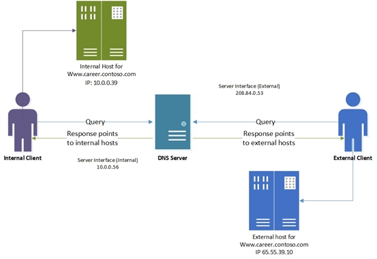

# Use DNS Policy for Split-Brain DNS in Active Directory

>Applies to: Windows Server (Semi-Annual Channel), Windows Server 2016

You can use this topic to leverage the traffic management capabilities of DNS policies for split\-brain deployments with Active Directory integrated DNS zones in Windows Server 2016.

In Windows Server 2016, DNS policies support is extended to Active Directory integrated DNS zones. Active Directory integration provides multi\-master high availability capabilities to the DNS server. 

Previously, this scenario required that DNS administrators maintain two different DNS servers, each providing services to each set of users, internal and external. If only a few records inside the zone were split\-brained or both instances of the zone (internal and external) were delegated to the same parent domain, this became a management conundrum.

> [!NOTE]
> - DNS deployments are split\-brain when there are two versions of a single zone, one version for internal users on the organization intranet, and one version for external users – who are, typically, users on the Internet.
> - The topic [Use DNS Policy for Split-Brain DNS Deployment](split-brain-DNS-deployment.md) explains how you can use DNS policies and zone scopes to deploy a split\-brain DNS system on a single Windows Server 2016 DNS server.

##  Example Split\-Brain DNS in Active Directory

This example uses one fictional company, Contoso, which maintains a career Web site at www.career.contoso.com.

The site has two versions, one for the internal users where internal job postings are available. This internal site is available at the local IP address 10.0.0.39. 

The second version is the public version of the same site, which is available at the public IP address 65.55.39.10.

In the absence of DNS policy, the administrator is required to host these two zones on separate Windows Server DNS servers and manage them separately. 

Using DNS policies these zones can now be hosted on the same DNS server.

If the DNS server for contoso.com is Active Directory integrated, and is listening on two network interfaces, the Contoso DNS Administrator can follow the steps in this topic to achieve a split\-brain deployment.

The DNS Administrator configures the DNS server interfaces with the following IP addresses.

- The Internet facing network adapter is configured with a public IP address of 208.84.0.53 for external queries.
- The Intranet facing network adapter is configured with a private IP address of 10.0.0.56 for internal queries.

The following illustration depicts this scenario.

## How DNS Policy for Split\-Brain DNS in Active Directory Works

When the DNS server is configured with the required DNS policies, each name resolution request is evaluated against the policies on the DNS server.

The server Interface is used in this example as the criteria to differentiate between the internal and external clients.

If the server interface upon which the query is received matches any of the policies, the associated zone scope is used to respond to the query. 

So, in our example, the DNS queries for www.career.contoso.com  that are received on the private IP (10.0.0.56) receive a DNS response that contains an internal IP address; and the DNS queries that are received on the public network interface receive a DNS response that contains the public IP address in the default zone scope (this is the same as normal query resolution).  

Support for Dynamic DNS \(DDNS\) updates and scavenging is supported only on the default zone scope. Because the internal clients are serviced by the default zone scope, Contoso DNS Administrators can continue using the existing mechanisms (dynamic DNS or static) to update the records in contoso.com. For non\-default zone scopes \(such as the external scope in this example\), DDNS or scavenging support is not available.

### High Availability of policies

DNS policies are not Active Directory integrated. Because of this, DNS policies are not replicated to the other DNS servers that are hosting the same Active Directory integrated zone. 

DNS policies are stored on the local DNS server. You can easily export DNS policies from one server to another by using the following example Windows PowerShell commands.

    $policies = Get-DnsServerQueryResolutionPolicy -ZoneName "contoso.com" -ComputerName Server01
    
    $policies |  Add-DnsServerQueryResolutionPolicy -ZoneName "contoso.com" -ComputerName Server02

For more information, see the following Windows PowerShell reference topics.

- [Get-DnsServerQueryResolutionPolicy](https://docs.microsoft.com/powershell/module/dnsserver/get-dnsserverqueryresolutionpolicy?view=win10-ps)
- [Add-DnsServerQueryResolutionPolicy](https://docs.microsoft.com/powershell/module/dnsserver/add-dnsserverqueryresolutionpolicy?view=win10-ps)

## How to Configure DNS Policy for Split\-Brain DNS in Active Directory

To configure DNS Split-Brain Deployment by using DNS Policy, you must use the following sections, which provide detailed configuration instructions.

### Add the Active Directory integrated zone

You can use the following example command to add the Active Directory integrated contoso.com zone to the DNS server.

    Add-DnsServerPrimaryZone -Name "contoso.com" -ReplicationScope "Domain" -PassThru

For more information, see [Add-DnsServerPrimaryZone](https://docs.microsoft.com/powershell/module/dnsserver/add-dnsserverprimaryzone?view=win10-ps).

### Create the Scopes of the Zone

You can use this section to partition the zone contoso.com to create an external zone scope.

A zone scope is a unique instance of the zone. A DNS zone can have multiple zone scopes, with each zone scope containing its own set of DNS records. The same record can be present in multiple scopes, with different IP addresses or the same IP addresses. 

Because you are adding this new zone scope in an Active Directory integrated zone, the zone scope and the records inside it will replicate via Active Directory to other replica servers in the domain.

By default, a zone scope exists in every DNS zone. This zone scope has the same name as the zone, and legacy DNS operations work on this scope. This default zone scope will host the internal version of www.career.contoso.com.

You can use the following example command to create the zone scope on the DNS server.

    Add-DnsServerZoneScope -ZoneName "contoso.com" -Name "external"

For more information, see [Add-DnsServerZoneScope](https://docs.microsoft.com/powershell/module/dnsserver/add-dnsserverzonescope?view=win10-ps).

### Add Records to the Zone Scopes

The next step is to add the records representing the web server host into the two zone scopes- external and default \(for internal clients\). 

In the default internal zone scope, the record www.career.contoso.com is added with IP address 10.0.0.39, which is a private IP address; and in the external zone scope, the same record \(www.career.contoso.com\) is added with the public IP address 65.55.39.10. 

The records \(both in the default internal zone scope and the external zone scope\)  will automatically replicate across the domain with their respective zone scopes.

You can use the following example command to add records to the zone scopes on the DNS server.

    Add-DnsServerResourceRecord -ZoneName "contoso.com" -A -Name "www.career" -IPv4Address "65.55.39.10" -ZoneScope "external"
    
    Add-DnsServerResourceRecord -ZoneName "contoso.com" -A -Name "www.career" -IPv4Address "10.0.0.39”

> [!NOTE]
> The **–ZoneScope** parameter is not included when the record is added to the default zone scope. This action is same as adding records to a normal zone.

For more information, see [Add-DnsServerResourceRecord](https://docs.microsoft.com/powershell/module/dnsserver/add-dnsserverresourcerecord?view=win10-ps).

### Create the DNS Policies

After you have identified the server interfaces for the external network and internal network and you have created the zone scopes, you must create DNS policies that connect the internal and external zone scopes.

> [!NOTE]
> This example uses the server interface \(the -ServerInterface parameter in the example command below\) as the criteria to differentiate between the internal and external clients. Another method to differentiate between external and internal clients is by using client subnets as a criteria. If you can identify the subnets to which the internal clients belong, you can configure DNS policy to differentiate based on client subnet. For information on how to configure traffic management using client subnet criteria, see [Use DNS Policy for Geo-Location Based Traffic Management with Primary Servers](primary-geo-location.md).

After you configure policies, when a DNS query is received on the public interface, the answer is returned from the external scope of the zone. 

> [!NOTE]
> No policies are required for mapping the default internal zone scope. 

    Add-DnsServerQueryResolutionPolicy -Name "SplitBrainZonePolicy" -Action ALLOW -ServerInterface "eq,208.84.0.53" -ZoneScope "external,1" -ZoneName contoso.com

> [!NOTE]
> 208.84.0.53 is the IP address on the public network interface.

For more information, see [Add-DnsServerQueryResolutionPolicy](https://docs.microsoft.com/powershell/module/dnsserver/add-dnsserverqueryresolutionpolicy?view=win10-ps).

Now the DNS server is configured with the required DNS policies for a split-brain name server with an Active Directory integrated DNS zone.

You can create thousands of DNS policies according to your traffic management requirements, and all new policies are applied dynamically - without restarting the DNS server - on incoming queries. 
