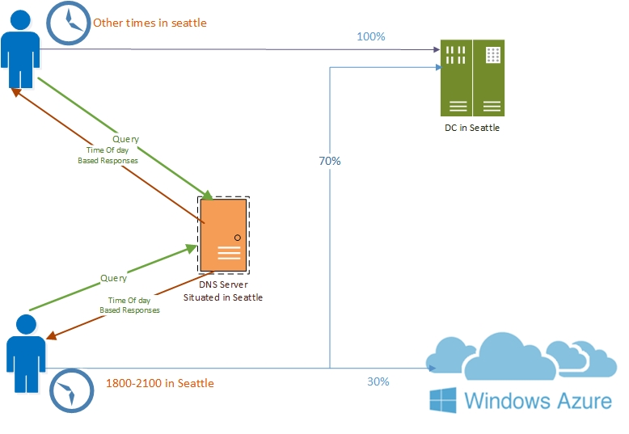

# DNS Responses Based on Time of Day with an Azure Cloud App Server

>Applies to: Windows Server (Semi-Annual Channel), Windows Server 2016

You can use this topic to learn how to distribute application traffic across different geographically distributed instances of an application by using DNS policies that are based on the time of day. 

This scenario is useful in situations where you want to direct traffic in one time zone to alternate application servers, such as Web servers that are hosted on Microsoft Azure, that are located in another time zone. This allows you to load balance traffic across application instances during peak time periods when your primary servers are overloaded with traffic. 

> [!NOTE]
> To learn how to use DNS policy for intelligent DNS responses without using Azure, see [Use DNS Policy for Intelligent DNS Responses Based on the Time of Day](Scenario--Use-DNS-Policy-for-Intelligent-DNS-Responses-Based-on-the-Time-of-Day.md). 

## Example of Intelligent DNS Responses Based on the Time of Day with Azure Cloud App Server

Following is an example of how you can use DNS policy to balance application traffic based on the time of day.

This example uses one fictional company, Contoso Gift Services, which provides online gifting solutions across the globe through their Web site, contosogiftservices.com. 

The contosogiftservices.com web site is hosted only at a single on-premises datacenter in Seattle (with public IP 192.68.30.2). 

The DNS server is also located in the on-premises datacenter. 

With a recent surge in business, contosogiftservices.com has a higher number of visitors every day, and some of the customers have reported service availability issues. 

Contoso Gift Services performs a site analysis, and discovers that every evening between 6 PM and 9 PM local time, there is a surge in the traffic to the Seattle Web server. The Web server cannot scale to handle the increased traffic at these peak hours, resulting in denial of service to customers. 

To ensure that contosogiftservices.com customers get a responsive experience from the Web site, Contoso Gift Services decides that during these hours it will rent a virtual machine \(VM\) on Microsoft Azure to host a copy of its Web server.  

Contoso Gift Services gets a public IP address from Azure for the VM (192.68.31.44) and develops the automation to deploy the Web Server every day on Azure between 5-10 PM, allowing for a one hour contingency period.

> [!NOTE]
> For more information about Azure VMs, see [Virtual Machines documentation](https://azure.microsoft.com/documentation/services/virtual-machines/) 

The DNS servers are configured with zone scopes and DNS policies so that between 5-9 PM every day, 30% of queries are sent to the instance of the Web server that is running in Azure.

The following illustration depicts this scenario.

  

## How Intelligent DNS Responses Based on Time of Day with Azure App Server Works
 
This article demonstrates how to configure the DNS server to answer DNS queries with two different application server IP addresses - one web server is in Seattle and the other is in an Azure datacenter.

After the configuration of a new DNS policy that is based on the peak hours of 6 PM to 9 PM in Seattle, the DNS server sends seventy per cent of the DNS responses to clients containing the IP address of the Seattle Web server, and thirty per cent of the DNS responses to clients containing the IP address of the Azure Web server, thereby directing client traffic to the new Azure Web server, and preventing the Seattle Web server from becoming overloaded. 

At all other times of day, the normal query processing takes place and responses are sent from default zone scope which contains a record for the web server in the on-premises datacenter. 

The TTL of 10 minutes on the Azure record ensures that the record is expired from the LDNS cache before the VM is removed from Azure. One of the benefits of such scaling is that you can keep your DNS data on-premises, and keep scaling out to Azure as demand requires.

## How to Configure DNS Policy for Intelligent DNS Responses Based on Time of Day with Azure App Server

To configure DNS policy for time of day application load balancing based query responses, you must perform the following steps.

- [Create the Zone Scopes](#create-the-zone-scopes)
- [Add Records to the Zone Scopes](#add-records-to-the-zone-scopes)
- [Create the DNS Policies](#create-the-dns-policies)

> [!NOTE]
> You must perform these steps on the DNS server that is authoritative for the zone you want to configure. Membership in DnsAdmins, or equivalent, is required to perform the following procedures. 

The following sections provide detailed configuration instructions.

> [!IMPORTANT]
> The following sections include example Windows PowerShell commands that contain example values for many parameters. Ensure that you replace example values in these commands with values that are appropriate for your deployment before you run these commands. 


### Create the Zone Scopes

A zone scope is a unique instance of the zone. A DNS zone can have multiple zone scopes, with each zone scope containing its own set of DNS records. The same record can be present in multiple scopes, with different IP addresses or the same IP addresses. 

> [!NOTE]
> By default, a zone scope exists on the DNS zones. This zone scope has the same name as the zone, and legacy DNS operations work on this scope. 

You can use the following example command to create a zone scope to host the Azure records.

```
Add-DnsServerZoneScope -ZoneName "contosogiftservices.com" -Name "AzureZoneScope"
```

For more information, see [Add-DnsServerZoneScope](https://docs.microsoft.com/powershell/module/dnsserver/add-dnsserverzonescope?view=win10-ps)

### Add Records to the Zone Scopes
The next step is to add the records representing the Web server host into the zone scopes. 

In AzureZoneScope, the record www.contosogiftservices.com is added with IP address 192.68.31.44, which is located in the Azure public cloud. 

Similarly, in the default zone scope \(contosogiftservices.com\), a record \(www.contosogiftservices.com\) is added with IP address 192.68.30.2 of the Web server running in the Seattle on-premises datacenter.

In the second cmdlet below, the –ZoneScope parameter is not included. Because of this,  the records are added in the default ZoneScope. 

In addition, the TTL of the record for Azure VMs is kept at 600s (10 mins) so that the LDNS do not cache it for a longer time - which would interfere with load balancing. Also, the Azure VMs are available for 1 extra hour as a contingency to ensure that even clients with cached records are able to resolve.

```
Add-DnsServerResourceRecord -ZoneName "contosogiftservices.com" -A -Name "www" -IPv4Address "192.68.31.44" -ZoneScope "AzureZoneScope" –TimeToLive 600

Add-DnsServerResourceRecord -ZoneName "contosogiftservices.com" -A -Name "www" -IPv4Address "192.68.30.2"
```

For more information, see [Add-DnsServerResourceRecord](https://docs.microsoft.com/powershell/module/dnsserver/add-dnsserverresourcerecord?view=win10-ps).  

### Create the DNS Policies 
After the zone scopes are created, you can create DNS policies that distribute the incoming queries across these scopes so that the following occurs.

1. From 6 PM to 9 PM daily, 30% of clients receive the IP address of the Web server in the Azure datacenter in the DNS response, while 70% of clients receive the IP address of the Seattle on-premises Web server.
2. At all other times, all the clients receive the IP address of the Seattle on-premises Web server.

The time of the day has to be expressed in local time of the DNS server.

You can use the following example command to create the DNS policy.

```
Add-DnsServerQueryResolutionPolicy -Name "Contoso6To9Policy" -Action ALLOW -ZoneScope "contosogiftservices.com,7;AzureZoneScope,3" –TimeOfDay “EQ,18:00-21:00” -ZoneName "contosogiftservices.com" –ProcessingOrder 1
```

For more information, see [Add-DnsServerQueryResolutionPolicy](https://docs.microsoft.com/powershell/module/dnsserver/add-dnsserverqueryresolutionpolicy?view=win10-ps).  
  
Now the DNS server is configured with the required DNS policies to redirect traffic to the Azure Web server based on time of day. 

Note the expression:

`
 -ZoneScope "contosogiftservices.com,7;AzureZoneScope,3" –TimeOfDay “EQ,18:00-21:00” 
`

This expression configures the DNS server with a ZoneScope and weight combination that instructs the DNS server to send the IP address of the Seattle Web server seventy per cent of the time, while sending the IP address of the Azure Web server thirty per cent of the time.

You can create thousands of DNS policies according to your traffic management requirements, and all new policies are applied dynamically - without restarting the DNS server - on incoming queries.
