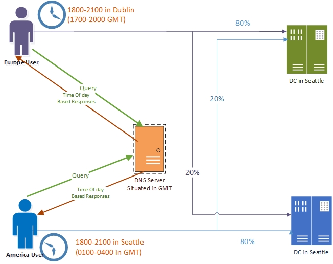

# Use DNS Policy for Intelligent DNS Responses Based on the Time of Day

>Applies to: Windows Server (Semi-Annual Channel), Windows Server 2016

You can use this topic to learn how to distribute application traffic across different geographically distributed instances of an application by using DNS policies that are based on the time of day.  
  
This scenario is useful in situations where you want to direct traffic in one time zone to alternate application servers, such as Web servers, that are located in another time zone. This allows you to load balance traffic across application instances during peak time periods when your primary servers are overloaded with traffic.   
  
### <a name="bkmk_example1"></a>Example of Intelligent DNS Responses Based on the Time of Day  
Following is an example of how you can use DNS policy to balance application traffic based on the time of day.  
  
This example uses one fictional company, Contoso Gift Services, which provides online gifting solutions across the globe through their Web site, contosogiftservices.com.   
  
The contosogiftservices.com Web site is hosted in two datacenters, one in Seattle (North America) and another in Dublin (Europe). The DNS servers are configured for sending geo-location aware responses using DNS policy. With a recent surge in business, contosogiftservices.com has a higher number of visitors every day, and some of the customers have reported service availability issues.  
  
Contoso Gift Services performs a site analysis, and discovers that every evening between 6 PM and 9 PM local time, there is a surge in the traffic to the Web servers. The Web servers cannot scale to handle the increased traffic at these peak hours, resulting in denial of service to customers. The same peak hour traffic overload happens in both the European and American datacenters. At other times of day, the servers handle traffic volumes that are well below their maximum capability.  
  
To ensure that contosogiftservices.com customers get a responsive experience from the Web site, Contoso Gift Services wants to redirect some Dublin traffic to the Seattle application servers between 6 PM and 9 PM in Dublin; and they want to redirect some Seattle traffic to the Dublin application servers between 6 PM and 9 PM in Seattle.  
  
The following illustration depicts this scenario.  
  
  
  
### <a name="bkmk_works1"></a>How Intelligent DNS Responses Based on Time of Day Works  
  
When the DNS server is configured with time of day DNS policy, between 6 PM and 9 PM at each geographical location, the DNS server does the following.  
  
- Answers the first four queries it receives with the IP address of the Web server in the local datacenter.  
- Answers the fifth query it receives with the IP address of the Web server in the remote datacenter.   
  
This policy-based behavior offloads twenty per cent of the local Web server's traffic load to the remote Web server, easing the strain on the local application server and improving site performance for customers.  
  
During off-peak hours, the DNS servers perform normal geo-locations based traffic management. In addition, DNS clients that send queries from locations other than North America or Europe, the DNS server load balances the traffic across the Seattle and Dublin datacenters.  
  
When multiple DNS policies are configured in DNS, they are an ordered set of rules, and they are processed by DNS from highest priority to lowest priority. DNS uses the first policy that matches the circumstances, including time of day. For this reason, more specific policies should have higher priority. If you create time of day policies and give them high priority in the list of policies, DNS processes and uses these policies first if they match the parameters of the DNS client query and the criteria defined in the policy. If they don't match, DNS moves down the list of policies to process the default policies until it finds a match.  
  
For more information about policy types and criteria, see [DNS Policies Overview](../../dns/deploy/DNS-Policies-Overview.md).  
  
### <a name="bkmk_how1"></a>How to Configure DNS Policy for Intelligent DNS Responses Based on Time of Day  
To configure DNS policy for time of day application load balancing based query responses, you must perform the following steps.  
  
- [Create the DNS Client Subnets](#bkmk_subnets)  
- [Create the Zone Scopes](#bkmk_zscopes)  
- [Add Records to the Zone Scopes](#bkmk_records)  
- [Create the DNS Policies](#bkmk_policies)  
  
>[!NOTE]
>You must perform these steps on the DNS server that is authoritative for the zone you want to configure. Membership in **DnsAdmins**, or equivalent, is required to perform the following procedures.  
  
The following sections provide detailed configuration instructions.  
  
>[!IMPORTANT]
>The following sections include example Windows PowerShell commands that contain example values for many parameters. Ensure that you replace example values in these commands with values that are appropriate for your deployment before you run these commands.  
  
#### <a name="bkmk_subnets"></a>Create the DNS Client Subnets  
The first step is to identify the subnets or IP address space of the regions for which you want to redirect traffic. For example, if you want to redirect traffic for the U.S. and Europe, you need to identify the subnets or IP address spaces of these regions.  
  
You can obtain this information from Geo-IP maps. Based on these Geo-IP distributions, you must create the "DNS Client Subnets." A DNS Client Subnet is a logical grouping of IPv4 or IPv6 subnets from which queries are sent to a DNS server.  
  
You can use the following Windows PowerShell commands to create DNS Client Subnets.  
  
```  
Add-DnsServerClientSubnet -Name "AmericaSubnet" -IPv4Subnet "192.0.0.0/24, 182.0.0.0/24"  
  
Add-DnsServerClientSubnet -Name "EuropeSubnet" -IPv4Subnet "141.1.0.0/24, 151.1.0.0/24"  
  
```  
For more information, see [Add-DnsServerClientSubnet](https://docs.microsoft.com/powershell/module/dnsserver/add-dnsserverclientsubnet?view=win10-ps).  
  
#### <a name="bkmk_zscopes"></a>Create the Zone Scopes  
After the client subnets are configured, you must partition the zone whose traffic you want to redirect into two different zone scopes, one scope for each of the DNS Client Subnets that you have configured.  
  
For example, if you want to redirect traffic for the DNS name www.contosogiftservices.com, you must create two different zone scopes in the contosogiftservices.com zone, one for the U.S. and one for Europe.  
  
A zone scope is a unique instance of the zone. A DNS zone can have multiple zone scopes, with each zone scope containing its own set of DNS records. The same record can be present in multiple scopes, with different IP addresses or the same IP addresses.  
  
>[!NOTE]
>By default, a zone scope exists on the DNS zones. This zone scope has the same name as the zone, and legacy DNS operations work on this scope.  
  
You can use the following Windows PowerShell commands to create zone scopes.  
  
```  
Add-DnsServerZoneScope -ZoneName "contosogiftservices.com" -Name "SeattleZoneScope"  
  
Add-DnsServerZoneScope -ZoneName "contosogiftservices.com" -Name "DublinZoneScope"  
  
```  
For more information, see [Add-DnsServerZoneScope](https://docs.microsoft.com/powershell/module/dnsserver/add-dnsserverzonescope?view=win10-ps).  
  
#### <a name="bkmk_records"></a>Add Records to the Zone Scopes  
Now you must add the records representing the web server host into the two zone scopes.  
  
For example, in **SeattleZoneScope**, the record <strong>www.contosogiftservices.com</strong> is added with IP address 192.0.0.1, which is located in a Seattle datacenter. Similarly, in **DublinZoneScope**, the record <strong>www.contosogiftservices.com</strong> is added with IP address 141.1.0.3 in the Dublin datacenter  
  
You can use the following Windows PowerShell commands to add records to the zone scopes.  
  
```  
Add-DnsServerResourceRecord -ZoneName "contosogiftservices.com" -A -Name "www" -IPv4Address "192.0.0.1" -ZoneScope "SeattleZoneScope  
  
Add-DnsServerResourceRecord -ZoneName "contosogiftservices.com" -A -Name "www" -IPv4Address "141.1.0.3" -ZoneScope "DublinZoneScope"  
  
```  
The ZoneScope parameter is not included when you add a record in the default scope. This is the same as adding records to a standard DNS zone.  
  
For more information, see [Add-DnsServerResourceRecord](https://docs.microsoft.com/powershell/module/dnsserver/add-dnsserverresourcerecord?view=win10-ps).  
  
#### <a name="bkmk_policies"></a>Create the DNS Policies  
After you have created the subnets, the partitions (zone scopes), and you have added records, you must create policies that connect the subnets and partitions, so that when a query comes from a source in one of the DNS client subnets, the query response is returned from the correct scope of the zone. No policies are required for mapping the default zone scope.  
  
After you configure these DNS policies, the DNS server behavior is as follows:  
  
1. European DNS clients receive the IP address of the Web server in the Dublin datacenter in their DNS query response.  
2. American DNS clients receive the IP address of the Web server in the Seattle datacenter in their DNS query response.  
3. Between 6 PM and 9 PM in Dublin, 20% of the queries from European clients receive the IP address of the Web server in the Seattle datacenter in their DNS query response.  
4. Between 6 PM and 9 PM in Seattle, 20% of the queries from the American clients receive the IP address of the Web server in the Dublin datacenter in their DNS query response.  
5. Half of the queries from the rest of the world receive the IP address of the Seattle datacenter and the other half receive the IP address of the Dublin datacenter.  
  
  
You can use the following Windows PowerShell commands to create a DNS policy that links the DNS Client Subnets and the zone scopes.  
  
>[!NOTE]
>In this example, the DNS server is in the GMT time zone, so the peak hour time periods must be expressed in the equivalent GMT time.  
  
```  
Add-DnsServerQueryResolutionPolicy -Name "America6To9Policy" -Action ALLOW -ClientSubnet "eq,AmericaSubnet" -ZoneScope "SeattleZoneScope,4;DublinZoneScope,1" -TimeOfDay "EQ,01:00-04:00" -ZoneName "contosogiftservices.com" -ProcessingOrder 1  
  
Add-DnsServerQueryResolutionPolicy -Name "Europe6To9Policy" -Action ALLOW -ClientSubnet "eq,EuropeSubnet" -ZoneScope "SeattleZoneScope,1;DublinZoneScope,4" -TimeOfDay "EQ,17:00-20:00" -ZoneName "contosogiftservices.com" -ProcessingOrder 2  
  
Add-DnsServerQueryResolutionPolicy -Name "AmericaPolicy" -Action ALLOW -ClientSubnet "eq,AmericaSubnet" -ZoneScope "SeattleZoneScope,1" -ZoneName "contosogiftservices.com" -ProcessingOrder 3  
  
Add-DnsServerQueryResolutionPolicy -Name "EuropePolicy" -Action ALLOW -ClientSubnet "eq,EuropeSubnet" -ZoneScope "DublinZoneScope,1" -ZoneName "contosogiftservices.com" -ProcessingOrder 4  
  
Add-DnsServerQueryResolutionPolicy -Name "RestOfWorldPolicy" -Action ALLOW --ZoneScope "DublinZoneScope,1;SeattleZoneScope,1" -ZoneName "contosogiftservices.com" -ProcessingOrder 5  
  
```  
For more information, see [Add-DnsServerQueryResolutionPolicy](https://docs.microsoft.com/powershell/module/dnsserver/add-dnsserverqueryresolutionpolicy?view=win10-ps).  
  
Now the DNS server is configured with the required DNS policies to redirect traffic based on geo-location and time of day.  
  
When the DNS server receives name resolution queries, the DNS server evaluates the fields in the DNS request against the configured DNS policies. If the source IP address in the name resolution request matches any of the policies, the associated zone scope is used to respond to the query, and the user is directed to the resource that is geographically closest to them.  
  
You can create thousands of DNS policies according to your traffic management requirements, and all new policies are applied dynamically - without restarting the DNS server - on incoming queries.


