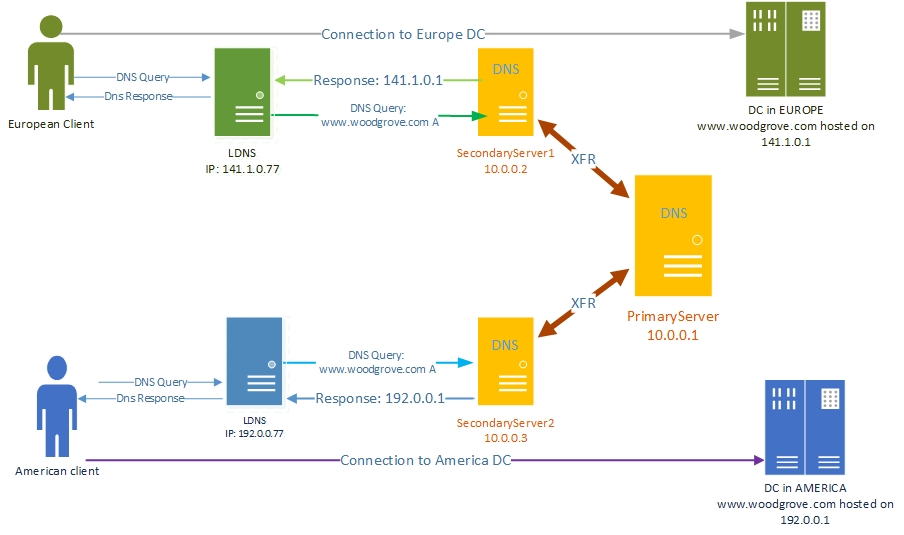

# Use DNS Policy for Geo-Location Based Traffic Management with Primary-Secondary Deployments

>Applies to: Windows Server (Semi-Annual Channel), Windows Server 2016

You can use this topic to learn how to create DNS policy for geo-location based traffic management when your DNS deployment includes both primary and secondary DNS servers.  

The previous scenario, [Use DNS Policy for Geo-Location Based Traffic Management with Primary Servers](primary-geo-location.md), provided instructions for configuring DNS policy for geo-location based traffic management on a primary DNS server. In the Internet infrastructure, however, the DNS servers are widely deployed in a primary-secondary model, where the writable copy of a zone is stored on select and secure primary servers, and read-only copies of the zone are kept on multiple secondary servers.   
  
The secondary servers use the zone transfer protocols Authoritative Transfer (AXFR) and Incremental Zone Transfer (IXFR) to request and receive zone updates that include new changes to the zones on the primary DNS servers.   
  
> [!NOTE]
> For more information about AXFR, see the Internet Engineering Task Force (IETF) [Request for Comments 5936](https://tools.ietf.org/rfc/rfc5936.txt). For more information about IXFR, see the Internet Engineering Task Force (IETF) [Request for Comments 1995](https://tools.ietf.org/html/rfc1995).  
  
## Primary-Secondary Geo-Location Based Traffic Management Example  
Following is an example of how you can use DNS policy in a primary-secondary deployment to achieve traffic redirection on the basis of the physical location of the client that performs a DNS query.  
  
This example uses two fictional companies - Contoso Cloud Services, which provides web and domain hosting solutions; and Woodgrove Food Services, which provides food delivery services in multiple cities across the globe, and which has a Web site named woodgrove.com.  
  
To ensure that woodgrove.com customers get a responsive experience from their website, Woodgrove wants European clients directed to the European datacenter and American clients directed to the U.S. datacenter. Customers located elsewhere in the world can be directed to either of the datacenters.  
  
Contoso Cloud Services has two datacenters, one in the U.S. and another in Europe, upon which Contoso hosts its food ordering portal for woodgrove.com.  
  
The Contoso DNS deployment includes two secondary servers: **SecondaryServer1**, with the IP address 10.0.0.2; and **SecondaryServer2**, with the IP address 10.0.0.3. These secondary servers are acting as name servers in the two different regions, with SecondaryServer1 located in Europe and SecondaryServer2 located in the U.S.
  
There is a primary writable zone copy on **PrimaryServer** (IP address 10.0.0.1), where the zone changes are made. With regular zone transfers to the secondary servers, the secondary servers are always up to date with any new changes to the zone on the PrimaryServer.
  
The following illustration depicts this scenario.
  
  
   
## How the DNS Primary-Secondary System Works

When you deploy geo-location based traffic management in a primary-secondary DNS deployment, it is important to understand how normal primary-secondary zone transfers occur before learning about zone scope level transfers. The following sections provide information on zone and zone scope level transfers.  
  
- [Zone transfers in a DNS primary-secondary deployment](#zone-transfers-in-a-dns-primary-secondary-deployment)  
- [Zone scope level transfers in a DNS primary-secondary deployment](#zone-scope-level-transfers-in-a-dns-primary-secondary-deployment)  
  
### Zone transfers in a DNS primary-secondary deployment

You can create a DNS primary-secondary deployment and synchronize zones with the following steps.  
1. When you install DNS, the primary zone is created on the primary DNS server.  
2. On the secondary server, create the zones and specify the primary servers.   
3. On the primary servers, you can add the secondary servers as trusted secondaries on the primary zone.   
4. The secondary zones make a full zone transfer request (AXFR) and receive the copy of the zone.   
5. When needed, the primary servers send notifications to the secondary servers about zone updates.  
6. Secondary servers make an incremental zone transfer request (IXFR). Because of this, the secondary servers remain synchronized with the primary server.   
  
### Zone scope level transfers in a DNS primary-secondary deployment

The traffic management scenario requires additional steps to partition the zones into different zone scopes. Because of this, additional steps are required to transfer the data inside the zone scopes to the secondary servers, and to transfer policies and DNS Client Subnets to the secondary servers.   
  
After you configure your DNS infrastructure with primary and secondary servers, zone scope level transfers are performed automatically by DNS, using the following processes.  
  
To ensure the Zone scope level transfer, DNS servers use the Extension Mechanisms for DNS (EDNS0) OPT RR. All zone transfer (AXFR or IXFR) requests from the zones with scopes originate with an EDNS0 OPT RR, whose option ID is set to "65433" by default. For more information about EDNSO, see the IETF [Request for Comments 6891](https://tools.ietf.org/html/rfc6891).  
  
The value of the OPT RR is the zone scope name for which the request is being sent. When a primary DNS server receives this packet from a trusted secondary server, it interprets the request as coming for that zone scope.   
  
If the primary server has that zone scope it responds with the transfer (XFR) data from that scope. The response contains an OPT RR with the same option ID "65433" and value set to the same zone scope. The secondary servers receive this response, retrieve the scope information from the response, and update that particular scope of the zone.  
  
After this process, the primary server maintains a list of trusted secondaries which have sent such a zone scope request for notifications.   
  
For any further update in a zone scope, an IXFR notification is sent to the secondary servers, with the same OPT RR. The zone scope receiving that notification makes the IXFR request containing that OPT RR and the same process as described above follows.  
  
## How to configure DNS Policy for Primary-Secondary Geo-Location Based Traffic Management

Before you begin, ensure that you have completed all of the steps in the topic [Use DNS Policy for Geo-Location Based Traffic Management with Primary Servers](../../dns/deploy/Scenario--Use-DNS-Policy-for-Geo-Location-Based-Traffic-Management-with-Primary-Servers.md), and your primary DNS server is configured with zones, zone scopes, DNS Client Subnets, and DNS policy.  
  
> [!NOTE]
> The instructions in this topic to copy DNS Client Subnets, zone scopes, and DNS policies from DNS primary servers to DNS secondary servers are for your initial DNS setup and validation. In the future you might want to change the DNS Client Subnets, zone scopes, and policies settings on the primary server. In this circumstance, you can create automation scripts to keep the secondary servers synchronized with the primary server.  
  
To configure DNS policy for primary-secondary geo-location based query responses, you must perform the following steps.  
  
- [Create the Secondary Zones](#create-the-secondary-zones)  
- [Configure the Zone Transfer Settings on the Primary Zone](#configure-the-zone-transfer-settings-on-the-primary-zone)  
- [Copy the DNS Client Subnets](#copy-the-dns-client-subnets)  
- [Create the Zone Scopes on the Secondary Server](#create-the-zone-scopes-on-the-secondary-server)  
- [Configure DNS policy](#configure-dns-policy)  
  
The following sections provide detailed configuration instructions.  
  
> [!IMPORTANT]
> The following sections include example Windows PowerShell commands that contain example values for many parameters. Ensure that you replace example values in these commands with values that are appropriate for your deployment before you run these commands.  
> 
> Membership in **DnsAdmins**, or equivalent, is required to perform the following procedures.  
  
### Create the Secondary Zones

You can create the secondary copy of the zone you want to replicate to SecondaryServer1 and SecondaryServer2 (assuming the cmdlets are being executed remotely from a single management client).   
  
For example, you can create the secondary copy of www.woodgrove.com on SecondaryServer1 and SecondarySesrver2.  
  
You can use the following Windows PowerShell commands to create the secondary zones.  
  
    
    Add-DnsServerSecondaryZone -Name "woodgrove.com" -ZoneFile "woodgrove.com.dns" -MasterServers 10.0.0.1 -ComputerName SecondaryServer1  
      
    Add-DnsServerSecondaryZone -Name "woodgrove.com" -ZoneFile "woodgrove.com.dns" -MasterServers 10.0.0.1 -ComputerName SecondaryServer2  
      

For more information, see [Add-DnsServerSecondaryZone](https://docs.microsoft.com/powershell/module/dnsserver/add-dnsserversecondaryzone?view=win10-ps).  
  
### Configure the Zone Transfer Settings on the Primary Zone

You must configure the primary zone settings so that:

1. Zone transfers from the primary server to the specified secondary servers are allowed.  
2. Zone update notifications are sent by the primary server to the secondary servers.  
  
You can use the following Windows PowerShell commands to configure the zone transfer settings on the primary zone.
  
> [!NOTE]
> In the following example command, the parameter **-Notify** specifies that the primary server will send notifications about updates to the select list of secondaries.  
  
    
    Set-DnsServerPrimaryZone -Name "woodgrove.com" -Notify Notify -SecondaryServers "10.0.0.2,10.0.0.3" -SecureSecondaries TransferToSecureServers -ComputerName PrimaryServer  
     
  
For more information, see [Set-DnsServerPrimaryZone](https://docs.microsoft.com/powershell/module/dnsserver/set-dnsserverprimaryzone?view=win10-ps).  
  
  
### Copy the DNS Client Subnets

You must copy the DNS Client Subnets from the primary server to the secondary servers.
  
You can use the following Windows PowerShell commands to copy the subnets to the secondary servers.
  
    
    Get-DnsServerClientSubnet -ComputerName PrimaryServer | Add-DnsServerClientSubnet -ComputerName SecondaryServer1  
      
    Get-DnsServerClientSubnet -ComputerName PrimaryServer | Add-DnsServerClientSubnet -ComputerName SecondaryServer2  
      

For more information, see [Add-DnsServerClientSubnet](https://docs.microsoft.com/powershell/module/dnsserver/add-dnsserverclientsubnet?view=win10-ps).  
  
### Create the Zone Scopes on the Secondary Server

You must create the zone scopes on the secondary servers. In DNS, the zone scopes also start requesting XFRs from the primary server. With any change on the zone scopes on the primary server, a notification that contains the zone scope information is sent to the secondary servers. The secondary servers can then update their zone scopes with incremental change.  
  
You can use the following Windows PowerShell commands to create the zone scopes on the secondary servers.  
  
    
    Get-DnsServerZoneScope -ZoneName "woodgrove.com" -ComputerName PrimaryServer|Add-DnsServerZoneScope -ZoneName "woodgrove.com" -ComputerName SecondaryServer1 -ErrorAction Ignore  
      
    Get-DnsServerZoneScope -ZoneName "woodgrove.com" -ComputerName PrimaryServer|Add-DnsServerZoneScope -ZoneName "woodgrove.com" -ComputerName SecondaryServer2 -ErrorAction Ignore  
  

> [!NOTE]
> In these example commands, the **-ErrorAction Ignore** parameter is included, because a default zone scope exists on every zone. The default zone scope cannot be created or deleted. Pipelining will result in an attempt to create that scope and it will fail. Alternatively, you can create the non-default zone scopes on two secondary zones.  
  
For more information, see [Add-DnsServerZoneScope](https://docs.microsoft.com/powershell/module/dnsserver/add-dnsserverzonescope?view=win10-ps).  
  
### Configure DNS policy

After you have created the subnets, the partitions (zone scopes), and you have added records, you must create policies that connect the subnets and partitions, so that when a query comes from a source in one of the DNS client subnets, the query response is returned from the correct scope of the zone. No policies are required for mapping the default zone scope.  
  
You can use the following Windows PowerShell commands to create a DNS policy that links the DNS Client Subnets and the zone scopes.   
    
    $policy = Get-DnsServerQueryResolutionPolicy -ZoneName "woodgrove.com" -ComputerName PrimaryServer  
      
    $policy | Add-DnsServerQueryResolutionPolicy -ZoneName "woodgrove.com" -ComputerName SecondaryServer1  
      
    $policy | Add-DnsServerQueryResolutionPolicy -ZoneName "woodgrove.com" -ComputerName SecondaryServer2  
      

For more information, see [Add-DnsServerQueryResolutionPolicy](https://docs.microsoft.com/powershell/module/dnsserver/add-dnsserverqueryresolutionpolicy?view=win10-ps).  
  
Now the secondary DNS servers are configured with the required DNS policies to redirect traffic based on geo-location.  
  
When the DNS server receives name resolution queries, the DNS server evaluates the fields in the DNS request against the configured DNS policies. If the source IP address in the name resolution request matches any of the policies, the associated zone scope is used to respond to the query, and the user is directed to the resource that is geographically closest to them.   
  
You can create thousands of DNS policies according to your traffic management requirements, and all new policies are applied dynamically - without restarting the DNS server - on incoming queries.
