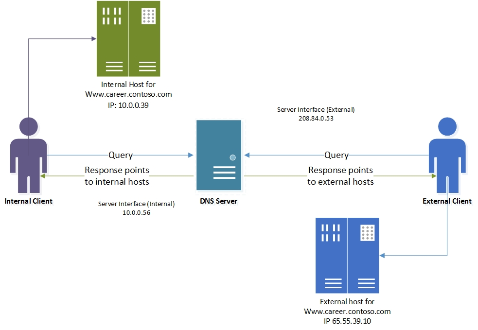
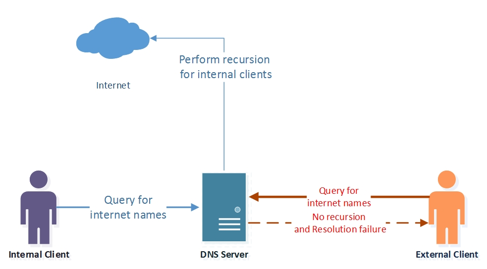

# Use DNS Policy for Split\-Brain DNS Deployment

>Applies to: Windows Server 2016

You can use this topic to learn how to configure DNS policy in Windows Server&reg; 2016 for split-brain DNS deployments, where there are two versions of a single zone - one for the internal users on your organization intranet, and one for the external users, who are typically users on the Internet.

>[!NOTE]
>For information on how to use DNS Policy for split\-brain DNS deployment with Active Directory integrated DNS Zones, see [Use DNS Policy for Split-Brain DNS in Active Directory](dns-sb-with-ad.md).

Previously, this scenario required that DNS administrators maintain two different DNS servers, each providing services to each set of users, internal and external. If only a few records inside the zone were split\-brained or both instances of the zone (internal and external) were delegated to the same parent domain, this became a management conundrum. 

Another configuration scenario for split-brain deployment is Selective Recursion Control for DNS name resolution. In some circumstances, the Enterprise DNS servers are expected to perform recursive resolution over the Internet for the internal users, while they also must act as authoritative name servers for external users, and block recursion for them. 

This topic contains the following sections.

- [Example of DNS Split-Brain Deployment](#bkmk_sbexample)
- [Example of DNS Selective Recursion Control](#bkmk_recursion)

## Example of DNS Split-Brain Deployment
Following is an example of how you can use DNS policy to accomplish the previously described scenario of split-brain DNS.

This section contains the following topics.

- [How DNS Split-Brain Deployment Works](#bkmk_sbhow)
- [How to Configure DNS Split-Brain Deployment](#bkmk_sbconfigure)

This example uses one fictional company, Contoso, which maintains a career Web site at www.career.contoso.com.

The site has two versions, one for the internal users where internal job postings are available. This internal site is available at the local IP address 10.0.0.39. 

The second version is the public version of the same site, which is available at the public IP address 65.55.39.10.

In the absence of DNS policy, the administrator is required to host these two zones on separate Windows Server DNS servers and manage them separately. 

Using DNS policies these zones can now be hosted on the same DNS server.  

The following illustration depicts this scenario.

  

## How DNS Split-Brain Deployment Works

When the DNS server is configured with the required DNS policies, each name resolution request is evaluated against the policies on the DNS server.

The server Interface is used in this example as the criteria to differentiate between the internal and external clients.

If the server interface upon which the query is received matches any of the policies, the associated zone scope is used to respond to the query. 

So, in our example, the DNS queries for www.career.contoso.com  that are received on the private IP (10.0.0.56) receive a DNS response that contains an internal IP address; and the DNS queries that are received on the public network interface receive a DNS response that contains the public IP address in the default zone scope (this is the same as normal query resolution).  

## How to Configure DNS Split-Brain Deployment
To configure DNS Split-Brain Deployment by using DNS Policy, you must use the following steps.

- [Create the Zone Scopes](#bkmk_zscopes)  
- [Add Records to the Zone Scopes](#bkmk_records)  
- [Create the DNS Policies](#bkmk_policies)

The following sections provide detailed configuration instructions.

>[!IMPORTANT]
>The following sections include example Windows PowerShell commands that contain example values for many parameters. Ensure that you replace example values in these commands with values that are appropriate for your deployment before you run these commands. 

### Create the Zone Scopes

A zone scope is a unique instance of the zone. A DNS zone can have multiple zone scopes, with each zone scope containing its own set of DNS records. The same record can be present in multiple scopes, with different IP addresses or the same IP addresses. 

> [!NOTE]
> By default, a zone scope exists on the DNS zones. This zone scope has the same name as the zone, and legacy DNS operations work on this scope. This default zone scope will host the external version of www.career.contoso.com.

You can use the following example command to partition the zone scope contoso.com to create an internal zone scope. The internal zone scope will be used to keep the internal version of www.career.contoso.com.

`Add-DnsServerZoneScope -ZoneName "contoso.com" -Name "internal"`

For more information, see [Add-DnsServerZoneScope](https://docs.microsoft.com/powershell/module/dnsserver/add-dnsserverzonescope?view=win10-ps)

### Add Records to the Zone Scopes

The next step is to add the records representing the Web server host into the two zone scopes - internal and default (for external clients). 

In the internal zone scope, the record <strong>www.career.contoso.com</strong> is added with the IP address 10.0.0.39, which is a private IP; and in the default zone scope the same record, <strong>www.career.contoso.com</strong>, is added with the IP address 65.55.39.10.

No **–ZoneScope** parameter is provided in the following example commands when the record is being added to the default zone scope. This is similar to adding records to a vanilla zone.

`
Add-DnsServerResourceRecord -ZoneName "contoso.com" -A -Name "www.career" -IPv4Address "65.55.39.10"
`
`
Add-DnsServerResourceRecord -ZoneName "contoso.com" -A -Name "www.career" -IPv4Address "10.0.0.39” -ZoneScope "internal"
`

For more information, see [Add-DnsServerResourceRecord](https://docs.microsoft.com/powershell/module/dnsserver/add-dnsserverresourcerecord?view=win10-ps).

### Create the DNS Policies

After you have identified the server interfaces for the external network and internal network and you have created the zone scopes, you must create DNS policies that connect the internal and external zone scopes.

>[!NOTE]
>This example uses the server interface as the criteria to differentiate between the internal and external clients. Another method to differentiate between external and internal clients is by using client subnets as a criteria. If you can identify the subnets to which the internal clients belong, you can configure DNS policy to differentiate based on client subnet. For information on how to configure traffic management using client subnet criteria, see [Use DNS Policy for Geo-Location Based Traffic Management with Primary Servers](https://technet.microsoft.com/windows-server-docs/networking/dns/deploy/scenario--use-dns-policy-for-geo-location-based-traffic-management-with-primary-servers).

When the DNS server receives a query on the private interface, the DNS query response is returned from the internal zone scope.

>[!NOTE]
>No policies are required for mapping the default zone scope. 

In the following example command, 10.0.0.56 is the IP address on the private network interface, as shown in the previous illustration.

`Add-DnsServerQueryResolutionPolicy -Name "SplitBrainZonePolicy" -Action ALLOW -ServerInterface "eq,10.0.0.56" -ZoneScope "internal,1" -ZoneName contoso.com`

For more information, see [Add-DnsServerQueryResolutionPolicy](https://docs.microsoft.com/powershell/module/dnsserver/add-dnsserverqueryresolutionpolicy?view=win10-ps).  

## Example of DNS Selective Recursion Control

Following is an example of how you can use DNS policy to accomplish the previously described scenario of DNS selective recursion control.

This section contains the following topics.

- [How DNS Selective Recursion Control Works](#bkmk_recursionhow)
- [How to Configure DNS Selective Recursion Control](#bkmk_recursionconfigure)

This example uses the same fictional company as in the previous example, Contoso, which maintains a career Web site at www.career.contoso.com.

In the DNS split-brain deployment example, the same DNS server responds to both the external and internal clients and provides them with different answers. 

Some DNS deployments might require the same DNS server to perform recursive name resolution for internal clients in addition to acting as the authoritative name server for external clients. This circumstance is called DNS selective recursion control.

In previous versions of Windows Server, enabling recursion meant that it was enabled on the whole DNS server for all zones. Because the DNS server is also listening to external queries, recursion is enabled for both internal and external clients, making the DNS server an open resolver. 

A DNS server that is configured as an open resolver might be vulnerable to resource exhaustion and can be abused by malicious clients to create reflection attacks. 

Because of this, Contoso DNS administrators do not want the DNS server for contoso.com to perform recursive name resolution for external clients. There is only a need for recursion control for internal clients, while recursion control can be blocked for external clients. 

The following illustration depicts this scenario.

 

### How DNS Selective Recursion Control Works

If a query for which the Contoso DNS server is non-authoritative is received, such as for https://www.microsoft.com, then the name resolution request is evaluated against the policies on the DNS server. 

Because these queries do not fall under any zone, the zone level policies \(as defined in the split-brain example\) are not evaluated. 

The DNS server evaluates the recursion policies, and the queries that are received on the private interface match the **SplitBrainRecursionPolicy**. This policy points to a recursion scope where recursion is enabled.

The DNS server then performs recursion to get the answer for https://www.microsoft.com from the Internet, and caches the response locally. 

If the query is received on the external interface, no DNS policies match, and the default recursion setting - which in this case is **Disabled** - is applied.

This prevents the server from acting as an open resolver for external clients, while it is acting as a caching resolver for internal clients. 

### How to Configure DNS Selective Recursion Control

To configure DNS selective recursion control by using DNS Policy, you must use the following steps.

- [Create DNS Recursion Scopes](#bkmk_recscopes)
- [Create DNS Recursion Policies](#bkmk_recpolicy)

#### Create DNS Recursion Scopes

Recursion scopes are unique instances of a group of settings that control recursion on a DNS server. A recursion scope contains a list of forwarders and specifies whether recursion is enabled. A DNS server can have many recursion scopes. 

The legacy recursion setting and list of forwarders are referred to as the default recursion scope. You cannot add or remove the default recursion scope, identified by the name dot \(“.”\).

In this example, the default recursion setting is disabled, while a new recursion scope for internal clients is created where recursion is enabled.

    
    Set-DnsServerRecursionScope -Name . -EnableRecursion $False
    Add-DnsServerRecursionScope -Name "InternalClients" -EnableRecursion $True 
    

For more information, see [Add-DnsServerRecursionScope](https://docs.microsoft.com/powershell/module/dnsserver/add-dnsserverrecursionscope?view=win10-ps)

#### Create DNS Recursion Policies

You can create DNS server recursion policies to choose a recursion scope for a set of queries that match specific criteria. 

If the DNS server is not authoritative for some queries, DNS server recursion policies allow you to control how to resolve the queries. 

In this example, the internal recursion scope with recursion enabled is associated with the private network interface.

You can use the following example command to configure DNS recursion policies.

    
    Add-DnsServerQueryResolutionPolicy -Name "SplitBrainRecursionPolicy" -Action ALLOW -ApplyOnRecursion -RecursionScope "InternalClients" -ServerInterfaceIP "EQ,10.0.0.39"
    

For more information, see [Add-DnsServerQueryResolutionPolicy](https://docs.microsoft.com/powershell/module/dnsserver/add-dnsserverqueryresolutionpolicy?view=win10-ps).

Now the DNS server is configured with the required DNS policies for either a split-brain name server or a DNS server with selective recursion control enabled for internal clients.

You can create thousands of DNS policies according to your traffic management requirements, and all new policies are applied dynamically - without restarting the DNS server - on incoming queries. 

For more information, see [DNS Policy Scenario Guide](DNS-Policy-Scenario-Guide.md).
