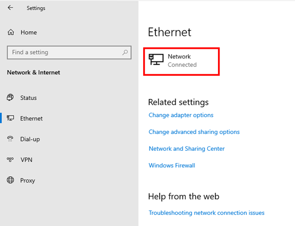
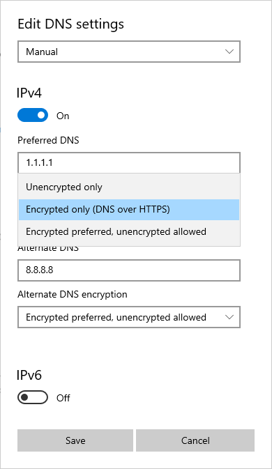
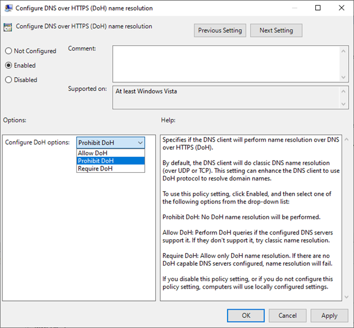
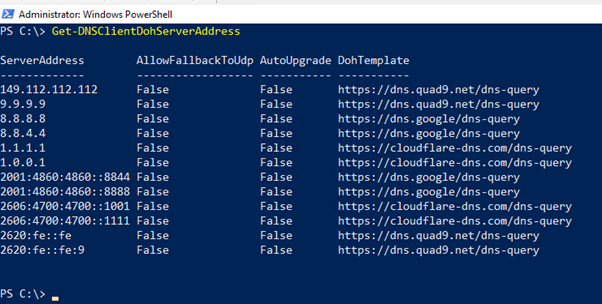

# Secure DNS Client over HTTPS (DoH)

Starting with Windows Server 2022, the DNS client supports DNS-over-HTTPS (DoH). When DoH is enabled, DNS queries between Windows Server’s DNS client and the DNS server pass across a secure HTTPS connection rather than in plain text. By passing the DNS query across an encrypted connection, it's protected from interception by untrusted third parties.

## Configure the DNS client to support DoH

You can only configure the Windows Server client to use DoH if the primary or secondary DNS server selected for the network interface is on the list of known DoH servers. You can configure the DNS client to require DoH, request DoH or only use traditional plain-text DNS queries. To configure the DNS client to support DoH on Windows Server with Desktop Experience, do the following steps:

1. From the Windows Settings control panel, select **Network & Internet**.
2. On the Network & Internet page, select **Ethernet**.
3. On the Ethernet screen, select the network interface that you want to
    configure for DoH.

    

4. On the Network screen, scroll down to **DNS settings** and select the
    **Edit** button.
5. On the Edit DNS settings screen, select Manual from the automatic or manual
    IP settings dropdown. This setting allows you to configure the Preferred DNS
    and Alternate DNS servers. If the addresses of these servers are present in
    the list of known DoH servers, the **Preferred DNS encryption** dropdown
    will be enabled. You can choose between the following settings to set the
    preferred DNS encryption:

    - **Encrypted only (DNS over HTTPS)**. When this setting is chosen, all
        DNS query traffic will pass across HTTPS. This setting provides the best
        protection for DNS query traffic. However, it also means DNS resolution won't
        occur if the target DNS server is unable to support DoH queries.

    - **Encrypted preferred, unencrypted allowed**. When this setting is
        chosen, the DNS client will attempt to use DoH and then fall back to
        unencrypted DNS queries if that isn't possible. This setting provides
        the best compatibility for DoH capable DNS servers, but you won't be
        provided with any notification if DNS queries are switched from DoH to
        plain text.

    - **Unencrypted only**. All DNS query traffic to the specified DNS server
        is unencrypted. This setting configures the DNS client to use
        traditional plain text DNS queries.

        

6. Select **Save** to apply the DoH settings to the DNS client.

If you're configuring the DNS server address for a client using PowerShell
using the `Set-DNSClientServerAddress` cmdlet, the DoH setting will depend on
whether the server’s fallback setting is in the list of known DoH servers table. At present you can't
configure DoH settings for the DNS client on Windows Server 2022 using Windows
Admin Center or *sconfig.cmd*.

### Configuring DoH through Group Policy

Windows Server 2022 local and domain Group Policy settings include the **Configure DNS over HTTPS
(DoH) name resolution** policy. You can use it to configure the DNS client to use DoH. This policy is found in the `Computer
Configuration\Policies\Administrative Templates\Network\DNS Client` node. When
enabled, this policy can be configured with the following settings:

- **Allow DoH**. Queries will be performed using DoH if the specified DNS
    servers support the protocol. If the servers don't support DoH,
    non-encrypted queries will be issued.

- **Prohibit DoH**. Will prevent use of DoH with DNS client queries.

- **Require DoH**. Will require that queries are performed using DoH. If
    configured DNS servers don't support DoH, name resolution will fail.

    

Don't enable the Require DoH option for domain joined computers as
Active Directory Domain Services is heavily reliant on DNS because the Windows
Server DNS Server service doesn't support DoH queries. If you require DNS
query traffic on Active Directory Domain Services network to be encrypted,
consider implementing IPsec based connection security rules to protect this
traffic. See [Securing end-to-end IPsec connections by using IKEv2](/windows/security/threat-protection/windows-firewall/securing-end-to-end-ipsec-connections-by-using-ikev2) for more information.

## Determine which DoH servers are on the known server list

Windows Server ships with a list of servers that are known to support DoH.
You can determine which DNS servers are on this list by using the
`Get-DNSClientDohServerAddress` PowerShell cmdlet.



The default list of known DoH servers is as follows:

| Server Owner | DNS Server IP Addresses |
|---|---|
| Cloudflare | 1.1.1.1<br/>1.0.0.1<br/>2606:4700:4700::1111<br/>2606:4700:4700::1001 |
| Google | 8.8.8.8<br/>8.8.4.4<br/>2001:4860:4860::8888<br/>2001:4860:4860::8844 |
| Quad 9 | 9.9.9.9<br/>149.112.112.112<br/>2620:fe::fe<br/>2620:fe::fe:9 |

## Add a new DoH server to the list of known servers

You can add new DoH servers to the list of known servers using the
`Add-DnsClientDohServerAddress` PowerShell cmdlet. Specify the URL of the
DoH template and whether you'll allow the client to fall back to an
unencrypted query should the secure query fail. The syntax of this command is:

```PowerShell
Add-DnsClientDohServerAddress -ServerAddress '<resolver-IP-address>' -DohTemplate '<resolver-DoH-template>' -AllowFallbackToUdp $False -AutoUpgrade $True
```

## Use Name Resolution Policy Table with DoH

You can use the Name Resolution Policy Table (NRPT) to configure queries to a specific DNS namespace to use a
specific DNS server. If the DNS server is known to
support DoH, queries related to that domain will be performed using DoH rather
than in an unencrypted manner.
