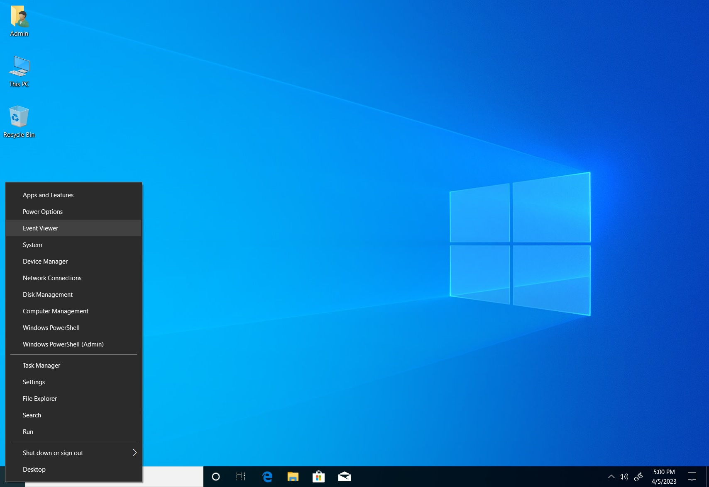
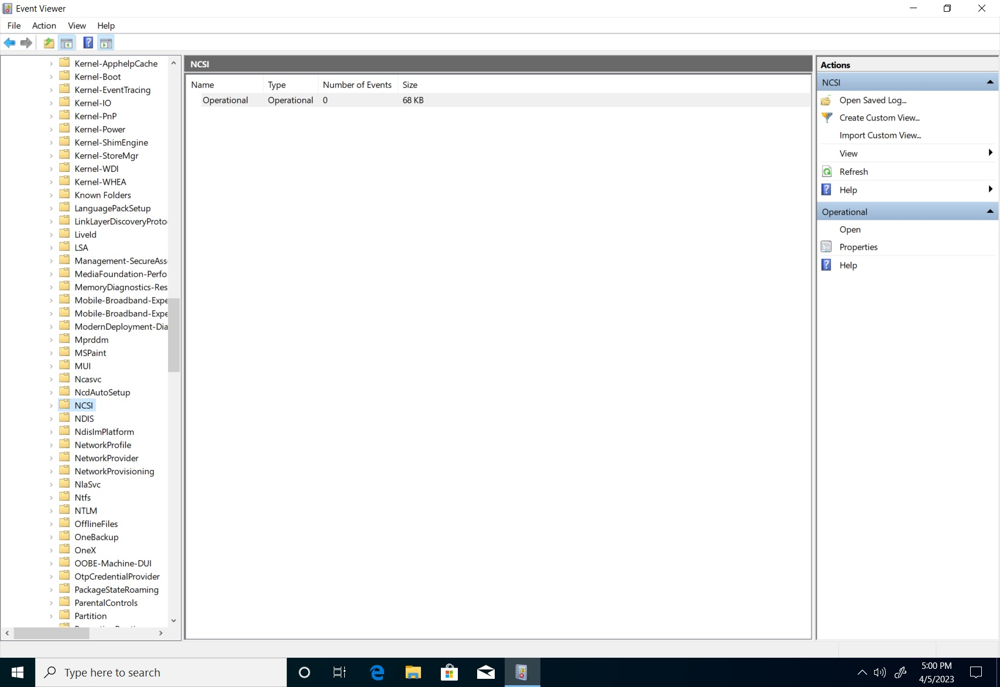
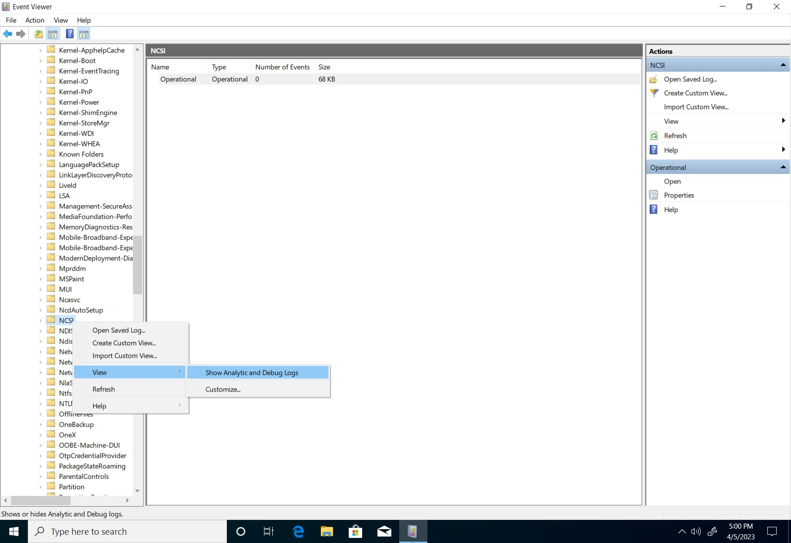
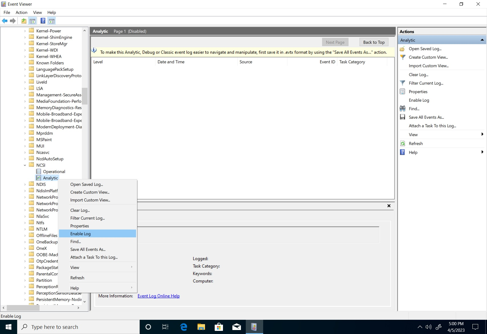
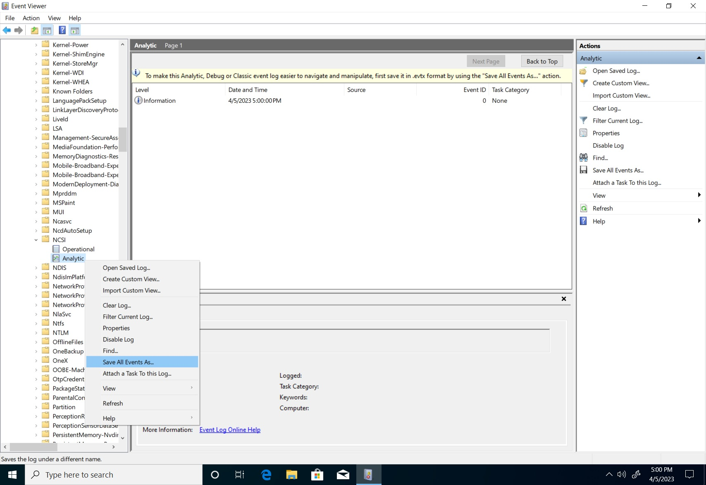
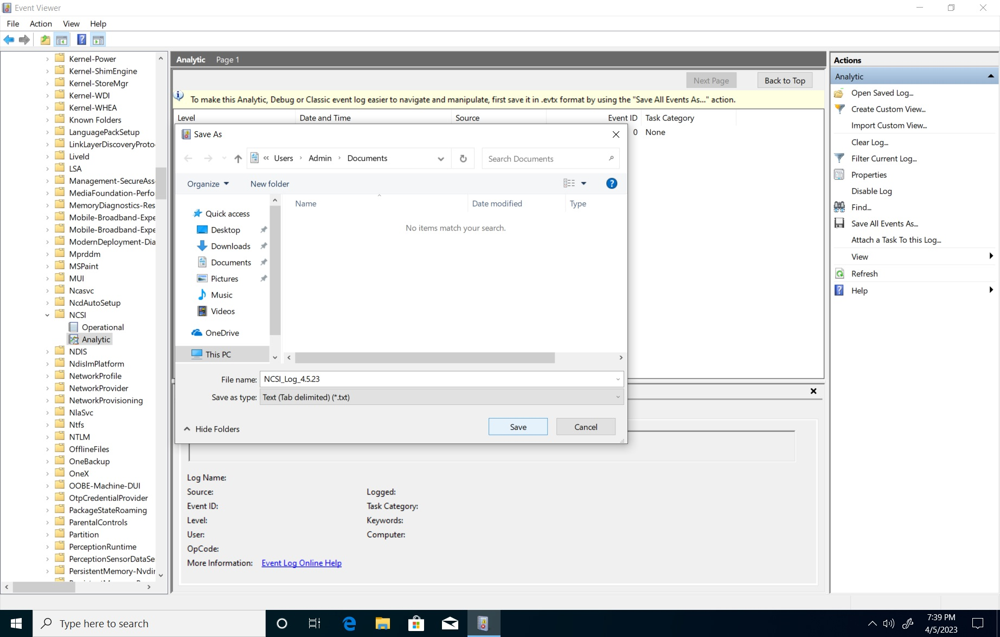

# How to collect data to diagnose NCSI issues

Troubleshooting NCSI (Network Connectivity Status Indicator) issues are generally performed with packet capture data but NCSI event logs can also be a useful tool when correlated with the packet traffic. This guide serves to assist users on how diagnosing NCSI issues from common scenarios.

## View NCSI data using Event Viewer

1. To open the **Event Viewer**, right-click on **Start** > **Event Viewer**. <br>_Alternatively_, open the Run prompt by pressing **Win+R** and typing eventviewer.exe.
[ ](../media/ncsi/ncsi-troubleshooting-guide/ncsi-event-viewer-1.jpg#lightbox)

1. Expand **Applications and Service Logs** > **Microsoft** > **Windows** > **NCSI**.
[ ](../media/ncsi/ncsi-troubleshooting-guide/ncsi-event-viewer-2.jpg#lightbox)

1. Right-click **NCSI**, select **View** > **Show Analytic and Debug Logs**.
[ ](../media/ncsi/ncsi-troubleshooting-guide/ncsi-event-viewer-3.jpg#lightbox)

1. Right-click on **Analytic** under the **NCSI** folder, select **Enable Log**.
<br>_A dialog box may notify you that you may lose Analytic and Debug log events when logging is enabled. Select **Ok** to proceed._
[ ](../media/ncsi/ncsi-troubleshooting-guide/ncsi-event-viewer-4.jpg#lightbox)

## Retrieve NCSI data using Event Viewer

Performing the actions mentioned above will facilitate in data retrieval. For easier analysis, convert the generated logs to text format. While in the **Event Viewer**, follow these steps:

1. Expand **Applications and Service Logs** > **Microsoft** > **Windows** > **NCSI**.
1. Right-click on **Analytic**, select **Save All Events As**.
[ ](../media/ncsi/ncsi-troubleshooting-guide/ncsi-event-viewer-5.jpg#lightbox)

1. The "Save As" dialog box opens. Set the "save as type" to text (*.txt), name your file and select your location. Select **Save**.
[ ](../media/ncsi/ncsi-troubleshooting-guide/ncsi-event-viewer-6.jpg#lightbox)

Here's an example of a successful connection output:

```output
Information    4/26/2023 12:17:46 PM    Microsoft-Windows-NCSI    4013    Internet Connectivity Detection    Active Internet Probe started on interface {611346db-8fbb-473d-808b-6c7573b3ef4d}
Information    4/26/2023 12:17:46 PM    Microsoft-Windows-NCSI    4017    Internet Connectivity Detection    Active Internet Probe (HTTP) started on interface {611346db-8fbb-473d-808b-6c7573b3ef4d}
Information    4/26/2023 12:17:48 PM    Microsoft-Windows-NCSI    4005    Wait for Internet Connectivity     Entered State: Internet Connectivity Interface Luid: 0x6008001000000
Information    4/26/2023 12:18:07 PM    Microsoft-Windows-NCSI    4018    Internet Connectivity Detection    Active Internet Probe (HTTP) finished on interface {611346db-8fbb-473d-808b-6c7573b3ef4d}
Information    4/26/2023 12:18:07 PM    Microsoft-Windows-NCSI    4014    Internet Connectivity Detection    Active Internet Probe finished on interface {611346db-8fbb-473d-808b-6c7573b3ef4d} (false)
```

Here's an example of a failed connection output:

```output
Information    4/26/2023 12:01:02 PM    Microsoft-Windows-NCSI    4013    Internet Connectivity Detection    Active Internet Probe started on interface {611346db-8fbb-473d-808b-6c7573b3ef4d}
Information    4/26/2023 12:01:02 PM    Microsoft-Windows-NCSI    4017    Internet Connectivity Detection    Active Internet Probe (HTTP) started on interface {611346db-8fbb-473d-808b-6c7573b3ef4d}
Information    4/26/2023 12:01:04 PM    Microsoft-Windows-NCSI    4005    Wait for Internet Connectivity     Entered State: Local Connectivity Interface Luid: 0x6008001000000
Information    4/26/2023 12:03:23 PM    Microsoft-Windows-NCSI    4018    Internet Connectivity Detection    Active Internet Probe (HTTP) finished on interface {611346db-8fbb-473d-808b-6c7573b3ef4d}
Warning        4/26/2023 12:03:23 PM    Microsoft-Windows-NCSI    4051    None                               Active probe result code on interface {611346db-8fbb-473d-808b-6c7573b3ef4d} (0x6008001000000 Family: V4) = 12007
```

Correlate both the **Analytic** and **Operational** NCSI events with the packet capture timestamps to determine whether the active probe was fired, if it completed, and why it failed. To learn more about Winhttp error codes, see [error messages (Winhttp.h)](/windows/win32/winhttp/error-messages).

## How to reproduce a problem scenario

You can troubleshoot an issue by forcing an active probe to see if it completes. The easiest way to do this is to cause a network change event. The following demonstrates this on both wired and wireless connections:

**Wired**

1. Disconnect the Ethernet cable. (Alternatively, you can disable the network adapter in Advanced network settings).
1. Use a packet capture software, such as wireshark, and wait 30 seconds to collect the data.
1. Reconnect the Ethernet cable. (Or enable the network adapter in Advanced network settings if it was previously disabled).
1. Wait 60 seconds before stopping the capture to ensure ample time for active probe to be attempted.

**Wireless**

1. Start the packet capture prior to the connection.
1. Connect to the wireless network.
1. Wait 60 seconds to ensure the active probe activity has fully transpired.
1. Stop the network capture.

## Additional references

- [NCSI Overview](ncsi-overview.md)
- [NCSI FAQ](ncsi-frequently-asked-questions.md)
