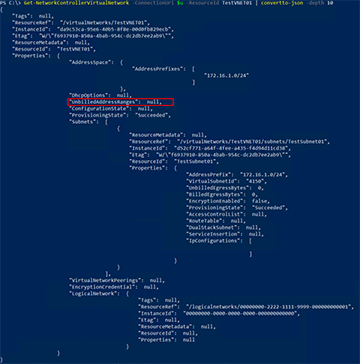
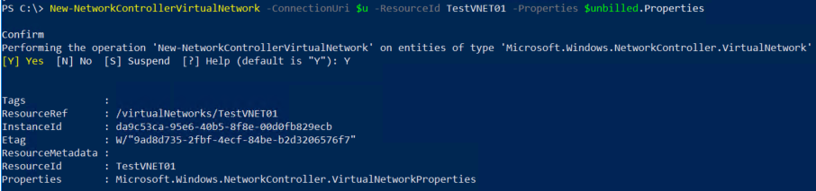
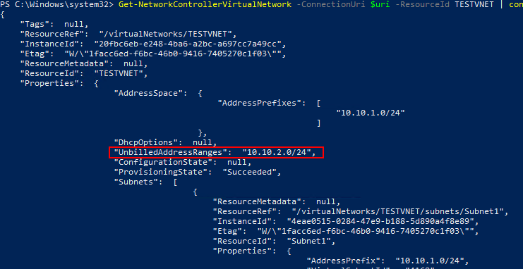
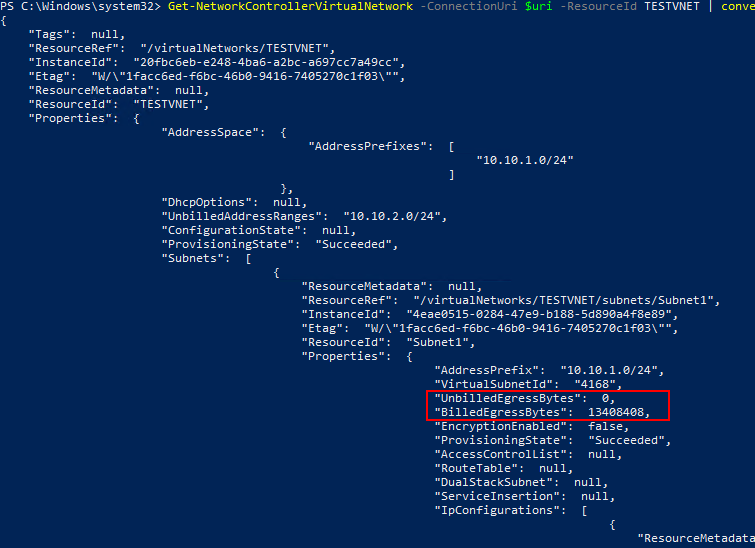

# Egress metering in virtual network

>Applies to: Windows Server


A fundamental aspect of cloud networking monetization is network bandwidth egress. For example - outbound Data transfers In Microsoft Azure business model. Outbound data is charged based on the total amount of data moving out of the Azure datacenters via the Internet in a given billing cycle.

This new feature in Windows Server 2019 enables SDN to offer usage meters for outbound data transfers. With this feature added, Network Controller keeps a whitelist per Virtual Network of all IP ranges used within SDN, and consider any
packet bound for a destination that is not included in one of these ranges to be billed outbound data transfers.

## Virtual network unbilled address ranges (whitelist of IP ranges)

You can find unbilled address ranges under the **UnbilledAddressRanges** property of an existing virtual Network. By default, there is no address ranges added.



## Manage the unbilled address ranges of a virtual network

You can manage which data transfer/traffic to the destination IPs defined in the **UnbilledAddressRange** property of a virtual network.

>[!NOTE]
>These destination IPs do not get metered.

1.  Create a **UnbilledAddressRanges** property.

    ```PowerShell
    $unbilled = (Get-NetworkControllerVirtualNetwork -ConnectionUri $uri -ResourceID VirtualNetworkResourceID) 
    $unbilled.Properties.UnbilledAddressRanges = “10.10.2.0/24, 192.168.1.0/24 … “
    ```
    
    >[!TIP]
    >If adding multiple IP ranges, use a comma between each of the IP ranges.

2.  Update the Virtual Network **UnbilledAddressRanges** property.

    ```PowerShell
    New-NetworkControllerVirtualNetwork -ConnectionUri $uri -ResourceId VirtualnetworkResourceID -Properties $unbilled.Properties
    ```

    

3.  Check the Virtual Network to see the configured **UnbilledAddressRanges**.

    ```PowerShell
    Get-NetworkControllerVirtualNetwork -ConnectionUri $uri -ResourceID VirtualNetworkResourceID
    ```

    

## Check the billed the unbilled egress usage of a virtual network

After you configure the UnbilledAddressRanges property, you can check the billed and unbilled egress usage of a virtual network. Egress traffic updates every four minutes with the total bytes of the billed and unbilled ranges.

-   **UnbilledEgressBytes** under the *Properties* of *Subnets* shows the number of unbilled bytes sent by virtual machines with network interfaces with IP configurations from this virtual subnet. Unbilled bytes are bytes sent to  address ranges that are part of the **UnbilledAddressRanges** property of the parent virtual network.

-   **BilledEgressBytes** under the *Properties* of *Subnets* shows Number of billed bytes sent by virtual machines with network interfaces with IP configurations from this virtual subnet. Billed bytes are bytes sent to address ranges that are not part of the UnbilledAddressRanges property of the parent virtual network.




---