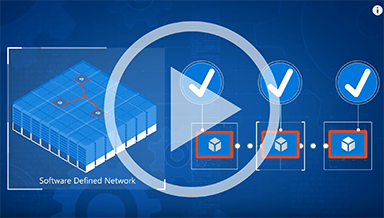
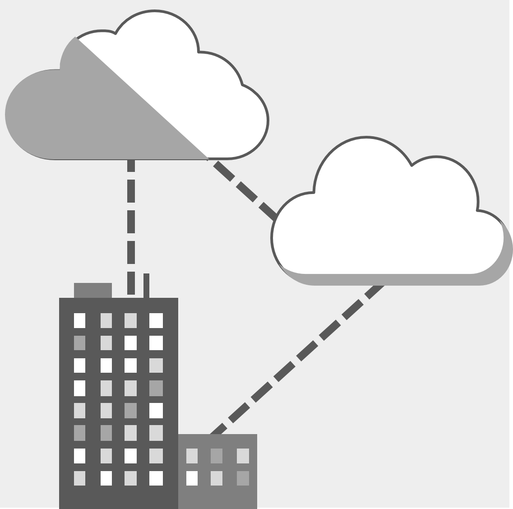

# Introduction to SDN in Windows Server Datacenter

>Applies To: Windows Server (Semi-Annual Channel), Windows Server 2016

This topic provides a high\-level overview of Microsoft's Software Defined Networking \(SDN\) solution. If you're new to SDN, or just looking for a clear place to start in understanding our solution, you're in the right place.

For a deeper overview of Microsoft SDN infrastructure, skip this topic and start with the topic [Software Defined Networking (SDN)](software-defined-networking.md).

## What can Microsoft SDN provide for your business?
| Increased agility | Enhanced network security | Optimal efficiency |
| ----------- | --------- | ------|
| &#10003; Accelerate your DevOps cycle &#10003; Manage complex policies on-dmand &#10003; Onboard large workloads quickly &#10003; Work seamlessly between your private datacenter and the public cloud | &#10003; Layerd architecture for stronger protection and threat isolation &#10003; Full network control for instant reaction to threats &#10003; Granular firewall policies | &#10003; Minimized operation and infrastructure costs &#10003; Highly available, self-healing architecture &#10003; Smart and flexible resource management |
|

## Microsoft SDN Mechanics Video

In this Microsoft Mechanics Video, Windows Server SDN engineer Greg Cusanza joins Matt McSpirit to demonstrate the new Software Defined Networking capabilities in Windows Server 2016. Watch as Cusanza explains the SDN technology underpinnings and shows you how you can use SDN to do the following.

- Dynamically create, secure, and connect your network to meet the evolving needs of your apps
- Speed up the deployment of your workloads
- Contain security vulnerabilities from spreading across your network

SDN allows you to accomplish all of this while also reducing your overall infrastructure costs.

To watch the video on YouTube, click the image below.

## SDN Services
<table>
    <tr style="border: 0;">
        <td style="border: 0;">
            
        </td>
        <td style="padding: 10px; border: 0;">
		<b>Centrally configure</b> and manage physical and virtual network devices
        </td>
    </tr>
        <tr style="border: 0;">
            <td style="border: 0;">
                
            </td>
            <td style="padding: 10px; border: 0;">
	    	Implement network policies at <b>scale</b>, seamlessly across your environments
            </td>
        </tr>
	<tr style="border: 0;">
		<td style="border: 0;">
			
		</td>
		<td style="padding: 10px; border: 0;">
		Leverage <b>layered network architecture</b> for increased security, protection and isolation
		</td>
	</tr>
	<tr style="border: 0;">
		<td style="border: 0;">
			
		</td>
		<td style="padding: 10px; border: 0;">
			Manage your network based on <b>granular</b> app and security needs
		</td>
	</tr>
	<tr style="border: 0;">
		<td style="border: 0;">
			
		</td>
		<td style="padding: 10px; border: 0;">
		Define routes to <b>control traffic flow</b> between tenants and the virtual and physical networks
		</td>
	</tr>
	<tr style="border: 0;">
		<td style="border: 0;">
			
		</td>
		<td style="padding: 10px; border: 0;">
		Use port mirroring for to <b>enforce</b> policies, <b>detect</b> security threats, <b>monitor</b> compliance and <b>track</b> traffic patterns
		</td>
	</tr>
	<tr style="border: 0;">
		<td style="border: 0;">
			
		</td>
		<td style="padding: 10px; border: 0;">
		Enjoy optimal network <b>performance</b>
		</td>
	</tr>
  <tr style="border: 0;">
    <td style="border: 0;">
      
    </td>
    <td style="padding: 10px; border: 0;">
    Using SDN gateways, extend your virtual network infrastructure across multiple environments, to seamlessly leverage <b>hybrid</b> and <b>cross-cloud</b> flexibility
  </tr>
	<tr style="border: 0;">
        <td style="border: 0;">
            
		</td>
		<td style="padding: 10px; border: 0;">
		Experience the power offered by Windows Server 2016 as SDN converges with all of our most innovative storage and compute datacenter solutions
		</td>
	</tr>
</table>

## Key Components of SDN Architecture

The following list of SDN technologies provides links to documentation for each technology. For brief technology overviews, see the section **Windows Server Technologies for Software Defined Networking** in the topic [Software Defined Networking (SDN)](https://technet.microsoft.com/windows-server-docs/networking/sdn/software-defined-networking#a-namebkmkwsawindows-server-technologies-for-software-defined-networking).

- [Network Controller](technologies/network-controller/Network-Controller.md)
- [Hyper-V Network Virtualization](technologies/hyper-v-network-virtualization/hyper-v-network-virtualization.md)
- [Hyper-V Virtual Switch](../../virtualization/hyper-v-virtual-switch/Hyper-V-Virtual-Switch.md)
- [Internal DNS Service (iDNS) for SDN](technologies/Idns-for-Sdn.md)
- [Software Load Balancing (SLB) for SDN](technologies/network-function-virtualization/software-load-balancing-for-sdn.md) with Network Address Translation \(NAT\)
- [Datacenter Firewall Overview](technologies/network-function-virtualization/Datacenter-Firewall-Overview.md)
- [RAS Gateway for SDN](technologies/network-function-virtualization/RAS-Gateway-for-Sdn.md)
- [Remote Direct Memory Access (RDMA) and Switch Embedded Teaming (SET)](../../virtualization/hyper-v-virtual-switch/RDMA-and-Switch-Embedded-Teaming.md)
- [Container Networking Overview](technologies/containers/Container-networking-overview.md)

## SDN Learning Resources
The links [above](https://docs.microsoft.com/en-us/windows-server/networking/sdn/sdn-intro#key-components-of-sdn-architecture) lead to the official documentation on SDN and the key components of SDN architecture. In addition to this core documentation, we have also published several videos, blog posts and other items on SDN. Refer to the links below as additional resources for understanding SDN, and how you might use it to boost your organization's network infrastructure:
- [Microsoft Software Defined Networking Datasheet](https://download.microsoft.com/download/1/5/A/15AC87E7-E99C-4E98-B6AF-9346790AD2DF/Software_Defined_Networking_is_built_in_with_Windows_Server_2016_solution_brief_EN_US.pdf)
- TechNet Virtual Lab: [Implementing a Software Defined Network with Windows Server 2016](http://msft.social/LryGa6)
- Blog post: [How to find the SDN gateway local address for BGP peering in Windows Server 2016](https://blogs.technet.microsoft.com/networking/2017/03/23/how-to-find-the-sdn-gateway-local-address-for-bgp-peering-in-windows-server-2016/)
- Blog post: [Troubleshoot Configuring SDN RAS Gateway VPN Bandwidth Settings in Virtual Machine Manager](https://blogs.technet.microsoft.com/networking/2017/03/06/troubleshoot-configuring-sdn-ras-gateway-vpn-bandwidth-settings-in-virtual-machine-manager/)
- Blog post: [4 datacenter challenges and how Windows Server 2016 software defined networking can help](https://blogs.technet.microsoft.com/hybridcloud/2015/11/04/4-datacenter-challenges-and-how-windows-server-2016-software-defined-networking-can-help/)
- Blog post: [Network Virtualization in the Windows Server 2016 Software Defined Networking (SDN) Stack](https://blogs.technet.microsoft.com/networking/2016/10/26/network-virtualization-with-ws2016-sdn/)
- Video: [An Introduction to Software Defined Networking with Windows Server 2016](https://www.youtube.com/watch?v=f501zUUcXD0)
- Video: [Ten reasons you’ll love Windows Server 2016: Software-Defined Networking](https://channel9.msdn.com/Blogs/windowsserver/Software-Defined-Networking)
- Video: [Software-defined Networking Load Balancer in Windows Server 2016](https://www.youtube.com/watch?v=5q3sEQN4GSM)
- Video: [Explore Windows Server 2016 Software Defined Datacenter (Ignite 2016)](https://www.youtube.com/watch?v=m5oOOsy539w)
- Video: [Software-Defined Networking in Windows Server 2016 - by Matt McSpirit (Ignite Australia 2015)](https://channel9.msdn.com/Events/Ignite/Australia-2015/INF324)

## Contact the Datacenter and Cloud Networking Team

Have questions about how Microsoft SDN can meet your needs?

Need troubleshooting help, or to report a bug?

Looking to make a doc request?

Please [Contact the Datacenter and Cloud Networking Team](contact-sdn-team.md) with questions, to get assistance with our products, or simply to provide us with feedback of any kind. We love to hear from you as a member of our community--it's in hearing from you that we are able to make our products truly meet and exceed your needs as a customer.
