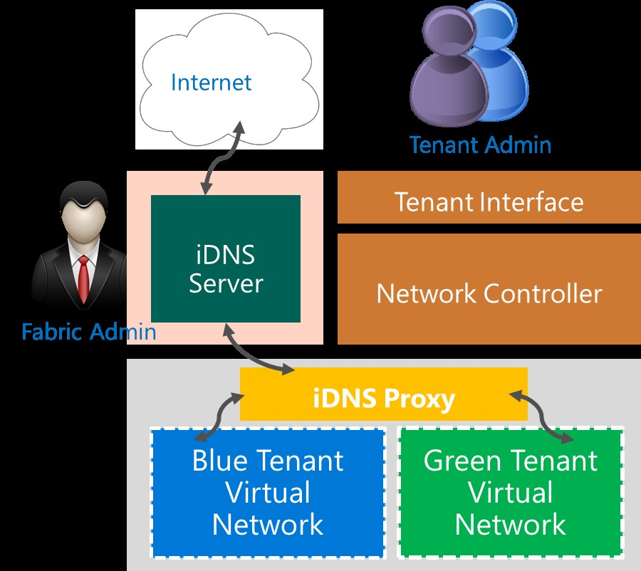

# Internal DNS Service (iDNS) for SDN

>Applies to: Windows Server (Semi-Annual Channel), Windows Server 2016

If you work for a Cloud Service Provider \(CSP\) or Enterprise that is planning to deploy Software Defined Networking \(SDN\) in Windows Server 2016, you can provide DNS services to your hosted tenant workloads by using Internal DNS \(iDNS\), which is integrated with SDN.

Hosted virtual machines \(VMs\) and applications require DNS to communicate within their own networks and with external resources on the Internet. With iDNS, you can provide tenants with DNS name resolution services for their isolated, local name space and for Internet resources.

Because the iDNS service is not accessible from tenant Virtual Networks, other than through the iDNS proxy, the server is not vulnerable to malicious activities on tenant networks.

**Key Features**

Following are the key features for iDNS.

- Provides shared DNS name resolution services for tenant workloads
- Authoritative DNS service for name resolution and DNS registration within the tenant name space
- Recursive DNS service for resolution of Internet names from tenant VMs.
- If desired, you can configure simultaneous hosting of fabric and tenant names
- A cost-effective DNS solution - tenants do not need to deploy their own DNS infrastructure
- High availability with Active Directory integration, which is required.

In addition to these features, if you are concerned about keeping your AD integrated DNS servers open to the Internet, you can deploy iDNS servers behind another recursive resolver in the perimeter network.

Because iDNS is a centralized server for all DNS queries, a CSP or Enterprise can also implement tenant DNS firewalls, apply filters, detect malicious activities, and audit transactions at a central location

## iDNS Infrastructure
The iDNS infrastructure includes iDNS Servers and iDNS proxy.

### iDNS Servers
iDNS includes a set of DNS servers that host tenant-specific data, such as VM DNS Resource Records.

iDNS servers are the authoritative servers for their internal DNS zones, and also act as a resolver for public names when tenant VMs attempt to connect to external resources.

All of the host names for VMs on Virtual Networks are stored as DNS Resource Records under the same zone. For example, if you deploy iDNS for a zone named contoso.local, the DNS Resource Records for the VMs on that network are stored in the contoso.local zone.

Tenant VM Fully Qualified Domain Names \(FQDNs\) consist of the computer name and the DNS suffix string for the Virtual Network, in GUID format. For example, if you have a tenant VM named TENANT1 that is on the Virtual Network contoso,local, the VM's FQDN is TENANT1.*vn-guid*.contoso.local, where *vn-guid* is the DNS suffix string for the Virtual Network.

>[!NOTE]
>If you are a fabric administrator, you can use your CSP or Enterprise DNS infrastructure as iDNS servers instead of deploying new DNS servers specifically for use as iDNS servers. Whether you deploy new servers for iDNS or you use your existing infrastructure, iDNS relies on Active Directory to provide high availability. Your iDNS servers must therefore be integrated with Active Directory.

### iDNS Proxy
iDNS proxy is a Windows service that runs on every host, and which forwards tenant Virtual Network DNS traffic to the iDNS Server.

The following illustration depicts DNS traffic paths from tenant Virtual Networks through the iDNS proxy to the iDNS Server and the Internet.



## How to Deploy iDNS
When you deploy SDN in Windows Server 2016 by using scripts, iDNS is automatically included in your deployment.

For more information, see the following topics.

- [Deploy a Software Defined Network infrastructure using scripts](https://docs.microsoft.com/windows-server/networking/sdn/deploy/deploy-a-software-defined-network-infrastructure-using-scripts)


## Understanding iDNS Deployment Steps
You can use this section to gain an understanding of how iDNS is installed and configured when you deploy SDN using scripts.

Following is a summary of the steps needed to deploy iDNS.

>[!NOTE]
>If you have deployed SDN by using scripts, you do not need to perform any of these steps. The steps are provided for information and troubleshooting purposes only.

### Step 1: Deploy DNS
You can deploy a DNS server by using the following example Windows PowerShell command.
    
    Install-WindowsFeature DNS -IncludeManagementTools
    
### Step 2: Configure iDNS information in Network Controller
This script segment is a REST call that is made by the administrator to Network Controller, informing it about the iDNS zone configuration - such as the IP address of the iDNSServer and the zone that is used to host the iDNS names. 

```
	Url: https://<url>/networking/v1/iDnsServer/configuration
Method: PUT
{
	  "properties": {
	    "connections": [
	      {
	        "managementAddresses": [
	          "10.0.0.9"
	        ],
	        "credential": {
	          "resourceRef": "/credentials/iDnsServer-Credentials"
	        },
	        "credentialType": "usernamePassword"
	      }
	    ],
	    "zone": "contoso.local"
	  }
	}
```

>[!NOTE]
>This is an excerpt from the section **Configuration ConfigureIDns** in SDNExpress.ps1. For more information, see [Deploy a Software Defined Network infrastructure using scripts](https://technet.microsoft.com/windows-server-docs/networking/sdn/deploy/deploy-a-software-defined-network-infrastructure-using-scripts).

### Step 3: Configure the iDNS Proxy Service
The iDNS Proxy Service runs on each of the Hyper-V hosts, providing the bridge between the virtual networks of tenants and the physical network where the iDNS servers are located. The following registry keys must be created on every Hyper-V host.


**DNS port:** Fixed port 53

- Registry Key = HKLM\SYSTEM\CurrentControlSet\Services\NcHostAgent\Parameters\Plugins\Vnet\InfraServices\DnsProxyService"
- ValueName = "Port"
- ValueData = 53
- ValueType = "Dword"
       

**DNS Proxy Port:** Fixed port 53

- Registry Key = HKLM\SYSTEM\CurrentControlSet\Services\NcHostAgent\Parameters\Plugins\Vnet\InfraServices\DnsProxyService"
- ValueName = "ProxyPort"
- ValueData = 53
- ValueType = "Dword"
        
**DNS IP:** Fixed IP address configured on the network interface, in case the tenant chooses to use the iDNS service

- Registry Key = HKLM\SYSTEM\CurrentControlSet\Services\NcHostAgent\Parameters\Plugins\Vnet\InfraServices\DnsProxyService"
- ValueName = "IP"
- ValueData = "169.254.169.254"
- ValueType = "String"

        
**Mac Address:** Media Access Control address of the DNS server

- Registry Key = HKLM\SYSTEM\CurrentControlSet\Services\NcHostAgent\Parameters\Plugins\Vnet\InfraServices\DnsProxyService
- ValueName = "MAC"
- ValueData = “aa-bb-cc-aa-bb-cc”
- ValueType = "String"

**IDNS Server Address:** A comma separated list of iDNS Servers.

- Registry Key: HKLM\SYSTEM\CurrentControlSet\Services\DNSProxy\Parameters
- ValueName = "Forwarders"
- ValueData = “10.0.0.9”
- ValueType = "String"


>[!NOTE]
>This is an excerpt from the section **Configuration ConfigureIDnsProxy** in SDNExpress.ps1. For more information, see [Deploy a Software Defined Network infrastructure using scripts](https://technet.microsoft.com/windows-server-docs/networking/sdn/deploy/deploy-a-software-defined-network-infrastructure-using-scripts).

### Step 4: Restart the Network Controller Host Agent Service
You can use the following Windows PowerShell command to restart the Network Controller Host Agent Service.
    
    Restart-Service nchostagent -Force
    
For more information, see [Restart-Service](https://technet.microsoft.com/library/hh849823.aspx).

### Enable firewall rules for the DNS proxy service
You can use the following Windows PowerShell command to create a firewall rule that allows exceptions for the proxy to communicate with the VM and the iDNS server.
    
    Enable-NetFirewallRule -DisplayGroup 'DNS Proxy Firewall'

For more information, see [Enable-NetFirewallRule](https://technet.microsoft.com/library/jj554869.aspx).
    
### Validate the iDNS Service
To validate the iDNS Service, you must deploy a sample tenant workload.

For more information, see [Create a VM and Connect to a Tenant Virtual Network or VLAN](https://technet.microsoft.com/windows-server-docs/networking/sdn/manage/create-a-tenant-vm).

If you want the tenant VM to use the iDNS service, you must leave the VM network interfaces DNS Server configuration blank and allow the interfaces to use DHCP. 

After the VM with such a network interface is initiated, it automatically receives a configuration that allows the VM to use iDNS, and the VM immediately starts performing name resolution by using the iDNS service.

If you configure the tenant VM to use the iDNS service by leaving network interface DNS Server and Alternate DNS Server information blank, Network Controller provides the VM with an IP address, and performs a DNS name registration on behalf of the VM with the iDNS Server. 

Network Controller also informs the iDNS proxy about the VM and the required details to perform name resolution for the VM. 

When the VM initiates a DNS query, the proxy acts as a forwarder of the query from the Virtual Network to the iDNS service. 

The DNS proxy also ensures that the tenant VM queries are isolated. If the iDNS server is authoritative for the query, the iDNS server responds with an authoritative response. If the iDNS server is not authoritative for the query, it performs a DNS recursion to resolve Internet names.

>[!NOTE]
>This information is included in the section **Configuration AttachToVirtualNetwork** in SDNExpressTenant.ps1. For more information, see [Deploy a Software Defined Network infrastructure using scripts](https://technet.microsoft.com/windows-server-docs/networking/sdn/deploy/deploy-a-software-defined-network-infrastructure-using-scripts).

