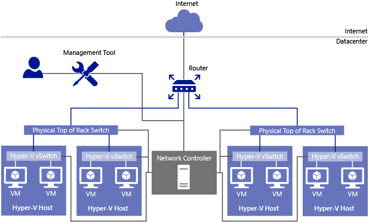

# Network Controller

>Applies to: Windows Server (Semi-Annual Channel), Windows Server 2016

New in  Windows Server 2016, Network Controller provides a centralized, programmable point of automation to manage, configure, monitor, and troubleshoot virtual and physical network infrastructure in your datacenter. 

Using Network Controller, you can automate the configuration of network infrastructure instead of performing manual configuration of network devices and services.

> [!NOTE]
> In addition to this topic, the following Network Controller documentation is available.
> - [Network Controller High Availability](network-controller-high-availability.md)
> - [Installation and Preparation Requirements for Deploying Network Controller](../../plan/Installation-and-Preparation-Requirements-for-Deploying-Network-Controller.md)  
> - [Deploy Network Controller using Windows PowerShell](../../deploy/Deploy-Network-Controller-using-Windows-PowerShell.md)  
> - [Install the Network Controller server role using Server Manager](Install-the-Network-Controller-server-role-using-Server-Manager.md)
> - [Post-Deployment Steps for Network Controller](post-deploy-steps-nc.md)
> - [Network Controller Cmdlets](https://technet.microsoft.com/library/mt576401.aspx) 

## Network Controller Overview

Network Controller is a highly available and scalable server role, and provides one application programming interface \(API\) that allows Network Controller to communicate with the network, and a second API that allows you to communicate with Network Controller.

You can deploy Network Controller in both domain and non-domain environments. In domain environments, Network Controller authenticates users and network devices by using Kerberos; in non-domain environments, you must deploy certificates for authentication.

>[!IMPORTANT]
>Do not deploy the Network Controller server role on physical hosts. To deploy Network Controller, you must install the Network Controller server role on a Hyper-V virtual machine \(VM\) that is installed on a Hyper-V host. After you have installed Network Controller on VMs on three different Hyper\-V hosts, you must enable the Hyper\-V hosts for Software Defined Networking \(SDN\) by adding the hosts to Network Controller using the Windows PowerShell command **New-NetworkControllerServer**. By doing so, you are enabling the SDN Software Load Balancer to function. For more information, see [New-NetworkControllerServer](https://technet.microsoft.com/itpro/powershell/windows/network-controller/new-networkcontrollerserver).

Network Controller communicates with network devices, services, and components by using the Southbound API. With the Southbound API, Network Controller can discover network devices, detect service configurations, and gather all of the information you need about the network. In addition, the Southbound API gives Network Controller a pathway to send information to the network infrastructure, such as configuration changes that you have made.

The Network Controller Northbound API provides you with the ability to gather network information from Network Controller and use it to monitor and configure the network.

The Network Controller Northbound API allows you to configure, monitor, troubleshoot, and deploy new devices on the network by using Windows PowerShell, the Representational State Transfer \(REST\) API, or a management application with a graphical user interface, such as System Center Virtual Machine Manager.

>[!NOTE]
>The Network Controller Northbound API is implemented as a REST interface.

You can manage your datacenter network with Network Controller by using management applications, such as System Center Virtual Machine Manager \(SCVMM\), and System Center Operations Manager \(SCOM\), because Network Controller allows you to configure, monitor, program, and troubleshoot the network infrastructure that is under its control.

Using Windows PowerShell, the REST API, or a management application, you can use Network Controller to manage the following physical and virtual network infrastructure:

- Hyper-V VMs and virtual switches

- Datacenter Firewall

- Remote Access Service \(RAS\) Multitenant Gateways, Virtual Gateways, and gateway pools

- Software Load Balancers

In the following illustration, an Administrator uses a Management Tool that interacts directly with Network Controller. Network Controller provides information about the network infrastructure, including both virtual and physical infrastructure, to the Management Tool, and makes configuration changes according to the Administrator's actions when using the tool.  

  

If you are deploying Network Controller in a test lab environment, you can run the Network Controller server role on a Hyper-V virtual machine \(VM\) that is installed on a Hyper-V host.

For high availability in larger datacenters, you can deploy a cluster by using three VMs that are installed on three or more Hyper-V hosts. For more information, see [Network Controller High Availability](network-controller-high-availability.md).

## Network Controller Features

The following Network Controller features allow you to configure and manage virtual and physical network devices and services.  
  
-   [Firewall Management](#bkmk_firewall)  
  
-   [Software Load Balancer Management](#bkmk_slb)  
  
-   [Virtual Network Management](#bkmk_virtual)  
  
-   [RAS Gateway Management](#bkmk_gateway)

>[!IMPORTANT]
>Network Controller Backup and Restore is not currently available in Windows Server 2016.
  
### Firewall Management

This Network Controller feature allows you to configure and manage allow/deny firewall Access Control rules for your workload VMs for both East/West and North/South network traffic in your datacenter. The firewall rules are plumbed in the vSwitch port of workload VMs, and so they are distributed across your workload in the datacenter. Using the Northbound API, you can define the firewall rules for both incoming and outgoing traffic from the workload VM. You can also configure each firewall rule to log the traffic that was allowed or denied by the rule.  

For more information, see [Datacenter Firewall Overview](../../../sdn/technologies/network-function-virtualization/Datacenter-Firewall-Overview.md).

### Software Load Balancer Management

This Network Controller feature allows you to enable multiple servers to host the same workload, providing high availability and scalability.  
  
For more information, see [Software Load Balancing &#40;SLB&#41; for SDN](../../../sdn/technologies/network-function-virtualization/Software-Load-Balancing--SLB--for-SDN.md).  
  
### Virtual Network Management

This Network Controller feature allows you to deploy and configure Hyper-V Network Virtualization, including the Hyper-V Virtual Switch and virtual network adapters on individual VMs, and to store and distribute virtual network policies.

Network Controller supports both Network Virtualization Generic Routing Encapsulation (NVGRE) and Virtual Extensible Local Area Network (VXLAN).

### RAS Gateway Management

This Network Controller feature allows you to deploy, configure, and manage virtual machines (VMs) that are members of a RAS Gateway pool, providing gateway services to your tenants. Network Controller allows you to automatically deploy VMs running RAS Gateway with the following gateway features:

> [!NOTE]
> In System Center Virtual Machine Manager, RAS Gateway is named Windows Server Gateway.

- Add and remove gateway VMs from the cluster and specify the level of backup required.

- Site-to-site virtual private network (VPN) gateway connectivity between remote tenant networks and your datacenter using IPsec.

- Site-to-site VPN gateway connectivity between remote tenant networks and your datacenter using Generic Routing Encapsulation (GRE).

- Layer 3 forwarding capability.

- Border Gateway Protocol (BGP) routing, which allows you to manage the routing of network traffic between your tenants' VM networks and their remote sites.

Network Controller can place different connections of a tenant on separate gateways. You can use a single public IP for all gateway connections or have different public IPs for a subset of the connections. Network Controller logs all gateway configuration and state changes, which can be used for auditing and troubleshooting purposes.

For more information on BGP, see [Border Gateway Protocol &#40;BGP&#41;](../../../../remote/remote-access/bgp/Border-Gateway-Protocol-BGP.md).

For more information on the RAS Gateway, see [RAS Gateway for SDN](../../../sdn/technologies/network-function-virtualization/RAS-Gateway-for-SDN.md).

## Network Controller Deployment Options

To deploy Network Controller by using System Center Virtual Machine Manager \(VMM\), see [Set up an SDN Network Controller in the VMM fabric](https://technet.microsoft.com/system-center-docs/vmm/scenario/sdn-network-controller).

To deploy Network Controller using scripts, see [Deploy a Software Defined Network Infrastructure Using Scripts](../../deploy/Deploy-a-Software-Defined-Network-infrastructure-using-scripts.md).

To deploy Network Controller using Windows PowerShell, see [Deploy Network Controller using Windows PowerShell](../../deploy/Deploy-Network-Controller-using-Windows-PowerShell.md)
