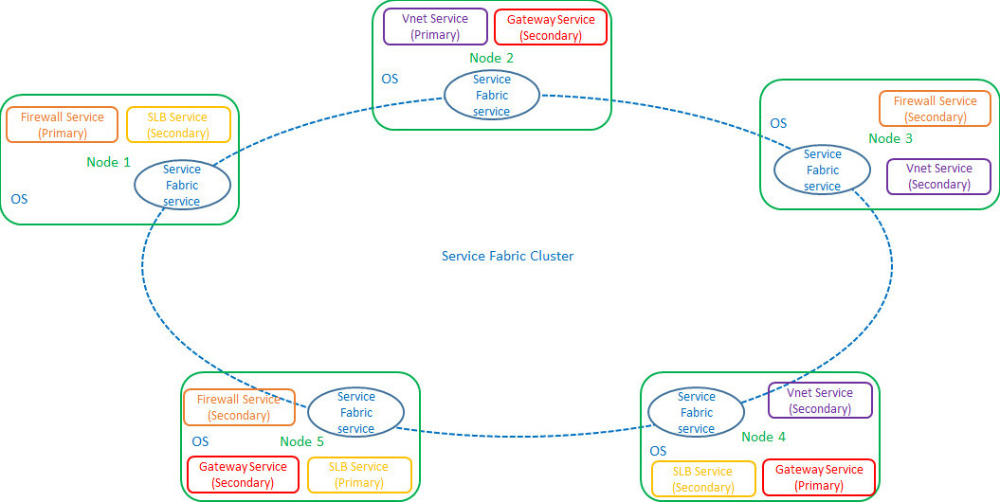

# Network Controller High Availability

>Applies to: Windows Server (Semi-Annual Channel), Windows Server 2016

You can use this topic to learn about Network Controller high availability and scalability configuration for Software Defined Networking \(SDN\).

When you deploy SDN in your datacenter, you can use Network Controller to centrally deploy, monitor, and manage many network elements, including RAS Gateways, Software Load Balancers, virtual networking policies for tenant communication, Datacenter Firewall policies, Quality of Service \(QoS\) for SDN policies, hybrid networking policies, and more.

Because Network Controller is the cornerstone of SDN management, it is critical for Network Controller deployments to provide high availability and the ability for you to easily scale up or down Network Controller nodes with your datacenter needs.

Although you can deploy Network Controller as a single machine cluster, for high availability and failover you must deploy Network Controller in a multiple machine cluster with a minimum of three machines.

>[!NOTE]
>You can deploy Network Controller on either server computers or on virtual machines \(VMs\) that are running Windows Server 2016 Datacenter edition. If you deploy Network Controller on VMs, the VMs must be running on Hyper-V hosts that are also running Datacenter edition. Network Controller is not available on Windows Server 2016 Standard edition.

## Network Controller as a Service Fabric Application

To achieve high availability and scalability, Network Controller relies on Service Fabric. Service Fabric provides a distributed systems platform to build scalable, reliable, and easily-managed applications.

As a platform, Service Fabric provides functionality that is required for building a scalable distributed system. It provides service hosting on multiple operating system instances, synchronizing state information between instances, electing a leader, failure detection, load balancing, and more.

>[!NOTE]
>For information about Service Fabric in Azure, see [Overview of Azure Service Fabric](https://docs.microsoft.com/azure/service-fabric/service-fabric-overview).

When you deploy Network Controller on multiple machines, Network Controller runs as a single Service Fabric application on a Service Fabric cluster. You can form a Service Fabric cluster  by connecting a set of operating system instances.

The Network Controller application is comprised of multiple stateful Service Fabric services. Each service is responsible for a network function, such as physical network management, virtual network management, firewall management, or gateway management. 

Each Service Fabric service has one primary replica and two secondary replicas. The primary service replica processes requests, while the two secondary service replicas provide high availability in circumstances where the primary replica is disabled or unavailable for some reason.

The following illustration depicts a Network Controller Service Fabric cluster with five machines. Four services are distributed across the five machines: Firewall Service, Gateway Service, Software Load Balancing \(SLB\) service, and virtual network \(Vnet\) service.  Each of the four services includes one primary service replica and two secondary service replicas.

## Advantages of using Service Fabric

Following are the primary advantages for using Service Fabric for Network Controller clusters.

### High Availability and Scalability

Because Network Controller is the core of a datacenter network, it must both be resilient to failure and be scalable enough to allow agile changes in datacenter networks over time. The following features provide these abilities: 

- **Fast failover**. Service Fabric provides extremely fast failover. Multiple hot secondary service replicas are always available. If an operating system instance becomes unavailable due to hardware failure, one of the secondary replicas is immediately promoted to primary replica. 
- **Agility of scale**. You can easily and quickly scale these reliable services from a few instances up to thousands of instances and then back down to a few instances, depending on your resource needs. 

### Persistent storage

The Network Controller application has large storage requirements for its configuration and state. The application also must be usable across planned and unplanned outages. For this purpose, Service Fabric provides a Key-Value Store \(KVS\) that is a replicated, transactional and persisted store.

### Modularity

Network Controller is designed with a modular architecture, with each of the network services, such as the virtual networks service and firewall service, built\-in as individual services. 

This application architecture provides the following benefits.

1. Network Controller modularity allows independent development of each of the supported services, as needs evolve. For example, the Software Load Balancing service can be updated without affecting any of the other services or the normal operation of Network Controller.
2. Network Controller modularity allows the addition of new services, as the network evolves. New services can be added to Network Controller without impacting existing services.

>[!NOTE]
>In Windows Server 2016, the addition of third party services to Network Controller is not supported.

Service Fabric modularity uses service model schemas to maximize the ease of developing, deploying, and servicing an application.

## Network Controller Deployment Options

To deploy Network Controller by using System Center Virtual Machine Manager \(VMM\), see [Set up an SDN network controller in the VMM fabric](https://technet.microsoft.com/system-center-docs/vmm/scenario/sdn-network-controller).

To deploy Network Controller using scripts, see [Deploy a Software Defined Network Infrastructure Using Scripts](../../deploy/Deploy-a-Software-Defined-Network-infrastructure-using-scripts.md).

To deploy Network Controller using Windows PowerShell, see [Deploy Network Controller using Windows PowerShell](../../deploy/Deploy-Network-Controller-using-Windows-PowerShell.md)

For more information about Network Controller, see [Network Controller](Network-Controller.md).