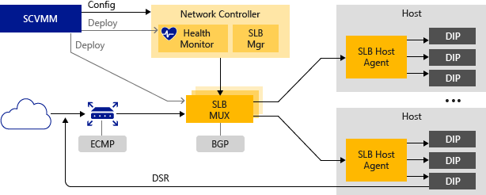

# Software Load Balancing \(SLB\) for SDN

>Applies to: Windows Server (Semi-Annual Channel), Windows Server 2016

You can use this topic to learn about Software Load Balancing for Software Defined Networking in Windows Server 2016.  

Cloud Service Providers (CSPs) and Enterprises that are deploying Software Defined Networking (SDN) in Windows Server 2016 can use Software Load Balancing (SLB) to evenly distribute tenant and tenant customer network traffic among virtual network resources. The Windows Server SLB enables multiple servers to host the same workload, providing high availability and scalability.
  
Windows Server SLB includes the following capabilities.  
  
-   Layer 4 (L4) load balancing services for 'North-South' and 'East-West' TCP/UDP traffic.  
  
-   Public and Internal network traffic load balancing.  
  
-   Supports dynamic IP addresses (DIPs) on virtual Local Area Networks (VLANs) and on virtual networks that you create by using Hyper-V Network Virtualization.  
  
-   Health probe support.  
  
-   Ready for cloud scale, including scale-out capability, and scale up capability for multiplexers and Host Agents.  
  
For more information, see [Software Load Balancing Features](#bkmk_features) in this topic.  
  
> [!NOTE]  
> Multitenancy for VLANs is not supported by Network Controller, however you can use VLANs with SLB for service provider managed workloads, such as the datacenter infrastructure and high density Web servers.  
  
Using Windows Server SLB, you can scale out your load balancing capabilities using SLB VMs on the same Hyper-V compute servers that you use for your other VM workloads. Because of this, SLB supports the rapid creation and deletion of load balancing endpoints that is required for CSP operations. In addition, Windows Server SLB supports tens of gigabytes per cluster, provides a simple provisioning model, and is easy to scale out and in.  
  
**How SLB works**  
  
SLB works by mapping virtual IP addresses (VIPs) to dynamic IP addresses (DIPs) that are part of a cloud service set of resources in the datacenter.  
  
VIPs are single IP addresses that provide public access to a pool of load balanced VMs. For example, VIPs are IP addresses that are exposed on the Internet so that tenants and tenant customers can connect to tenant resources in the cloud datacenter.  
  
DIPs are the IP addresses of the member VMs of a load balanced pool behind the VIP. DIPs are assigned within the cloud infrastructure to the tenant resources.  
  
VIPs are located in the SLB Multiplexer (MUX).  The MUX consists of one or more virtual machines (VMs).  Network Controller provides each MUX with each VIP, and each MUX in turn uses Border Gateway Protocol (BGP) to advertise each VIP to routers on the physical network as a /32 route.  BGP allows the physical network routers to:  
  
-   Learn that a VIP is available on each MUX, even if the MUXes are on different subnets in a layer 3 network.  
  
-   Spread the load for each VIP across all available MUXes using Equal Cost Multi-Path (ECMP) routing.  
  
-   Automatically detect a MUX failure or removal and stop sending traffic to the failed MUX.  
  
-   Spread the load from the failed or removed MUX across the healthy MUXes.  
  
When public traffic arrives from the Internet, the SLB MUX examines the traffic, which contains the VIP as a destination, and maps and rewrites the traffic so that it will arrive at an individual DIP. For inbound network traffic, this transaction is performed in a two-step process that is split between the MUX virtual machines (VMs) and the Hyper-V host where the destination DIP is located:  
  
-   Load balance - the MUX uses the VIP to select a DIP, encapsulates the packet, and forwards the traffic to the Hyper-V host where the DIP is located.  
  
-   Network Address Translation (NAT) - the Hyper-V host removes encapsulation from the packet, translates the VIP to a DIP, remaps the ports, and forwards the packet  to the DIP VM.  
  
The MUX knows how to map VIPs to the correct DIPs because of  load balancing policies that you define by using Network Controller. These rules include Protocol, Front-end Port, Back-end port, and distribution algorithm (5, 3, or 2 tuples).  
  
When tenant VMs respond and send outbound network traffic back to the Internet or remote tenant locations, because the NAT is performed by the Hyper-V host, the traffic bypasses the MUX and goes directly to the edge router from the Hyper-V host. This MUX bypass process is called Direct Server Return (DSR).  
  
And after the initial network traffic flow is established, the inbound network traffic bypasses the SLB MUX completely.  
  
In the following illustration, a client computer performs a DNS query for the IP address of a company SharePoint site - in this case, a fictional company named Contoso. The following process occurs.  
  
-   The DNS server returns the VIP 107.105.47.60 to the client.  
  
-   The client sends an HTTP request to the VIP.  
  
-   The physical network has multiple paths available to reach the VIP located on any MUX.  Each router along the way uses ECMP to pick the next segment of the path until the request arrives at a MUX.  
  
-   The MUX that receives the request checks configured policies, and sees that there are two DIPs available, 10.10.10.5 and 10.10.20.5, on a virtual network to handle the request to the VIP 107.105.47.60  
  
-   The MUX selects the DIP 10.10.10.5 and encapsulates the packets using VXLAN so it can send it to the host containing the DIP using the hosts physical network address.  
  
-   The host receives the encapsulated packet and inspects it.  It removes the encapsulation and rewrites the packet so the destination is now the DIP 10.10.10.5 instead of the VIP and sends the traffic to DIP VM.  
  
-   The request has now reached the Contoso SharePoint site in Server Farm 2. The server generates a response and sends it to the client, using its own IP address as the source.  
  
-   The host intercepts the outgoing packet in the virtual switch which remembers that the client, now the destination, made the original request to the VIP.  The host rewrites the source of the packet to be the VIP so that to the client does not see the DIP address.  
  
-   The host forwards the packet directly to the default gateway for the physical network which uses its standard routing table to forward the packet on to the client which eventually receives the response.  
  
  
  
**Load balancing internal datacenter traffic**  
  
When load balancing network traffic internal to the datacenter, such as between tenant resources that are running on different servers and are members of the same virtual network,  the Hyper-V Virtual Switch to which the VMs are connected performs NAT.  
  
With internal traffic load balancing, the first request is sent to and processed by the MUX, which selects the appropriate DIP and routes the traffic to the DIP. From that point forward, the established traffic flow bypasses the MUX and goes directly from VM to VM.  
  
**Health probes**  
  
SLB includes health probes to validate the health of the network infrastructure, including the following.  
  
-   TCP probe to port  
  
-   HTTP probe to port and URL  
  
Unlike a traditional load balancer appliance where the probe originates on the appliance and travels across the wire to the DIP, the SLB probe originates on the host where the DIP is located and goes directly from the SLB host agent to the DIP, further distributing the work across the hosts.  
  
## Software Load Balancing Infrastructure  
To deploy Windows Server SLB, you must first deploy Network Controller in  Windows Server 2016 and one or more SLB MUX VMs.  
  
In addition, you must configure Hyper-V hosts with the SDN-enabled Hyper-V Virtual Switch and ensure that the SLB Host Agent is running.  The routers that serve the hosts must support equal cost multipath (ECMP) routing and Border Gateway Protocol (BGP) and must be configured to accept BGP peering requests from the SLB MUXes.  
  
Following is an overview of the SLB infrastructure.  

  
  
The following sections provide more information about these elements of the SLB infrastructure.  
  
### SCVMM  
With System Center 2016, you can configure Network Controller on  Windows Server 2016, including the SLB Manager and Health Monitor. You can also use System Center to deploy SLB MUXs and to install SLB Host Agents on computers that are running  Windows Server 2016 and Hyper-V.  
  
For more information about System Center 2016, see [System Center 2016](https://www.microsoft.com/server-cloud/products/system-center-2016/).  
  
> [!NOTE]  
> If you do not want to use System Center 2016, you can use Windows PowerShell or another management application to install and configure Network Controller and other SLB infrastructure. For more information, see [Deploy Network Controller using Windows PowerShell](../../../sdn/deploy/Deploy-Network-Controller-using-Windows-PowerShell.md).  
  
### Network Controller  
Network Controller hosts the SLB Manager and performs the following actions for SLB.  
  
-   Processes SLB commands that come in through the Northbound API from System Center, Windows PowerShell, or another network management application.  
  
-   Calculates policy for distribution to Hyper-V hosts and SLB MUXes.  
  
-   Provides the health status of the SLB infrastructure.  
  
### SLB MUX  
The SLB MUX processes inbound network traffic and maps VIPs to DIPs, then forwards the traffic to the correct DIP. Each MUX also uses BGP to publish VIP routes to edge routers. BGP Keep Alive notifies MUXes when a MUX fails, which allows active MUXes to redistribute the load in case of a MUX failure - essentially providing load balancing for the load balancers.  
  
### Hosts that are running Hyper-V  
You can use SLB with computers that are running  Windows Server 2016 and Hyper-V. The VMs on the Hyper-V host can run any operating system that is supported by Hyper-V.  
  
### SLB Host Agent  
When you deploy SLB, you must use System Center, Windows PowerShell, or another management application to deploy the SLB Host Agent on every Hyper-V host computer. You can install the SLB Host Agent on all versions of  Windows Server 2016 that provide Hyper-V support, including Nano Server.  
  
The SLB Host Agent listens for SLB policy updates from Network Controller. In addition, the host agent programs rules for SLB into the SDN-enabled Hyper-V Virtual Switches that are configured on the local computer.  
  
### SDN Enabled Hyper-V Virtual Switch  
For a virtual switch to be compatible with SLB, you must use Hyper-V Virtual Switch Manager or Windows PowerShell commands to create the switch, and then you must enable Virtual Filtering Platform (VFP) for the virtual switch.  
  
For information on enabling VFP on virtual switches, see the Windows PowerShell commands [Get-VMSystemSwitchExtension](https://technet.microsoft.com/library/hh848603.aspx) and [Enable-VMSwitchExtension](https://technet.microsoft.com/library/hh848541.aspx?f=255&MSPPError=-2147217396).  
  
The SDN enabled Hyper-V Virtual Switch performs the following actions for SLB.  
  
-   Processes the data path for SLB.  
  
-   Receives inbound network traffic from the MUX.  
  
-   Bypasses the MUX for outbound network traffic, sending it to the router using DSR.  
  
-   Runs on Nano Server instances of Hyper-V.  
  
### BGP Enabled Router  
The BGP router performs the following actions for SLB.  
  
-   Routes inbound traffic to the MUX using ECMP.  
  
-   For outbound network traffic, uses the route provided by the host.  
  
-   Listens for route updates for VIPs from SLB MUX.  
  
-   Removes SLB MUXes from the SLB rotation if Keep Alive fails.  
  
## Software Load Balancing Features  
Following are some of the features and capabilities of SLB.  
  
**Core functionality**  
  
-   SLB provides Layer 4 load balancing services for 'North-South'  and 'East-West' TCP/UDP traffic  
  
-   You can use SLB on a Hyper-V Network Virtualization-based network  
  
-   You can use SLB with a VLAN-based network for DIP VMs connected to a SDN Enabled Hyper-V Virtual Switch.  
  
-   One SLB instance can handle multiple tenants  
  
-   SLB and DIP support a scalable and low-latency return path, as implemented by Direct Server Return (DSR)  
  
-   SLB functions when you are also using Switch Embedded Teaming (SET) or Single Root Input/Output Virtualization (SR-IOV)  
  
-   SLB includes Internet Protocol version 4 (IPv4) support  
  
-   For site-to-site gateway scenarios, SLB provides NAT functionality to enable all site-to-site connections to utilize a single public IP  
  
-   You can install SLB, including the Host Agent and the MUX, on  Windows Server 2016, Full, Core, and Nano Install.  
  
**Scale and performance**  
  
-   Ready for cloud scale, including scale-out capability, and scale up capability for MUXes and Host Agents.  
  
-   One active SLB Manager Network Controller module can support 8 MUX instances  
  
**High availability**  
  
-   You can deploy SLB to more than 2 nodes in an active/active configuration  
  
-   MUXes can be added and removed from the MUX pool without impacting the SLB service. This maintains SLB availability when   
    individual MUXes are being patched.  
  
-   Individual MUX instances have an uptime of 99%  
  
-   Health monitoring data is available to management entities  
  
**Alignment**  
  
-   You can deploy and configure SLB  with SCVMM  
  
-   SLB provides a multitenant unified edge by seamlessly integrating with Microsoft appliances such as the RAS Multitenant Gateway, Datacenter Firewall, and Route Reflector.  
  

