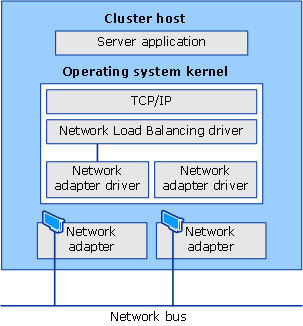

# Network Load Balancing

>Applies to: Windows Server (Semi-Annual Channel), Windows Server 2016

In this topic, we provide you with an overview of the Network Load Balancing \(NLB\) feature in Windows Server 2016. You can use NLB to manage two or more servers as a single virtual cluster. NLB enhances the availability and scalability of Internet server applications such as those used on web, FTP, firewall, proxy, virtual private network \(VPN\), and other mission\-critical servers.  

> [!NOTE]
> Windows Server 2016 includes a new Azure-inspired Software Load Balancer \(SLB\) as a component of the Software Defined Networking \(SDN\) infrastructure. Use SLB instead of NLB if you are using SDN, are using non-Windows workloads, need outbound network address translation \(NAT\), or need Layer 3 \(L3\) or non-TCP based load balancing. You can continue to use NLB with Windows Server 2016 for non-SDN deployments. For more information about SLB, see [Software Load Balancing (SLB) for SDN](../sdn/technologies/network-function-virtualization/Software-Load-Balancing--SLB--for-SDN.md).

The Network Load Balancing \(NLB\) feature distributes traffic across several servers by using the TCP\/IP networking protocol. By combining two or more computers that are running applications into a single virtual cluster, NLB provides reliability and performance for web servers and other mission\-critical servers.  
  
The servers in an NLB cluster are called *hosts*, and each host runs a separate copy of the server applications. NLB distributes incoming client requests across the hosts in the cluster. You can configure the load that is to be handled by each host. You can also add hosts dynamically to the cluster to handle increased load. NLB can also direct all traffic to a designated single host, which is called the *default host*.  
  
NLB allows all of the computers in the cluster to be addressed by the same set of IP addresses, and it maintains a set of unique, dedicated IP addresses for each host. For load\-balanced applications, when a host fails or goes offline, the load is automatically redistributed among the computers that are still operating. When it is ready, the offline computer can transparently rejoin the cluster and regain its share of the workload, which allows the other computers in the cluster to handle less traffic.  
  
## Practical applications  
NLB is useful for ensuring that stateless applications, such as web servers running Internet Information Services \(IIS\), are available with minimal downtime, and that they are scalable \(by adding additional servers as the load increases\). The following sections describe how NLB supports high availability, scalability, and manageability of the clustered servers that run these applications.  
  
### High availability  
A high availability system reliably provides an acceptable level of service with minimal downtime. To provide high availability, NLB includes built\-in features that can automatically:  
  
-   Detect a cluster host that fails or goes offline, and then recover.  
  
-   Balance the network load when hosts are added or removed.  
  
-   Recover and redistribute the workload within ten seconds.  
  
### Scalability  
Scalability is the measure of how well a computer, service, or application can grow to meet increasing performance demands. For NLB clusters, scalability is the ability to incrementally add one or more systems to an existing cluster when the overall load of the cluster exceeds its capabilities. To support scalability, you can do the following with NLB:  
  
-   Balance load requests across the NLB cluster for individual TCP\/IP services.  
  
-   Support up to 32 computers in a single cluster.  
  
-   Balance multiple server load requests \(from the same client or from several clients\) across multiple hosts in the cluster.  
  
-   Add hosts to the NLB cluster as the load increases, without causing the cluster to fail.  
  
-   Remove hosts from the cluster when the load decreases.  
  
-   Enable high performance and low overhead through a fully pipelined implementation. Pipelining allows requests to be sent to the NLB cluster without waiting for a response to a previous request.  
  
### Manageability  
To support manageability, you can do the following with NLB:  
  
-   Manage and configure multiple NLB clusters and the cluster hosts from a single computer by using NLB Manager or the [Network Load Balancing (NLB) Cmdlets in Windows PowerShell](https://technet.microsoft.com/library/hh801274.aspx).
  
-   Specify the load balancing behavior for a single IP port or group of ports by using port management rules.  
  
-   Define different port rules for each website. If you use the same set of load\-balanced servers for multiple applications or websites, port rules are based on the destination virtual IP address \(using virtual clusters\).  

-   Direct all client requests to a single host by using optional, single\-host rules. NLB routes client requests to a particular host that is running specific applications.  

-   Block undesired network access to certain IP ports.  

-   Enable Internet Group Management Protocol \(IGMP\) support on the cluster hosts to control switch port flooding \(where incoming network packets are sent to all ports on the switch\) when operating in multicast mode.  

-   Start, stop, and control NLB actions remotely by using Windows PowerShell commands or scripts.  

-   View the Windows Event Log to check NLB events. NLB logs all actions and cluster changes in the event log.  

## Important functionality  
 
NLB is installed as a standard Windows Server networking driver component. Its operations are transparent to the TCP\/IP networking stack. The following figure shows the relationship between NLB and other software components in a typical configuration.  
  
  
  
Following are the primary features of NLB.  
  
- Requires no hardware changes to run.  
  
- Provides Network Load Balancing Tools to configure and manage multiple clusters and all of the hosts from a single remote or local computer.  
  
- Enables clients to access the cluster by using a single, logical Internet name and virtual IP address, which is known as the cluster IP address \(it retains individual names for each computer\). NLB allows multiple virtual IP addresses for multihomed servers.  
  
> [!NOTE]  
> When you deploy VMs as virtual clusters, NLB does not require servers to be multihomed to have multiple virtual IP addresses.  
  
- Enables NLB to be bound to multiple network adapters, which enables you to configure multiple independent clusters on each host. Support for multiple network adapters differs from virtual clusters in that virtual clusters allow you to configure multiple clusters on a single network adapter.  
  
- Requires no modifications to server applications so that they can run in an NLB cluster.  
  
- Can be configured to automatically add a host to the cluster if that cluster host fails and is subsequently brought back online. The added host can start handling new server requests from clients.  
  
-   Enables you to take computers offline for preventive maintenance without disturbing the cluster operations on the other hosts.  
  
## Hardware requirements  
Following are the hardware requirements to run an NLB cluster.  
  
-   All hosts in the cluster must reside on the same subnet.  
  
-   There is no restriction on the number of network adapters on each host, and different hosts can have a different number of adapters.  
  
-   Within each cluster, all network adapters must be either multicast or unicast. NLB does not support a mixed environment of multicast and unicast within a single cluster.  
  
-   If you use the unicast mode, the network adapter that is used to handle client\-to\-cluster traffic must support changing its media access control \(MAC\) address.  
  
## Software requirements  
Following are the software requirements to run an NLB cluster.  
  
-   Only TCP\/IP can be used on the adapter for which NLB is enabled on each host. Do not add any other protocols \(for example, IPX\) to this adapter.  
  
-   The IP addresses of the servers in the cluster must be static.  
  
> [!NOTE]  
> NLB does not support Dynamic Host Configuration Protocol \(DHCP\). NLB disables DHCP on each interface that it configures.  
  
## Installation information  
You can install NLB by using either Server Manager or the Windows PowerShell commands for NLB.

Optionally you can install the Network Load Balancing Tools to manage a local or remote NLB cluster. The tools include Network Load Balancing Manager and the NLB Windows PowerShell commands.

### Installation with Server Manager

In Server Manager, you can use the Add Roles and Features Wizard to add the **Network Load Balancing** feature. When you complete the wizard, NLB is installed, and you do not need to restart the computer.

### Installation with Windows PowerShell  

To install NLB by using Windows PowerShell, run the following command at an elevated Windows PowerShell prompt on the computer where you want to install NLB.

    
    Install-WindowsFeature NLB -IncludeManagementTools
    
After installation is complete, no restart of the computer is required.

For more information, see [Install-WindowsFeature](https://docs.microsoft.com/powershell/module/servermanager/install-windowsfeature?view=win10-ps).

### Network Load Balancing Manager
To open Network Load Balancing Manager in Server Manager, click **Tools**, and then click **Network Load Balancing Manager**.
  
## Additional resources  
The following table provides links to additional information about the NLB feature.  
  
|Content type|References|  
|----------------|--------------|  
|Deployment|[Network Load Balancing Deployment Guide](https://technet.microsoft.com/library/cc754833(WS.10).aspx) &#124; [Configuring Network Load Balancing with Terminal Services](https://technet.microsoft.com/library/cc771300(v=WS.10).aspx)|  
|Operations|[Managing Network Load Balancing Clusters](https://technet.microsoft.com/library/cc753954(WS.10).aspx) &#124; [Setting Network Load Balancing Parameters](https://technet.microsoft.com/library/cc731619(WS.10).aspx) &#124; [Controlling Hosts on Network Load Balancing Clusters](https://technet.microsoft.com/library/cc770870(WS.10).aspx)|  
|Troubleshooting|[Troubleshooting Network Load Balancing Clusters](https://technet.microsoft.com/library/cc732592(WS.10).aspx) &#124; [NLB Cluster Events and Errors](https://technet.microsoft.com/library/cc731678(WS.10).aspx)|
|Tools and settings|[Network Load Balancing Windows PowerShell cmdlets](https://go.microsoft.com/fwlink/p/?LinkId=238123)|
|Community resources|[High Availability \(Clustering\) Forum](https://go.microsoft.com/fwlink/p/?LinkId=230641)
