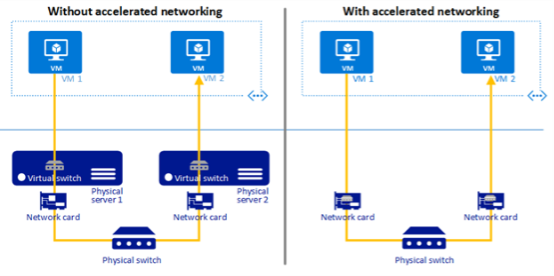

# Accelerated Networking

Accelerated Networking enables single root input-output (I/O) virtualization (SR-IOV) on supported virtual machine (VM) types, greatly improving networking performance. Accelerated Networking lets network traffic bypass the software switch layer of Hyper-V virtualization stacks. Because Accelerated Networking assigns the virtual function (VF) to a child partition, the network traffic flows directly between the VF and child partition. As a result, the I/O overhead in the software emulation layer shrinks until network performance becomes almost the same as physical, on-premises environments. Both single servers that aren't clustered and Windows Server Standard edition don't support Accelerated Networking.

The following diagram illustrates how two VMs communicate with and without Accelerated Networking.

<p align="center">

</p>

Accelerated Networking's high-performance data path enables single root I/O virtualization (SR-IOV) on supported VM types, greatly improving networking performance in the following ways:

- Lower latency and higher packets per second (pps)

- Reduced jitter

- Decreased CPU utilization

Accelerated Networking also adds an extra management layer with the following features:

- Built-in prerequisite checks that let you know if your deployment's compatible with Accelerated Networking by checking SR-IOV support, OS version, hyperthreading status, and so on.

- Host configuration ensures SR-IOV is enabled on the correct vSwitch hosting VM workloads, and also allows you to configure reserve nodes for failover scenarios and avoiding resource oversubscription.

- Simplified VM performance settings that show overall performance as Low, Medium, and High to make configuration easier.

These features make Accelerated Networking useful for environments that require high-performance computing (HPC). It's ideal for intensive computational tasks and real-time applications like financial trading platforms. Additionally, it benefits deployments that use Network Function Virtualization (NFV) to work around limits on network throughput.

## Prerequisites

Your deployment needs to meet the following prerequisites in order to use Accelerated Networking:

- You must set up a functioning cluster running Windows Server 2025 Datacenter edition.

- You must install the **Network ATC** feature. To learn more, see [Install or Uninstall Roles, Role Services, or Features](/windows-server/administration/server-manager/install-or-uninstall-roles-role-services-or-features) and configure a valid Compute intent before you enable Accelerated Networking.

  *Alternatively*, you can run the following command to install this feature:

  ```powershell
  Install-WindowsFeature -Name NetworkATC
  ```

- Your network interface card (NIC) must support SR-IOV and SR-IOV enabled in the BIOS. You might need to contact your hardware vendor to see if your machine supports SR-IOV. Run the following cmdlet to enable SR-IOV on your NIC:

  ```powershell
  Enable-NetAdapterSriov
  ```

- Virtualization must be enabled in the BIOS. Review your hardware vendor guide on setting this feature.

- You must use a Windows Server Pay-as-you-go subscription or [Software Assurance](https://www.microsoft.com/licensing/licensing-programs/software-assurance-default.aspx) license types.

## Configure Accelerated Networking

To configure Accelerated Networking on your device, you can do so using an elevated PowerShell window, or through the Windows Admin Center.

# [PowerShell](#tab/powershell)

Run the following cmdlet to ensure your system meets all prerequisite requirements:

```powershell
Get-AccelNetManagementPreReq
```

Run the following command to enable Accelerated Networking on a cluster:

```powershell
Enable-AccelNetManagement -IntentName "MyIntent" -NodeReservePercentage
```

The `-IntentName` parameter is required. If you leave the `NodeReservePercentage` value blank, the system defaults to **50%**. This value must be an integer greater than or equal to **0** and less than or equal to **99**.

Run the following command to enable Accelerated Networking on a VM set to high performance:

```powershell
Enable-AccelNetVM -VMName "MyVM" -Performance High
```

To enable Accelerated Networking for multiple VMs to run in low performance, run the following command:

```powershell
Get-VM -VMName "MyVM01, MyVM02" | Enable-AccelNetVM -Performance Low
```

The `-VMName` and `-Performance` parameters are required. You can set the performance value to Low, Medium, or High. Performance options have minimum vCPU requirements based on hyperthreading status as shown in the following table:

| Hyperthreading configuration | Performance setting | Minimum vCPUs required |
|---|---|---|
| Disabled | Low | 2 |
| Disabled | Medium | 2 |
| Disabled | High | 4 |
| Enabled | Low | 4 |
| Enabled | Medium | 4 |
| Enabled | High | 4 |

Run the following cmdlet to disable Accelerated Networking on a cluster:

```powershell
Disable-AccelNetManagement
```

After you disable Accelerated Networking on the cluster, the Network HUD no longer monitors the health of the feature.

> [!NOTE]
> Disabling Accelerated Networking at the cluster level doesn't alter the settings on individual VMs. The Network HUD stops monitoring these VMs, and Accelerated Networking ceases to manage them.

Run the following command to disable Accelerated Networking on a VM:

```powershell
Disable-AccelNetVM -VMName "MyVM"
```

To disable Accelerated Networking for multiple VMs, run the following command:

```powershell
Get-VM -VMName "MyVM01, MyVM02" | Disable-AccelNetVM
```

To configure Accelerated Networking on a cluster, go to your node and run the following command with the values for the new intent and node reserve:

```powershell
Set-AccelNetManagement -IntentName "MyIntent" -NodeReservePercentage
```

Run the following command to configure your VM to run in medium performance:

```powershell
Set-AccelNetManagement -VMName "MyVM" -Performance Medium
```

To learn more about the Accelerated Networking PowerShell cmdlets, see the [FailoverClusters](/powershell/module/failoverclusters) module set.

# [Windows Admin Center](#tab/wac)

To configure Accelerated Networking in Windows Admin Center, navigate to your cluster and follow these steps:

1. On the left-hand menu, under **Networking**, select **Accelerated Networking**, then select **Set up Accelerated Networking**.

1. Select a valid **Intent**, select the **Node reserve** percentage for failover, then select **Enable accelerated Networking**.

   The next screen displays the Accelerated Networking status, intent, and node reserve used. If you need to make any changes to these settings, select **Cluster overview**, select **Settings**, make your adjustments, then select **Save**.

1. On this same screen, if you want to disable Accelerated Networking on your cluster, select **Disable cluster-level Accelerated Networking**, then select **Disable Accelerated Networking**.

To enable or disable Accelerated Networking on your VMs, perform the following steps. You can perform this action on single or multiple VMs at once.

1. To disable one or more VMs, select **Enabled virtual machines**, select your VMs, then select **Disable VM Accelerated Networking**.

1. To enable one or more VMs, select **Disabled virtual machines**, select your VMs, select **Enable VM Accelerated Networking**, select the **Performance** level, then select **Enable**.

To change the performance settings on a single or multiple VMs, follow these steps:

1. On the same screen, select **Enabled virtual machines**, then select all the VMs where you want to change the performance setting.

1. Select **Settings**, select your **Performance** level, then select **Apply**.

---

## Known PowerShell errors

You might encounter the following error messages while using this feature.

| Error | Description | Resolution |
| --- | --- | --- |
| `Accel_net_not_supported` | `Node {0} does not support Accelerated Networking. Windows Server 2025 or later is required.` | Your device must be running the latest version of Windows Server 2025. |
| `cannot_provision_performance` | `Cannot provision {0} on this system.` | Select a different Performance option or update your network adapters. |
| `cluster_not_enough_resources` | `The cluster does not have enough SRIOV resources to enable VM {0}.` | Either lower the **NodeReservePercentage** value, select a different performance option, or increase the number of SRIOV resources in your cluster. |
| `enable_accel_net_failed` | `Failed to enable Accelerated Networking on the cluster {0}.` | Make sure you're using a valid Pay-as-you-go subscription license. |
| `Get_network_adapter_failed` | `Failed to get network adapters for VM {0}.` | Make sure the VM has at least one network adapter. |
| `ht_enabled_min_processor_counter` | `The minimum required processor count for requested performance with hyperthreading enabled/disabled is {0}.` | To meet the requirements, add more vCPUs to your VM. |
| `Hyperthreading_check_failed` | `Hyperthreading validation: Failed. There is an inconsistency across the cluster. Either disable or enable hyperthreading on all nodes.` | Make sure the hyperthreading configuration is consistent for every node in your cluster. |
| `Intent_not_found` | `Intent validation: Failed. Intent {0} not found.` | Make sure the intent name you entered is correct, then try again. |
| `Intent_type_check_failed` | `The selected intent {0} does not have Compute capabilities.` | Create or update an intent with the Compute state. |
| `Sriov_support_MissingAcs` | `Adapter {0} cannot be enabled for Accelerated Networking because it is in a PCIe slot that does not support Access Control Services (ACS).` | Either try moving the device to another PCIe slot or contact your hardware vendor. |
| `Sriov_support_MissingPfDriver` | `Adapter {0} cannot be enabled for Accelerated Networking because the device driver does not support SR-IOV.` | Ensure the drivers are updated. |
| `Sriov_support_NoBusResources` | `Adapter {0} cannot be enabled for Accelerated Networking because there are not enough PCI Express bus numbers available.` | Adjust the PCI Express bus speed in the BIOS settings, or add an expansion card that supports more PCI Express slots. |
| `Sriov_support_Unknown` | `Adapter {0} cannot be enabled for Accelerated Networking because it is not advertising SR-IOV Support.` | Make sure the computer hardware can support SR-IOV and that you enabled I/O virtualization in the BIOS. |
| `vm_not_enough_vcpus` | `VM {0} does not have enough vCPUs to enable Accelerated Networking with the specified performance.` | Increase the vCPU amount for your VM. |

## See also

- [Hyper-V overview](../../../virtualization/hyper-v/overview.md)

- [What are Azure Arc-enabled servers?](/azure/azure-arc/servers/overview)

- [High-performance networking (HPN)](../hpn/hpn-top.md)

