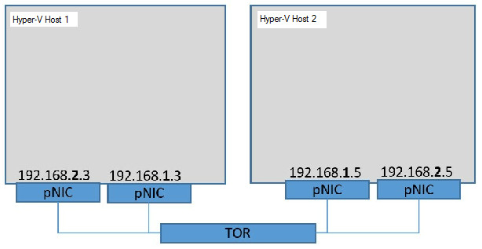
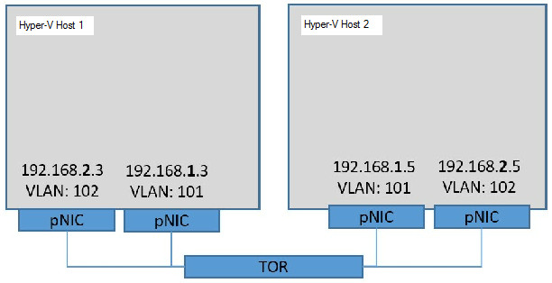
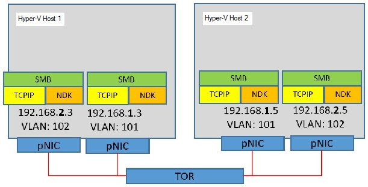
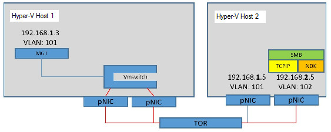

# Converged NIC in a Teamed NIC configuration (datacenter)

>Applies to: Windows Server (Semi-Annual Channel), Windows Server 2016

In this topic, we provide you with instructions to deploy Converged NIC in a Teamed NIC configuration with Switch Embedded Teaming \(SET\). 

The example configuration in this topic describes two Hyper-V hosts, **Hyper-V Host 1** and **Hyper-V Host 2**. Both hosts have two network adapters. On each host, one adapter is connected to the 192.168.1.x/24 subnet, and one adapter is connected to the 192.168.2.x/24 subnet.



## Step 1. Test the connectivity between source and destination

Ensure that the physical NIC can connect to the destination host.  This test demonstrates connectivity by using Layer 3 \(L3\) - or the IP layer - as well as the Layer 2 \(L2\) virtual local area networks \(VLAN\).

1. View the first network adapter properties.

   ```PowerShell
   Get-NetAdapter -Name "Test-40G-1" | ft -AutoSize
   ```

   _**Results:**_


   |    Name    |           InterfaceDescription           | ifIndex | Status |    MacAddress     | LinkSpeed |
   |------------|------------------------------------------|---------|--------|-------------------|-----------|
   | Test-40G-1 | Mellanox ConnectX-3 Pro Ethernet Adapter |   11    |   Up   | E4-1D-2D-07-43-D0 |  40 Gbps  |

   ---

2. View additional properties for the first adapter, including the IP address. 

   ```PowerShell
   Get-NetIPAddress -InterfaceAlias "Test-40G-1"
   Get-NetIPAddress -InterfaceAlias "TEST-40G-1" | Where-Object {$_.AddressFamily -eq "IPv4"} | fl InterfaceAlias,IPAddress
   ```

   _**Results:**_


   |   Parameter    |    Value    |
   |----------------|-------------|
   |   IPAddress    | 192.168.1.3 |
   | InterfaceIndex |     11      |
   | InterfaceAlias | Test-40G-1  |
   | AddressFamily  |    IPv4     |
   |      Type      |   Unicast   |
   |  PrefixLength  |     24      |

   ---

3. View the second network adapter properties.

   ```PowerShell
   Get-NetAdapter -Name "Test-40G-2" | ft -AutoSize
   ```

   _**Results:**_


   |    Name    |          InterfaceDescription           | ifIndex | Status |    MacAddress     | LinkSpeed |
   |------------|-----------------------------------------|---------|--------|-------------------|-----------|
   | TEST-40G-2 | Mellanox ConnectX-3 Pro Ethernet A...#2 |   13    |   Up   | E4-1D-2D-07-40-70 |  40 Gbps  |

   ---

4. View additional properties for the second adapter, including the IP address.

   ```PowerShell
   Get-NetIPAddress -InterfaceAlias "Test-40G-2"
   Get-NetIPAddress -InterfaceAlias "Test-40G-2" | Where-Object {$_.AddressFamily -eq "IPv4"} | fl InterfaceAlias,IPAddress
   ```

   _**Results:**_


   |   Parameter    |    Value    |
   |----------------|-------------|
   |   IPAddress    | 192.168.2.3 |
   | InterfaceIndex |     13      |
   | InterfaceAlias | TEST-40G-2  |
   | AddressFamily  |    IPv4     |
   |      Type      |   Unicast   |
   |  PrefixLength  |     24      |

   ---

5. Verify that other NIC Team or SET member pNICs has a valid IP address.<p>Use a separate subnet, \(xxx.xxx.**2**.xxx vs xxx.xxx.**1**.xxx\), to facilitate sending from this adapter to the destination. Otherwise, if you locate both pNICs on the same subnet, the Windows TCP/IP stack load balances among the interfaces and simple validation becomes more complicated.


## Step 2. Ensure that source and destination can communicate

In this step, we use the **Test-NetConnection** Windows PowerShell command, but if you can use the **ping** command if you prefer. 

1. Verify bi-directional communication.

   ```PowerShell
   Test-NetConnection 192.168.1.5
   ```

   _**Results:**_


   |        Parameter         |    Value    |
   |--------------------------|-------------|
   |       ComputerName       | 192.168.1.5 |
   |      RemoteAddress       | 192.168.1.5 |
   |      InterfaceAlias      | Test-40G-1  |
   |      SourceAddress       | 192.168.1.3 |
   |      PingSucceeded       |    False    |
   | PingReplyDetails \(RTT\) |    0 ms     |

   ---

   In some cases, you might need to disable Windows Firewall with Advanced Security to successfully perform this test. If you disable the firewall, keep security in mind and ensure that your configuration meets your organization's security requirements.

2. Disable all firewall profiles.

   ```PowerShell
   Set-NetFirewallProfile -All -Enabled False
   ```

3. After disabling the firewall profiles, test the connection again. 

   ```PowerShell
   Test-NetConnection 192.168.1.5
   ```

   _**Results:**_


   |        Parameter         |    Value    |
   |--------------------------|-------------|
   |       ComputerName       | 192.168.1.5 |
   |      RemoteAddress       | 192.168.1.5 |
   |      InterfaceAlias      | Test-40G-1  |
   |      SourceAddress       | 192.168.1.3 |
   |      PingSucceeded       |    False    |
   | PingReplyDetails \(RTT\) |    0 ms     |

   ---


4. Verify the connectivity for additional NICs. Repeat the previous steps for all subsequent pNICs included in the NIC or SET team.

   ```PowerShell    
   Test-NetConnection 192.168.2.5
   ```

   _**Results:**_


   |        Parameter         |    Value    |
   |--------------------------|-------------|
   |       ComputerName       | 192.168.2.5 |
   |      RemoteAddress       | 192.168.2.5 |
   |      InterfaceAlias      | Test-40G-2  |
   |      SourceAddress       | 192.168.2.3 |
   |      PingSucceeded       |    False    |
   | PingReplyDetails \(RTT\) |    0 ms     |

   ---

## Step 3. Configure the VLAN IDs for NICs installed in your Hyper-V hosts

Many network configurations make use of VLANs, and if you are planning to use VLANs in your network, you must repeat the previous test with VLANs configured.

For this step, the NICs are in **ACCESS** mode. However, when you create a Hyper-V Virtual Switch \(vSwitch\) later in this guide, the VLAN properties are applied at the vSwitch port level. 

Because a switch can host multiple VLANs, it is necessary for the Top of Rack \(ToR\) physical switch to have the port that the host is connected to configured in Trunk mode.

>[!NOTE]
>Consult your ToR switch documentation for instructions on how to configure Trunk mode on the switch.

The following image shows two Hyper-V hosts with two network adapters each that have VLAN 101 and VLAN 102 configured in network adapter properties.




>[!TIP]
>According to the Institute of Electrical and Electronics Engineers \(IEEE\) networking standards, the Quality of Service \(QoS\) properties in the physical NIC act on the 802.1p header that is embedded within the 802.1Q \(VLAN\) header when you configure the VLAN ID.

1. Configure the VLAN ID on the first NIC, Test-40G-1.

   ```PowerShell    
   Set-NetAdapterAdvancedProperty -Name "Test-40G-1" -RegistryKeyword VlanID -RegistryValue "101"
   Get-NetAdapterAdvancedProperty -Name "Test-40G-1" | Where-Object {$_.RegistryKeyword -eq "VlanID"} | ft -AutoSize
   ```

   _**Results:**_   


   |    Name    | DisplayName | DisplayValue | RegistryKeyword | RegistryValue |
   |------------|-------------|--------------|-----------------|---------------|
   | TEST-40G-1 |   VLAN ID   |     101      |     VlanID      |     {101}     |

   ---

2. Restart the network adapter to apply the VLAN ID.

   ```PowerShell
   Restart-NetAdapter -Name "Test-40G-1"
   ```

3. Ensure the Status is **Up**.

   ```PowerShell
   Get-NetAdapter -Name "Test-40G-1" | ft -AutoSize
   ```

   _**Results:**_


   |    Name    |          InterfaceDescription           | ifIndex | Status |    MacAddress     | LinkSpeed |
   |------------|-----------------------------------------|---------|--------|-------------------|-----------|
   | Test-40G-1 | Mellanox ConnectX-3 Pro Ethernet Ada... |   11    |   Up   | E4-1D-2D-07-43-D0 |  40 Gbps  |

   ---

4. Configure the VLAN ID on the second NIC, Test-40G-2.

   ```PowerShell    
   Set-NetAdapterAdvancedProperty -Name "Test-40G-2" -RegistryKeyword VlanID -RegistryValue "102"
   Get-NetAdapterAdvancedProperty -Name "Test-40G-2" | Where-Object {$_.RegistryKeyword -eq "VlanID"} | ft -AutoSize
   ``` 

   _**Results:**_


   |    Name    | DisplayName | DisplayValue | RegistryKeyword | RegistryValue |
   |------------|-------------|--------------|-----------------|---------------|
   | TEST-40G-2 |   VLAN ID   |     102      |     VlanID      |     {102}     |

   ---

5. Restart the network adapter to apply the VLAN ID.

   ```PowerShell
   Restart-NetAdapter -Name "Test-40G-2" 
   ```

6. Ensure the Status is **Up**.

   ```PowerShell
   Get-NetAdapter -Name "Test-40G-1" | ft -AutoSize
   ```

   _**Results:**_


   |    Name    |          InterfaceDescription           | ifIndex | Status |    MacAddress     | LinkSpeed |
   |------------|-----------------------------------------|---------|--------|-------------------|-----------|
   | Test-40G-2 | Mellanox ConnectX-3 Pro Ethernet Ada... |   11    |   Up   | E4-1D-2D-07-43-D1 |  40 Gbps  |

   ---

   >[!IMPORTANT]
   >It might take several seconds for the device to restart and become available on the network. 

7. Verify the connectivity for the first NIC, Test-40G-1.<p>If connectivity fails, inspect the switch VLAN configuration or destination participation in the same VLAN. 

   ```PowerShell
   Test-NetConnection 192.168.1.5
   ```

   _**Results:**_   


   |        Parameter         |    Value    |
   |--------------------------|-------------|
   |       ComputerName       | 192.168.1.5 |
   |      RemoteAddress       | 192.168.1.5 |
   |      InterfaceAlias      | Test-40G-1  |
   |      SourceAddress       | 192.168.1.5 |
   |      PingSucceeded       |    True     |
   | PingReplyDetails \(RTT\) |    0 ms     |

   ---

8. Verify the connectivity for the first NIC, Test-40G-2.<p>If connectivity fails, inspect the switch VLAN configuration or destination participation in the same VLAN.

   ```PowerShell    
   Test-NetConnection 192.168.2.5
   ```

   _**Results:**_    


   |        Parameter         |    Value    |
   |--------------------------|-------------|
   |       ComputerName       | 192.168.2.5 |
   |      RemoteAddress       | 192.168.2.5 |
   |      InterfaceAlias      | Test-40G-2  |
   |      SourceAddress       | 192.168.2.3 |
   |      PingSucceeded       |    True     |
   | PingReplyDetails \(RTT\) |    0 ms     |

   ---

   >[!IMPORTANT]
   >It's not uncommon for a **Test-NetConnection** or ping failure to occur immediately after you perform **Restart-NetAdapter**.  So wait for the network adapter to fully initialize, and then try again.
   >
   >If the VLAN 101 connections work, but the VLAN 102 connections don’t, the problem might be that the switch needs to be configured to allow port traffic on the desired VLAN. You can check for this by temporarily setting the failing adapters to VLAN 101, and repeating the connectivity test.


   The following image shows your Hyper-V hosts after successfully configuring VLANs.

   


## Step 4. Configure Quality of Service \(QoS\)

>[!NOTE]
>You must perform all of the following DCB and QoS configuration steps on all hosts that are intended to communicate with each other.

1. Install Data Center Bridging \(DCB\) on each of your Hyper-V hosts.

   - **Optional** for network configurations that use iWarp.
   - **Required** for network configurations that use RoCE \(any version\) for RDMA services.

   ```PowerShell
   Install-WindowsFeature Data-Center-Bridging
   ```

   _**Results:**_


   | Success | Restart Needed | Exit Code |     Feature Result     |
   |---------|----------------|-----------|------------------------|
   |  True   |       No       |  Success  | {Data Center Bridging} |

   ---

2. Set the QoS policies for SMB-Direct:

   - **Optional** for network configurations that use iWarp.
   - **Required** for network configurations that use RoCE \(any version\) for RDMA services.

   In the example command below, the value “3” is arbitrary. You can use any value between 1 and 7 as long as you consistently use the same value throughout the configuration of QoS policies.

   ```PowerShell
   New-NetQosPolicy "SMB" -NetDirectPortMatchCondition 445 -PriorityValue8021Action 3
   ```

   _**Results:**_


   |   Parameter    |          Value           |
   |----------------|--------------------------|
   |      Name      |           SMB            |
   |     Owner      | Group Policy \(Machine\) |
   | NetworkProfile |           All            |
   |   Precedence   |           127            |
   |   JobObject    |          &nbsp;          |
   | NetDirectPort  |           445            |
   | PriorityValue  |            3             |

   ---

3. Set additional QoS policies for other traffic on the interface.   

   ```PowerShell
   New-NetQosPolicy "DEFAULT" -Default -PriorityValue8021Action 0
   ```

   _**Results:**_   


   |   Parameter    |          Value           |
   |----------------|--------------------------|
   |      Name      |         DEFAULT          |
   |     Owner      | Group Policy \(Machine\) |
   | NetworkProfile |           All            |
   |   Precedence   |           127            |
   |    Template    |         Default          |
   |   JobObject    |          &nbsp;          |
   | PriorityValue  |            0             |

   ---

4. Turn on **Priority Flow Control** for SMB traffic, which is not required for iWarp.

   ```PowerShell
   Enable-NetQosFlowControl -priority 3
   Get-NetQosFlowControl
   ```

   _**Results:**_


   | Priority | Enabled | PolicySet | IfIndex | IfAlias |
   |----------|---------|-----------|---------|---------|
   |    0     |  False  |  Global   | &nbsp;  | &nbsp;  |
   |    1     |  False  |  Global   | &nbsp;  | &nbsp;  |
   |    2     |  False  |  Global   | &nbsp;  | &nbsp;  |
   |    3     |  True   |  Global   | &nbsp;  | &nbsp;  |
   |    4     |  False  |  Global   | &nbsp;  | &nbsp;  |
   |    5     |  False  |  Global   | &nbsp;  | &nbsp;  |
   |    6     |  False  |  Global   | &nbsp;  | &nbsp;  |
   |    7     |  False  |  Global   | &nbsp;  | &nbsp;  |

   ---

   >**IMPORTANT**
   >If your results do not match these results because items other than 3 have an Enabled value of True, you must disable **FlowControl** for these classes.
   >
   >```PowerShell
   >Disable-NetQosFlowControl -priority 0,1,2,4,5,6,7
   >Get-NetQosFlowControl
   >```
   >Under more complex configurations, the other traffic classes might require flow control, however these scenarios are outside the scope of this guide.


5. Enable QoS for the first NIC, Test-40G-1.

   ```PowerShell
   Enable-NetAdapterQos -InterfaceAlias "Test-40G-1"
   Get-NetAdapterQos -Name "Test-40G-1"

   Name: TEST-40G-1 
   Enabled: True
   ```
   _**Capabilities**:_   


   |      Parameter      |   Hardware   |   Current    |
   |---------------------|--------------|--------------|
   |    MacSecBypass     | NotSupported | NotSupported |
   |     DcbxSupport     |     None     |     None     |
   | NumTCs(Max/ETS/PFC) |    8/8/8     |    8/8/8     |

   ---

   _**OperationalTrafficClasses**:_    


   | TC |  TSA   | Bandwidth | Priorities |
   |----|--------|-----------|------------|
   | 0  | Strict |  &nbsp;   |    0-7     |

   ---

   _**OperationalFlowControl**:_  

   Priority 3 Enabled  

   _**OperationalClassifications**:_  


   | Protocol  | Port/Type | Priority |
   |-----------|-----------|----------|
   |  Default  |  &nbsp;   |    0     |
   | NetDirect |    445    |    3     |

   ---

6. Enable QoS for the second NIC, Test-40G-2.

   ```PowerShell
   Enable-NetAdapterQos -InterfaceAlias "Test-40G-2"
   Get-NetAdapterQos -Name "Test-40G-2"

   Name: TEST-40G-2 
   Enabled: True 
   ```

   _**Capabilities**:_ 


   |      Parameter      |   Hardware   |   Current    |
   |---------------------|--------------|--------------|
   |    MacSecBypass     | NotSupported | NotSupported |
   |     DcbxSupport     |     None     |     None     |
   | NumTCs(Max/ETS/PFC) |    8/8/8     |    8/8/8     |

   ---

   _**OperationalTrafficClasses**:_  


   | TC |  TSA   | Bandwidth | Priorities |
   |----|--------|-----------|------------|
   | 0  | Strict |  &nbsp;   |    0-7     |

   ---

    _**OperationalFlowControl**:_  

    Priority 3 Enabled  

   _**OperationalClassifications**:_  


   | Protocol  | Port/Type | Priority |
   |-----------|-----------|----------|
   |  Default  |  &nbsp;   |    0     |
   | NetDirect |    445    |    3     |

   ---


7. Reserve half the bandwidth to SMB Direct \(RDMA\)

   ```PowerShell
   New-NetQosTrafficClass "SMB" -priority 3 -bandwidthpercentage 50 -algorithm ETS
   ```

   _**Results:**_  


   | Name | Algorithm | Bandwidth(%) | Priority | PolicySet | IfIndex | IfAlias |
   |------|-----------|--------------|----------|-----------|---------|---------|
   | SMB  |    ETS    |      50      |    3     |  Global   | &nbsp;  | &nbsp;  |

   ---

8. View the bandwidth reservation settings:   

   ```PowerShell
   Get-NetQosTrafficClass | ft -AutoSize
   ```

   _**Results:**_  


   |   Name    | Algorithm | Bandwidth(%) | Priority | PolicySet | IfIndex | IfAlias |
   |-----------|-----------|--------------|----------|-----------|---------|---------|
   | [Default] |    ETS    |      50      | 0-2,4-7  |  Global   | &nbsp;  | &nbsp;  |
   |    SMB    |    ETS    |      50      |    3     |  Global   | &nbsp;  | &nbsp;  |

   ---

9. (Optional) Create two additional traffic classes for tenant IP traffic. 

   >[!TIP]
   >You can omit the "IP1" and "IP2" values.

   ```PowerShell
   New-NetQosTrafficClass "IP1" -Priority 1 -bandwidthpercentage 10 -algorithm ETS
   ```

   _**Results:**_


   | Name | Algorithm | Bandwidth(%) | Priority | PolicySet | IfIndex | IfAlias |
   |------|-----------|--------------|----------|-----------|---------|---------|
   | IP1  |    ETS    |      10      |    1     |  Global   | &nbsp;  | &nbsp;  |

   ---

   ```PowerShell
   New-NetQosTrafficClass "IP2" -Priority 2 -bandwidthpercentage 10 -algorithm ETS
   ```

   _**Results:**_


   | Name | Algorithm | Bandwidth(%) | Priority | PolicySet | IfIndex | IfAlias |
   |------|-----------|--------------|----------|-----------|---------|---------|
   | IP2  |    ETS    |      10      |    2     |  Global   | &nbsp;  | &nbsp;  |

   ---

10. View the QoS traffic classes.

    ```PowerShell
    Get-NetQosTrafficClass | ft -AutoSize
    ```

    _**Results:**_


    |   Name    | Algorithm | Bandwidth(%) | Priority | PolicySet | IfIndex | IfAlias |
    |-----------|-----------|--------------|----------|-----------|---------|---------|
    | [Default] |    ETS    |      30      |  0,4-7   |  Global   | &nbsp;  | &nbsp;  |
    |    SMB    |    ETS    |      50      |    3     |  Global   | &nbsp;  | &nbsp;  |
    |    IP1    |    ETS    |      10      |    1     |  Global   | &nbsp;  | &nbsp;  |
    |    IP2    |    ETS    |      10      |    2     |  Global   | &nbsp;  | &nbsp;  |

    ---

11. (Optional) Override the debugger.<p>By default, the attached debugger blocks NetQos. 

    ```PowerShell
    Set-ItemProperty HKLM:"\SYSTEM\CurrentControlSet\Services\NDIS\Parameters" AllowFlowControlUnderDebugger -type DWORD -Value 1 –Force
    Get-ItemProperty HKLM:"\SYSTEM\CurrentControlSet\Services\NDIS\Parameters" | ft AllowFlowControlUnderDebugger
    ```

    _**Results:**_  

    ```
    AllowFlowControlUnderDebugger
    -----------------------------
    1
    ```

## Step 5. Verify the RDMA configuration \(Mode 1\) 

You want to ensure that the fabric is configured correctly prior to creating a vSwitch and transitioning to RDMA \(Mode 2\).

The following image shows the current state of the Hyper-V hosts.




1. Verify the RDMA configuration.

   ```PowerShell
   Get-NetAdapterRdma | ft -AutoSize
   ```

   _**Results:**_


   |    Name    |        InterfaceDescription        | Enabled |
   |------------|------------------------------------|---------|
   | TEST-40G-1 | Mellanox ConnectX-4 VPI Adapter #2 |  True   |
   | TEST-40G-2 |  Mellanox ConnectX-4 VPI Adapter   |  True   |

   ---

2. Determine the **ifIndex** value of your target adapters.<p>You use this value in subsequent steps when you run the script you download.   

   ```PowerShell
   Get-NetIPConfiguration -InterfaceAlias "TEST*" | ft InterfaceAlias,InterfaceIndex,IPv4Address
   ```

   _**Results:**_


   | InterfaceAlias | InterfaceIndex |  IPv4Address  |
   |----------------|----------------|---------------|
   |   TEST-40G-1   |       14       | {192.168.1.3} |
   |   TEST-40G-2   |       13       | {192.168.2.3} |

   ---

3. Download the [DiskSpd.exe utility](https://aka.ms/diskspd) and extract it into C:\TEST\.

4. Download the [Test-RDMA PowerShell script](https://github.com/Microsoft/SDN/blob/master/Diagnostics/Test-Rdma.ps1) to a test folder on your local drive, for example, C:\TEST\.

5. Run the **Test-Rdma.ps1** PowerShell script to pass the ifIndex value to the script, along with the IP address of the first remote adapter on the same VLAN.<p>In this example, the script passes the **ifIndex** value of 14 on the remote network adapter IP address 192.168.1.5.

   ```PowerShell
   C:\TEST\Test-RDMA.PS1 -IfIndex 14 -IsRoCE $true -RemoteIpAddress 192.168.1.5 -PathToDiskspd C:\TEST\Diskspd-v2.0.17\amd64fre\
   ```

   _**Results:**_ 

   ```   
   VERBOSE: Diskspd.exe found at C:\TEST\Diskspd-v2.0.17\amd64fre\diskspd.exe
   VERBOSE: The adapter M2 is a physical adapter
   VERBOSE: Underlying adapter is RoCE. Checking if QoS/DCB/PFC is configured on each physical adapter(s)
   VERBOSE: QoS/DCB/PFC configuration is correct.
   VERBOSE: RDMA configuration is correct.
   VERBOSE: Checking if remote IP address, 192.168.1.5, is reachable.
   VERBOSE: Remote IP 192.168.1.5 is reachable.
   VERBOSE: Disabling RDMA on adapters that are not part of this test. RDMA will be enabled on them later.
   VERBOSE: Testing RDMA traffic now for. Traffic will be sent in a parallel job. Job details:
   VERBOSE: 0 RDMA bytes written per second
   VERBOSE: 0 RDMA bytes sent per second
   VERBOSE: 662979201 RDMA bytes written per second
   VERBOSE: 37561021 RDMA bytes sent per second
   VERBOSE: 1023098948 RDMA bytes written per second
   VERBOSE: 8901349 RDMA bytes sent per second
   VERBOSE: Enabling RDMA on adapters that are not part of this test. RDMA was disabled on them prior to sending RDMA traffic.
   VERBOSE: RDMA traffic test SUCCESSFUL: RDMA traffic was sent to 192.168.1.5
   ```

   >[!NOTE]
   >If the RDMA traffic fails, for the RoCE case specifically, consult your ToR Switch configuration for proper PFC/ETS settings that should match the Host settings. Refer to the QoS section in this document for reference values.

6. Run the **Test-Rdma.ps1** PowerShell script to pass the ifIndex value to the script, along with the IP address of the second remote adapter on the same VLAN.<p>In this example, the script passes the **ifIndex** value of 13 on the remote network adapter IP address 192.168.2.5.

   ```PowerShell
   C:\TEST\Test-RDMA.PS1 -IfIndex 13 -IsRoCE $true -RemoteIpAddress 192.168.2.5 -PathToDiskspd C:\TEST\Diskspd-v2.0.17\amd64fre\
   ```

   _**Results:**_ 

   ```   
   VERBOSE: Diskspd.exe found at C:\TEST\Diskspd-v2.0.17\amd64fre\diskspd.exe
   VERBOSE: The adapter TEST-40G-2 is a physical adapter
   VERBOSE: Underlying adapter is RoCE. Checking if QoS/DCB/PFC is configured on each physical adapter(s)
   VERBOSE: QoS/DCB/PFC configuration is correct.
   VERBOSE: RDMA configuration is correct.
   VERBOSE: Checking if remote IP address, 192.168.2.5, is reachable.
   VERBOSE: Remote IP 192.168.2.5 is reachable.
   VERBOSE: Disabling RDMA on adapters that are not part of this test. RDMA will be enabled on them later.
   VERBOSE: Testing RDMA traffic now for. Traffic will be sent in a parallel job. Job details:
   VERBOSE: 0 RDMA bytes written per second
   VERBOSE: 0 RDMA bytes sent per second
   VERBOSE: 541185606 RDMA bytes written per second
   VERBOSE: 34821478 RDMA bytes sent per second
   VERBOSE: 954717307 RDMA bytes written per second
   VERBOSE: 35040816 RDMA bytes sent per second
   VERBOSE: Enabling RDMA on adapters that are not part of this test. RDMA was disabled on them prior to sending RDMA traffic.
   VERBOSE: RDMA traffic test SUCCESSFUL: RDMA traffic was sent to 192.168.2.5
   ``` 

## Step 6. Create a Hyper-V vSwitch on your Hyper-V hosts


The following image shows Hyper-V Host 1 with a vSwitch.



1. Create a vSwitch in SET mode on Hyper-V host 1.

   ```PowerShell
   New-VMSwitch –Name "VMSTEST" –NetAdapterName "TEST-40G-1","TEST-40G-2" -EnableEmbeddedTeaming $true -AllowManagementOS $true
   ```

   _**Result:**_


   |  Name   | SwitchType | NetAdapterInterfaceDescription |
   |---------|------------|--------------------------------|
   | VMSTEST |  External  |        Teamed-Interface        |

   ---

2. View the physical adapter team in SET.

   ```PowerShell
   Get-VMSwitchTeam -Name "VMSTEST" | fl
   ```

   _**Results:**_  

   ```
   Name: VMSTEST  
   Id: ad9bb542-dda2-4450-a00e-f96d44bdfbec  
   NetAdapterInterfaceDescription: {Mellanox ConnectX-3 Pro Ethernet Adapter, Mellanox ConnectX-3 Pro Ethernet Adapter #2}  
   TeamingMode: SwitchIndependent  
   LoadBalancingAlgorithm: Dynamic   
   ```

3. Display two views of the host vNIC

   ```PowerShell
    Get-NetAdapter
   ```

   _**Results:**_


   |        Name         |        InterfaceDescription         | ifIndex | Status |    MacAddress     | LinkSpeed |
   |---------------------|-------------------------------------|---------|--------|-------------------|-----------|
   | vEthernet (VMSTEST) | Hyper-V Virtual Ethernet Adapter #2 |   28    |   Up   | E4-1D-2D-07-40-71 |  80 Gbps  |

   ---

4. View additional properties of the host vNIC. 

   ```PowerShell
   Get-VMNetworkAdapter -ManagementOS
   ```

   _**Results:**_


   |  Name   | IsManagementOs | VMName  |  SwitchName  | MacAddress | Status | IPAddresses |
   |---------|----------------|---------|--------------|------------|--------|-------------|
   | VMSTEST |      True      | VMSTEST | E41D2D074071 |    {Ok}    | &nbsp; |             |

   ---


5. Test the network connection to the remote VLAN 101 adapter.

   ```PowerShell
   Test-NetConnection 192.168.1.5 
   ```

   _**Results:**_  

   ```
   WARNING: Ping to 192.168.1.5 failed -- Status: DestinationHostUnreachable

   ComputerName   : 192.168.1.5
   RemoteAddress  : 192.168.1.5
   InterfaceAlias : vEthernet (CORP-External-Switch)
   SourceAddress  : 10.199.48.170
   PingSucceeded  : False
   PingReplyDetails (RTT) : 0 ms
   ```

## Step 7. Remove the Access VLAN setting

In this step, you remove the ACCESS VLAN setting from the physical NIC and to set the VLANID using the vSwitch.

You must remove the ACCESS VLAN setting to prevent both auto-tagging the egress traffic with the incorrect VLAN ID and from filtering ingress traffic which doesn’t match the ACCESS VLAN ID.

1. Remove the setting.

   ```PowerShell
   Set-NetAdapterAdvancedProperty -Name "Test-40G-1" -RegistryKeyword VlanID -RegistryValue "0"
   Set-NetAdapterAdvancedProperty -Name "Test-40G-2" -RegistryKeyword VlanID -RegistryValue "0"
   ```

2. Set the VLAN ID.

   ```PowerShell
   Set-VMNetworkAdapterVlan -VMNetworkAdapterName "VMSTEST" -VlanId "101" -Access -ManagementOS
   Get-VMNetworkAdapterVlan -ManagementOS -VMNetworkAdapterName "VMSTEST"
   ```

   _**Results:**_  

   ```
   VMName VMNetworkAdapterName Mode   VlanList
   ------ -------------------- ----   --------
          VMSTEST              Access 101     
   ```


3. Test the network connection.

   ```PowerShell
   Test-NetConnection 192.168.1.5
   ```

   _**Results:**_   

   ```
   ComputerName   : 192.168.1.5
   RemoteAddress  : 192.168.1.5
   InterfaceAlias : vEthernet (VMSTEST)
   SourceAddress  : 192.168.1.3
   PingSucceeded  : True
   PingReplyDetails (RTT) : 0 ms
   ```

   >**IMPORTANT** If your results are not similar to the example results and ping fails with the message "WARNING: Ping to 192.168.1.5 failed -- Status: DestinationHostUnreachable," confirm that the “vEthernet (VMSTEST)” has the proper IP address.
   >
   >```PowerShell
   >Get-NetIPAddress -InterfaceAlias "vEthernet (VMSTEST)"
   >```
   >
   >If the IP address is not set, correct the issue.
   >
   >```PowerShell
   >New-NetIPAddress -InterfaceAlias "vEthernet (VMSTEST)" -IPAddress 192.168.1.3 -PrefixLength 24
   >
   >IPAddress : 192.168.1.3
   >InterfaceIndex: 37
   >InterfaceAlias: vEthernet (VMSTEST)
   >AddressFamily : IPv4
   >Type  : Unicast
   >PrefixLength  : 24
   >PrefixOrigin  : Manual
   >SuffixOrigin  : Manual
   >AddressState  : Tentative
   >ValidLifetime : Infinite ([TimeSpan]::MaxValue)
   >PreferredLifetime : Infinite ([TimeSpan]::MaxValue)
   >SkipAsSource  : False
   >PolicyStore   : ActiveStore
   >```  


4. Rename the Management NIC.

   ```PowerShell
   Rename-VMNetworkAdapter -ManagementOS -Name “VMSTEST” -NewName “MGT”
   Get-VMNetworkAdapter -ManagementOS
   ```

   _**Results:**_ 


   |         Name         | IsManagementOs | VMName |      SwitchName      |  MacAddress  | Status | IPAddresses |
   |----------------------|----------------|--------|----------------------|--------------|--------|-------------|
   | CORP-External-Switch |      True      | &nbsp; | CORP-External-Switch | 001B785768AA |  {Ok}  |   &nbsp;    |
   |         MGT          |      True      | &nbsp; |       VMSTEST        | E41D2D074071 |  {Ok}  |   &nbsp;    |

   ---

5. View additional NIC properties.

   ```PowerShell
   Get-NetAdapter
   ```

   _**Results:**_


   |      Name       |        InterfaceDescription         | ifIndex | Status |    MacAddress     | LinkSpeed |
   |-----------------|-------------------------------------|---------|--------|-------------------|-----------|
   | vEthernet (MGT) | Hyper-V Virtual Ethernet Adapter #2 |   28    |   Up   | E4-1D-2D-07-40-71 |  80 Gbps  |

   ---

## Step 8. Test Hyper-V vSwitch RDMA

The following image shows the current state of your Hyper-V hosts, including the vSwitch on Hyper-V Host 1.


1. Set the priority tagging on the Host vNIC to complement the previous VLAN settings.

   ```PowerShell    
   Set-VMNetworkAdapter -ManagementOS -Name "MGT" -IeeePriorityTag on
   Get-VMNetworkAdapter -ManagementOS -Name "MGT" | fl Name,IeeePriorityTag
   ```

   _**Results:**_  

   Name : MGT  
   IeeePriorityTag :  On  

2. Create two host vNICs for RDMA and connect them to the vSwitch VMSTEST.

   ```PowerShell    
   Add-VMNetworkAdapter –SwitchName "VMSTEST" –Name SMB1 –ManagementOS
   Add-VMNetworkAdapter –SwitchName "VMSTEST" –Name SMB2 –ManagementOS
   ```

3. View the Management NIC properties.

   ```PowerShell    
   Get-VMNetworkAdapter -ManagementOS
   ```

   _**Results:**_ 


   |         Name         | IsManagementOs |        VMName        |  SwitchName  | MacAddress | Status | IPAddresses |
   |----------------------|----------------|----------------------|--------------|------------|--------|-------------|
   | CORP-External-Switch |      True      | CORP-External-Switch | 001B785768AA |    {Ok}    | &nbsp; |             |
   |         Mgt          |      True      |       VMSTEST        | E41D2D074071 |    {Ok}    | &nbsp; |             |
   |         SMB1         |      True      |       VMSTEST        | 00155D30AA00 |    {Ok}    | &nbsp; |             |
   |         SMB2         |      True      |       VMSTEST        | 00155D30AA01 |    {Ok}    | &nbsp; |             |

   ---

## Step 9. Assign an IP address to the SMB Host vNICs vEthernet \(SMB1\) and vEthernet \(SMB2\)

The TEST-40G-1 and TEST-40G-2 physical adapters still have an ACCESS VLAN of 101 and 102 configured. Because of this, the adapters tag the traffic - and ping succeeds. Previously, you configured both pNIC VLAN IDs to zero, then set the VMSTEST vSwitch to VLAN 101. After that, you were still able to ping the remote VLAN 101 adapter by using the MGT vNIC, but there are currently no VLAN 102 members.


1. Remove the ACCESS VLAN setting from the physical NIC to prevent it from both auto-tagging the egress traffic with the incorrect VLAN ID and to prevent it from filtering ingress traffic that doesn’t match the ACCESS VLAN ID.

   ```PowerShell    
   New-NetIPAddress -InterfaceAlias "vEthernet (SMB1)" -IPAddress 192.168.2.111 -PrefixLength 24
   ```

   _**Results:**_  

   ```   
   IPAddress : 192.168.2.111
   InterfaceIndex: 40
   InterfaceAlias: vEthernet (SMB1)
   AddressFamily : IPv4
   Type  : Unicast
   PrefixLength  : 24
   PrefixOrigin  : Manual
   SuffixOrigin  : Manual
   AddressState  : Invalid
   ValidLifetime : Infinite ([TimeSpan]::MaxValue)
   PreferredLifetime : Infinite ([TimeSpan]::MaxValue)
   SkipAsSource  : False
   PolicyStore   : PersistentStore
   ```

2. Test the remote VLAN 102 adapter.

   ```PowerShell
   Test-NetConnection 192.168.2.5 
   ```

   _**Results:**_  

   ```
   ComputerName   : 192.168.2.5
   RemoteAddress  : 192.168.2.5
   InterfaceAlias : vEthernet (SMB1)
   SourceAddress  : 192.168.2.111
   PingSucceeded  : True
   PingReplyDetails (RTT) : 0 ms
   ```

3. Add a new IP address for interface vEthernet \(SMB2\).

   ```PowerShell
   New-NetIPAddress -InterfaceAlias "vEthernet (SMB2)" -IPAddress 192.168.2.222 -PrefixLength 24 
   ```

   _**Results:**_ 

   ```
   IPAddress : 192.168.2.222
   InterfaceIndex: 44
   InterfaceAlias: vEthernet (SMB2)
   AddressFamily : IPv4
   Type  : Unicast
   PrefixLength  : 24
   PrefixOrigin  : Manual
   SuffixOrigin  : Manual
   AddressState  : Invalid
   ValidLifetime : Infinite ([TimeSpan]::MaxValue)
   PreferredLifetime : Infinite ([TimeSpan]::MaxValue)
   SkipAsSource  : False
   PolicyStore   : PersistentStore
   ```

4. Test the connection again.    


5. Place the RDMA Host vNICs on the pre-existing VLAN 102.

   ```PowerShell
   Set-VMNetworkAdapterVlan -VMNetworkAdapterName "SMB1" -VlanId "102" -Access -ManagementOS
   Set-VMNetworkAdapterVlan -VMNetworkAdapterName "SMB2" -VlanId "102" -Access -ManagementOS

   Get-VMNetworkAdapterVlan -ManagementOS
   ```

   _**Results:**_ 

   ```   
   VMName VMNetworkAdapterName Mode VlanList
   ------ -------------------- ---- --------
      SMB1 Access   102 
      Mgt  Access   101 
      SMB2 Access   102 
      CORP-External-Switch Untagged
   ```

6. Inspect the mapping of SMB1 and SMB2 to the underlying physical NICs under the vSwitch SET Team.<p>The association of Host vNIC to Physical NICs is random and subject to rebalancing during creation and destruction. In this circumstance, you can use an indirect mechanism to check the current association. The MAC addresses of SMB1 and SMB2 are associated with the NIC Team member TEST-40G-2. This is not ideal because Test-40G-1 does not have an associated SMB Host vNIC, and will not allow for utilization of RDMA traffic over the link until an SMB Host vNIC is mapped to it.

   ```PowerShell    
   Get-NetAdapterVPort (Preferred)

   Get-NetAdapterVmqQueue
   ```

   _**Results:**_ 

   ```
   Name   QueueID MacAddressVlanID Processor VmFriendlyName
   ----   ------- ---------------- --------- --------------
   TEST-40G-1 1   E4-1D-2D-07-40-71 1010:17
   TEST-40G-2 1   00-15-5D-30-AA-00 1020:17
   TEST-40G-2 2   00-15-5D-30-AA-01 1020:17
   ```

7. View the VM network adapter properties.

   ```PowerShell
   Get-VMNetworkAdapter -ManagementOS
   ```

   _**Results:**_ 

   ```
   Name IsManagementOs VMName SwitchName   MacAddress   Status IPAddresses
   ---- -------------- ------ ----------   ----------   ------ -----------
   CORP-External-Switch True  CORP-External-Switch 001B785768AA {Ok}  
   Mgt  True  VMSTEST  E41D2D074071 {Ok}  
   SMB1 True  VMSTEST  00155D30AA00 {Ok}  
   SMB2 True  VMSTEST  00155D30AA01 {Ok}  
   ```

8. View the network adapter team mapping.<p>The results should not return information because you have not yet performed mapping.

   ```PowerShell
   Get-VMNetworkAdapterTeamMapping -ManagementOS -SwitchName VMSTEST -VMNetworkAdapterName SMB1
   Get-VMNetworkAdapterTeamMapping -ManagementOS -SwitchName VMSTEST -VMNetworkAdapterName SMB2
   ```


9. Map SMB1 and SMB2 to separate physical NIC team members, and to view the results of your actions.

   >[!IMPORTANT]
   >Ensure that you complete this step before proceeding, or your implementation fails.

   ```PowerShell
   Set-VMNetworkAdapterTeamMapping -ManagementOS -SwitchName VMSTEST -VMNetworkAdapterName "SMB1" -PhysicalNetAdapterName "Test-40G-1"
   Set-VMNetworkAdapterTeamMapping -ManagementOS -SwitchName VMSTEST -VMNetworkAdapterName "SMB2" -PhysicalNetAdapterName "Test-40G-2"

   Get-VMNetworkAdapterTeamMapping -ManagementOS -SwitchName VMSTEST
   ```

   _**Results:**_ 

   ```   
   NetAdapterName : Test-40G-1
   NetAdapterDeviceId : {BAA9A00F-A844-4740-AA93-6BD838F8CFBA}
   ParentAdapter  : VMInternalNetworkAdapter, Name = 'SMB1'
   IsTemplate : False
   CimSession : CimSession: .
   ComputerName   : 27-3145G0803
   IsDeleted  : False

   NetAdapterName : Test-40G-2
   NetAdapterDeviceId : {B7AB5BB3-8ACB-444B-8B7E-BC882935EBC8}
   ParentAdapter  : VMInternalNetworkAdapter, Name = 'SMB2'
   IsTemplate : False
   CimSession : CimSession: .
   ComputerName   : 27-3145G0803
   IsDeleted  : False
   ```

10. Confirm the MAC associations created previously.

    ```PowerShell    
    Get-NetAdapterVmqQueue
    ```

    _**Results:**_ 

    ```   
    Name   QueueID MacAddressVlanID Processor VmFriendlyName
    ----   ------- ---------------- --------- --------------
    TEST-40G-1 1   E4-1D-2D-07-40-71 1010:17
    TEST-40G-1 2   00-15-5D-30-AA-00 1020:17
    TEST-40G-2 1   00-15-5D-30-AA-01 1020:17
    ```


11. Test the connection from the remote system because both Host vNICs reside on the same subnet and have the same VLAN ID \(102\).

    ```PowerShell 
    Test-NetConnection 192.168.2.111
    ```

    _**Results:**_   

    ```
    ComputerName   : 192.168.2.111
    RemoteAddress  : 192.168.2.111
    InterfaceAlias : Test-40G-2
    SourceAddress  : 192.168.2.5
    PingSucceeded  : True
    PingReplyDetails (RTT) : 0 ms
    ```

    ```PowerShell   
    Test-NetConnection 192.168.2.222
    ```

    _**Results:**_   

    ```
    ComputerName   : 192.168.2.222
    RemoteAddress  : 192.168.2.222
    InterfaceAlias : Test-40G-2
    SourceAddress  : 192.168.2.5
    PingSucceeded  : True
    PingReplyDetails (RTT) : 0 ms 
    ```
12. Set the name, switch name, and priority tags.   

    ```PowerShell
    Set-VMNetworkAdapter -ManagementOS -Name "SMB1" -IeeePriorityTag on
    Set-VMNetworkAdapter -ManagementOS -Name "SMB2" -IeeePriorityTag on
    Get-VMNetworkAdapter -ManagementOS -Name "SMB*" | fl Name,SwitchName,IeeePriorityTag,Status
    ```

    _**Results:**_   

    ```
    Name: SMB1
    SwitchName  : VMSTEST
    IeeePriorityTag : On 
    Status  : {Ok}

    Name: SMB2
    SwitchName  : VMSTEST
    IeeePriorityTag : On
    Status  : {Ok}
    ```

13. View the vEthernet network adapter properties.

    ```PowerShell
    Get-NetAdapterRdma -Name "vEthernet*" | sort Name | ft -AutoSize
    ```

    _**Results:**_   

    ```
    Name  InterfaceDescription Enabled
    ----  -------------------- -------
    vEthernet (SMB2)  Hyper-V Virtual Ethernet Adapter #4  False  
    vEthernet (SMB1)  Hyper-V Virtual Ethernet Adapter #3  False  
    vEthernet (MGT)   Hyper-V Virtual Ethernet Adapter #2  False   
    ```

14. Enable the vEthernet network adapters.  

    ```PowerShell
    Enable-NetAdapterRdma -Name "vEthernet (SMB1)"
    Enable-NetAdapterRdma -Name "vEthernet (SMB2)"
    Get-NetAdapterRdma -Name "vEthernet*" | sort Name | fl *
    ```

    _**Results:**_   

    ```
    Name  InterfaceDescription Enabled
    ----  -------------------- -------
    vEthernet (SMB2)  Hyper-V Virtual Ethernet Adapter #4  True   
    vEthernet (SMB1)  Hyper-V Virtual Ethernet Adapter #3  True  
    vEthernet (MGT)   Hyper-V Virtual Ethernet Adapter #2  False
    ```

## Step 10. Validate the RDMA functionality.

You want to validate the RDMA functionality from the remote system to the local system, which has a vSwitch, to both members of the vSwitch SET team.<p>Because both Host vNICs \(SMB1 and SMB2\) are assigned to VLAN 102, you can select the VLAN 102 adapter on the remote system. <p>In this example, the NIC Test-40G-2 does RDMA to SMB1 (192.168.2.111) and SMB2 (192.168.2.222).

>[!TIP]
>You might need to disable the Firewall on this system.  Consult your fabric policy for details.
>
>```PowerShell
>Set-NetFirewallProfile -All -Enabled False
>    
>Get-NetAdapterAdvancedProperty -Name "Test-40G-2"
>```
>
>_**Results:**_ 
>   
>```
>Name  DisplayNameDisplayValue   RegistryKeyword RegistryValue  
>----  -----------------------   --------------- -------------  
> .
> .
>Test-40G-2VLAN ID102VlanID  {102} 
>```

1. View the network adapter properties.

   ```PowerShell
   Get-NetAdapter
   ```

   _**Results:**_ 

   ```
   Name  InterfaceDescriptionifIndex Status   MacAddress LinkSpeed
   ----  --------------------------- ------   ---------- ---------
   Test-40G-2Mellanox ConnectX-3 Pro Ethernet A...#3   3 Up   E4-1D-2D-07-43-D140 Gbps
   ```

2. View the network adapter RDMA information.

   ```PowerShell
   Get-NetAdapterRdma
   ```

   _**Results:**_  

   ```
   Name  InterfaceDescription Enabled
   ----  -------------------- -------
   Test-40G-2Mellanox ConnectX-3 Pro Ethernet Adap... True   
   ```

3. Perform the RDMA traffic test on the first physical adapter.

   ```PowerShell 
   C:\TEST\Test-RDMA.PS1 -IfIndex 3 -IsRoCE $true -RemoteIpAddress 192.168.2.111 -PathToDiskspd C:\TEST\Diskspd-v2.0.17\amd64fre\
   ```

   _**Results:**_ 

   ```
   VERBOSE: Diskspd.exe found at C:\TEST\Diskspd-v2.0.17\amd64fre\diskspd.exe
   VERBOSE: The adapter Test-40G-2 is a physical adapter
   VERBOSE: Underlying adapter is RoCE. Checking if QoS/DCB/PFC is configured on each physical adapter(s)
   VERBOSE: QoS/DCB/PFC configuration is correct.
   VERBOSE: RDMA configuration is correct.
   VERBOSE: Checking if remote IP address, 192.168.2.111, is reachable.
   VERBOSE: Remote IP 192.168.2.111 is reachable.
   VERBOSE: Disabling RDMA on adapters that are not part of this test. RDMA will be enabled on them later.
   VERBOSE: Testing RDMA traffic now for. Traffic will be sent in a parallel job. Job details:
   VERBOSE: 34251744 RDMA bytes sent per second
   VERBOSE: 967346308 RDMA bytes written per second
   VERBOSE: 35698177 RDMA bytes sent per second
   VERBOSE: 976601842 RDMA bytes written per second
   VERBOSE: Enabling RDMA on adapters that are not part of this test. RDMA was disabled on them prior to sending RDMA traffic.
   VERBOSE: RDMA traffic test SUCCESSFUL: RDMA traffic was sent to 192.168.2.111
   ```

4. Perform the RDMA traffic test on the second physical adapter.

   ```PowerShell
   C:\TEST\Test-RDMA.PS1 -IfIndex 3 -IsRoCE $true -RemoteIpAddress 192.168.2.222 -PathToDiskspd C:\TEST\Diskspd-v2.0.17\amd64fre\
   ```

   _**Results:**_ 

   ```
   VERBOSE: Diskspd.exe found at C:\TEST\Diskspd-v2.0.17\amd64fre\diskspd.exe
   VERBOSE: The adapter Test-40G-2 is a physical adapter
   VERBOSE: Underlying adapter is RoCE. Checking if QoS/DCB/PFC is configured on each physical adapter(s)
   VERBOSE: QoS/DCB/PFC configuration is correct.
   VERBOSE: RDMA configuration is correct.
   VERBOSE: Checking if remote IP address, 192.168.2.222, is reachable.
   VERBOSE: Remote IP 192.168.2.222 is reachable.
   VERBOSE: Disabling RDMA on adapters that are not part of this test. RDMA will be enabled on them later.
   VERBOSE: Testing RDMA traffic now for. Traffic will be sent in a parallel job. Job details:
   VERBOSE: 0 RDMA bytes written per second
   VERBOSE: 0 RDMA bytes sent per second
   VERBOSE: 485137693 RDMA bytes written per second
   VERBOSE: 35200268 RDMA bytes sent per second
   VERBOSE: 939044611 RDMA bytes written per second
   VERBOSE: 34880901 RDMA bytes sent per second
   VERBOSE: Enabling RDMA on adapters that are not part of this test. RDMA was disabled on them prior to sending RDMA traffic.
   VERBOSE: RDMA traffic test SUCCESSFUL: RDMA traffic was sent to 192.168.2.222
   ```

5. Test for RDMA traffic from the local to the remote computer.

    ```PowerShell
    Get-NetAdapter | ft –AutoSize
    ```

    _**Results:**_ 

    ```
    Name  InterfaceDescriptionifIndex Status   MacAddress LinkSpeed
    ----  --------------------------- ------   ---------- ---------
    vEthernet (SMB2)  Hyper-V Virtual Ethernet Adapter #4  45 Up   00-15-5D-30-AA-0380 Gbps
    vEthernet (SMB1)  Hyper-V Virtual Ethernet Adapter #3  41 Up   00-15-5D-30-AA-0280 Gbps
    ```

6. Perform the RDMA traffic test on the first virtual adapter.    

   ```
   C:\TEST\Test-RDMA.PS1 -IfIndex 41 -IsRoCE $true -RemoteIpAddress 192.168.2.5 -PathToDiskspd C:\TEST\Diskspd-v2.0.17\amd64fre\
   ```

   _**Results:**_ 

   ```
   VERBOSE: Diskspd.exe found at C:\TEST\Diskspd-v2.0.17\amd64fre\diskspd.exe
   VERBOSE: The adapter vEthernet (SMB1) is a virtual adapter
   VERBOSE: Retrieving vSwitch bound to the virtual adapter
   VERBOSE: Found vSwitch: VMSTEST
   VERBOSE: Found the following physical adapter(s) bound to vSwitch: TEST-40G-1, TEST-40G-2
   VERBOSE: Underlying adapter is RoCE. Checking if QoS/DCB/PFC is configured on each physical adapter(s)
   VERBOSE: QoS/DCB/PFC configuration is correct.
   VERBOSE: RDMA configuration is correct.
   VERBOSE: Checking if remote IP address, 192.168.2.5, is reachable.
   VERBOSE: Remote IP 192.168.2.5 is reachable.
   VERBOSE: Disabling RDMA on adapters that are not part of this test. RDMA will be enabled on them later.
   VERBOSE: Testing RDMA traffic now for. Traffic will be sent in a parallel job. Job details:
   VERBOSE: 0 RDMA bytes written per second
   VERBOSE: 0 RDMA bytes sent per second
   VERBOSE: 0 RDMA bytes written per second
   VERBOSE: 15250197 RDMA bytes sent per second
   VERBOSE: 896320913 RDMA bytes written per second
   VERBOSE: 33947559 RDMA bytes sent per second
   VERBOSE: 912160540 RDMA bytes written per second
   VERBOSE: 34091930 RDMA bytes sent per second
   VERBOSE: Enabling RDMA on adapters that are not part of this test. RDMA was disabled on them prior to sending RDMA traffic.
   VERBOSE: RDMA traffic test SUCCESSFUL: RDMA traffic was sent to 192.168.2.5
   ```

7. Perform the RDMA traffic test on the second virtual adapter.

   ```PowerShell
   C:\TEST\Test-RDMA.PS1 -IfIndex 45 -IsRoCE $true -RemoteIpAddress 192.168.2.5 -PathToDiskspd C:\TEST\Diskspd-v2.0.17\amd64fre\
   ```

   _**Results:**_ 

   ```
   VERBOSE: Diskspd.exe found at C:\TEST\Diskspd-v2.0.17\amd64fre\diskspd.exe
   VERBOSE: The adapter vEthernet (SMB2) is a virtual adapter
   VERBOSE: Retrieving vSwitch bound to the virtual adapter
   VERBOSE: Found vSwitch: VMSTEST
   VERBOSE: Found the following physical adapter(s) bound to vSwitch: TEST-40G-1, TEST-40G-2
   VERBOSE: Underlying adapter is RoCE. Checking if QoS/DCB/PFC is configured on each physical adapter(s)
   VERBOSE: QoS/DCB/PFC configuration is correct.
   VERBOSE: RDMA configuration is correct.
   VERBOSE: Checking if remote IP address, 192.168.2.5, is reachable.
   VERBOSE: Remote IP 192.168.2.5 is reachable.
   VERBOSE: Disabling RDMA on adapters that are not part of this test. RDMA will be enabled on them later.
   VERBOSE: Testing RDMA traffic now for. Traffic will be sent in a parallel job. Job details:
   VERBOSE: 0 RDMA bytes written per second
   VERBOSE: 0 RDMA bytes sent per second
   VERBOSE: 385169487 RDMA bytes written per second
   VERBOSE: 33902277 RDMA bytes sent per second
   VERBOSE: 907354685 RDMA bytes written per second
   VERBOSE: 33923662 RDMA bytes sent per second
   VERBOSE: Enabling RDMA on adapters that are not part of this test. RDMA was disabled on them prior to sending RDMA traffic.
   VERBOSE: RDMA traffic test SUCCESSFUL: RDMA traffic was sent to 192.168.2.5
   ```

The final line in this output, "RDMA traffic test SUCCESSFUL: RDMA traffic was sent to 192.168.2.5," shows that you have successfully configured Converged NIC on your adapter.

## Related topics 

- [Converged NIC Configuration with a Single Network Adapter](cnic-single.md)
- [Physical Switch Configuration for Converged NIC](cnic-app-switch-config.md)
- [Troubleshooting Converged NIC Configurations](cnic-app-troubleshoot.md)
