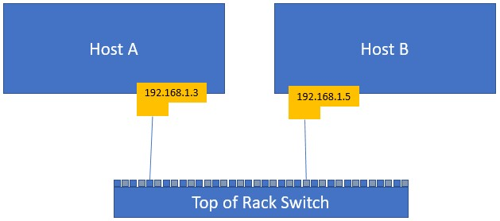
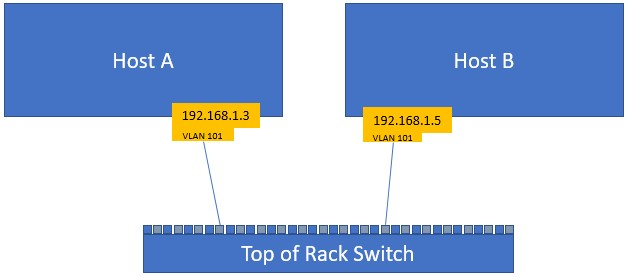
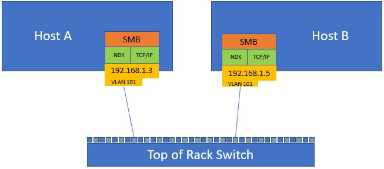
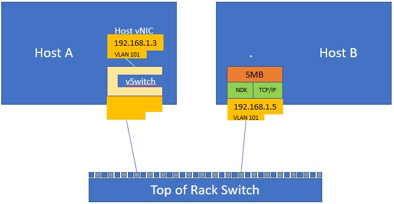
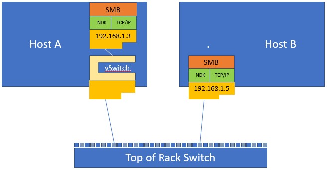

# Converged NIC configuration with a single network adapter

>Applies to: Windows Server (Semi-Annual Channel), Windows Server 2016

In this topic, we provide you with the instructions to configure Converged NIC with a single NIC in your Hyper-V host.

The example configuration in this topic describes two Hyper-V hosts, **Hyper-V Host A**, and **Hyper-V Host B**. Both hosts have a single physical NIC (pNIC) installed, and the NICs are connected to a top of rack \(ToR\) physical switch. In addition, the hosts are located on the same subnet, which is 192.168.1.x/24.




## Step 1. Test the connectivity between source and destination

Ensure that the physical NIC can connect to the destination host. This test demonstrates connectivity by using Layer 3 \(L3\) - or the IP layer - as well as Layer 2 \(L2\).

1. View the network adapter properties.

   ```PowerShell
   Get-NetAdapter
   ```

   _**Results:**_  


   | Name |    InterfaceDescription     | ifIndex | Status |    MacAddress     | LinkSpeed |
   |------|-----------------------------|---------|--------|-------------------|-----------|
   |  M1  | Mellanox ConnectX-3 Pro ... |    4    |   Up   | 7C-FE-90-93-8F-A1 |  40 Gbps  |

   ---

2. View additional adapter properties, including the IP address.

   ```PowerShell
   Get-NetAdapter M1 | fl *
   ```

   _**Results:**_

   ```PowerShell   
    MacAddress   : 7C-FE-90-93-8F-A1
    Status   : Up
    LinkSpeed: 40 Gbps
    MediaType: 802.3
    PhysicalMediaType: 802.3
    AdminStatus  : Up
    MediaConnectionState : Connected
    DriverInformation: Driver Date 2016-08-28 Version 5.25.12665.0 NDIS 6.60
    DriverFileName   : mlx4eth63.sys
    NdisVersion  : 6.60
    ifOperStatus : Up
    ifAlias  : M1
    InterfaceAlias   : M1
    ifIndex  : 4
    ifDesc   : Mellanox ConnectX-3 Pro Ethernet Adapter
    ifName   : ethernet_32773
    DriverVersion: 5.25.12665.0
    LinkLayerAddress : 7C-FE-90-93-8F-A1
    Caption  :
    Description  :
    ElementName  :
    InstanceID   : {39B58B4C-8833-4ED2-A2FD-E105E7146D43}
    CommunicationStatus  :
    DetailedStatus   :
    HealthState  :
    InstallDate  :
    Name : M1
    OperatingStatus  :
    OperationalStatus:
    PrimaryStatus:
    StatusDescriptions   :
    AvailableRequestedStates :
    EnabledDefault   : 2
    EnabledState : 5
    OtherEnabledState:
    RequestedState   : 12
    TimeOfLastStateChange:
    TransitioningToState : 12
    AdditionalAvailability   :
    Availability :
    CreationClassName: MSFT_NetAdapter
   ``` 

## Step 2. Ensure that source and destination can communicate

In this step, we use the **Test-NetConnection** Windows PowerShell command, but if you can use the **ping** command if you prefer. 

>[!TIP]
>If you're certain that your hosts can communicate with each other, you can skip this step.

1. Verify bi-directional communication.

   ```PowerShell
   Test-NetConnection 192.168.1.5
   ```

   _**Results:**_


   |        Parameter         |    Value    |
   |--------------------------|-------------|
   |       ComputerName       | 192.168.1.5 |
   |      RemoteAddress       | 192.168.1.5 |
   |      InterfaceAlias      |     M1      |
   |      SourceAddress       | 192.168.1.3 |
   |      PingSucceeded       |    True     |
   | PingReplyDetails \(RTT\) |    0 ms     |

   ---

   In some cases, you might need to disable Windows Firewall with Advanced Security to successfully perform this test. If you disable the firewall, keep security in mind and ensure that your configuration meets your organization's security requirements.

2. Disable all firewall profiles.

   ```PowerShell
   Set-NetFirewallProfile -All -Enabled False
   ```

3. After disabling the firewall profiles, test the connection again. 

   ```PowerShell
   Test-NetConnection 192.168.1.5
   ```

   _**Results:**_


   |        Parameter         |    Value    |
   |--------------------------|-------------|
   |       ComputerName       | 192.168.1.5 |
   |      RemoteAddress       | 192.168.1.5 |
   |      InterfaceAlias      | Test-40G-1  |
   |      SourceAddress       | 192.168.1.3 |
   |      PingSucceeded       |    False    |
   | PingReplyDetails \(RTT\) |    0 ms     |

   ---


## Step 3. (Optional) Configure the VLAN IDs for NICs installed in your Hyper-V hosts

Many network configurations make use of VLANs, and if you are planning to use VLANs in your network, you must repeat the previous test with VLANs configured. Also, if you are planning to use RoCE for RDMA services you must enable VLANs.

For this step, the NICs are in **ACCESS** mode. However, when you create a Hyper-V Virtual Switch \(vSwitch\) later in this guide, the VLAN properties are applied at the vSwitch port level. 

Because a switch can host multiple VLANs, it is necessary for the Top of Rack \(ToR\) physical switch to have the port that the host is connected to configured in Trunk mode.

>[!NOTE]
>Consult your ToR switch documentation for instructions on how to configure Trunk mode on the switch.

The following image shows two Hyper-V hosts, each with one physical network adapter, and each configured to communicate on VLAN 101.




>[!IMPORTANT]
>Perform this on both the local and destination servers. If the destination server is not configured with the same VLAN ID as the local server, the two cannot communicate.


1. Configure the VLAN ID for NICs installed in your Hyper-V hosts.

   >[!IMPORTANT]
   >Do not run this command if you are connected to the host remotely over this interface, because this results in loss of access to the host.

   ```PowerShell
   Set-NetAdapterAdvancedProperty -Name M1 -RegistryKeyword VlanID -RegistryValue "101"
   Get-NetAdapterAdvancedProperty -Name M1 | Where-Object {$_.RegistryKeyword -eq "VlanID"} 
   ```

   _**Results:**_


   | Name | DisplayName | DisplayValue | RegistryKeyword | RegistryValue |
   |------|-------------|--------------|-----------------|---------------|
   |  M1  |   VLAN ID   |     101      |     VlanID      |     {101}     |

   ---

2. Restart the network adapter to apply the VLAN ID.

   ```PowerShell
   Restart-NetAdapter -Name "M1"
   ```

3. Ensure the Status is **Up**.

   ```PowerShell
   Get-NetAdapter -Name "M1"
   ```

   _**Results:**_


   | Name |          InterfaceDescription           | ifIndex | Status |    MacAddress     | LinkSpeed |
   |------|-----------------------------------------|---------|--------|-------------------|-----------|
   |  M1  | Mellanox ConnectX-3 Pro Ethernet Ada... |    4    |   Up   | 7C-FE-90-93-8F-A1 |  40 Gbps  |

   ---

   >[!IMPORTANT]
   >It might take several seconds for the device to restart and become available on the network. 

4. Verify the connectivity.<p>If connectivity fails, inspect the switch VLAN configuration or destination participation in the same VLAN. 

   ```PowerShell
   Test-NetConnection 192.168.1.5
   ```

## Step 4. Configure Quality of Service \(QoS\)

>[!NOTE]
>You must perform all of the following DCB and QoS configuration steps on all hosts that are intended to communicate with each other.

1. Install Data Center Bridging \(DCB\) on each of your Hyper-V hosts.

   - **Optional** for network configurations that use iWarp for RDMA services.
   - **Required** for network configurations that use RoCE \(any version\) for RDMA services.

   ```PowerShell
   Install-WindowsFeature Data-Center-Bridging
   ```

2. Set the QoS policies for SMB-Direct:

   - **Optional** for network configurations that use iWarp.
   - **Required** for network configurations that use RoCE.

   In the example command below, the value “3” is arbitrary. You can use any value between 1 and 7 as long as you consistently use the same value throughout the configuration of QoS policies.

   ```PowerShell
   New-NetQosPolicy "SMB" -NetDirectPortMatchCondition 445 -PriorityValue8021Action 3
   ```

   _**Results:**_


   |   Parameter    |          Value           |
   |----------------|--------------------------|
   |      Name      |           SMB            |
   |     Owner      | Group Policy \(Machine\) |
   | NetworkProfile |           All            |
   |   Precedence   |           127            |
   |   JobObject    |          &nbsp;          |
   | NetDirectPort  |           445            |
   | PriorityValue  |            3             |

   ---

3. For RoCE deployments, turn on **Priority Flow Control** for SMB traffic, which is not required for iWarp.

   ```PowerShell
   Enable-NetQosFlowControl -priority 3
   Get-NetQosFlowControl
   ```

   _**Results:**_


   | Priority | Enabled | PolicySet | IfIndex | IfAlias |
   |----------|---------|-----------|---------|---------|
   |    0     |  False  |  Global   | &nbsp;  | &nbsp;  |
   |    1     |  False  |  Global   | &nbsp;  | &nbsp;  |
   |    2     |  False  |  Global   | &nbsp;  | &nbsp;  |
   |    3     |  True   |  Global   | &nbsp;  | &nbsp;  |
   |    4     |  False  |  Global   | &nbsp;  | &nbsp;  |
   |    5     |  False  |  Global   | &nbsp;  | &nbsp;  |
   |    6     |  False  |  Global   | &nbsp;  | &nbsp;  |
   |    7     |  False  |  Global   | &nbsp;  | &nbsp;  |

   ---

4. Enable QoS for the local and destination network adapters.

   - **Not needed** for network configurations that use iWarp.
   - **Required** for network configurations that use RoCE.

   ```PowerShell
   Enable-NetAdapterQos -InterfaceAlias "M1"
   Get-NetAdapterQos -Name "M1"
   ```

   _**Results:**_

   **Name**: M1  
   **Enabled**: True  

   _**Capabilities:**_   


   |      Parameter      |   Hardware   |   Current    |
   |---------------------|--------------|--------------|
   |    MacSecBypass     | NotSupported | NotSupported |
   |     DcbxSupport     |     None     |     None     |
   | NumTCs(Max/ETS/PFC) |    8/8/8     |    8/8/8     |

   ---

   _**OperationalTrafficClasses:**_ 


   | TC | TSA | Bandwidth | Priorities |
   |----|-----|-----------|------------|
   | 0  | ETS |    70%    |  0-2,4-7   |
   | 1  | ETS |    30%    |     3      |

   ---

   _**OperationalFlowControl:**_  

   Priority 3 Enabled  

   _**OperationalClassifications:**_  


   | Protocol  | Port/Type | Priority |
   |-----------|-----------|----------|
   |  Default  |  &nbsp;   |    0     |
   | NetDirect |    445    |    3     |

   ---

5. Reserve a percentage of the bandwidth for SMB Direct \(RDMA\).

    In this example, a 30% bandwidth reservation is used. You should select a value that represents what you expect your storage traffic requires. 

   ```PowerShell
   New-NetQosTrafficClass "SMB" -Priority 3 -BandwidthPercentage 30 -Algorithm ETS
   ```

   _**Results:**_


   | Name | Algorithm | Bandwidth(%) | Priority | PolicySet | IfIndex | IfAlias |
   |------|-----------|--------------|----------|-----------|---------|---------|
   | SMB  |    ETS    |      30      |    3     |  Global   | &nbsp;  | &nbsp;  |

   ---                                      

6. View the bandwidth reservation settings.  

   ```PowerShell
   Get-NetQosTrafficClass
   ```

   _**Results:**_


   |   Name    | Algorithm | Bandwidth(%) | Priority | PolicySet | IfIndex | IfAlias |
   |-----------|-----------|--------------|----------|-----------|---------|---------|
   | [Default] |    ETS    |      70      | 0-2,4-7  |  Global   | &nbsp;  | &nbsp;  |
   |    SMB    |    ETS    |      30      |    3     |  Global   | &nbsp;  | &nbsp;  |

   ---

## Step 5. (Optional) Resolve the Mellanox adapter debugger conflict 

By default, when using a Mellanox adapter, the attached debugger blocks NetQos, which is a known issue. Therefore, if you are using an adapter from Mellanox and intend to attach a debugger, use the following command resolve this issue. This step is not required if you do not intend to attach a debugger or if you're not using a Mellanox adapter.

   ```PowerShell    
   Set-ItemProperty HKLM:"\SYSTEM\CurrentControlSet\Services\NDIS\Parameters" AllowFlowControlUnderDebugger -type DWORD -Value 1 –Force
   ``` 

## Step 6. Verify the RDMA configuration (Native host)

You want to ensure that the fabric is configured correctly prior to creating a vSwitch and transitioning to RDMA (Converged NIC). 

The following image shows the current state of the Hyper-V hosts.



1. Verify the RDMA configuration.

   ```PowerShell
   Get-NetAdapterRdma
   ```
   _**Results:**_


   | Name |           InterfaceDescription           | Enabled |
   |------|------------------------------------------|---------|
   |  M1  | Mellanox ConnectX-3 Pro Ethernet Adapter |  True   |

   ---

2. Determine the **ifIndex** value of your target adapter.<p>You use this value in subsequent steps when you run the script you download.

   ```PowerShell
   Get-NetIPConfiguration -InterfaceAlias "M*" | ft InterfaceAlias,InterfaceIndex,IPv4Address
   ```

   _**Results:**_ 


   | InterfaceAlias | InterfaceIndex |  IPv4Address  |
   |----------------|----------------|---------------|
   |       M2       |       14       | {192.168.1.5} |

   ---

3. Download the [DiskSpd.exe utility](https://aka.ms/diskspd) and extract it into C:\TEST\.

4. Download the [Test-RDMA powershell script](https://github.com/Microsoft/SDN/blob/master/Diagnostics/Test-Rdma.ps1) to a test folder on your local drive, for example, C:\TEST\.

5. Run the **Test-Rdma.ps1** PowerShell script to pass the ifIndex value to the script, along with the IP address of the remote adapter on the same VLAN.<p>In this example, the script passes the **ifIndex** value of 14 on the remote network adapter IP address 192.168.1.5.

   ```PowerShell
    C:\TEST\Test-RDMA.PS1 -IfIndex 14 -IsRoCE $true -RemoteIpAddress 192.168.1.5 -PathToDiskspd C:\TEST\Diskspd-v2.0.17\amd64fre\

    VERBOSE: Diskspd.exe found at C:\TEST\Diskspd-v2.0.17\amd64fre\\diskspd.exe
    VERBOSE: The adapter M2 is a physical adapter
    VERBOSE: Underlying adapter is RoCE. Checking if QoS/DCB/PFC is configured on each physical adapter(s)
    VERBOSE: QoS/DCB/PFC configuration is correct.
    VERBOSE: RDMA configuration is correct.
    VERBOSE: Checking if remote IP address, 192.168.1.5, is reachable.
    VERBOSE: Remote IP 192.168.1.5 is reachable.
    VERBOSE: Disabling RDMA on adapters that are not part of this test. RDMA will be enabled on them later.
    VERBOSE: Testing RDMA traffic now for. Traffic will be sent in a parallel job. Job details:
    VERBOSE: 0 RDMA bytes written per second
    VERBOSE: 0 RDMA bytes sent per second
    VERBOSE: 662979201 RDMA bytes written per second
    VERBOSE: 37561021 RDMA bytes sent per second
    VERBOSE: 1023098948 RDMA bytes written per second
    VERBOSE: 8901349 RDMA bytes sent per second
    VERBOSE: Enabling RDMA on adapters that are not part of this test. RDMA was disabled on them prior to sending RDMA traffic.
    VERBOSE: RDMA traffic test SUCCESSFUL: RDMA traffic was sent to 192.168.1.5
   ```

   >[!NOTE]
   >If the RDMA traffic fails, for the RoCE case specifically, consult your ToR Switch configuration for proper PFC/ETS settings that should match the Host settings. Refer to the QoS section in this document for reference values.

## Step 7. Remove the Access VLAN setting

In preparation for creating the Hyper-V switch, you must remove the VLAN settings you installed above.  

1. Remove the ACCESS VLAN setting from the physical NIC to prevent the NIC from auto-tagging the egress traffic with the incorrect VLAN ID.<p>Removing this setting also prevents it from filtering ingress traffic that doesn't match the ACCESS VLAN ID.

   ```PowerShell
   Set-NetAdapterAdvancedProperty -Name M1 -RegistryKeyword VlanID -RegistryValue "0"
   ```    

2. Confirm that the **VlanID setting** shows the VLAN ID value as zero.

   ```PowerShell    
   Get-NetAdapterAdvancedProperty -name m1 | Where-Object {$_.RegistryKeyword -eq 'VlanID'} 
   ```  


## Step 8. Create a Hyper-V vSwitch on your Hyper-V hosts

The following image depicts Hyper-V Host 1 with a vSwitch.




1. Create an external Hyper-V vSwitch in Hyper-V on Hyper-V Host A. <p>In this example, the switch is named VMSTEST. Also, the parameter **AllowManagementOS** creates a host vNIC that inherits the MAC and IP addresses of the physical NIC.

   ```PowerShell
   New-VMSwitch -Name VMSTEST -NetAdapterName "M1" -AllowManagementOS $true
   ```
   _**Results:**_


   |  Name   | SwitchType |      NetAdapterInterfaceDescription      |
   |---------|------------|------------------------------------------|
   | VMSTEST |  External  | Mellanox ConnectX-3 Pro Ethernet Adapter |

   ---

2. View the network adapter properties.

   ```PowerShell
   Get-NetAdapter | ft -AutoSize
   ```

   _**Results:**_


   |         Name          |        InterfaceDescription         | ifIndex | Status |    MacAddress     | LinkSpeed |
   |-----------------------|-------------------------------------|---------|--------|-------------------|-----------|
   | vEthernet \(VMSTEST\) | Hyper-V Virtual Ethernet Adapter #2 |   27    |   Up   | E4-1D-2D-07-40-71 |  40 Gbps  |

   ---

3. Manage the host vNIC in one of two ways. 

   - **NetAdapter** view operates based upon the "vEthernet \(VMSTEST\)" name. Not all network adapter properties display in this view.
   - **VMNetworkAdapter** view drops the "vEthernet" prefix and simply uses the vmswitch name. (Recommended) 

   ```PowerShell
   Get-VMNetworkAdapter –ManagementOS | ft -AutoSize
   ```

   _**Results:**_


   |         Name         | IsManagementOs |        VMName        |  SwitchName  | MacAddress | Status | IPAddresses |
   |----------------------|----------------|----------------------|--------------|------------|--------|-------------|
   | CORP-External-Switch |      True      | CORP-External-Switch | 001B785768AA |    {Ok}    | &nbsp; |             |
   |       VMSTEST        |      True      |       VMSTEST        | E41D2D074071 |    {Ok}    | &nbsp; |             |

   ---

4. Test the connection.

   ```Powershell    
   Test-NetConnection 192.168.1.5
   ```

   _**Results:**_ 

   ```
    ComputerName   : 192.168.1.5
    RemoteAddress  : 192.168.1.5
    InterfaceAlias : vEthernet (CORP-External-Switch)
    SourceAddress  : 192.168.1.3
    PingSucceeded  : True
    PingReplyDetails (RTT) : 0 ms
   ```

5. Assign and view the network adapter VLAN settings.

   ```PowerShell
   Set-VMNetworkAdapterVlan -VMNetworkAdapterName "VMSTEST" -VlanId "101" -Access -ManagementOS
   Get-VMNetworkAdapterVlan -ManagementOS -VMNetworkAdapterName "VMSTEST"
   ```    

   _**Results:**_


   | VMName | VMNetworkAdapterName |  Mode  | VlanList |
   |--------|----------------------|--------|----------|
   | &nbsp; |       VMSTEST        | Access |   101    |

   ---  

6. Test the connection.<p>It may take a few seconds to complete before you can successfully ping the other adapter.  

   ```PowerShell    
   Test-NetConnection 192.168.1.5
   ```

   _**Results:**_

   ```
    ComputerName   : 192.168.1.5
    RemoteAddress  : 192.168.1.5
    InterfaceAlias : vEthernet (VMSTEST)
    SourceAddress  : 192.168.1.3
    PingSucceeded  : True
    PingReplyDetails (RTT) : 0 ms
   ```

## Step 9. Test Hyper-V Virtual Switch RDMA (Mode 2)

The following image depicts the current state of your Hyper-V hosts, including the vSwitch on Hyper-V Host 1.




1. Set the priority tagging on the host vNIC.

   ```PowerShell    
   Set-VMNetworkAdapter -ManagementOS -Name "VMSTEST" -IeeePriorityTag on
   Get-VMNetworkAdapter -ManagementOS -Name "VMSTEST" | fl Name,IeeePriorityTag
   ```  

   _**Results:**_

    Name: VMSTEST 
    IeeePriorityTag : On


2. View the network adapter RDMA information. 

   ```PowerShell
   Get-NetAdapterRdma
   ```   

   _**Results:**_


   |         Name          |        InterfaceDescription         | Enabled |
   |-----------------------|-------------------------------------|---------|
   | vEthernet \(VMSTEST\) | Hyper-V Virtual Ethernet Adapter #2 |  False  |

   ---

   >[!NOTE]
   >If the parameter **Enabled** has the value **False**, it means that RDMA is not enabled.


3. View the network adapter information.

   ```PowerShell
   Get-NetAdapter
   ```

   _**Results:**_   


   |        Name         |        InterfaceDescription         | ifIndex | Status |    MacAddress     | LinkSpeed |
   |---------------------|-------------------------------------|---------|--------|-------------------|-----------|
   | vEthernet (VMSTEST) | Hyper-V Virtual Ethernet Adapter #2 |   27    |   Up   | E4-1D-2D-07-40-71 |  40 Gbps  |

   ---


4. Enable RDMA on the host vNIC.

   ```PowerShell
   Enable-NetAdapterRdma -Name "vEthernet (VMSTEST)"
   Get-NetAdapterRdma -Name "vEthernet (VMSTEST)"
   ```

   _**Results:**_


   |         Name          |        InterfaceDescription         | Enabled |
   |-----------------------|-------------------------------------|---------|
   | vEthernet \(VMSTEST\) | Hyper-V Virtual Ethernet Adapter #2 |  True   |

   ---

   >[!NOTE]
   >If the parameter **Enabled** has the value **True**, it means that RDMA is enabled.

5. Perform RDMA traffic test.

   ```PowerShell    
    C:\TEST\Test-RDMA.PS1 -IfIndex 27 -IsRoCE $true -RemoteIpAddress 192.168.1.5 -PathToDiskspd C:\TEST\Diskspd-v2.0.17\amd64fre\
    VERBOSE: Diskspd.exe found at C:\TEST\Diskspd-v2.0.17\amd64fre\\diskspd.exe
    VERBOSE: The adapter vEthernet (VMSTEST) is a virtual adapter
    VERBOSE: Retrieving vSwitch bound to the virtual adapter
    VERBOSE: Found vSwitch: VMSTEST
    VERBOSE: Found the following physical adapter(s) bound to vSwitch: TEST-40G-1
    VERBOSE: Underlying adapter is RoCE. Checking if QoS/DCB/PFC is configured on each physical adapter(s)
    VERBOSE: QoS/DCB/PFC configuration is correct.
    VERBOSE: RDMA configuration is correct.
    VERBOSE: Checking if remote IP address, 192.168.1.5, is reachable.
    VERBOSE: Remote IP 192.168.1.5 is reachable.
    VERBOSE: Disabling RDMA on adapters that are not part of this test. RDMA will be enabled on them later.
    VERBOSE: Testing RDMA traffic now for. Traffic will be sent in a parallel job. Job details:
    VERBOSE: 0 RDMA bytes written per second
    VERBOSE: 0 RDMA bytes sent per second
    VERBOSE: 0 RDMA bytes written per second
    VERBOSE: 0 RDMA bytes sent per second
    VERBOSE: 0 RDMA bytes written per second
    VERBOSE: 0 RDMA bytes sent per second
    VERBOSE: 0 RDMA bytes written per second
    VERBOSE: 9162492 RDMA bytes sent per second
    VERBOSE: 938797258 RDMA bytes written per second
    VERBOSE: 34621865 RDMA bytes sent per second
    VERBOSE: 933572610 RDMA bytes written per second
    VERBOSE: 35035861 RDMA bytes sent per second
    VERBOSE: Enabling RDMA on adapters that are not part of this test. RDMA was disabled on them prior to sending RDMA traffic.
    VERBOSE: RDMA traffic test SUCCESSFUL: RDMA traffic was sent to 192.168.1.5
   ```

The final line in this output, "RDMA traffic test SUCCESSFUL: RDMA traffic was sent to 192.168.1.5," shows that you have successfully configured Converged NIC on your adapter.

## Related topics
- [Converged NIC Teamed NIC Configuration](cnic-datacenter.md)
- [Physical Switch Configuration for Converged NIC](cnic-app-switch-config.md)
- [Troubleshooting Converged NIC Configurations](cnic-app-troubleshoot.md)
