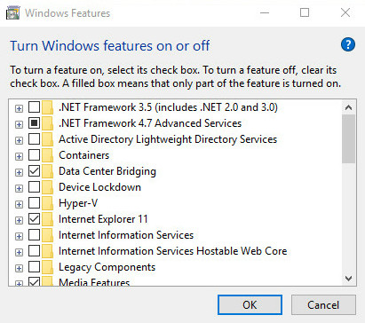

# Install Data Center Bridging \(DCB\) in Windows Server 2016 or Windows 10

>Applies to: Windows Server (Semi-Annual Channel), Windows Server 2016

You can use this topic to learn how to install DCB in Windows Server 2016 or Windows 10.

## Prerequisites for using DCB

Following are the prerequisites for configuring and managing DCB.

### Install a compatible operating system

You can use the DCB commands from this guide in the following operating systems.

- Windows Server (Semi-Annual Channel)
- Windows Server 2016
- Windows 10 \(all versions\)

The following operating systems include previous versions of DCB that are not compatible with the commands that are used in DCB documentation for Windows Server 2016 and Windows 10.

- Windows Server 2012 R2
- Windows Server 2012

###  Hardware requirements

Following is a list of hardware requirements for DCB.

- DCB\-capable Ethernet network adapter\(s\) must be installed in computers that are providing Windows Server 2016 DCB.
- DCB\-capable hardware switches must be deployed on your network.


## Install DCB in Windows Server 2016

You can use the following sections to install DCB on a computer running Windows Server 2016.

**Administrative Credentials**

To perform these procedures, you must be a member of **Administrators**.

### Install DCB Using Windows PowerShell

You can use the following procedure to install DCB by using Windows PowerShell.

1. On a computer running Windows Server 2016, click **Start**, then right-click the Windows PowerShell icon. A menu appears. In the menu, click **More**, and then click **Run as administrator**. If prompted, type the credentials for an account that has Administrator privileges on the computer. Windows PowerShell opens with Administrator privileges.
2. Type the following command, and then press ENTER.

````
	Install-WindowsFeature -Name Data-Center-Bridging -IncludeManagementTools
````

### Install DCB Using Server Manager

You can use the following procedure to install DCB by using Server Manager.

>[!NOTE]
>After you perform the first step in this procedure, the **Before You Begin** page of the Add Roles and Features Wizard is not displayed if you have previously selected **Skip this page by default** when the Add Roles and Features Wizard was run. If the **Before You Begin** page is not displayed, skip from step 1 to step 3.

1. On DC1, in Server Manager, click **Manage**, and then click **Add Roles and Features**. The Add Roles and Features Wizard opens.
2. In **Before You Begin**, click **Next**.
3. In **Select Installation Type**, ensure that **Role-Based or feature-based installation** is selected, and then click **Next**.
4. In **Select destination server**, ensure that **Select a server from the server pool** is selected. In **Server Pool**, ensure that the local computer is selected. Click **Next**.
5. In **Select server roles**, click **Next**.
6. In **Select features**, in **Features**, click **Data Center Bridging**. A dialog box opens to ask if you want to add DCB required features. Click **Add Features**.
7. In **Select features**, click **Next**. 
8. 7.In **Confirm installation selections**, click **Install**. The **Installation progress** page displays status during the installation process. After the message appears stating that installation succeeded, click **Close**.

### Configure the kernel debugger to allow QoS \(Optional\)

 By default, kernel debuggers block NetQos. Regardless of the method that you used to install DCB, if you have a kernel debugger installed in the computer, you must configure the debugger to allow QoS to be enabled and configured by running the following command.

````
Set-ItemProperty HKLM:"\SYSTEM\CurrentControlSet\Services\NDIS\Parameters" AllowFlowControlUnderDebugger -type DWORD -Value 1 -Force
````

## Install DCB in Windows 10

You can perform the following procedure on a Windows 10 computer.

To perform this procedure, you must be a member of **Administrators**.

### Install DCB

1. Click **Start**, then scroll down to and click **Windows System**.
2. Click **Control Panel**. The **Control Panel** dialog box opens.
3. In **Control Panel**, click **View by**, and then click either **Large icons** or **Small icons**.
4. Click **Programs and Features**. The Programs and Features dialog box opens.
5. In **Programs and Features**, in the left pane, click **Turn Windows features on or off**. The **Windows Features** dialog box opens.
6. In **Windows Features**, click **Data Center Bridging**, and then click **OK**.




