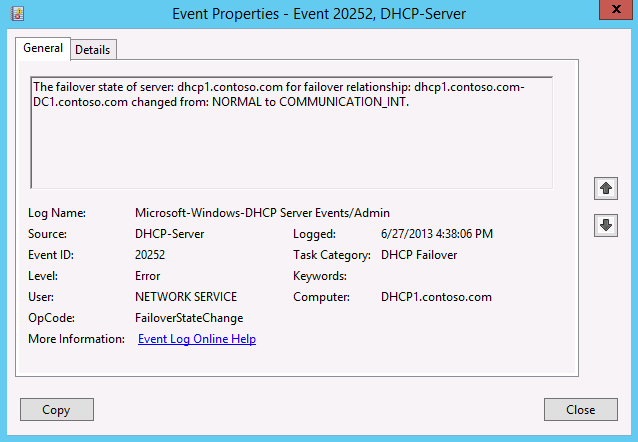
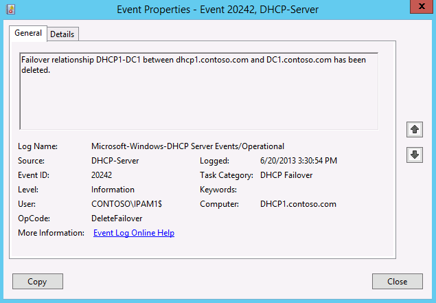

# DHCP failover events in Windows Server

Windows Server has event logging and performance counters to support monitoring and troubleshooting for DHCP failover. DHCP failover-related events are also logged to the DHCP Audit Log.

In DHCP failover, the client messages which are broadcast are received by both the DHCP failover servers. However, only one server responds to the client messages. In load balance mode, the servers hash the MAC address of a DHCP client to establish which of them must respond. In hot standby mode, only the active server responds. In both cases, the DHCP server which doesn't respond to the client logs this message in the audit log.

## DHCP server event channels for DHCP failover

The following DHCP Server event channels are available using Event Viewer with the path: **Applications and Services Logs\\Microsoft\\Windows\\DHCP-Server**. There are two event channels where you can view DHCP failover events.

- **Admin** channel (Microsoft-Windows-DHCP Server Events/Admin): This channel provides DHCP server administrative event logging. For example, events are logged to this channel if a DHCP failover state of a server changes.

- **Operational** channel (Microsoft-Windows-DHCP Server Events/Operational): This channel provides DHCP configuration auditing. For example, an event is logged if a scope on the DHCP server is added or removed from a DHCP failover relationship.

## Administrative event logging

Event Tracing for Windows (ETW) events are logged for state transition of the local server, or its partner server. These events are logged to the DHCP server **Admin** channel. The following data is provided as part of each state change event.

- The previous state of the server.

- The current state of the server.

- The failover relationship name.

- The server host name or IP address.

In addition to logging its own state change, the server logs changes in the state of its failover partner server. This information is communicated by state messages from the failover partner. The following table lists the values populated for the various fields in the event log.

| Event Field   | Value                                     |
|---------------|-------------------------------------------|
| Event ID      | 20252 (example ID)                                      |
| Date and Time | Time of the state change                                   |
| Computer      | DHCP server host name or IP address                           |
| User          | NETWORK SERVICE                                                |
| Description   | The failover state of server: `<host name>` for failover relationship: `<relationship name>` changed from: `<previous state>` to `<current state>`. The server IP address or host name corresponds to the server that changed state. This can be the host name or IP address of the local DHCP server or the failover partner. If the previous state of the server isn't known, the following description is shown for the event: The failover state of server: `<host name>` for failover relationship changed to `<current state>`. |
| OpCode        | FailoverStateChange                               |
| Task Category | DHCP Failover                                                     |
| Level         | - Error: If transitioning out of the NORMAL state or when entering into the PARTNER DOWN state.           - Information: If transitioning into the NORMAL state.   - Warning: For transitions between other states. |

See the following example event.

The following type of event data is logged when a server detects that it's out of time synchronization with its partner server.

| Event Field   | Value            |
|---------------|-----------------------------------------------------------|
| Event ID      | 20253                       |
| Date and Time | Time of detection of time being out of sync with partner server     |
| Computer      | DHCP server host name                                         |
| User          | NETWORK SERVICE                                   |
| Description   | The server detected that it's out of time synchronization with partner server: `<host name>` for failover relationship: `<relationship name>`. The time is out of sync by: `<# of seconds>` seconds. |
| OpCode        | TimeOutOfSync                         |
| Task Category | DHCP Failover                                     |
| Level         | Error                                                         |

An event is also logged when a connection is established and when a connection is lost between DHCP failover partners.

| Level       | Opcode       | Task Category   | Description                                                                 |
|-------------|--------------|-----------------|-----------------------------------------------------------------------------|
| Error       | CommDown     | DHCP Failover   | Server lost contact with failover partner server: `<host name>` for relationship: `<relationship name>`. |
| Information | CommUp       | DHCP Failover   | Server established contact with failover partner server: `<host name>` for relationship: `<relationship name>`. |

## Operational event logging

The following information-level configuration audit events are logged to the DHCP server **Operational** channel.

| Event Type                                | OpCode       | Description |
|-------------------|----------------------|--------------------------------------------------------|
| Creation of Failover Relationship         | CreateFailover       | A failover relationship is created between servers: `<host name>` and `<host name>` with the following configuration parameters: Name: `<value>` Mode: `<mode>`, Maximum Client Lead Time: `<value>` seconds, Load Balance percentage on this server/Reserve Address percentage on standby server: `<value>`, Auto state switchover interval: `<value>` seconds Standby server: `<host name>` |
| Deletion of Failover Relationship         | DeleteFailover       | Failover relationship `<relationship name>` between `<host name>` and `<host name>` is deleted. |
| Addition of a scope to an existing failover relationship | AddFailoverScope     | Scope `<scope ID>` is added to the failover relationship `<relationship name>` with server `<host name>`                                                                           |
| Removal of a scope from an existing failover relationship | RemoveFailoverScope  | Scope `<scope ID>` is removed from the failover relationship `<relationship name>` with server `<host name>`                                                                       |
| Change MCLT                               | ChangeFailoverConfig | The failover configuration parameter MCLT for failover relationship `<relationship name>` with server `<host name>` is changed from `<old value>` seconds to `<new value>` seconds |
| Change Auto state switchover interval     | ChangeFailoverConfig | The failover configuration parameter Auto State switchover interval for failover relationship `<relationship name>` with server `<host name>` is changed from `<old value>` seconds to `<new value>` seconds |
| Change Reserve Address percentage         | ChangeFailoverConfig | The failover configuration parameter Reserve Address Percentage on standby server for failover relationship `<relationship name>` with server `<host name>` is changed from `<old value>` to `<new value>` |
| Change Mode of failover relationship      | ChangeFailoverConfig | The failover configuration parameter Mode for failover relationship `<relationship name>` with server `<host name>` is changed from `<old value>` to `<new value>`                 |
| Change Load Balance percentage            | ChangeFailoverConfig | The failover configuration parameter Load Balance percentage for failover relationship `<relationship name>` with server `<host name>` is changed from `<old value>` to `<new value>` on this server |

See the following example event.

## Performance counters

Windows Server has the following DHCP failover-related performance counters to the DHCP server counters:

- Binding Updates sent per minute

- Binding Updates received per minute

- Binding Acks received per minute

- Binding Acks sent per minute

- Number of pending outbound binding updates on this server

- Number of transitions into COMMUNICATION INTERRUPTED state

- Number of transitions into PARTNER DOWN state

- Number of transitions into RECOVER state

- Number of Binding Update queues running at 90% of the maximum queue size

- Number of Binding Updates dropped

## Related content

- [DHCP failover overview](/windows-server/networking/technologies/dhcp/dhcp-failover)

- [DHCP server events](/windows-server/networking/technologies/dhcp/dhcp-server-events)

