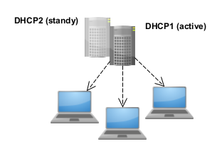
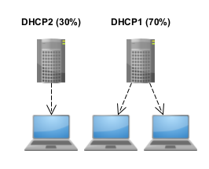

# DHCP failover overview

DHCP failover allows two Microsoft DHCP servers to share availability information, ensuring high availability by replicating IP address leases and settings between a primary server and its failover partner.

All scope information is shared between the two DHCP servers, including active leases. This enables either DHCP server to assume responsibility for DHCP clients if the other server becomes unavailable.

This article provides an overview of DHCP failover.

## Introduction to DHCP failover

With DHCP failover, DHCPv4 scopes are replicated from a primary DHCP server to a partner DHCP server, enabling redundancy and load balancing of DHCP services. DHCP servers that share a failover-enabled DHCP scope are called **failover partners**. Microsoft’s implementation of DHCP failover is based on the [Internet Engineering Task Force (IETF) DHCP Failover Protocol draft](https://datatracker.ietf.org/doc/html/draft-ietf-dhc-failover-12).

When two DHCP servers are configured for failover, they share scope information, including all active leases. This enables both DHCP servers to provide leases to the same subnet for load balancing or redundancy purposes. Scope settings are replicated when you first configure DHCP failover, and can be replicated again later if configuration changes are made.

The following figure illustrates how components and settings for a failover-enabled DHCP scope are shared between two DHCP servers.

The scopes and settings used with DHCP servers that are configured for DHCP failover are shared using a new object called the **DHCP failover relationship**. Several configuration options are available with DHCP failover. You can configure failover on all scopes that exist on a DHCP server, or only on some scopes. You can also easily use the same DHCP failover settings for many scopes by adding them to the same failover relationship. A failover relationship is always between only two DHCP servers. However, a server can have many failover relationships, and each failover relationship can be with a different DHCP server.

> [!IMPORTANT]
> If changes are made to a failover-enabled scope, you must manually replicate these changes to the partner server in order to synchronize scopes on both DHCP servers. Replication copies scope settings from the DHCP server where replication is initiated to the partner server, overwriting settings on the partner server. Therefore, it's important to always initiate replication from the server that has DHCP scope settings you wish to use.

## DHCP failover specifications

The following specifications apply to DHCP failover.

DHCP scopes:

- You can't configure DHCP failover on a DHCP scope to include more than two DHCP servers.

- DHCP failover supports DHCPv4 scopes only. DHCPv6 scopes can't be failover-enabled.

- If parameters of a failover-enabled scope are modified, these settings must be manually replicated to the partner DHCP server.

- Replication of scope settings can be initiated from either DHCP server to its failover partner server.

DHCP client/server:

- DHCP clients must be able to communicate with both DHCP failover partner servers, either directly or using a DHCP relay.

- When DHCP failover is enabled, a DHCP client lease can be renewed by a different server than the one that originally issued it.

- Two separate, synchronized client lease databases are maintained independently by each DHCP failover partner server.

- DHCP servers configured as failover partners can be located on different subnets, but this isn't required.

- Clustered DHCP is supported in conjunction with DHCP failover. For purposes of failover, a DHCP cluster is considered a single DHCP server.

- DHCP failover can be configured, and settings can be modified without the need to pause, stop, or restart the DHCP Server service.

DHCP failover partners:

- DHCP failover partners must both be running at least Windows Server 2016.

- Two DHCP servers configured as failover partners attempt to maintain a persistent TCP/IP connection.

- DHCP servers configured as failover partners are both aware of the status of the DHCP service on the other server, and are informed of any change in that status with minimal delay.

- If two DHCP servers configured as failover partners are unable to communicate, precautions are taken to avoid the same IP address lease being issued to two different DHCP clients.

- If a DHCP server becomes unavailable before it's able to successfully synchronize all DHCP client information with its failover partner, precautions are taken to ensure DHCP lease continuity for DHCP clients.

- Two separate, synchronized client lease databases are maintained independently by each DHCP failover partner server.

> [!IMPORTANT]
> When replicating settings between DHCP failover partner servers that have different operating system versions, always modify settings and initiate replication from the DHCP server with the more recent operating system version. This ensures that settings are recognized by both failover partners and replicated consistently.

You can configure DHCP failover can be configured using Server Manager or Windows PowerShell. For information about using Windows PowerShell, see [DHCP Server Cmdlets in Windows PowerShell](/powershell/module/dhcpserver/). For instructions to configure DHCP in Server Manager, see this [step-by-step guide](/previous-versions/windows/it-pro/windows-server-2012-R2-and-2012/hh831385(v=ws.11)).

## DHCP failover and IPv6

DHCP failover isn't supported for Internet Protocol version 6 (IPv6) scopes. Network adapters using IPv6 typically determine their own IPv6 address using stateless IP autoconfiguration. In this mode, the DHCP server delivers only the DHCP option configuration, and the server doesnt maintain any lease state information. A high availability deployment for stateless DHCPv6 is possible by setting up two servers with identical option configuration. Even in a stateful DHCPv6 deployment, the scopes don't run under high address utilization, which makes split scope a viable solution for high availability.

## DHCP failover modes

Two DHCP failover modes are available to use when you create a DHCP failover relationship:

- **Hot standby mode**: This mode provides redundancy for DHCP services.

- **Load balance mode**: This mode allocates DHCP client leases across two servers.

You can switch between hot standby and load balance mode if desired, but you can only use one mode at a time with a single DHCP scope. You can also use both modes on the same DHCP server if you configure multiple failover relationships. Customize your deployment based on the physical architecture of your network.

### Hot standby mode

In hot standby mode, two servers operate in a failover relationship where an active server is responsible for leasing IP addresses and configuration information to all clients in a scope or subnet. The partner server assumes a standby role, with responsibility to issue leases to DHCP clients only if the active server becomes unavailable. Hot standby mode is ideal for scenarios where the failover partner is only intended to be used temporarily when the active server is unavailable.

A server is active or standby in the context of a failover relationship. For instance, a server that has the role of active for a given relationship could be a standby server for another relationship. By default, the server that is used to create the failover relationship is the active server, but this isn't required.

When you choose hot standby, you must also configure the percentage of IP addresses on the active server that are reserved for use on the standby server if the active server doesn't respond. By default, this reserve percentage is 5%.

The reserve percentage is used for new DHCP leases. If a DHCP client attempts to renew a DHCP lease with the standby server that is unable to contact the active server, the same IP address that was previously assigned to the DHCP client is renewed. In this situation, a temporary lease is granted for the maximum client lead time (MCLT) duration, not the full scope lease time.

If the standby server issues all its available reserve percentage leases to new DHCP clients before the MCLT expires, it refuses to issue new DHCP leases, and continue to renew existing leases. After the MCLT expires, the standby server is permitted to use the entire available IP address pool for new DHCP leases. If the server is still in communications interrupted state, it doesn't use the entire available IP address pool for new DHCP leases.

In hot standby mode, a central office or data center server typically acts as a standby backup server. This server provides redundancy for a local DHCP server at a remote site, which directly serves the DHCP clients. In such deployments, the standby server should only service clients if the local DHCP server becomes unavailable.

### Load balance mode

Load balance mode is the default mode of deployment. In this mode, two DHCP servers simultaneously serve IP addresses and options to clients on a given subnet. DHCP client requests are load balanced and shared between the two DHCP servers. The default load balancing ratio between the two servers is 50:50, but this can be customized to any ratio from 0% to 100%.

The load-balancing mechanism is defined in [RFC 3074](https://www.rfc-editor.org/rfc/rfc3074), in which a hash is computed from the MAC address contained in each DHCP client request. A range of hash values (also called the hash bucket) is assigned to each DHCP server based on the load balancing percentages that are configured. Servers determine if they're designated to respond to the client based on their assigned hash bucket.

In load balancing mode, when a DHCP server loses contact with its failover partner, it begins granting leases to all DHCP clients. If it receives a lease renewal request from a DHCP client that is assigned to its failover partner, it temporarily renews the same IP address lease for the duration of the MCLT. If it receives a request from a client that wasn't previously assigned a lease, it grants a new lease from its free IP address pool until this is exhausted, and then begin using the free IP address pool of its failover partner. If the DHCP server enters a partner down state, it waits for the MCLT duration, and then assumes responsibility for 100% of the IP address pool.

The load balance mode of operation is best suited to deployments where both servers in a failover relationship are located at the same physical site. Both servers respond to DHCP client requests based on the load distribution ratio configured by the administrator.

## DHCP failover and Windows Failover Clustering

DHCP failover is supported with clustered DHCP in the following configurations:

- A single DHCP server can have a failover relationship with a DHCP failover cluster.

- A DHCP failover cluster can have a failover relationship with another DHCP failover cluster.

In both cases, you must configure DHCP failover to use the name or IP address of the cluster, not the name or IP address of a cluster node. If an individual cluster node is configured as the failover partner, the primary server enters a communications interrupted state if the DHCP Server service moves to a different node in the cluster.

> [!IMPORTANT]
> If you use a shared secret, you must manually replicate the shared secret to all cluster nodes. You can replicate the shared secret on the active cluster node using the PowerShell cmdlet [Set-DhcpServerv4Failover](/powershell/module/dhcpserver/set-dhcpserverv4failover).

## DHCP failover and DNS dynamic updates

If DHCP servers are configured to perform DNS dynamic updates on behalf of the client computer, both DHCP servers in a DHCP failover relationship must use the same DNS credentials to update DNS records. If the failover partner attempts to use different credentials to update DNS resource records, this update fails.

The following steps describe how DNS dynamic updates might fail when a client computer uses a different DHCP server:

1. A Windows DHCP server performs a dynamic update on behalf of a DHCP client.

1. The DHCP server creates the client’s DNS name and becomes the owner of that name.

1. Now only the DHCP server itself can update the DNS records for the client’s name.

1. The original server fails and a second backup DHCP server comes online; now the second server can't update the client name because it isn't the name’s owner.

Also see [DNS Record Ownership and the DnsUpdateProxy Group](/previous-versions/windows/it-pro/windows-server-2008-R2-and-2008/dd334715(v=ws.10)) for a discussion of this scenario.

## Deployment considerations

Before you deploy DHCP failover, consider the following:

### Time synchronization

For DHCP failover to function correctly, time must be kept synchronized between the two servers in a failover relationship. Time synchronization can be maintained by deployment of the Network Time Protocol (NTP) or any other alternative mechanism. When the failover configuration wizard is run, it will compare the current time on the servers being configured for failover. If the time difference between the servers is greater than one minute, the failover setup process will halt with a critical error and request that time on the servers be synchronized.

Each failover protocol message includes a time field that is populated with the Coordinated Universal Time (UTC) when the source server transmitted the message. For each message, the receiving server will perform a check of the time difference between the time stamp field in the packet and the time at the receiving server. If this time difference is found to be greater than one minute, the receiving server will log a critical event indicating that the two servers are not time synchronized.

### Policy based assignment

Windows Server includes a policy based IP address assignment feature, which allows a Windows DHCP administrator to group the DHCP clients by a specific attribute of the client, such as vendor class, user class, client identifier, or MAC address. Administrators group the clients based on these attributes, and can assign parameters such as IP address, default gateway, DNS server, and other DHCP options to a specific grouping of clients. This allows the administrator to exercise greater control on the configuration parameters delivered to end hosts. This feature introduces the concept of multiple IP address ranges within a single scope. To accommodate this, DHCP failover address distribution in load sharing mode is done on a per IP address range basis.

### Windows Firewall

DHCP failover uses TCP port 647 to listen for failover messages between two failover partner servers. For this traffic to be allowed by the Windows Firewall, the following inbound and outbound firewall rules are added then you install the DHCP Server role:

- Microsoft-Windows-DHCP-Failover-TCP-In

- Microsoft-Windows-DHCP-Failover-TCP-Out

### Relay agents

Initial DHCPDISCOVER messages are broadcast by DHCP clients on the subnet to which they belong. Since routers typically do not forward broadcast traffic, a mechanism is required to enable DHCP clients to communicate with DHCP servers if the DHCP server isn't located on the same subnet. Relay agents (typically provided on a router) are designed to perform this function, relaying DHCP, and BOOTP messages between clients and servers on different subnets. Relay agents are commonly configured with on a network device, or you can configure DHCP relay on a Windows Server with the Remote Access role installed. For more information, see [Deploy the DHCP Relay Agent](/windows-server/networking/technologies/dhcp/dhcp-deploy-relay-agent).

If your DHCP relay is configured on a network device, consult your vendor’s documentation for details. The **helper-address** command is commonly used to configure DHCP relay on a network device, for example: `ip helper-address 10.0.1.1`.

When you deploy DHCP failover, a single DHCP relay address might not be sufficient, since DHCP clients must always be able to communicate with both the primary DHCP server and the failover partner server. If both DHCP servers are located on a different subnet than DHCP clients, this requires at least two DHCP relay agents. For example: `ip helper-address 10.0.1.1`, `ip helper-address 10.0.1.2`.

In this example, both DHCP servers are on the same subnet (10.0.1.0/24). The primary DHCP server’s IP address is 10.0.1.1 and 10.0.1.2 is the IP address for the failover partner server. If both DHCP servers are located on the same subnet, you can also configure the subnet broadcast address (ex: 10.0.1.255) as a single DHCP relay. The use of a subnet broadcast address as a single DHCP relay isn't possible if DHCP servers are located on separate subnets.

### Duplicate relay agents

Virtual Router Redundancy Protocol (VRRP) is another failover protocol used to enable redundancy on network devices. An example of VRRP includes Hot Standby Router Protocol (HSRP), which is a Cisco proprietary VRRP. If VRRP/HSRP is configured on a network device that is also configured with one or more DHCP relays, this can cause duplicate DHCP relay messages to be sent to the same DHCP failover server.

If a single DHCP server configured for DHCP failover receives duplicate lease requests, this can cause inconsistent client lease durations, and clients might lease IP addresses that belong to other clients. Consult your vendor documentation to determine if the router redundancy protocol requires a specific configuration to support DHCP relay. For example, Cisco provides DHCP relay support for the HSRP protocol using virtual router groups.

