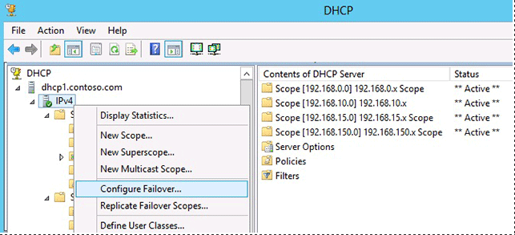
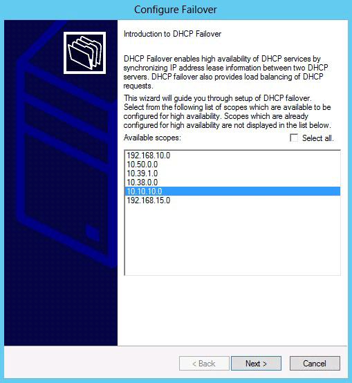
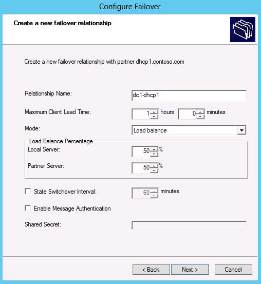
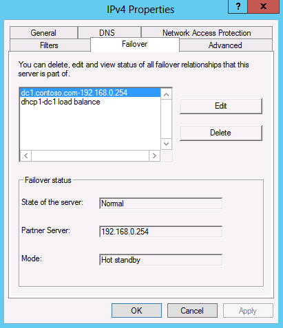
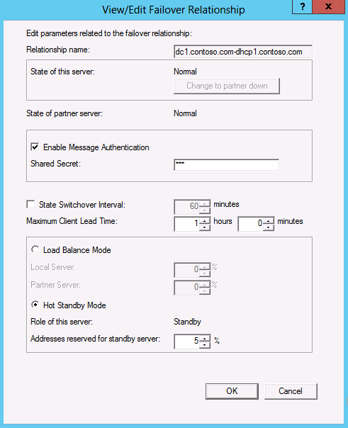
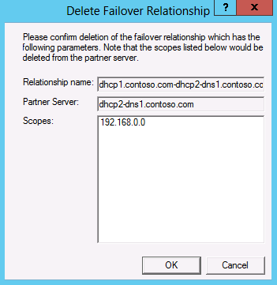

# Manage DHCP failover relationships in Windows Server

Failover relationships are settings used by two DHCP servers to share one or more failover-enabled DHCP scopes.

In this article, follow the steps to create, view, edit, and delete DHCP failover relationships in Windows Server.

## Prerequisites

- At least Windows Server 2012

- The DHCP server role is installed

- Understand how failover relationships work. For more information about DHCP failover relationships, see [DHCP failover overview](/windows-server/networking/technologies/dhcp/dhcp-failover).

- Two network-connected DHCP servers that can communicate with each other

- At least one IPv4 DHCP scope is configured on the primary DHCP server.

## Configure failover relationships

To create a failover relationship on a DHCP server, you can use PowerShell, or you can use the DHCP console. Follow the steps for the method of your choice.

Some notes to consider about creating a failover relationship:

- The default DHCP failover mode is load balance with 50% of leases assigned by the local server and 50% assigned by the partner server.
- Authentication is enabled by default, but this setting isn't required. If authentication is enabled, you must also provide a shared secret.
- The scope ID provided must correspond to a scope configured on the local server that isn't already failover-enabled, and doesn't already exist on the partner server.
- If DHCP failover is being configured remotely, the local server refers to the server specified on the command line or added to the management console.
- You can't enable DHCP failover on a DHCP scope if the scope already exists on both DHCP servers in a failover relationship, as might occur in a split scope configuration.
- If a DHCP scope exists on the partner DHCP server, it must be deleted prior to configuring DHCP failover.

### [PowerShell](#tab/powershell)

To configure a failover relationship using PowerShell, complete the following steps:

1. On the Windows desktop, select the Start button and type any part of the name **Windows PowerShell**.

1. Right-click Windows PowerShell and select **Run as Administrator**.

1. Use the PowerShell cmdlet [Add-DhcpServerv4Failover](/powershell/module/dhcpserver/add-dhcpserverv4failover) to add an IPv4 failover relationship on the DHCP server service. Run the following command to create a **load balance failover** relationship:

```powershell
Add-DhcpServerv4Failover -ComputerName "dhcp1.contoso.com" -Name "dc1-dhcp1" -PartnerServer "dhcp2.contoso.com" -ScopeId 10.10.10.0,10.20.20.0 -SharedSecret "sEcReT"
```

This command creates a **load balance failover relationship** between **dhcp1.contoso.com** and **dhcp2.contoso.com**. The failover has scopes 10.10.10.0, and 10.20.20.0 present on **dhcp1.contoso.com**. These scopes are created on the partner DHCP server service that runs on the computer named **dhcp2.contoso.com** as part of the failover relationship creation. Message authentication is enabled for the server-to-server message exchange with the specified shared secret.

To create a **hot standby failover** relationship, use the command:

```powershell
Add-DhcpServerv4Failover -ComputerName "dhcp1.contoso.com" -Name "dc1-dhcp1" -PartnerServer "dhcp2.contoso.com" -ServerRole Standby -ScopeId 10.10.10.0,10.20.20.0
```

**dhcpserver.contoso.com** is the standby DHCP server service, and **dhcpserver2.contoso.com** is the active DHCP server service in the failover relationship.

### [DHCP console](#tab/dhcp-console)

To configure a failover relationship using the DHCP console, complete the following steps:

1. Open Server Manager if it's not already open.

1. Select **Tools**, then **DHCP**.

1. In the DHCP console, select your server, and expand it so you see IPv4.

1. Right-click on IPv4, and select **Configure Failover...**.

    

1. The Configure Failover wizard opens. A list of available DHCP scopes displays. You can choose multiple scopes if you like. In this example, a single DHCP scope is configured using a new failover relationship.

    

1. Select **Next**, and then on the Specify the partner server to use for failover page, for **Partner Server** type the name, or IP address of the failover partner DHCP server. You can also use the drop-down list to choose from a list of authorized DHCP servers in the domain.

1. To reuse an existing DHCP failover relationship, select **Next**. Alternatively, to create a new DHCP failover relationship, clear the **Reuse existing failover relationships…** checkbox, and then select **Next**.

1. On the Create a new failover relationship page, type a name for the failover relationship next to **Relationship Name**, or accept the default name.

    For **Mode**, select either **Load balance**, or **Hot standby**. Complete the configuration details for your selected mode.

    By default, the Enable Message Authentication checkbox is enabled. Clear this checkbox if you don't wish to use a shared secret. Otherwise, type a shared secret next to Shared Secret. By default, load balancing is set to 50% for both the local server and the partner server.

    

1. Select **Next**, select **Finish**, verify that the status of all the tasks are successful, and then select **Close**.

In the previous examples, a new failover relationship named **dc1-dhcp1** is established between **dhcp1.contoso.com** and **dhcp2.contoso.com**. To use a 50-50 load balancing percentage for the DHCP scope with ID 192.168.10.0.

> [!IMPORTANT]
> A single DHCP server can support up to 31 failover relationships. To avoid exceeding this limit, reuse existing failover relationships when possible and delete failover relationships that aren't in use.
> Failover relationships can exist with no association to a DHCP scope. This occurs if you deconfigure failover on the last DHCP scope associated to a failover relationship, and don't also delete the failover relationship. You might do this if you plan to reuse the failover relationship later.

---

## View failover relationships

You can view failover relationships on a DHCP server using either Windows PowerShell, or the DHCP console.

### [PowerShell](#tab/powershell)

To view failover relationships on a DHCP server, you can use the cmdlet [Get-DhcpServerv4Failover](/powershell/module/dhcpserver/get-dhcpserverv4failover) in an elevated Windows PowerShell prompt.

1. On the Windows desktop, select the Start button and type any part of the name **Windows PowerShell**.

1. Right-click Windows PowerShell and select **Run as Administrator**.

1. Run the following command:

```powershell
Get-DhcpServerv4Failover
```

```output
    Name                : dc1.contoso.com-192.168.0.254
    PartnerServer       : 192.168.0.254
    Mode                : HotStandby
    LoadBalancePercent  :
    ServerRole          : Active
    ReservePercent      : 5
    MaxClientLeadTime   : 01:00:00
    StateSwitchInterval :
    State               : Normal
    ScopeId             : {192.168.50.0, 192.168.0.0}
    AutoStateTransition : False
    EnableAuth          : False
    
    Name                : dhcp1-dc1 load balance
    PartnerServer       : dhcp1.contoso.com
    Mode                : LoadBalance
    LoadBalancePercent  : 50
    ServerRole          :
    ReservePercent      :
    MaxClientLeadTime   : 01:00:00
    StateSwitchInterval :
    State               : Normal
    ScopeId             :
    AutoStateTransition : False
    EnableAuth          : False
```

An advantage to using Windows PowerShell to view failover relationships is that you can view more properties of the DHCP failover relationship than you can see in the DHCP console.

### [DHCP console](#tab/dhcp-console)

To view failover relationships using the DHCP console, complete the following steps:

1. Open Server Manager if it's not already open.

1. Select **Tools**, then **DHCP**.

1. In the DHCP console, select your server, and expand it so you see IPv4.

1. Right-click on the scope name, and then select **Properties**, and then select the **Failover** tab.

    

---

## Edit failover relationships

To edit failover relationships on a DHCP server, you can either use PowerShell or the DHCP console.

### [PowerShell](#tab/powershell)

To edit failover relationships on a DHCP server, you can use the cmdlet [Set-DhcpServerv4Failover](/powershell/module/dhcpserver/set-dhcpserverv4failover).

1. On the Windows desktop, select the Start button and type any part of the name **Windows PowerShell**.

1. Right-click Windows PowerShell and select **Run as Administrator**.

1. Run the following command:

```powershell
Set-DhcpServerv4Failover –Name "dhcp1-dc1" –LoadBalancePercent 70
```

This command changes the failover relationship **dhcp1-dc1** to take 70% of the client requests served by the DHCP server.

### [DHCP console](#tab/dhcp-console)

To edit failover relationships using the DHCP console, complete the following steps:

1. Open Server Manager if it's not already open.

1. Select **Tools**, then **DHCP**.

1. In the DHCP console, select your server, and expand it so you see IPv4.

1. Select **Properties**, and then select the **Failover** tab.

1. Choose a failover relationship, and then select **Edit**. A window opens where you can edit details about the selected failover relationship.



---

## Delete failover relationships

To delete a failover relationship on a DHCP server, you can either use PowerShell or the DHCP console.

### [PowerShell](#tab/powershell)

To edit failover relationships on a DHCP server, you can use the cmdlet [Remove-DhcpServerv4Failover](/powershell/module/dhcpserver/remove-dhcpserverv4failover).

1. On the Windows desktop, select the Start button and type any part of the name **Windows PowerShell**.

1. Right-click Windows PowerShell and select **Run as Administrator**.

1. Run the following command:

```powershell
Remove-DhcpServerv4Failover –Name dhcp1.contoso.com-dhcp2-dns1.contoso.com
```

### [DHCP console](#tab/dhcp-console)

To delete a failover relationship using the DHCP console, complete the following steps:

1. Open Server Manager if it's not already open.

1. Select **Tools**, then **DHCP**.

1. In the DHCP console, select your server, and expand it so you see IPv4.

1. Select **Properties**, and then select the **Failover** tab.

1. Highlight the relationship name on the **Failover** tab and then select **Delete**. You're prompted to confirm the deletion, and see if any scopes are currently associated with the failover relationship.

    

1. Select **OK** to confirm deletion of the failover relationship. Deleting a failover relationship with DHCP scopes associated with it removes those scopes from the partner DHCP server. The scopes remain on the DHCP server where the failover relationship was deleted.

> [!NOTE]
> If you remove the last DHCP scope from a failover relationship using the DHCP console, you're notified that the failover relationship can be deleted. The failover relationship isn't automatically removed. If you don't plan to reuse the relationship later, manually delete this relationship from either the primary DHCP server or the failover partner.

---

## Related content

[DHCP Failover overview](/windows-server/networking/technologies/dhcp/dhcp-failover)


