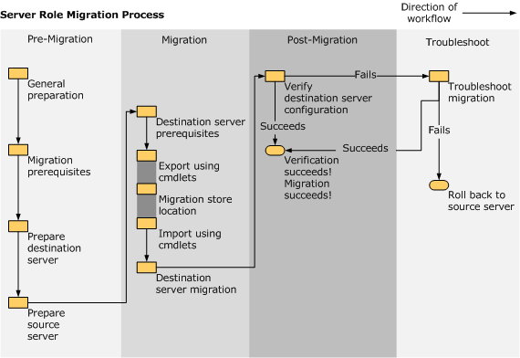

# Migrate a DHCP server installation to another Windows Server

DHCP server migration involves moving the settings for your existing DHCP server to a new DHCP server on the network. The goal of this server migration is to install the DHCP server role on the Windows Server operating system so that it provides DHCP leases on a network without any perceptible change to DHCP client computers.

This guide describes the steps for migrating existing DHCP server settings to a server that is running Windows Server. By using this guide to migrate a DHCP server, you can simplify migration, reduce migration time, increase the accuracy of the migration process, and help eliminate possible conflicts that might otherwise occur during DHCP migration. This guide doesn't contain instructions for migration when the source server is running multiple roles. If your server is running multiple roles, we recommend that you design a custom migration procedure specific to your server environment. Some notes about migration:

- Migrations between physical operating systems and virtual operating systems are supported.
- Migration from a source server to a destination server that is running an operating system in a different system user interface (UI) language than the source server isn't supported.
- Migration is recommended instead of an upgrade even when the hardware is native x64-based.

This guide is intended for IT administrators, IT professionals, and other knowledge workers who are responsible for the operation and deployment of DHCP servers in a managed environment. The server administrator can choose which components of an existing installation to migrate. Together with the server role, these components usually include configuration, data, system identity, and operating system settings.

## Prerequisites

- An existing DHCP server that is set up and running
- The following permissions are required on the source server and the destination server:
  - Domain administrative rights that are required to authorize DHCP Server.
  - Local administrative rights are required to install or manage DHCP Server.
  - Write permissions are required to the migration store location.

## Server migration process

DHCP Server migration is divided into the following major sections:

- [Prepare to migrate](#prepare-to-migrate): The premigration process involves the manual collection of data, followed by steps to prepare the destination and source servers.
- [Migrate the DHCP Server Role](#migrate-the-dhcp-server-role): The migration process includes source and destination server procedures that use the Export and Import cmdlets to automatically collect, store, and then migrate server role settings.
- [Verify the migration](#verify-the-migration): Confirm that the destination server successfully replaced the source server.
- [Complete post-migration tasks](#post-migration-tasks): Retire, or repurpose the source server. Troubleshoot the migration if it failed, and roll back if needed.



## Prepare to migrate

- **Identify your DHCP Server source and destination servers.**

- **Determine the domain, server name, and passwords on the source server.** To identify the domain of the original server, view System Settings from the Control Panel.

- **Before migration, install all critical updates and service packs on the source server.** It's a recommended best practice that all current critical updates and service packs are installed on both the source and the destination servers.

- **Count the number of network adapters in the source and destination servers and make sure that they're equal in number.** If the source server that is running DHCP Server has multiple network adapters and the DHCP Server service is bound to all and serving IP addresses on different subnets, the destination server that is running DHCP Server must also have multiple network adapters so that it can serve the same subnets as on the source server.

- **Prepare a migration store file location.** The store location must be accessible from the source server during the export and from the destination server during the import. Use a common drive that can contain all DHCP Server–related information from the source server. The storage location should be similar to the following: \\\\fileserver\\users\\username\\.

### Install migration tools

If you haven't already done so, install Windows Server Migration Tools on the destination and source servers. The migration tools can be installed either using PowerShell or Server Manager.

For PowerShell, use the [Install-WindowsFeature](/powershell/module/servermanager/install-windowsfeature) cmdlet:

```powershell
Install-WindowsFeature -Name Migration -ComputerName Server1
```

Use Server Manager, and open the Add Roles and Features Wizard. Find and install the feature: **Windows Server Migration Tools**.

### Prepare the destination server

To install DHCP Server on the destination server, complete the menu-driven installation process. Complete the following procedure to prepare the destination server.

#### To prepare the destination server

1. Install Windows Server and configure the destination server.

1. Make sure that there's sufficient disk space to store the DHCP Server database. The disk space needed varies with each installation and should be equal to or greater than the space for the DHCP Server database.

1. Add the destination server as a member server in the domain of the source server that's being replaced.

1. Verify that the destination server can resolve the names of domain users who are members of the local group during the import operation. If source and destination servers are in different domains, the destination server must be able to contact a global catalog server for the forest in which the source domain user accounts are located.

1. On a computer that is running Windows Server, open Windows PowerShell as an administrator.

1. Load the Server Manager module into your Windows PowerShell session. To load the Server Manager module, enter the command:

    ```powershell
    Import-Module -Name ServerManager
    ```

    > [!NOTE]
    > It isn't mandatory that DHCP Server is installed on the destination server before you import the settings. If the role isn't installed on the destination server, it'll be installed automatically during the import process. However, because installation of the role during import might extend downtime, we recommend that you install DHCP Server by using the Server Manager console on the destination server as part of your preparation for the migration.

1. On the destination server, to install the DHCP server, run the following command:
  
    ```powershell
    Install-WindowsFeature -Name DHCP
    ```
  
  You can also install DHCP Server manually by using Server Manager. For more information, see [Install and configure DHCP Server](/windows-server/networking/technologies/dhcp/quickstart-install-configure-dhcp-server).

1. By the end of the migration process, the destination server should have a static IP address. Although you won't change the destination server IP address now, consider the following scenarios in preparation for changing it when migration is complete.

    - If your migration scenario requires that you decommission and disconnect the source server from the network, only then can you make the IP address on the destination server the same as the IP address on the source server. The source server must be disconnected from the network or shut down so that there's no IP address conflict between the source server and destination server. However, the destination server can still serve clients that are searching for the legacy (source) server that was running DHCP Server.

    - If your migration scenario calls for continuing to run the source server on the network for other, non-DHCP purposes, you have to assign the destination server an unallocated IP address in the same subnet as the source server to avoid IP conflicts.

    - DHCP Server clients that attempt to renew an IP address lease send the renew request to the previous IP address of the DHCP server. If the source server has been decommissioned and then disconnected from the network and the new DHCP destination server is operating with a different IP address, this request initially fails because of the changed IP address. However, clients try to rediscover the IP address of the DHCP server on the network and therefore recover from this transient failure.

    > [!WARNING]
    > If the source server is running multiple roles, renaming the source server or changing its IP address can cause other roles that are running on the source server to fail.

1. If the DHCP Server database path doesn't match the default path, you must ensure that the destination server has a disk with the same drive letter as seen in source server’s DHCP Server database path.

The destination server is now prepared for migration.

### Prepare the source server

Follow these steps to prepare the source server for migration.

1. Back up the source server. The backup should be a DHCP Server-specific backup, not a Windows backup. (A Windows backup backs up the complete operating system.) You can create the DHCP Server-specific backup by using the [Netsh command-line tool](/windows-server/networking/technologies/netsh/netsh-contexts) or [Microsoft Management Console (MMC)](/windows-server/administration/windows-commands/mmc).

1. If it's running, stop the DHCP Server service. In a session that was opened as described in step 5 of [prepare the destination server](#prepare-the-destination-server), enter:

    ```powershell
    Stop-Service -Name "DHCPserver"
    ```

1. If the DHCP Server database path doesn't match the default path, make sure that the destination server has a disk with the same drive letter as in source server’s DHCP Server database path.

You're now ready to begin DHCP Server migration.

## Migrate the DHCP Server Role

In this section, you'll migrate the DHCP Server to the destination server from the source server. Membership in Domain Administrators or equivalent is the minimum required to complete these procedures.

### Migrate DHCP Server to the destination server

1. If it isn't already installed, install DHCP Server on the destination server.

1. If it's running, stop the DHCP Server service by running the following command:

    ```powershell
    Stop-Service -Name "DHCPserver"
    ```

### Migrate DHCP Server from the source server

Follow the steps in this section to migrate DHCP Server from the source server.

> [!IMPORTANT]
> Before you run the **Import-SmigServerSetting**, **Export-SmigServerSetting**, or **Get-SmigServerFeature** cmdlets, verify that during migration, both source and destination servers can contact the domain controller that's associated with domain users or groups who are members of local groups on the source server.
> Before you run the **Send-SmigServerData** or **Receive-SmigServerData** cmdlets, verify that during migration, both source and destination servers can contact the domain controller that's associated with those domain users who own files or shares that are being migrated.

1. On a computer that's running Windows Server, open Windows PowerShell as an administrator.

1. Load Windows Server Migration Tools into your session.

    If you opened the current session by using the Windows Server Migration Tools shortcut on the **Start** menu, skip this step, and go to step 3. Only load the Windows Server Migration Tools snap-in in a session that was opened by using some other method, and into which the snap-in hasn't already been loaded. To load Windows Server Migration Tools, type the following, and then press **Enter**.

    ```powershell
    Add-PSSnapin Microsoft.Windows.ServerManager.Migration
    ```

1. Collect data from the source server by running the **Export-SmigServerSetting** cmdlet as an administrator. The **Export-SmigServerSetting** cmdlet parameters can collect all source DHCP server data in a single file (Svrmig.mig). Or, the **Export-SmigServerSetting** cmdlet can be run multiple times, with each iteration using one or more parameters to collect and store data in multiple Svrmig.mig files. Before you run this command, review the following:

      - When you run the command in step 4, you're prompted to provide a password to encrypt the migration store data. You must provide this same password to import from the migration store.

      - The **path** parameter can be an empty or nonempty directory. The actual data file in the directory (Svrmig.mig) is created by the **Export-SmigServerSetting** cmdlet. Therefore, the user doesn't have to specify a file name.

      - If the path isn't a shared location that the destination server can read from, you must manually copy the migration store to the destination server or a location that the destination server can access.

      - If a migration store location already exists and you want to rerun the **Export-SmigServerSetting** cmdlet, you must move the Svrmig.mig file from that location and store it elsewhere, rename or first delete the migration store.

      - You can perform both IP and DHCP Server migration at the same time from a Windows PowerShell prompt by using the **Export-SmigServerSetting** cmdlet combined with the **IPConfig** switch, on a single command line.

      - Extra command line parameter information:

          - **-Users** and **-Group** parameters

            The **-Users** parameter must be specified only if the DHCP Administrators group includes local users. Otherwise, you can use the **-Group** parameter and all members of DHCP administrators will be migrated. Administrator group members can include domain users.

            > [!IMPORTANT]
            > If the source server is a domain controller, but the destination server isn't, Domain Local groups are migrated as local groups, and domain users are migrated as local users.

          - The **-IPConfig** parameter collects IP information when it's used with the **Export-SmigServerSetting** cmdlet on the source server; the **-IPConfig** parameter applies settings when the **Import-SmigServerSetting** cmdlet is used on the destination server.

            If the source DHCP Server has multiple network adapters and the DHCP server service is bound to more than one network adapter and serving IP addresses on different subnets, the destination DHCP Server must also have multiple network adapters so that it can serve the same subnets as the source DHCP Server. Because IP configuration details will be used later when importing IP configuration settings to the destination server, it's a best practice to save the IP configuration settings by using the following command: `IPConfig /all > IPSettings.txt`.

            The **Import-SmigServerSetting** cmdlet requires you to map the source physical address to the destination physical address.

        > [!NOTE]
        > The destination server can be assigned the same static IP address as the source server, unless other roles on the source server must continue to run on it. In that case, the static IP address of the destination server can be any unallocated static IP address in the same subnet as the source server.

1. On the source server, run the **Export-SmigServerSetting** cmdlet, where *\<storepath\>* is the path that contains the Svrmig.mig file after this step is completed. An example of the path is \\\\fileserver\\users\\username\\dhcpstore.

    ```powershell
    Export-SmigServerSetting -featureID DHCP -User All -Group -IPConfig -path <storepath> -Verbose
    ```

1. On the source server, delete the DHCP authorization for the source DHCP server by running the following command, where *Server FQDN* is the fully qualified domain name (FQDN) of the DHCP server and *Server IPAddress* is the IP address of the server. The command parameters are case-sensitive and must appear exactly as shown.

    ```powershell
    Netsh DHCP delete server <Server FQDN> <Server IPAddress>
    ```

### Complete the migration on the destination server

Return to the destination server and follow these steps to complete the migration.

1. Before you use the [**Import-SmigServerSetting**](/powershell/module/microsoft.windows.servermanager.migration/import-smigserversetting) cmdlet to import the DHCP server settings, be aware of the following conditions:

    - You can either use a single command line with all the parameters to import DHCP settings (as when you export data from the source server) or you can use the cmdlet multiple times to import data one parameter at a time.

    - If you decide to run the **Import-SmigServerSetting** cmdlet separately to import the IP settings, use the source IPSettings.txt file, referred to in step 3 of the previous procedure. You map the source physical addresses to the destination physical addresses in step 3 of this procedure. If you plan to import role and IP settings separately, you should import IP settings first to avoid any IP conflicts. You can then import the DHCP role.

    - If the DHCP Administrators group includes local users, then use the **-Users** parameter combined with the **-Group** parameter to import local users into the DHCP Administrators group. If it only contains domain users, then use only the **-Group** parameter.

    > [!NOTE]
    > If the source server is a domain member server, but the destination server is a domain controller, imported local users are elevated to domain users, and imported local groups become Domain Local groups on the destination server.

    - If the DHCP Server role that you're migrating hasn't been installed on the destination server, the **Import-SmigServerSetting** cmdlet installs that DHCP Server role and its dependencies. You might have to restart the destination computer to complete the installation after the DHCP Server role is installed by the cmdlet. Then, to complete the import operation after you restart the computer you must run the **Import-SmigServerSetting** cmdlet again along with the **-Force** parameter.

1. On the destination server, run the following command, where *\<storepath\>* is the available path that contains the Svrmig.mig file, *\<SourcePhysicalAddress-1\>* and *\<SourcePhysicalAddress-2\>* are comma-separated lists of the physical addresses of the source network adapter, and *\<TargetPhysicalAddress-1\>* and *\<TargetPhysicalAddress-2\>* are comma-separated lists of the physical addresses of the destination network adapter:

    ```powershell
    Import-SmigServerSetting -FeatureID 'DHCP' -User All -Group -IPConfig <All | Global | NIC>
        -SourcePhysicalAddress <SourcePhysicalAddress-1>,<SourcePhysicalAddress-2>
        -TargetPhysicalAddress <TargetPhysicalAddress-1>,<TargetPhysicalAddress-2>
        -Force -Path <storepath> -Verbose
    ```

    The **-IPConfig** switch should be used with the value **All** in case the user wants to import all source settings.

    > [!IMPORTANT]
    > If you import the source server IP address to the target server together with the DHCP role without disconnecting or changing the IP address of the source server, an IP address conflict will occur.

1. Run the following command to start the DHCP service: `Start-Service -Name "DHCPServer"`

1. Authorize the destination server. Command parameters are case-sensitive and must appear exactly as shown. On the destination server, run the following command where *Server FQDN* is the FQDN of the DHCP Server and *Server IPAddress* is the IP address of the server:

    ```powershell
    netsh DHCP add server <Server FQDN> <Server IPAddress>
    ```

When this migration is finished, client computers on the network server are served by the new x64-based destination server running Windows Server. The migration is complete when the destination server is ready to serve IP addresses to the network.

## Verify the migration

When all the migration steps are complete, you can use the following procedure to verify that the DHCP server role migration was successful. If the migration failed, you can return to the previous valid configuration by following the steps in [Post-Migration Tasks](#post-migration-tasks).

### Verify the configuration of the destination server

Follow these steps to confirm that the DHCP destination server is now serving the domain.

1. Make sure that the destination server is authorized by running the following command in a Windows PowerShell window:

    ```powershell
    netsh DHCP show server
    ```

    The output of this command must contain the name of the DHCP destination server.

1. Check whether DHCP server is running on the destination server. In Task Manager, on the **Services** tab, the DHCP server status should be **Started**. You also use Task Manager to confirm that the status of the source server is **Stopped**.

1. Verify that the client computers are correctly receiving IP addresses on request by running the following commands at a command prompt on a client computer:

    ```powershell
    ipconfig /release
    
    ipconfig /renew
    ```

    If the IP address of the DHCP server hasn't changed, you don't have to run the **ipconfig /release** command. Running **ipconfig /renew** should be sufficient.

    The output of these commands should show that the client computer was issued an IP address.

1. Use the DHCP console to verify that the scopes and other settings were migrated. To connect to the destination server, select **Action**, select **Add Server**, and then type the IP address or host name of the DHCP server. In the console tree, expand the server node, and then expand the IPv4 and IPv6 nodes to confirm that the scopes have been migrated. Then locate the folders for the scopes and view the address range, reservations, scope options, and active leases to verify the same. You can also go to the Server Options folder and verify the migrated server options.

## Post-migration tasks

These post-migration tasks for the source server are optional, depending on your migration scenario.

Migration is complete after you verify that the destination server, not the source server, is now serving the network.

### Retire DHCP on your source server

After you verify the migration, you can disconnect, repurpose, or retire the source server. If the source server is running other server roles, it should be left on the network. If you don't have to use this computer, you can store it as a backup in case you ever have to revert to your previous DHCP configuration.

**If your migration scenario includes a standalone DHCP Server**, then this source server was taken offline after the export file was created. In this scenario, the DHCP service was interrupted from the time that it was stopped until the migration was complete on the new server.

**If your migration scenario includes more than one DHCP Server in a domain**, a backup or other DHCP server continues to serve IP addresses during the migration so that services to clients are never interrupted. The migration is complete on the new server when the IP address of the source server is migrated to the destination server.

### Retire your source server

After you confirm that the destination server is performing the functions previously handled by the source server, you can retire or repurpose the source server, depending on your needs. Follow your organization’s policy regarding server decommissioning. For information about decommissioning a domain controller, see [Demoting domain controllers and domains](/windows-server/identity/ad-ds/deploy/demoting-domain-controllers-and-domains--level-200-).

### Restore DHCP if migration fails

If the migration of DHCP Server fails, you have these options:

- If the source server hasn't been repurposed, an administrator can reassign the IP configuration settings, reauthorize the server, and restart the DHCP service on the original server.
- Use the backup files that were created on the source server, to restore DHCP server on the original DHCP server.

### Troubleshoot cmdlet-based migration

The Windows Server Migration Tools deployment log file is located at %*windir*%\\Logs\\SmigDeploy.log. Other Windows Server Migration Tools log files are created at the following locations.

- %*windir*%\\Logs\\ServerMigration.log

- %*localappdata*%\\SvrMig\\Log

If migration log files can't be created in the previous locations, **ServerMigration.log** and **SmigDeploy.log** are created in %*temp*%, and other logs are created in %*windir*%\\System32.

For DHCP-specific troubleshooting tips, see [Troubleshoot problems on DHCP servers](/windows-server/troubleshoot/troubleshoot-problems-on-dhcp-server).

#### If connections between either the source or destination servers and the domain controllers or global catalog servers can't be restored

1. Before you run **Export-SmigServerSetting**, **Import-SmigServerSetting** or **Get-SmigServerFeature** again, remove all unresolved domain users or groups who are members of local groups from the server on which you're running the cmdlet.

1. Before you run **Send-SmigServerData** or **Receive-SmigServerData** again, remove all unresolved domain users or groups who have user rights to files, folders, or shares on the migration source server.

### View the content of Windows Server Migration Tools result objects

All Windows Server Migration Tools cmdlets return results as objects. You can save result objects, and query them for more information about settings and data that were migrated. You can also use result objects as input for other Windows PowerShell commands and scripts.

### Result object descriptions

The Windows Server Migration Tools **Import-SmigServerSetting** and **Export-SmigServerSetting** cmdlets return results in a list of **MigrationResult** objects. Each **MigrationResult** object contains information about the data or setting that the cmdlet processes, the result of the operation, and any related error or warning messages. The following table describes the properties of a **MigrationResult** object.

| Property name       | Type                        | Definition                                                                 |
|---------------------|-----------------------------|-----------------------------------------------------------------------------|
| ItemType            | Enum                        | The type of item being migrated. Values include **General**, **WindowsFeatureInstallation**, **WindowsFeature**, and **OSSetting**. |
| ID                  | String                      | The ID of the migrated item. Examples of values include **Local User**, **Local Group**, and **DHCP**. |
| Success             | Boolean                     | The value **True** is displayed if migration was successful; otherwise, **False** is displayed. |
| DetailsList         | `List<MigrationResultDetails>` | A list of **MigrationResultDetails** objects.                              |

**Send-SmigServerData** and **Receive-SmigServerData** cmdlets return results in a list of **MigrationDataResult** objects. Each **MigrationDataResult** object contains information about the data or share that the cmdlet processes, the result of the operation, any error or warning messages, and other related information. The following table describes the properties of a **MigrationDataResult** object.

| Property name       | Type                        | Definition                                                                 |
|---------------------|-----------------------------|-----------------------------------------------------------------------------|
| ItemType            | Enum                        | The type of migrated item. Values include **File**, **Folder**, **Share**, and **Encrypted File**. |
| SourceLocation      | String                      | The source location of the item, shown as a path.                          |
| DestinationLocation | String                      | The destination location of the item, shown as a path.                     |
| Success             | Boolean                     | The value **True** is displayed if migration was successful; otherwise, **False** is displayed. |
| Size                | Integer                     | The item size, in bytes.                                                   |
| ErrorDetails        | `List<MigrationResultDetails>`| A list of **MigrationResultDetails** objects.                              |
| Error               | Enum                        | Errors enumeration for errors that occurred.                               |
| WarningMessageList  | `List<String>`                | A list of warning messages.                                                |

The following table describes the properties of objects within the **MigrationResultDetails** object that are common to both **MigrationResult** and **MigrationDataResult** objects.

| Property name | Type | Definition |
|---------------|------|------------|
| FeatureId     | String | The name of the migration setting that is related to the item. Examples of values include **IPConfig** and **DNS**. This property is empty for data migration. |
| Messages      | `List<String>` | A list of detailed event messages. |
| DetailCode    | Integer | The error or warning code associated with each event message. |
| Severity      | Enum | The severity of an event, if events occurred. Examples of values include **Information**, **Error**, and **Warning**. |
| Title         | String | Title of the result object. Examples of values include the network adapter physical address for IP configuration, or user name for local user migration. |

