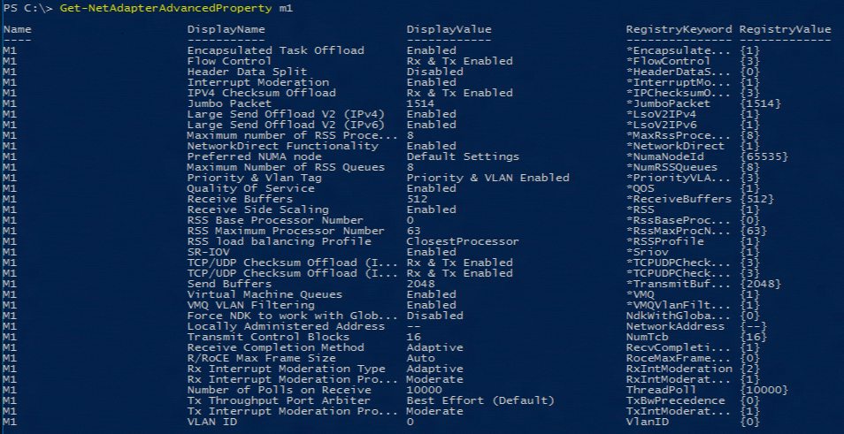
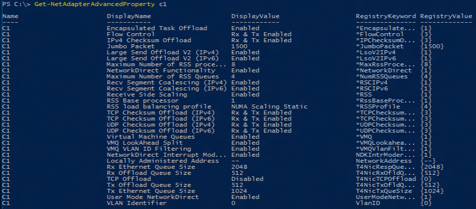
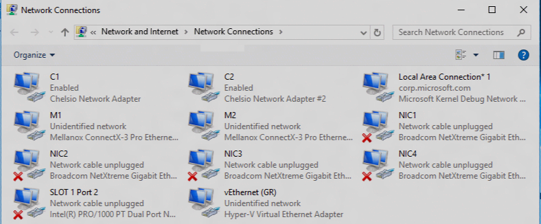
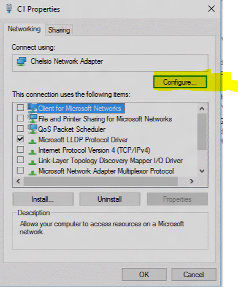
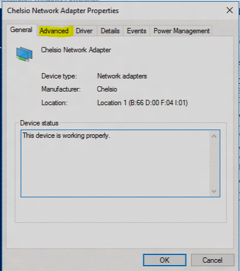

# NIC advanced properties

You can manage NICs and all the features via Windows PowerShell using the [NetAdapter](https://docs.microsoft.com/powershell/module/netadapter/?view=win10-ps&viewFallbackFrom=winserverr2-ps) cmdlet.  You can also manage NICs and all the features using Network Control Panel (ncpa.cpl). 

1. In **Windows PowerShell**, run the `Get‑NetAdapterAdvancedProperties` cmdlet against two different make/model of NICs.

   

   

   There are similarities and differences in these two NIC Advanced Properties Lists.

2. In the **Network Control Panel** (ncpa.cpl), do the following:

   a. Right-click the NIC.

   

   b. In the properties dialog, click **Configure**.

    

   c. Click the **Advanced** tab to view the advanced properties.
The items in this list correlates to the items in the `Get-NetAdapterAdvancedProperties` output.

   

---
