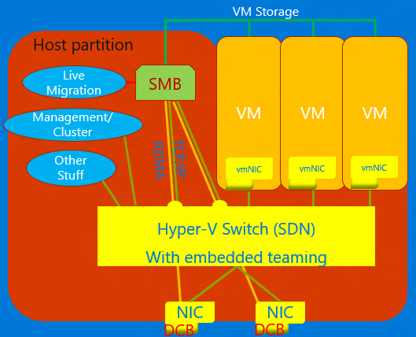

# Software and hardware (SH) integrated features and technologies

These features have both software and hardware components. The software is intimately tied to hardware capabilities that are required for the feature to work. Examples of these include VMMQ, VMQ, Send-side IPv4 Checksum Offload, and RSS.

>[!TIP]
>SH and HO features are available if the installed NIC supports it. The feature descriptions below will cover how to tell if your NIC supports the feature.

## Converged NIC 

Converged NIC is a technology that allows virtual NICs in the Hyper-V host to expose RDMA services to host processes. Windows Server 2016 no longer requires separate NICs for RDMA. The Converged NIC feature allows the Virtual NICs in the Host partition (vNICs) to expose RDMA to the host partition and share the bandwidth of the NICs between the RDMA traffic and the VM and other TCP/UDP traffic in a fair and manageable manner.

You can manage converged NIC operation through VMM or Windows PowerShell. The PowerShell cmdlets are the same cmdlets used for RDMA (see below).

To use the converged NIC capability:

1.  Ensure to set the host up for DCB.

2.  Ensure to enable RDMA on the NIC, or in the case of a SET team, the NICs are bound to the Hyper-V switch. 

3.  Ensure to enable RDMA on the vNICs designated for RDMA in the host. 

For more details about RDMA and SET, see [Remote Direct Memory Access (RDMA) and Switch Embedded Teaming (SET)](https://docs.microsoft.com/windows-server/virtualization/hyper-v-virtual-switch/rdma-and-switch-embedded-teaming).

## Data Center Bridging (DCB) 

DCB is a suite of Institute of Electrical and Electronics Engineers (IEEE) standards that enable Converged Fabrics in data centers. DCB provides hardware queue-based bandwidth management in a host with cooperation from the adjacent switch. All traffic for storage, data networking, cluster Inter-Process Communication (IPC), and management share the same Ethernet network infrastructure. In Windows Server 2016, DCB can be applied to any NIC individually and to NICs bound to the Hyper-V switch.

For DCB, Windows Server uses Priority-based Flow Control (PFC), standardized in IEEE 802.1Qbb. PFC creates a (nearly) lossless network fabric by preventing overflow within traffic classes. Windows Server also uses Enhanced Transmission Selection (ETS), standardized in IEEE 802.1Qaz. ETS enables the division of the bandwidth into reserved portions for up to eight classes of traffic. Each traffic class has its own transmit queue and, through the use of PFC, can start and stop transmission within a class.

For more information, see [Data Center Bridging (DCB)](https://docs.microsoft.com/windows-server/networking/technologies/dcb/dcb-top).

## Hyper-V Network Virtualization

|                            |                                                                                                                                                                                                                                                                                                                                                                                                                                                                                      |
|----------------------------|--------------------------------------------------------------------------------------------------------------------------------------------------------------------------------------------------------------------------------------------------------------------------------------------------------------------------------------------------------------------------------------------------------------------------------------------------------------------------------------|
|       **v1 (HNVv1)**       |                     Introduced in Windows Server 2012, Hyper-V Network Virtualization (HNV) enables virtualization of customer networks on top of a shared, physical network infrastructure. With minimal changes necessary on the physical network fabric, HNV gives service providers the agility to deploy and migrate tenant workloads anywhere across the three clouds: the service provider cloud, the private cloud, or the Microsoft Azure public cloud.                     |
| **v2 NVGRE (HNVv2 NVGRE)** | In Windows Server 2016 and System Center Virtual Machine Manager, Microsoft provides an end-to-end network virtualization solution that includes RAS Gateway, Software Load Balancing, Network Controller, and more. For more information, see [Hyper-V Network Virtualization Overview in Windows Server 2016](https://technet.microsoft.com/windows-server-docs/networking/sdn/technologies/hyper-v-network-virtualization/hyperv-network-virtualization-overview-windows-server). |
| **v2 VxLAN (HNVv2 VxLAN)** |                                                                                                                                                                                        In Windows Server 2016, is part of the SDN-extension, which you manage through the Network Controller.                                                                                                                                                                                        |

---

## IPsec Task Offload (IPsecTO) 

IPsec task offload is a NIC feature that enables the operating system to use the processor on the NIC for the IPsec encryption work.

>[!IMPORTANT] 
>IPsec Task Offload is a legacy technology that is not supported by most network adapters, and where it does exist, it's disabled by default.

## Private virtual Local Area Network (PVLAN). 

PVLANs allow communication only between virtual machines on the same virtualization server. A private virtual network is not bound to a physical network adapter. A private virtual network is isolated from all external network traffic on the virtualization server, as well as any network traffic between the management operating system and the external network. This type of network is useful when you need to create an isolated networking environment, such as an isolated test domain. The Hyper-V and SDN stacks support PVLAN Isolated Port mode only.

For details about PVLAN isolation, see [System Center: Virtual Machine Manager Engineering Blog](https://blogs.technet.microsoft.com/scvmm/2013/06/04/logical-networks-part-iv-pvlan-isolation/).

## Remote Direct Memory Access (RDMA) 

RDMA is a networking technology that provides high-throughput, low-latency communication that minimizes CPU usage. RDMA supports zero-copy networking by enabling the network adapter to transfer data directly to or from application memory. RDMA-capable means the NIC (physical or virtual) is capable of exposing RDMA to an RDMA client. RDMA-enabled, on the other hand, means an RDMA-capable NIC is exposing the RDMA interface up the stack.

For more details about RDMA, see [Remote Direct Memory Access (RDMA) and Switch Embedded Teaming (SET)](https://docs.microsoft.com/windows-server/virtualization/hyper-v-virtual-switch/rdma-and-switch-embedded-teaming).

## Receive Side Scaling (RSS) 

RSS is a NIC feature that segregates different sets of streams and delivers them to different processors for processing. RSS parallelizes the networking processing, enabling a host to scale to very high data rates. 

For more details, see [Receive Side Scaling (RSS)](https://docs.microsoft.com/windows-hardware/drivers/network/introduction-to-receive-side-scaling).

## Single Root Input-Output Virtualization (SR-IOV) 

SR-IOV allows VM traffic to move directly from the NIC to the VM without passing through the Hyper-V host. SR-IOV is an incredible improvement in performance for a VM but lacks the ability for the host to manage that pipe. Only use SR-IOV when the workload is well-behaved, trusted, and generally the only VM in the host.

Traffic that uses SR-IOV bypasses the Hyper-V switch, which means that any policies, for example, ACLs, or bandwidth management won't be applied. SR-IOV traffic also can't be passed through any network virtualization capability, so NV-GRE or VxLAN encapsulation can't be applied. Only use SR-IOV for well-trusted workloads in specific situations. Additionally, you cannot use the host policies, bandwidth management, and virtualization technologies.

In the future, two technologies would allow SR-IOV: Generic Flow Tables (GFT) and Hardware QoS Offload (bandwidth management in the NIC) – once the NICs in our ecosystem support them. The combination of these two technologies would make SR-IOV useful for all VMs, would allow policies, virtualization, and bandwidth management rules to be applied, and could result in great leaps forward in the general application of SR-IOV.

For more details, see [Overview of Single Root I/O Virtualization (SR-IOV)](https://docs.microsoft.com/windows-hardware/drivers/network/overview-of-single-root-i-o-virtualization--sr-iov-).

## TCP Chimney Offload

TCP Chimney Offload, also known as TCP Engine Offload (TOE), is a technology that allows the host to offload all TCP processing to the NIC. Because the Windows Server TCP stack is almost always more efficient than the TOE engine, using TCP Chimney Offload is not recommended.

>[!IMPORTANT]
>TCP Chimney Offload is a deprecated technology. We recommend you do not use TCP Chimney Offload as Microsoft might stop supporting it in the future.

## Virtual Local Area Network (VLAN) 

VLAN is an extension to the Ethernet frame header to enable partitioning of a LAN into multiple VLANs, each using its own address space. In Windows Server 2016, VLANs are set on ports of the Hyper-V switch or by setting team interfaces on NIC Teaming teams. For more information, see [NIC Teaming and Virtual Local Area Networks (VLANs)](https://docs.microsoft.com/windows-server/networking/technologies/nic-teaming/nict-and-vlans).

## Virtual Machine Queue (VMQ) 

VMQs is a NIC feature that allocates a queue for each VM. Anytime you have Hyper-V enabled; you must also enable VMQ. In Windows Server 2016, VMQs use NIC Switch vPorts with a single queue assigned to the vPort to provide the same functionality. For more information, see [Virtual Receive Side Scaling (vRSS)](https://docs.microsoft.com/windows-server/networking/technologies/vrss/vrss-top) and [NIC Teaming](https://docs.microsoft.com/windows-server/networking/technologies/nic-teaming/nic-teaming).

## Virtual Machine Multi-Queue (VMMQ) 

VMMQ is a NIC feature that allows traffic for a VM to spread across multiple queues, each processed by a different physical processor. The traffic is then passed to multiple LPs in the VM as it would be in vRSS, which allows for delivering substantial networking bandwidth to the VM.

---