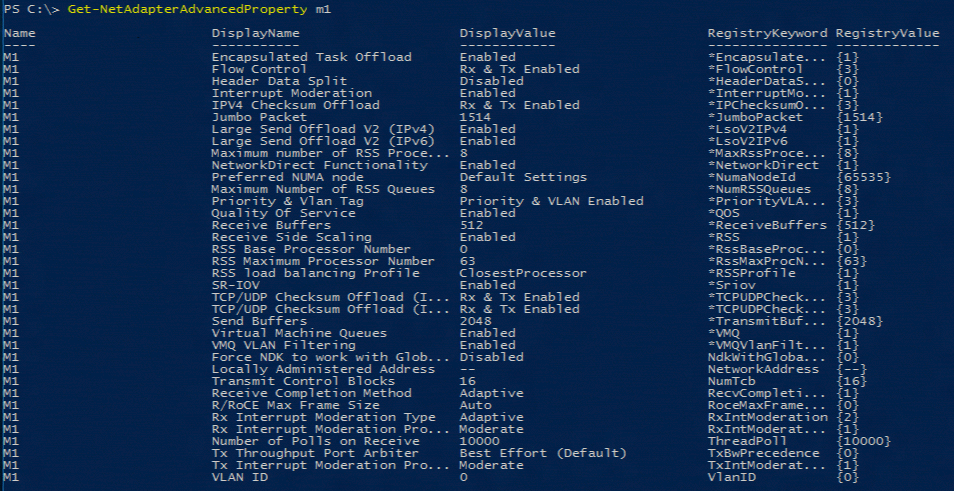
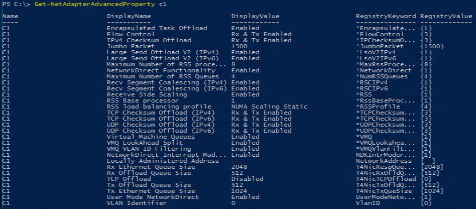
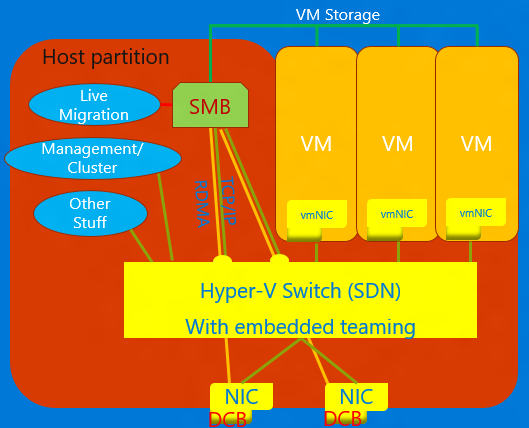

# High-performance networking

In this topic, we give you an overview of the different network offload and optimization features available in Windows Server 2016 and discuss how they help make networking more efficient. These technologies include Software Only (SO) features and technologies, Software and Hardware (SH) integrated features and technologies, and Hardware Only (HO) features and technologies.

## Network offload and optimization technologies

The three categories of networking features available in Windows Server 2016 are: 

1.  [Software only (SO) features](#software-only-so-features-and-technologies): These features are implemented as part of the OS and are independent of the underlying NIC(s). Sometimes these features will require some tuning of the NIC for optimal operation. Examples of these include Hyper-v features such as vmQoS, ACLs, and non-Hyper-V features like NIC Teaming.

    >[!IMPORTANT] 
    >SO features and technologies are available in all hardware architectures, regardless of NIC speed or NIC capabilities. SH and HO features are available only when your network adapter supports the features or technologies.

2.  [Software and Hardware (SH) integrated features and technologies](#software-and-hardware-sh-integrated-features-and-technologies): These features have both software and hardware components. The software is intimately tied to hardware capabilities that are required for the feature to work. Examples of these include VMMQ, VMQ, Send-side IPv4 Checksum Offload, and RSS.

3.  [Hardware Only (HO) features and technologies](#hardware-only-ho-features-and-technologies): These hardware accelerations improve networking performance in conjunction with the software but are not intimately part of any software feature. Examples of these include Interrupt Moderation, Flow Control, and Receive-side IPv4 Checksum Offload.

>[!TIP]
>- SO features are generally available in all hardware architectures and without regard to NIC Speed or capabilities. If the feature exists in Windows it exists no matter what NICs are installed.
>
>- SH and HO features are available if the installed NIC supports it. The feature descriptions below will cover how to tell if your NIC supports the feature.

## Networking feature management

In general there are two ways to manage NICs and their features. The first is PowerShell. This guide will use PowerShell examples. All the features can be managed through the Network Control Panel (ncpa.cpl) as well. So to help readers who prefer to use the GUI to know where to go, we include an example of how to access the Network Control Panel.

Documentation on the PowerShell cmdlets used to manage Network Adapters can be
found at <https://technet.microsoft.com/en-us/library/jj134956(v=wps.630).aspx>.

## NIC advanced properties

To determine whether the installed NIC supports a feature you may need to look at the Advanced Properties of the NIC. There are two ways to get the Advanced Properties:

### Method 1 - Windows PowerShell

In Windows PowerShell, run the `Get‑NetAdapterAdvancedProperties` cmdlet against two different make/model of NICs.





There are similarities and differences in these two NIC Advanced Properties Lists.

### Method 2 - Network Control Panel

1.  Go to Start and type `ncpa.cpl` to open the Network Control Panel.

2.  Right-click the NIC.

    

3.  In the properties dialog, click **Configure**.

    

4.  Click the **Advanced** tab to view the advanced properties.<p>The items in this list correlates to the items in the `Get-NetAdapterAdvancedProperties` output.

    


## Software Only (SO) features and technologies
These features are implemented as part of the OS and are independent of the underlying NIC(s). Sometimes these features require some tuning of the NIC for optimal operation. Examples of these include Hyper-v features such as Virtual Machine Quality of Service (vmQoS), Access Control Lists (ACLs), and non-Hyper-V features like NIC Teaming.

### Access Control Lists (ACLs)

A Hyper-V and SDNv1 feature for managing security for a VM. This feature applies to the non-virtualized Hyper-V stack and the HVNv1 stack. You can manage Hyper-V switch ACLs through [Add-VMNetworkAdapterAcl](https://docs.microsoft.com/en-us/powershell/module/hyper-v/add-vmnetworkadapteracl?view=win10-ps)
and [Remove-VMNetworkAdapterAcl](https://docs.microsoft.com/en-us/powershell/module/hyper-v/remove-vmnetworkadapteracl?view=win10-ps)
PowerShell cmdlets.

### Extended ACLs

Hyper-V Virtual Switch extended ACLs enable you to configure the Hyper-V Virtual Switch Extended Port ACLs to provide firewall protection and enforce security policies for the tenant VMs in datacenters. Because the port ACLs are configured on the Hyper-V Virtual Switch rather than within the VMs, the administrator can manage security policies for all tenants in a multitenant environment.

You can manage Hyper-V switch extended ACLs through the [Add-VMNetworkAdapterExtendedAcl](https://docs.microsoft.com/en-us/powershell/module/hyper-v/add-vmnetworkadapterextendedacl?view=win10-ps) and [Remove-VMNetworkAdapterExtendedAcl](https://docs.microsoft.com/en-us/powershell/module/hyper-v/remove-vmnetworkadapteracl?view=win10-ps) PowerShell cmdlets.

>[!TIP] 
>This feature applies to the HNVv1 stack. For ACLs in the SDN stack, refer to Software Defined Networking SDN) ACLs below.

For more information about Extended Port Access Control Lists in this library, see [Create Security Policies with Extended Port Access Control Lists](https://docs.microsoft.com/windows-server/virtualization/hyper-v-virtual-switch/Create-Security-Policies-with-Extended-Port-Access-Control-Lists).

### NIC Teaming

NIC Teaming, also called NIC bonding, is the aggregation of multiple NIC ports into an entity the host perceives as a single NIC port. NIC Teaming protects against the failure of a single NIC port (or the cable connected to it). It also aggregates network traffic for faster throughput.

With Windows Server 2016 you have two ways to do teaming:

1.  Windows Server 2012 teaming solution

2.  Windows Server 2016 [Switch Embedded Teaming (SET)](#switch-embedded-teaming-set)

For information about NIC Teaming in this library, see [NIC Teaming](https://docs.microsoft.com/windows-server/networking/technologies/nic-teaming/nic-teaming).

### RSC in the vSwitch

Receive Segment Coalescing (RSC) in the vSwitch is a feature that takes packets that are part of the same stream and arrive between network interrupts, and coalesces them into a single packet before delivering them to the operating system. The virtual switch in Windows Server 2019 has this feature. For more details about this feature, see [Receive Segment Coalescing in the vSwitch](https://docs.microsoft.com/en-us/windows-server/networking/technologies/hpn/rsc-in-the-vswitch).

### Software Defined Networking (SDN) ACLs

The SDN-extension in Windows Server 2016 improved ways to support ACLs. In the Windows Server 2016 SDN v2 stack, SDN ACLs are used instead of ACLs and Extended ACLs. You can use Network Controller to manage SDN ACLs. 

### SDN Quality of Service (QoS)

The SDN extension in Windows Server 2016 improved ways to provide bandwidth control (egress reservations, egress limits, and ingress limits) on a 5-tuple basis. Typically, these policies get applied at the vNIC or vmNIC level, but you can make them much more specific. In the Windows Server 2016 SDN v2 stack, SDN QoS is used instead of vmQoS. You can use Network Controller to manage SDN QoS.

### Switch Embedded Teaming (SET)

SET is an alternative NIC Teaming solution that you can use in environments that include Hyper-V and the Software Defined Networking (SDN) stack in Windows Server 2016. SET integrates some NIC Teaming functionality into the Hyper-V Virtual Switch. For information about Switch Embedded Teaming in this library, see [Remote Direct Memory Access (RDMA) and Switch Embedded Teaming (SET)](https://docs.microsoft.com/windows-server/virtualization/hyper-v-virtual-switch/rdma-and-switch-embedded-teaming).

### Virtual Receive Side Scaling (vRSS)

Software vRSS is used to spread incoming traffic destined for a VM across multiple logical processors (LPs) of the VM. Software vRSS gives the VM the ability to handle more networking traffic than a single LP would be able to handle. For more information, see [Virtual Receive Side Scaling (vRSS)](https://docs.microsoft.com/en-us/windows-server/networking/technologies/vrss/vrss-top).

### Virtual Machine Quality of Service (vmQoS)

Virtual Machine Quality of Service is a Hyper-V feature that allows the switch to set limits on traffic generated by each VM. It also enables a VM to reserve an amount of bandwidth on the external network connection so that one VM can’t starve another VM for bandwidth. In the Windows Server 2016 SDN v2 stack, SDN QoS replaces vmQoS.

vmQoS can set egress limits and egress reservations. You must determine the egress reservation mode (relative weight or absolute bandwidth) before creating the Hyper-V switch.

-  Determine the egress reservation mode with the –MinimumBandwidthMode parameter of the New-VMSwitch PowerShell cmdlet.

-  Set the value of the egress limit with the –MaximumBandwidth parameter on the Set-VMNetworkAdapter PowerShell cmdlet.

-  Set the value for the egress reservation with either of the following parameters of the Set VMNetworkAdapter PowerShell cmdlet:

   -  If the –MinimumBandwidthMode parameter on the New-VMSwitch cmdlet is Absolute, then set the –MinimumBandwidthAbsolute parameter on the Set VMNetworkAdapter cmdlet.

   -  If the –MinimumBandwidthMode parameter on the New-VMSwitch cmdlet is Weight, then set the –MinimumBandwidthWeight parameter on the Set VMNetworkAdapter cmdlet.

Because of the limitations in the algorithm used for this feature, we recommend that the highest weight or absolute bandwidth not be more than 20 times the lowest weight or absolute bandwidth. If more control is needed, consider using the SDN stack and the SDN-QoS feature.

## Software and Hardware (SH) integrated features and technologies

These features have both software and hardware components. The software is intimately tied to hardware capabilities that are required for the feature to work. Examples of these include VMMQ, VMQ, Send-side IPv4 Checksum Offload, and RSS.

>[!TIP]
>SH and HO features are available if the installed NIC supports it. The feature descriptions below will cover how to tell if your NIC supports the feature.

### Converged NIC 

Converged NIC is a technology that allows virtual NICs in the Hyper-V host to expose RDMA services to host processes. Windows Server 2016 no longer requires separate NICs for RDMA. The Converged NIC feature allows the Virtual NICs in the Host partition (vNICs) to expose RDMA to the host partition and share the bandwidth of the NICs between the RDMA traffic and the VM and other TCP/UDP traffic in a fair and manageable manner.



You can manage converged NIC operation through VMM or Windows PowerShell. The PowerShell cmdlets are the same cmdlets used for RDMA (see below).

To use the converged NIC capability:

1.  Ensure to set the host up for [DCB](#data-center-bridging-dcb).

2.  Ensure to enable RDMA on the NIC, or in the case of a SET team, the NICs are bound to the Hyper-V switch. 

3.  Ensure to enable RDMA on the vNICs designated for RDMA in the host. 

For more details about RDMA and SET, see [Remote Direct Memory Access (RDMA) and Switch Embedded Teaming (SET)](https://docs.microsoft.com/en-us/windows-server/virtualization/hyper-v-virtual-switch/rdma-and-switch-embedded-teaming).

### Data Center Bridging (DCB) 

DCB is a suite of Institute of Electrical and Electronics Engineers (IEEE) standards that enable Converged Fabrics in data centers. DCB provides hardware queue-based bandwidth management in a host with cooperation from the adjacent switch. All traffic for storage, data networking, cluster Inter-Process Communication (IPC), and management share the same Ethernet network infrastructure. In Windows Server 2016, DCB can be applied to any NIC individually and to NICs bound to the Hyper-V switch.

For DCB, Windows Server uses Priority-based Flow Control (PFC), standardized in IEEE 802.1Qbb. PFC creates a (nearly) lossless network fabric by preventing overflow within traffic classes. Windows Server also uses Enhanced Transmission Selection (ETS), standardized in IEEE 802.1Qaz. ETS enables the division of the bandwidth into reserved portions for up to eight classes of traffic. Each traffic class has its own transmit queue and, through the use of PFC, can start and stop transmission within a class.

For more information, see [Data Center Bridging (DCB)](https://docs.microsoft.com/en-us/windows-server/networking/technologies/dcb/dcb-top).

### Hyper-V Network Virtualization

| | |
|---|---|
| **v1 (HNVv1)**             | Introduced in Windows Server 2012, Hyper-V Network Virtualization (HNV) enables virtualization of customer networks on top of a shared, physical network infrastructure. With minimal changes necessary on the physical network fabric, HNV gives service providers the agility to deploy and migrate tenant workloads anywhere across the three clouds: the service provider cloud, the private cloud, or the Microsoft Azure public cloud.                                         |
| **v2 NVGRE (HNVv2 NVGRE)** | In Windows Server 2016 and System Center Virtual Machine Manager, Microsoft provides an end-to-end network virtualization solution that includes RAS Gateway, Software Load Balancing, Network Controller, and more. For more information, see [Hyper-V Network Virtualization Overview in Windows Server 2016](https://technet.microsoft.com/windows-server-docs/networking/sdn/technologies/hyper-v-network-virtualization/hyperv-network-virtualization-overview-windows-server). |
| **v2 VxLAN (HNVv2 VxLAN)** | In Windows Server 2016, is part of the SDN-extension, which you manage through the Network Controller.    |
---

### IPsec Task Offload (IPsecTO) 

IPsec task offload is a NIC feature that enables the operating system to use the processor on the NIC for the IPsec encryption work.

>[!IMPORTANT] 
>IPsec Task Offload is a legacy technology that is not supported by most network adapters, and where it does exist, it’s disabled by default.

### Private virtual Local Area Network (PVLAN). 

PVLANs allow communication only between virtual machines on the same virtualization server. A private virtual network is not bound to a physical network adapter. A private virtual network is isolated from all external network traffic on the virtualization server, as well as any network traffic between the management operating system and the external network. This type of network is useful when you need to create an isolated networking environment, such as an isolated test domain. The Hyper-V and SDN stacks support PVLAN Isolated Port mode only.

For details about PVLAN isolation, see [System Center: Virtual Machine Manager Engineering Blog](https://blogs.technet.microsoft.com/scvmm/2013/06/04/logical-networks-part-iv-pvlan-isolation/).

### Remote Direct Memory Access (RDMA) 

RDMA is a networking technology that provides high-throughput, low-latency communication that minimizes CPU usage. RDMA supports zero-copy networking by enabling the network adapter to transfer data directly to or from application memory. RDMA-capable means the NIC (physical or virtual) is capable of exposing RDMA to an RDMA client. RDMA-enabled, on the other hand, means an RDMA-capable NIC is exposing the RDMA interface up the stack.

For more details about RDMA, see [Remote Direct Memory Access (RDMA) and Switch Embedded Teaming (SET)](https://docs.microsoft.com/windows-server/virtualization/hyper-v-virtual-switch/rdma-and-switch-embedded-teaming).

### Receive Side Scaling (RSS) 

RSS is a NIC feature that segregates different sets of streams and delivers them to different processors for processing. RSS parallelizes the networking processing, enabling a host to scale to very high data rates. 

For more details, see [Receive Side Scaling (RSS)](https://docs.microsoft.com/en-us/windows-hardware/drivers/network/introduction-to-receive-side-scaling).

### Single Root Input-Output Virtualization (SR-IOV) 

SR-IOV allows VM traffic to move directly from the NIC to the VM without passing through the Hyper-V host. SR-IOV is an incredible improvement in performance for a VM but lacks the ability for the host to manage that pipe. Only use SR-IOV when the workload is well-behaved, trusted, and generally the only VM in the host.

Traffic that uses SR-IOV bypasses the Hyper-V switch, which means that any policies, for example, ACLs, or bandwidth management won’t be applied. SR-IOV traffic also can’t be passed through any network virtualization capability, so NV-GRE or VxLAN encapsulation can’t be applied. Only use SR-IOV for well-trusted workloads in specific situations. Additionally, you cannot use the host policies, bandwidth management, and virtualization technologies.

In the future, two technologies would allow SR-IOV: Generic Flow Tables (GFT) and Hardware QoS Offload (bandwidth management in the NIC) – once the NICs in our ecosystem support them. The combination of these two technologies would make SR-IOV useful for all VMs, would allow policies, virtualization, and bandwidth management rules to be applied, and could result in great leaps forward in the general application of SR-IOV.

For more details, see [Overview of Single Root I/O Virtualization (SR-IOV)](https://docs.microsoft.com/en-us/windows-hardware/drivers/network/overview-of-single-root-i-o-virtualization--sr-iov-).

### TCP Chimney Offload

TCP Chimney Offload, also known as TCP Engine Offload (TOE), is a technology that allows the host to offload all TCP processing to the NIC. Because the Windows Server TCP stack is almost always more efficient than the TOE engine, using TCP Chimney Offload is not recommended.

>[!IMPORTANT]
>TCP Chimney Offload is a deprecated technology. We recommend you do not use TCP Chimney Offload as Microsoft might stop supporting it in the future.

### Virtual Local Area Network (VLAN) 

VLAN is an extension to the Ethernet frame header to enable partitioning of a LAN into multiple VLANs, each using its own address space. In Windows Server 2016, VLANs are set on ports of the Hyper-V switch or by setting team interfaces on NIC Teaming teams. For more information, see [NIC Teaming and Virtual Local Area Networks (VLANs)](https://docs.microsoft.com/windows-server/networking/technologies/nic-teaming/nict-and-vlans).

### Virtual Machine Queue (VMQ) 

VMQs is a NIC feature that allocates a queue for each VM. Anytime you have Hyper-V enabled; you must also enable VMQ. In Windows Server 2016, VMQs use NIC Switch vPorts with a single queue assigned to the vPort to provide the same functionality. For more information, see [Virtual Receive Side Scaling (vRSS)](https://docs.microsoft.com/en-us/windows-server/networking/technologies/vrss/vrss-top) and [NIC Teaming](https://docs.microsoft.com/windows-server/networking/technologies/nic-teaming/nic-teaming).

### Virtual Machine Multi-Queue (VMMQ) 

VMMQ is a NIC feature that allows traffic for a VM to spread across multiple queues, each processed by a different physical processor. The traffic is then passed to multiple LPs in the VM as it would be in vRSS, which allows for delivering substantial networking bandwidth to to the VM.

## Hardware Only (HO) features and technologies

These hardware accelerations improve networking performance in conjunction with the software but are not intimately part of any software feature. Examples of these include Interrupt Moderation, Flow Control, and Receive-side IPv4 Checksum Offload.

>[!TIP]
>SH and HO features are available if the installed NIC supports it. The feature descriptions below will cover how to tell if your NIC supports the feature.

### Address Checksum Offload

Address checksum offloads are a NIC feature that offloads the calculation of address checksums (IP, TCP, UDP) to the NIC hardware for both send and receive.

On the receive path, the checksum offload calculates the checksums in the IP, TCP, and UDP headers (as appropriate) and indicates to the OS whether the checksums passed, failed, or not checked. If the NIC asserts that the checksums are valid, the OS accepts the packet unchallenged. If the NIC asserts the checksums are invalid or not checked, the IP/TCP/UDP stack internally calculates the checksums again. If the computed checksum fails, the packet gets discarded.

On the send path, the checksum offload calculates and inserts the checksums into the IP, TCP, or UDP header as appropriate.

Disabling checksum offloads on the send path does not disable checksum calculation and insertion for packets sent to the miniport driver using the Large Send Offload (LSO) feature.  To disable all checksum offload calculations, the user must also disable LSO.

_**Manage Address Checksum Offloads**_

In the Advanced Properties there are several distinct properties:

-   IPv4 Checksum Offload

-   TCP Checksum Offload (IPv4)

-   TCP Checksum Offload (IPv6)

-   UDP Checksum Offload (IPv4)

-   UDP Checksum Offload (IPv6)

By default, these are all always enabled. We recommend always enabling all of these offloads.

The Checksum Offloads can be managed using the Enable-NetAdapterChecksumOffload and Disable-NetAdapterChecksumOffload cmdlets. For example, the following cmdlet enables the TCP (IPv4) and UDP (IPv4) checksum calculations:

```PowerShell
Enable-NetAdapterChecksumOffload –Name * -TcpIPv4 -UdpIPv4
```

_**Tips on using Address Checksum Offloads**_

Address Checksum Offloads should ALWAYS be enabled no matter what workload or circumstance. This most basic of all offload technologies always improve your network performance. Checksum offloading is also required for other stateless offloads to work including receive side scaling (RSS), receive segment coalescing (RSC), and large send offload (LSO).

### Interrupt Moderation (IM)

IM buffers multiple received packets before interrupting the operating system. When a NIC receives a packet, it starts a timer. When the buffer is full, or the timer expires, whichever comes first, the NIC interrupts the operating system. 

Many NICs support more than just on/off for Interrupt Moderation. Most NICs support the concepts of a low, medium, and high rate for IM. The different rates represent shorter or longer timers and appropriate buffer size adjustments to reduce latency (low interrupt moderation) or reduce interrupts (high interrupt moderation).

There is a balance to be struck between reducing interrupts and excessively delaying packet delivery. Generally, packet processing is more efficient with Interrupt Moderation enabled. High performance or low latency applications may need to evaluate the impact of disabling or reducing Interrupt Moderation.

### Jumbo frames

Jumbo frames is a NIC and network feature that allows an application to send frames that are much larger than the default 1500 bytes. Typically the limit on jumbo frames is about 9000 bytes but may be smaller.

There were no changes to jumbo frame support in Windows Server 2012 R2.

In Windows Server 2016 there is a new offload: MTU_for_HNV. This new offload works with Jumbo Frame settings to ensure encapsulated traffic doesn’t require segmentation between the host and the adjacent switch. This new feature of the SDN stack has the NIC automatically calculate what MTU to advertise and what MTU to use on the wire. These values for MTU are different if any HNV offload is in use. (In the feature compatibility table, Table 1, MTU_for_HNV would have the same interactions as the HNVv2 offloads have since it is directly related to the HNVv2 offloads.)

### Large Send Offload (LSO)

LSO allows an application to pass a large block of data to the NIC, and the NIC breaks the data into packets that fit within the Maximum Transfer Unit (MTU) of the network.

### Receive Segment Coalescing (RSC)

Receive Segment Coalescing, also known as Large Receive Offload, is a NIC feature that takes packets that are part of the same stream that arrives between network interrupts and coalesces them into a single packet before delivering them to the operating system. RSC is not available on NICs that are bound to the Hyper-V Virtual Switch. For more information, see [Receive Segment Coalescing (RSC)](https://docs.microsoft.com/en-us/windows-server/networking/technologies/hpn/rsc-in-the-vswitch).

---