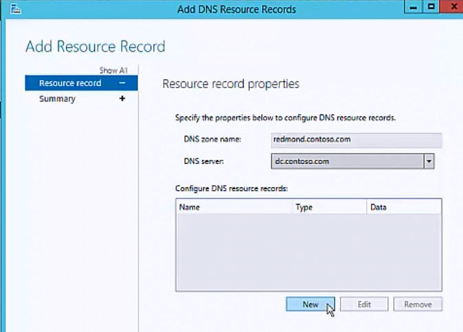
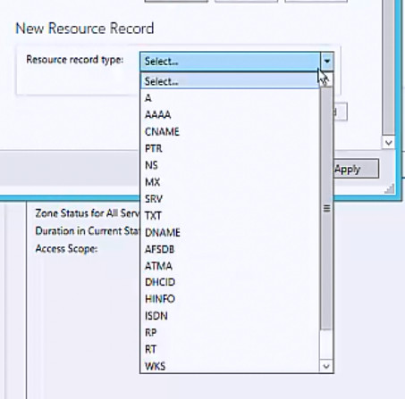

# Add a DNS Resource Record

>Applies to: Windows Server (Semi-Annual Channel), Windows Server 2016

You can use this topic to add one or more new DNS resource records by using the IPAM client console.  
  
Membership in **Administrators**, or equivalent, is the minimum required to perform this procedure.  
  
### To add a DNS resource record  
  
1.  In Server Manager, click  **IPAM**. The IPAM client console appears.  
  
2.  In the navigation pane, in **MONITOR AND MANAGE**, click **DNS Zones**.  The navigation pane divides into an upper navigation pane and a lower navigation pane.  
  
3.  In the lower navigation pane, click **Forward Lookup**. All IPAM-managed DNS Forward Lookup zones are displayed in the display pane search results. Right-click the zone where you want to add a resource record, and then click **Add DNS resource record**.  
  
    
  
4.  The **Add DNS Resource Records** dialog box opens. In **Resource record properties**, click **DNS server** and select the DNS server where you want to add one or more new resource records. In **Configure DNS resource records**, click **New**.  
  
      
  
5.  The dialog box expands to reveal **New Resource Record**. Click **Resource record type**.  
  
      
  
6.  The list of resource record types is displayed. Click the resource record type that you want to add.  
  
      
  
7.  In **New Resource Record,** in **Name**, type a resource record name. In **IP Address**, type an IP address, and then select the resource record properties that are appropriate for your deployment. Click **Add Resource Record**.  
  
      
  
8.  If you do not want to create additional new resource records, click **OK**. If you want to create additional new resource records, click **New**.  
  
    
  
9. The dialog box expands to reveal **New Resource Record**. Click **Resource record type**. The list of resource record types is displayed. Click the resource record type that you want to add.  
  
10. In **New Resource Record,** in **Name**, type a resource record name. In **IP Address**, type an IP address, and then select the resource record properties that are appropriate for your deployment. Click **Add Resource Record**.  
  
      
  
11. If you want to add more resource records, repeat the process for creating records. When you are done creating new resource records, click **Apply**.  
  
      
  
12. The **Add Resource Record** dialog box displays a resource records summary while IPAM creates the resource records on the DNS server that you specified. When the records are successfully created, the **Status** of the record is **Success**.  
  
      
  
13. Click **OK**.  
  
## See Also  
[DNS Resource Record Management](DNS-Resource-Record-Management.md)  
[Manage IPAM](Manage-IPAM.md)  
  

