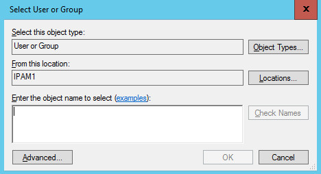
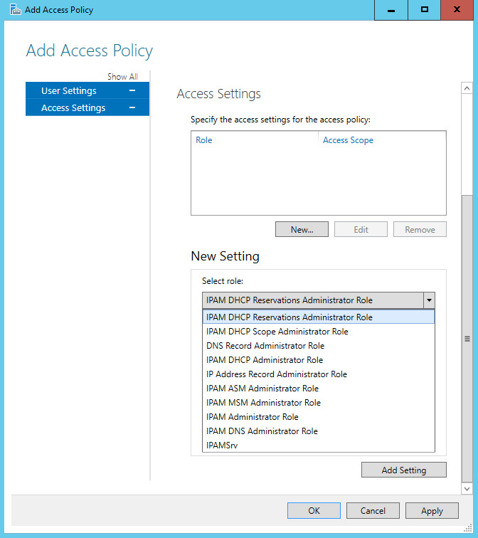

# Create an Access Policy

>Applies to: Windows Server (Semi-Annual Channel), Windows Server 2016

You can use this topic to create an access policy in the IPAM client console.  
  
Membership in **Administrators**, or equivalent, is the minimum required to perform this procedure.  
  
> [!NOTE]  
> You can create an access policy for a specific user or for a user group in Active Directory. When you create an access policy, you must select either a built-in IPAM role or a custom role that you have created. For more information on custom roles, see [Create a User Role for Access Control](../../technologies/ipam/Create-a-User-Role-for-Access-Control.md).  
  
### To create an access policy  
  
1.  In Server Manager, click  **IPAM**. The IPAM client console appears.  
  
2.  In the navigation pane, click **ACCESS CONTROL**. In the lower navigation pane, right-click **Access Policies**, and then click **Add Access Policy**.  
  
      
  
3.  The **Add Access Policy** dialog box opens. In **User Settings**, click **Add**.  
  
      
  
4.  The **Select User or Group** dialog box opens. Click **Locations**.  
  
      
  
5.  The **Locations** dialog box opens. Browse to the location that contains the user account, select the location, and then click **OK**. The **Locations** dialog box closes.  
  
      
  
6.  In the **Select User or Group** dialog box, in **Enter the object name to select**, type the user account name for which you want to create an access policy. Click **OK**.  
  
7.  In **Add Access Policy**, in **User Settings**, **User alias** now contains the user account to which the policy applies. In **Access Settings**, click **New**.  
  
      
  
8.  In **Add Access Policy**, **Access Settings** changes to **New Setting**.  
  
      
  
9. Click **Select role** to expand the list of roles. Select one of the built-in roles or, if you have created new roles, select one of the roles that you created. For example, if you created the IPAMSrv role to apply to the user, click **IPAMSrv**.  
  
      
  
10. Click **Add Setting**.  
  
      
  
11. The role is added to the access policy. To create additional access policies, click **Apply**, and then repeat these steps for each policy that you want to create. If you do not want to create additional policies, click **OK**.  
  
      
  
12. In the IPAM client console display pane, verify that the new access policy is created.  
  
      
  
## See Also  
[Role-based Access Control](Role-based-Access-Control.md)  
[Manage IPAM](Manage-IPAM.md)  
  

