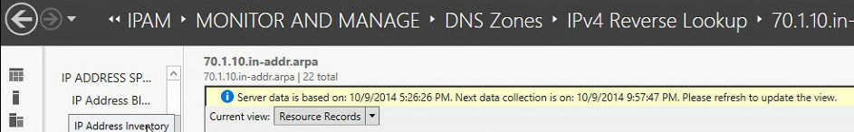

# DNS Resource Record Management

>Applies to: Windows Server (Semi-Annual Channel), Windows Server 2016

This topic provides information about managing DNS resource records by using IPAM.  
  
> [!NOTE]  
> In addition to this topic, the following DNS resource record management topics are available in this section.  
>   
> -   [Add a DNS Resource Record](../../technologies/ipam/Add-a-DNS-Resource-Record.md)  
> -   [Delete DNS Resource Records](../../technologies/ipam/Delete-DNS-Resource-Records.md)  
> -   [Filter the View of DNS Resource Records](../../technologies/ipam/Filter-the-View-of-DNS-Resource-Records.md)  
> -   [View DNS Resource Records for a Specific IP Address](../../technologies/ipam/View-DNS-Resource-Records-for-a-Specific-IP-Address.md)  
  
## Resource record management overview  
When you deploy IPAM in  Windows Server 2016, you can perform server discovery to add DHCP and DNS servers to the IPAM server management console. The IPAM server then dynamically collects DNS data every six hours from the DNS servers that it is configured to manage. IPAM maintains a local database where it stores this DNS data. IPAM provides you with notification of the day and time that the server data was collected, as well as telling you the next day and time when data collection from DNS servers will occur.  
  
The yellow status bar in the following illustration shows the user interface location of IPAM notifications.  
  
  
  
The DNS data that is collected includes DNS zone and resource record information. You can configure IPAM to collect zone information from your preferred DNS server.  IPAM collects both file-based and Active Directory zones.  
  
> [!NOTE]  
> IPAM collects data solely from domain-joined Microsoft DNS servers. Third party DNS servers and non-domain joined servers are not supported by IPAM.  
  
Following is a list of DNS resource record types that are collected by IPAM.  
  
-   AFS database  
  
-   ATM Address  
  
-   CNAME  
  
-   DHCID  
  
-   DNAME  
  
-   Host A or AAAA  
  
-   Host Information  
  
-   ISDN  
  
-   MX  
  
-   Name Servers  
  
-   Pointer (PTR)  
  
-   Responsible person  
  
-   Route Through  
  
-   Service Location  
  
-   SOA  
  
-   SRV  
  
-   Text  
  
-   Well Known Services  
  
-   WINS  
  
-   WINS-R  
  
-   X.25  
  
In  Windows Server 2016, IPAM provides integration between IP address inventory, DNS Zones, and DNS resource records:  
  
-   You can use IPAM to automatically build an IP address inventory from DNS resource records.  
  
-   You can manually create an IP address inventory from DNS A and AAAA resource records.  
  
-   You can view DNS resource records for a specific DNS zone, and filter the records based on type, IP address, resource record data, and other filtering options.  
  
-   IPAM automatically creates a mapping between IP address ranges and DNS Reverse Look-up Zones.  
  
-   IPAM creates IP addresses for the PTR records that are present in the reverse look-up zone and which are included in that IP address range. You can also manually modify this mapping if needed.  
  
IPAM allows you to perform the following operations on resource records from the IPAM console.  
  
-   Create DNS resource records  
  
-   Edit DNS resource records  
  
-   Delete DNS resource records  
  
-   Create associated resource records  
  
IPAM automatically logs all DNS configuration changes that you make using the IPAM console.  
  
## See Also  
[Manage IPAM](Manage-IPAM.md)  
  

