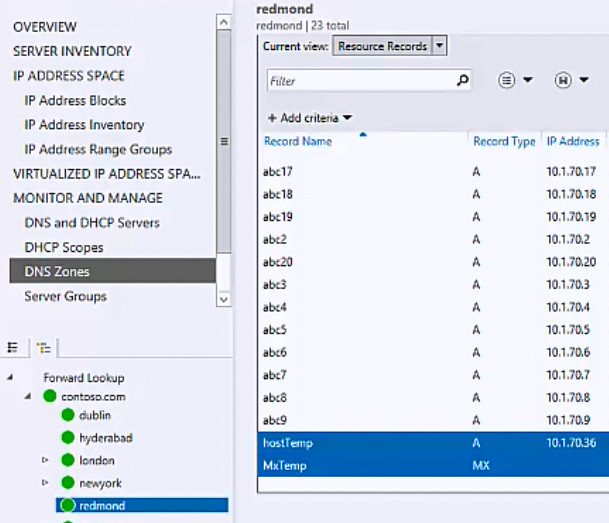
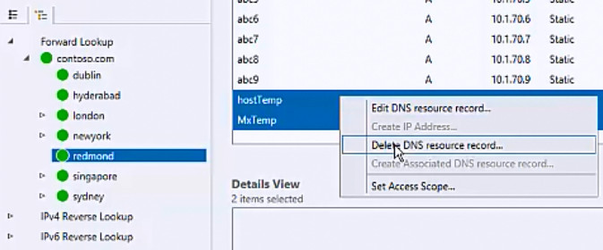
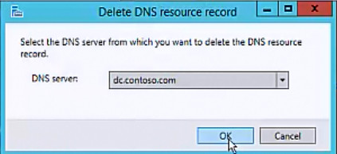

# Delete DNS Resource Records

You can use this topic to delete one or more DNS resource records by using the IPAM client console.

Membership in **Administrators**, or equivalent, is the minimum required to perform this procedure.

## To delete DNS resource records

1.  In Server Manager, click  **IPAM**. The IPAM client console appears.

2.  In the navigation pane, in **MONITOR AND MANAGE**, click **DNS Zones**.  The navigation pane divides into an upper navigation pane and a lower navigation pane.

3.  Click to expand **Forward Lookup** and the domain where the zone and resource records that you want to delete are located. Click on the zone, and in the display pane, click **Current view**. Click **Resource Records**.

1. In the display pane, locate and select the resource records that you want to delete.

   
   
1. Right-click the selected records, and then click **Delete DNS resource record**.

   
   
1. The **Delete DNS Resource Record** dialog box opens. Verify that the correct DNS server is selected. If it isn't, click **DNS server** and select the server from which you want to delete the resource records. Click **OK**. IPAM deletes the resource records from the DNS server.

   
   
## See Also

- [DNS Resource Record Management](DNS-Resource-Record-Management.md)
- [Manage IPAM](Manage-IPAM.md)

