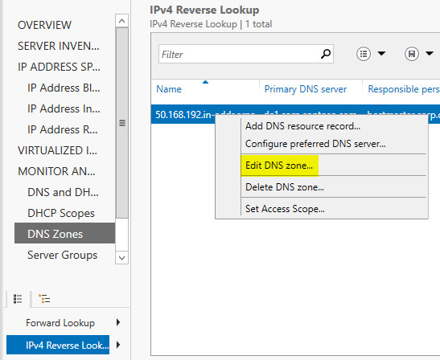
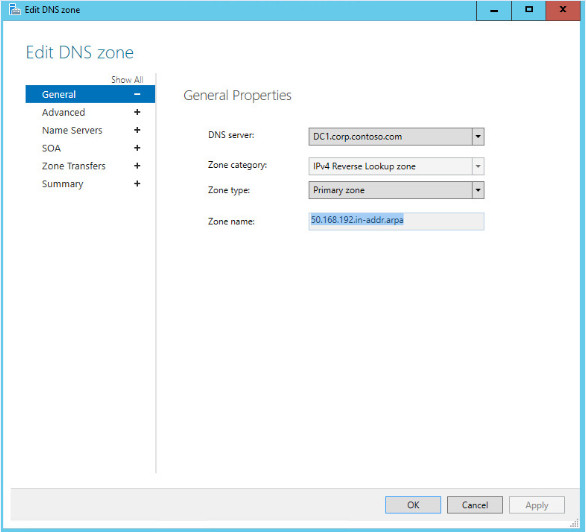

# Edit a DNS Zone

>Applies to: Windows Server (Semi-Annual Channel), Windows Server 2016

You can use this topic to edit a DNS zone in the IPAM client console.  
  
Membership in **Administrators**, or equivalent, is the minimum required to perform this procedure.  
  
### To edit a DNS zone  
  
1.  In Server Manager, click **IPAM**. The IPAM client console appears.  
  
2.  In the navigation pane, in **MONITOR AND MANAGE**, click **DNS Zones**. The navigation pane divides into an upper navigation pane and a lower navigation pane.  
  
3.  In the lower navigation pane, make one of the following selections:  
  
    -   Forward Lookup  
  
    -   IPv4 Reverse Lookup  
  
    -   IPv6 Reverse Lookup  
  
4.  For example, select IPv4 Reverse Lookup.  
  
      
  
5.  In the display pane, right-click the zone that you want to edit, and then click **Edit DNS Zone**.  
  
      
  
6.  The **Edit DNS Zone** dialog box opens with the **General** page selected. If needed, edit the General zone properties: **DNS server**, **Zone category**, and **Zone type**, and then click **Apply** or, if your edits are complete, **OK**.  
  
      
  
7.  In the **Edit DNS Zone** dialog box, click **Advanced**. The **Advanced** zone properties page opens. If needed, edit the properties that you want to change, and then click **Apply** or, if your edits are complete, **OK**.  
  
      
  
8.  If needed, select the additional zone properties page names (Name Servers, SOA, Zone Transfers), make your edits, and click **Apply** or **OK**. To review all of your zone edits, click **Summary**, and then click **OK**.  
  
## See Also  
[DNS Zone Management](DNS-Zone-Management.md)  
[Manage IPAM](Manage-IPAM.md)  
  

