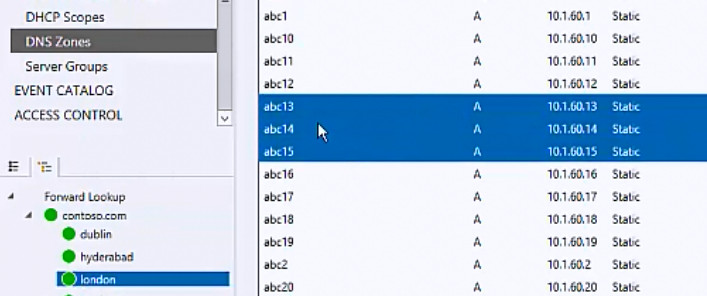
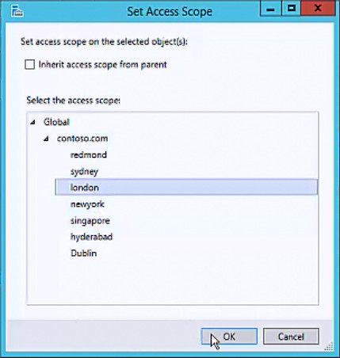

# Set Access Scope for DNS Resource Records

>Applies to: Windows Server (Semi-Annual Channel), Windows Server 2016

You can use this topic to set the access scope for a DNS resource records by using the IPAM client console.  
  
Membership in **Administrators**, or equivalent, is the minimum required to perform this procedure.  
  
### To set access scope for DNS resource records  
  
1.  In Server Manager, click  **IPAM**. The IPAM client console appears.  
  
2.  In the navigation pane, click **DNS Zones**.  In the lower navigation pane, expand **Forward Lookup** and browse to and select the zone that contains the resource records whose access scope you want to change.  
  
3.  In the display pane, locate and select the resource records whose access scope you want to change.  
  
      
  
4.  Right-click the selected DNS resource records, and then click **Set Access Scope**.  
  
      
  
5.  The **Set Access Scope** dialog box opens. If required for your deployment, click to deselect **Inherit access scope from parent**. In **Select the access scope**, select an item, and then click **OK**.  
  
      
  
## See Also  
[Role-based Access Control](Role-based-Access-Control.md)  
[Manage IPAM](Manage-IPAM.md)  
  

