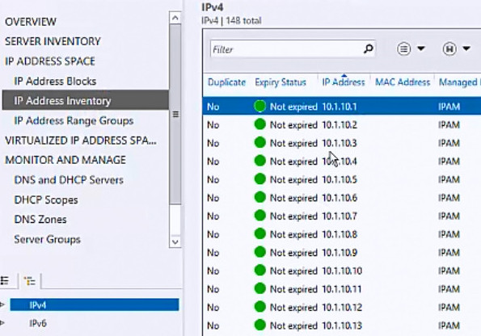
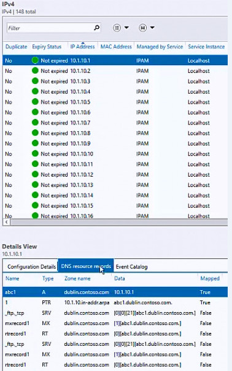

# View DNS Resource Records for a Specific IP Address

>Applies to: Windows Server (Semi-Annual Channel), Windows Server 2016

You can use this topic to view the DNS resource records that are associated with the IP Address that you choose.  
  
Membership in **Administrators**, or equivalent, is the minimum required to perform this procedure.  
  
### To view resource records for an IP Address  
  
1.  In Server Manager, click  **IPAM**. The IPAM client console appears.  
  
2.  In the navigation pane, in **IP ADDRESS SPACE**, click **IP Address Inventory**. In the lower navigation pane, click either **IPv4** or **IPv6**. The IP address inventory appears in the display pane search view. Locate and select the IP address whose DNS resource records you want to view.  
  
      
  
3.  In the display pane **Details View**, click **DNS resource records**. The resource records that are associated with the selected IP address are displayed.  
  
      
  
## See Also  
[DNS Resource Record Management](DNS-Resource-Record-Management.md)  
[Manage IPAM](Manage-IPAM.md)  
  

