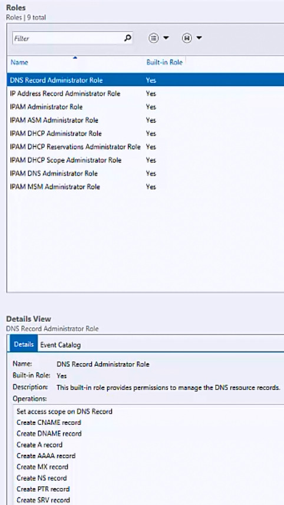

# View Roles and Role Permissions

>Applies to: Windows Server (Semi-Annual Channel), Windows Server 2016

You can use this topic to view Access Control user roles in the IPAM client console.  
  
Membership in **Administrators**, or equivalent, is the minimum required to perform this procedure.  
  
### To view Access Control roles  
  
1.  In Server Manager, click  **IPAM**. The IPAM client console appears.  
  
2.  In the navigation pane, click **ACCESS CONTROL**.  
  
3.  In the lower navigation pane, click **Roles**. In the display pane, the roles are listed.  
  
      
  
4.  Select the role whose permissions you want to view. In the lower details pane, the operations that are permitted for the role are displayed.  
  
      
  
## See Also  
[Role-based Access Control](Role-based-Access-Control.md)  
[Manage IPAM](Manage-IPAM.md)  
  

