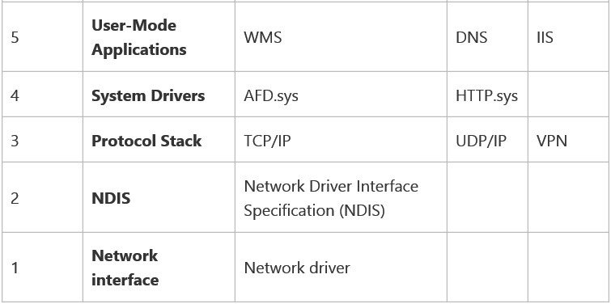

# Network Subsystem Performance Tuning

>Applies to: Windows Server (Semi-Annual Channel), Windows Server 2016

You can use this topic for an overview of the network subsystem and for links to other topics in this guide.

>[!NOTE]
>In addition to this topic, the following sections of this guide provide performance tuning recommendations for network devices and the network stack.
> - [Choosing a Network Adapter](net-sub-choose-nic.md)
> - [Configure the Order of Network Interfaces](net-sub-interface-metric.md)
> - [Performance Tuning Network Adapters](net-sub-performance-tuning-nics.md)
> - [Network-Related Performance Counters](net-sub-performance-counters.md)
> - [Performance Tools for Network Workloads](net-sub-performance-tools.md)

Performance tuning the network subsystem, particularly for network intensive workloads, can involve each layer of the network architecture, which is also called the network stack. These layers are broadly divided into the following sections.

1. **Network interface**. This is the lowest layer in the network stack, and contains the network driver that communicates directly with the network adapter.

2. **Network Driver Interface Specification (NDIS)**. NDIS exposes interfaces for the driver below it and for the layers above it, such as the Protocol Stack.
  
3. **Protocol Stack**. The protocol stack implements protocols such as TCP/IP and UDP/IP. These layers expose the transport layer interface for layers above them.
  
4. **System Drivers**. These are typically clients that use a transport data extension (TDX) or Winsock Kernel (WSK) interface to expose interfaces to user-mode applications. The WSK interface was introduced in Windows Server 2008 and Windows&reg; Vista, and it is exposed by AFD.sys. The interface improves performance by eliminating the switching between user mode and kernel mode.
  
5. **User-Mode Applications**. These are typically Microsoft solutions or custom applications.

The table below provides a vertical illustration of the layers of the network stack, including examples of items that run in each layer.  

