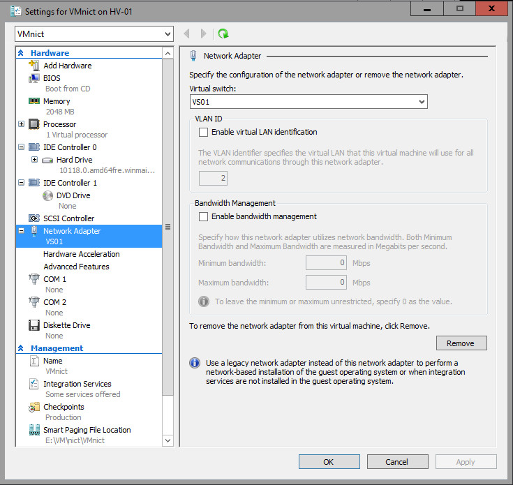
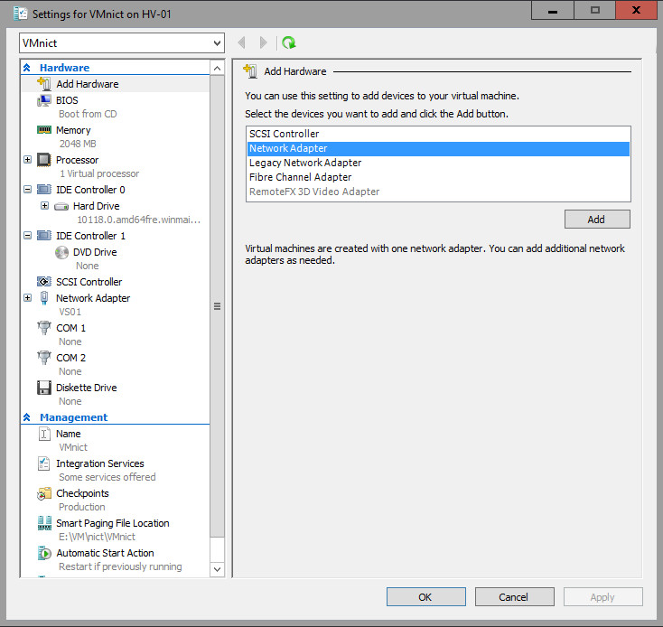
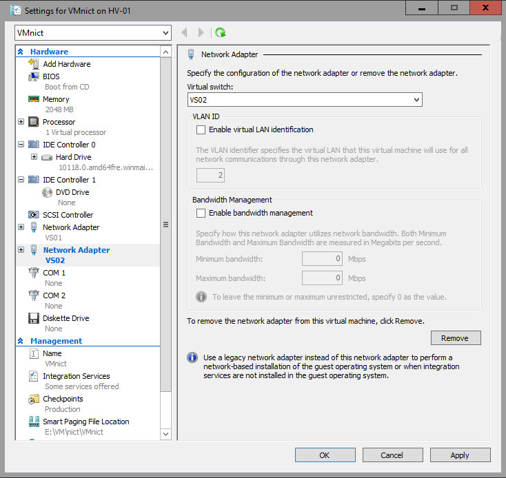

# Create a new NIC Team on a host computer or VM

>Applies to: Windows Server (Semi-Annual Channel), Windows Server 2016

In this topic, you create a new NIC Team on a host computer or in a Hyper-V virtual machine (VM) running Windows Server 2016.  

## Network configuration requirements  
Before you can create a new NIC Team, you must deploy a Hyper-V host with two network adapters that connect to different physical switches. You must also configure the network adapters with IP addresses that are from the same IP address range.  

The physical switch, Hyper-V Virtual Switch, local area network (LAN), and NIC Teaming requirements for creating a NIC Team in a VM are:  

-   The computer running Hyper-V must have two or more network adapters.  

-   If connecting the network adapters to multiple physical switches, the physical switches must be on the same Layer 2 subnet.  

-   You must use Hyper-V Manager or Windows PowerShell to create two external Hyper-V Virtual Switches, each connected to a different physical network adapter.  

-   The VM must connect to both external virtual switches you create.  

-   NIC Teaming, in Windows Server 2016, supports teams with two members in VMs. You can create larger teams, but there is no support.

-   If you are configuring a NIC Team in a VM, you must select a **Teaming mode** of _Switch Independent_ and a **Load balancing mode** of _Address Hash_. 

## Step 1. Configure the physical and virtual network  
In this procedure, you create two external Hyper-V Virtual Switches, connect a VM to the switches, and then configure the VM connections to the switches.  

### Prerequisites

You must have membership in **Administrators**, or equivalent.  

### Procedure

1.  On the Hyper-V host, open Hyper-V Manager, and under Actions, click **Virtual Switch Manager**.  

     

2.  In Virtual Switch Manager, make sure **External** is selected, and then click **Create Virtual Switch**.  

     

3.  In Virtual Switch Properties, type a **Name** for the virtual switch, and add **Notes** as needed.  

4.  In **Connection type**, in **External network**, select the physical network adapter to which you want to attach the virtual switch.  

5.  Configure additional switch properties for your deployment, and then click **OK**.  

6.  Create a second external virtual switch by repeating the previous steps. Connect the second external switch to a different network adapter.  

7.  In Hyper-V Manager, under **Virtual Machines**, right-click the VM that you want to configure, and then click **Settings**.  

   The VM **Settings** dialog box opens.

8.  Ensure that the VM is not started. If it is started, perform a shutdown before configuring the VM.  

8.  In **Hardware**, click **Network Adapter**.  

     

9. In **Network Adapter** properties, select one of the virtual switches that you created in previous steps, and then click **Apply**.  

      

10. In **Hardware**, click to expand the plus sign (+) next to **Network Adapter**. 

11. Click **Advanced Features** to enable NIC Teaming by using the graphical user interface. 

    >[!TIP]
    >You can also enable NIC Teaming with a Windows PowerShell command: 
    >
    >```PowerShell
    >Set-VMNetworkAdapter -VMName <VMname> -AllowTeaming On
    >```

    a. Select **Dynamic** for MAC address. 

    b. Click to select **Protected network**. 

    c. Click to select **Enable this network adapter to be part of a team in the guest operating system**. 

    d. Click **OK**.  

      

13. To add a second network adapter, in Hyper-V Manager, in **Virtual Machines**, right-click the same VM, and then click **Settings**.  

    The VM **Settings** dialog box opens.

14. In **Add Hardware**, click **Network Adapter**, and then click **Add**.  

     

15. In **Network Adapter** properties, select the second virtual switch that you created in previous steps, and then click **Apply**.  

     

16. In **Hardware**, click to expand the plus sign (+) next to **Network Adapter**. 

17. Click **Advanced Features**, scroll down to **NIC Teaming**, and click to select **Enable this network adapter to be part of a team in the guest operating system**. 

18. Click **OK**.  

_**Congratulations!**_  You have configured the physical and virtual network.  Now you can proceed to creating a new NIC Team.  

## Step 2. Create a new NIC Team

When you create a new NIC Team, you must configure the NIC Team properties:  

-   Team name  

-   Member adapters  

-   Teaming mode  

-   Load balancing mode  

-   Standby adapter  

You can also optionally configure the primary team interface and configure a virtual LAN (VLAN) number.  

For more details on these settings, see [NIC Teaming settings](nic-teaming-settings.md).

### Prerequisites

You must have membership in **Administrators**, or equivalent.  

### Procedure

1. In Server Manager, click **Local Server**.  

2. In the **Properties** pane, in the first column, locate **NIC Teaming**, and then click the **Disabled** link.  

   The **NIC Teaming** dialog box opens.

   

3. In **Adapters and Interfaces**, select the one or more network adapters that you want to add to a NIC Team.  

4. Click **TASKS**, and click **Add to New Team**.  

   The **New team** dialog box opens and displays network adapters and team members.

5. In **Team name**, type a name for the new NIC Team, and then click **Additional properties**.  

6. In **Additional properties**, select values for:

   - **Teaming mode**. The options for Teaming mode are **Switch Independent** and **Switch Dependent**. The Switch Dependent mode includes **Static Teaming** and **Link Aggregation Control Protocol (LACP)**. 

     - **Switch Independent.** [!INCLUDE [switch-independent-shortdesc-include](../../includes/switch-independent-shortdesc-include.md)]

     - **Switch Dependent.** [!INCLUDE [switch-dependent-shortdesc-include](../../includes/switch-dependent-shortdesc-include.md)] 


       |                                              |                                                                                                                                                                                                                                                                                                                                                                                                                                                                                                                                                                                                                                                                                      |
       |----------------------------------------------|--------------------------------------------------------------------------------------------------------------------------------------------------------------------------------------------------------------------------------------------------------------------------------------------------------------------------------------------------------------------------------------------------------------------------------------------------------------------------------------------------------------------------------------------------------------------------------------------------------------------------------------------------------------------------------------|
       |              **Static Teaming**              |                                                                                                                                              Requires you to manually configure both the switch and the host to identify which links form the team. Because this is a statically configured solution, there is no additional protocol to assist the switch and the host to identify incorrectly plugged cables or other errors that could cause the team to fail to perform. This mode is typically supported by server-class switches.                                                                                                                                              |
       | **Link Aggregation Control Protocol (LACP)** | Unlike Static Teaming, LACP Teaming mode dynamically identifies links that are connected between the host and the switch. This dynamic connection enables the automatic creation of a team and, in theory but rarely in practice, the expansion and reduction of a team simply by the transmission or receipt of LACP packets from the peer entity. All server-class switches support LACP, and all require the network operator to administratively enable LACP on the switch port. When you configure a Teaming mode of LACP, NIC Teaming always operates in LACP's Active mode with a short timer.  No option is presently available to modify the timer or change the LACP mode. |

       ---

   - **Load balancing mode**. The options for Load Balancing distribution mode are **Address Hash**, **Hyper-V Port**, and **Dynamic**.

     - **Address Hash.** [!INCLUDE [address-hash-shortdesc-include](../../includes/address-hash-shortdesc-include.md)]

     - **Hyper-V Port.** [!INCLUDE [hyper-v-port-shortdesc-include](../../includes/hyper-v-port-shortdesc-include.md)]

     - **Dynamic.** [!INCLUDE [dynamic-shortdesc-include](../../includes/dynamic-shortdesc-include.md)]

   - **Standby adapter**. The options for Standby Adapter are **None (all adapters Active)** or your selection of a specific network adapter in the NIC Team that acts as a Standby adapter.

   > [!TIP]  
   > If you are configuring a NIC Team in a virtual machine (VM), you must select a **Teaming mode** of _Switch Independent_ and a **Load balancing mode** of _Address Hash_.  

7. If you want to configure the primary team interface name or assign a VLAN number to the NIC Team, click the link to the right of **Primary team interface**.  

    The **New team interface** dialog box opens.

    

8. Depending on your requirements, do one of the following:  

   -   Provide a tNIC interface name.  

   -   Configure VLAN membership: click **Specific VLAN** and type the VLAN information. For example, if you want to add this NIC Team to the accounting VLAN number 44, Type Accounting 44 - VLAN.   

9. Click **OK**.  

_**Congratulations!**_  You've created a new NIC Team on a host computer or VM.

## Related topics

- [NIC Teaming](NIC-Teaming.md): In this topic, we give you an overview of Network Interface Card (NIC) Teaming in Windows Server 2016. NIC Teaming allows you to group between one and 32 physical Ethernet network adapters into one or more software-based virtual network adapters. These virtual network adapters provide fast performance and fault tolerance in the event of a network adapter failure.   

- [NIC Teaming MAC address use and management](NIC-Teaming-MAC-Address-Use-and-Management.md): When you configure a NIC Team with switch independent mode and either address hash or dynamic load distribution, the team uses the media access control (MAC) address of the primary NIC Team member on outbound traffic. The primary NIC Team member is a network adapter selected by the operating system from the initial set of team members.

- [NIC Teaming settings](nic-teaming-settings.md): In this topic, we give you an overview of the NIC Team properties such as teaming and load balancing modes. We also give you details about the Standby adapter setting and the Primary team interface property. If you have at least two network adapters in a NIC Team, you do not need to designate a Standby adapter for fault tolerance.

- [Troubleshooting NIC Teaming](Troubleshooting-NIC-Teaming.md): In this topic, we discuss ways to troubleshoot NIC Teaming, such as hardware, physical switch securities, and disabling or enabling network adapters using Windows PowerShell. 

---