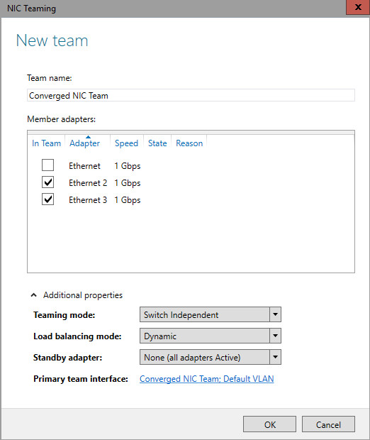

# Create a New NIC Team

>Applies To: Windows Server (Semi-Annual Channel), Windows Server 2016

You can use this topic to create a new NIC Team on a host computer or in a Hyper-V virtual machine (VM) that is running  Windows Server 2016.  
  
> [!IMPORTANT]  
> If you are creating a new NIC Team in a VM, review the topic [Create a New NIC Team in a VM](../../technologies/nic-teaming/Create-a-New-NIC-Team-in-a-VM.md) before you perform this procedure.  
  
Membership in **Administrators**, or equivalent, is the minimum required to perform this procedure.  
  
### To create a new NIC Team  
  
1.  In Server Manager, click **Local Server**.  
  
2.  In the **Properties** pane, in the first column, locate **NIC Teaming**, and then click the link **Disabled** to the right. The **NIC Teaming** dialog box opens.  
  
      
  
3.  In **Adapters and Interfaces**, select the network adapters that you want to add to a NIC Team. For example, if you want to add the adapters Ethernet 2 and Ethernet 3 to a new NIC Team, make the selection per the illustration below.  
  
      
  
4.  Click **TASKS**, and then click **Add to New Team**.  
  
      
  
5.  The **New team** dialog box opens and displays network adapters and team members. In **Team name**, type a name for the new NIC Team, and then click **Additional properties**.  
  
      
  
6.  In **Additional properties**, select values for **Teaming mode**, **Load balancing mode**, and **Standby adapter**. In most cases, the highest performing load balancing mode is **Dynamic**. For more detailed explanations of these modes, see the topic [Create a New NIC Team on a Host Computer or VM](../../technologies/nic-teaming/Create-a-New-NIC-Team-on-a-Host-Computer-or-VM.md).  
  
    > [!IMPORTANT]  
    > If you are configuring a NIC Team in a virtual machine (VM), you must select a **Teaming mode** of **Switch Independent** and a **Load balancing mode** of **Address Hash**.  
  
      
  
7.  If you want to configure the primary team interface name or assign a VLAN number to the NIC Team, click the link to the right of **Primary team interface**. The **New team interface** dialog box opens.  
  
      
  
8.  Depending on your requirements, take one of the following actions:  
  
    -   To provide a tNIC interface name, type an interface name.  
  
    -   To configure VLAN membership, click **Specific VLAN**. Type the VLAN information in the first section of the dialog box, which is highlighted in the illustration below. For example, if you want to add this NIC Team to the accounting VLAN number 44, Type Accounting 44 - VLAN. Next, to the right of **Specific VLAN**, type the VLAN number that you want to use. For example, type **44**.  
  
      
  
9. Click **OK**.  
  
## See Also  
[Create a New NIC Team on a Host Computer or VM](../../technologies/nic-teaming/Create-a-New-NIC-Team-on-a-Host-Computer-or-VM.md)  
[Create a New NIC Team in a VM](../../technologies/nic-teaming/Create-a-New-NIC-Team-in-a-VM.md)  
[NIC Teaming](NIC-Teaming.md)  
  

