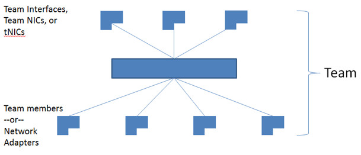

# NIC Teaming

>Applies to: Windows Server (Semi-Annual Channel), Windows Server 2016

In this topic, we give you an overview of Network Interface Card (NIC) Teaming in Windows Server 2016. NIC Teaming allows you to group between one and 32 physical Ethernet network adapters into one or more software-based virtual network adapters. These virtual network adapters provide fast performance and fault tolerance in the event of a network adapter failure.  
  
> [!IMPORTANT]
> You must install NIC Team member network adapters in the same physical host computer. 

> [!TIP]  
> A NIC team that contains only one network adapter cannot provide load balancing and failover. However, with one network adapter, you can use NIC Teaming for separation of network traffic when you are also using virtual Local Area Networks (VLANs).  
  
When you configure network adapters into a NIC team, they connect into the NIC teaming solution common core, which then presents one or more virtual adapters (also called team NICs [tNICs] or team interfaces) to the operating system. 

Since Windows Server 2016 supports up to 32 team interfaces per team, there are a variety of algorithms that distribute outbound traffic (load) between the NICs.  The following illustration depicts a NIC Team with multiple tNICs.  
  
  
  
Also, you can connect your teamed NICs to the same switch or different switches. If you connect NICs to different switches, both switches must be on the same subnet.  
  
## Availability  
NIC Teaming is available in all versions of Windows Server 2016. You can use a variety of tools to manage NIC Teaming from computers running a client operating system, such as:
•	Windows PowerShell cmdlets
•	Remote Desktop
•	Remote Server Administration Tools  
  
## Supported and Unsupported NICs   
You can use any Ethernet NIC that has passed the Windows Hardware Qualification and Logo test (WHQL tests) in a NIC Team in Windows Server 2016.  
  
You can not place the following NICs in a NIC team:
  
-   Hyper-V virtual network adapters that are Hyper-V Virtual Switch ports exposed as NICs in the host partition.  
  
    > [!IMPORTANT]  
    > Do not place Hyper-V virtual NICs exposed in the host partition (vNICs) in a team. Teaming of vNICs inside of the host partition is not supported in any configuration. Attempts to team vNICs might cause a complete loss of communication if network failures occur.  
  
-   Kernel debug network adapter (KDNIC).  
  
-   NICs used for network boot.  
  
-   NICs that use technologies other than Ethernet, such as WWAN, WLAN/Wi-Fi, Bluetooth, and Infiniband, including Internet Protocol over Infiniband (IPoIB) NICs.  
  
## Compatibility  
NIC teaming is compatible with all networking technologies in Windows Server 2016 with the following exceptions.  
  
-   **Single-root I/O virtualization (SR-IOV)**. For SR-IOV, data is delivered directly to the NIC without passing it through the networking stack (in the host operating system, in the case of virtualization). Therefore, it is not possible for the NIC team to inspect or redirect the data to another path in the team.  
  
-   **Native host Quality of Service (QoS)**. When you set QoS policies on a native or host system, and those policies invoke minimum bandwidth limitations, the overall throughput for a NIC team is less than it would be without the bandwidth policies in place.  
  
-   **TCP Chimney**. TCP Chimney is not supported with NIC teaming because TCP Chimney offloads the entire networking stack directly to the NIC.  
  
-   **802.1X Authentication**. You should not use 802.1X Authentication with NIC Teaming because some switches do not permit the configuration of both 802.1X Authentication and NIC Teaming on the same port.  
  
To learn about using NIC Teaming within virtual machines (VMs) that run on a Hyper-V host, see [Create a new NIC Team on a host computer or VM](Create-a-New-NIC-Team-on-a-Host-Computer-or-VM.md).
  
## Virtual Machine Queues (VMQs)  

VMQs is a NIC feature that allocates a queue for each VM.  Anytime you have Hyper-V enabled; you must also enable VMQ. In Windows Server 2016, VMQs use NIC Switch vPorts with a single queue assigned to the vPort to provide the same functionality. 

Depending on the switch configuration mode and the load distribution algorithm, NIC teaming presents either the smallest number of available and supported queues by any adapter in the team (Min-Queues mode) or the total number of queues available across all team members (Sum-of-Queues mode).  

If the team is in Switch-Independent teaming mode and you set the load distribution to Hyper-V Port mode or Dynamic mode, the number of queues reported is the sum of all the queues available from the team members (Sum-of-Queues mode). Otherwise, the number of queues reported is the smallest number of queues supported by any member of the team (Min-Queues mode).

Here's why:  
  
-   When the switch-independent team is in Hyper-V Port mode or Dynamic mode the inbound traffic for a Hyper-V switch port (VM) always arrives on the same team member. The host can predict/control which member receives the traffic for a particular VM so NIC Teaming can be more thoughtful about which VMQ Queues to allocate on a particular team member. NIC Teaming, working with the Hyper-V switch, sets the VMQ for a VM on precisely one team member and know that inbound traffic hits that queue.  
  
-   When the team is in any switch dependent mode (static teaming or LACP teaming), the switch that the team is connected to controls the inbound traffic distribution. The host's NIC Teaming software can't predict which team member gets the inbound traffic for a VM and it may be that the switch distributes the traffic for a VM across all team members. As a result of the NIC Teaming software, working with the Hyper-V switch, programs a queue for the VM on every team member, not just one team member.  
  
-   When the team is in switch-independent mode and uses address hash load balancing, the inbound traffic always comes in on one NIC (the primary team member) - all of it on just one team member. Since other team members aren't dealing with inbound traffic, they get programmed with the same queues as the primary member so that if the primary member fails, any other team member can be used to pick up the inbound traffic, and the queues are already in place.  

- Most NICs have queues used for either Receive Side Scaling (RSS) or VMQ, but not at the same time. Some VMQ settings appear to be settings for RSS queues but are settings on the generic queues that both RSS and VMQ use depending on which feature is presently in use. Each NIC has, in its advanced properties, values for *RssBaseProcNumber and \*MaxRssProcessors. Following are a few VMQ settings that provide better system performance.  
  
-   Ideally, each NIC should have the *RssBaseProcNumber set to an even number greater than or equal to two (2). The first physical processor, Core 0 (logical processors 0 and 1), typically does most of the system processing so the network processing should steer away from this physical processor. Some machine architectures don't have two logical processors per physical processor, so for such machines, the base processor should be greater than or equal to 1. If in doubt assume your host is using a 2 logical processor per physical processor architecture.  
  
-   If the team is in Sum-of-Queues mode the team members' processors should be non-overlapping. For example, in a 4-core host (8 logical processors) with a team of 2 10Gbps NICs, you could set the first one to use the base processor of 2 and to use 4 cores; the second would be set to use base processor 6 and use 2 cores.  
  
-   If the team is in Min-Queues mode the processor sets used by the team members must be identical.  

  
## Hyper-V Network Virtualization (HNV)  
NIC Teaming is fully compatible with Hyper-V Network Virtualization (HNV).  The HNV management system provides information to the NIC Teaming driver that allows NIC Teaming to distribute the load in a way that optimizes HNV traffic.  
  
## Live Migration  
NIC Teaming in VMs does not affect Live Migration. The same rules exist for Live Migration whether or not configuring NIC Teaming in the VM.  

## Virtual Local Area Networks (VLANs)
When you use NIC Teaming, creating multiple team interfaces allows a host to connect to different VLANs at the same time. 
Configure your environment using the following guidelines:
  
- Before you enable NIC Teaming, configure the physical switch ports connected to the teaming host to use trunk (promiscuous) mode. The physical switch should pass all traffic to the host for filtering without modifying the traffic.  

- Do not configure VLAN filters on the NICs by using the NIC advanced properties settings. Let the NIC Teaming software or the Hyper-V Virtual Switch (if present) perform VLAN filtering.  
  
### Use VLANs with NIC Teaming in a VM  
When a team connects to a Hyper-V Virtual Switch, all VLAN segregation must be done in the Hyper-V Virtual Switch rather than in NIC Teaming.  

Plan to use VLANs in a VM configured with a NIC Team using the following guidelines:
  
-	The preferred method of supporting multiple VLANs in a VM is to configure the VM with multiple ports on the Hyper-V Virtual Switch and associate each port with a VLAN. Never team these ports in the VM because doing so causes network communication problems.  

-	If the VM has multiple SR-IOV Virtual Functions (VFs), ensure that they are on the same VLAN before teaming them in the VM. It's easily possible to configure the different VFs to be on different VLANs and doing so causes network communication problems.  
 
  
### Manage network interfaces and VLANs 
If you must have more than one VLAN exposed into a guest operating system, consider renaming the Ethernet interfaces to clarify VLAN assigned to the interface. For example, if you associate **Ethernet** interface with VLAN 12 and the **Ethernet 2** interface with VLAN 48, rename the interface Ethernet to **EthernetVLAN12** and the other to **EthernetVLAN48**. 

Rename interfaces by using the Windows PowerShell command **Rename-NetAdapter** or by performing the following procedure:
  
1.  In Server Manager, in **Properties** for the network adapter you want to rename, click the link to the right of the network adapter name. 
  
2.  Right-click the network adapter that you want to rename, and select  **Rename**.  
  
3.  Type the new name for the network adapter and press ENTER.  

## Virtual Machines (VMs)

If you want to use NIC Teaming in a VM, you must connect the virtual network adapters in the VM to external Hyper-V Virtual Switches only. Doing this allows the VM to sustain network connectivity even in the circumstance when one of the physical network adapters connected to one virtual switch fails or gets disconnected. Virtual network adapters connected to internal or private Hyper-V Virtual Switches are not able to connect to the switch when they are in a team, and networking fails for the VM.  
  
NIC Teaming in Windows Server 2016 supports teams with two members in VMs. You can create larger teams, but there is no support for larger teams. Every team member must connect to a different external Hyper-V Virtual Switch, and the VM's networking interfaces must be configured to allow teaming.

  
If you are configuring a NIC Team in a VM, you must select a **Teaming mode** of _Switch Independent_ and a **Load balancing mode** of _Address Hash_.   
  
  
## SR-IOV-Capable Network Adapters  
A NIC team in or under the Hyper-V host cannot protect SR-IOV traffic because it doesn't go through the Hyper-V Switch.  With the VM NIC Teaming option, you can configure two external Hyper-V Virtual Switches, each connected to its own SR-IOV-capable NIC.  
  
  
  
Each VM can have a virtual function (VF) from one or both SR-IOV NICs and, in the event of a NIC disconnect, failover from the primary VF to the backup adapter (VF). Alternately, the VM may have a VF from one NIC and a non-VF vmNIC connected to another virtual switch. If the NIC associated with the VF gets disconnected, the traffic can failover to the other switch without loss of connectivity.  
  
Because failover between NICs in a VM might result in traffic sent with the MAC address of the other vmNIC, each Hyper-V Virtual Switch port associated with a VM using NIC Teaming must be set to allow teaming. 

## Related topics

- [NIC Teaming MAC address use and management](NIC-Teaming-MAC-Address-Use-and-Management.md): When you configure a NIC Team with switch independent mode and either address hash or dynamic load distribution, the team uses the media access control (MAC) address of the primary NIC Team member on outbound traffic. The primary NIC Team member is a network adapter selected by the operating system from the initial set of team members.

- [NIC Teaming settings](nic-teaming-settings.md): In this topic, we give you an overview of the NIC Team properties such as teaming and load balancing modes. We also give you details about the Standby adapter setting and the Primary team interface property. If you have at least two network adapters in a NIC Team, you do not need to designate a Standby adapter for fault tolerance.
  
- [Create a new NIC Team on a host computer or VM](Create-a-New-NIC-Team-on-a-Host-Computer-or-VM.md): In this topic, you create a new NIC Team on a host computer or in a Hyper-V virtual machine (VM) running Windows Server 2016.

- [Troubleshooting NIC Teaming](Troubleshooting-NIC-Teaming.md): In this topic, we discuss ways to troubleshoot NIC Teaming, such as hardware, physical switch securities, and disabling or enabling network adapters using Windows PowerShell. 
 
