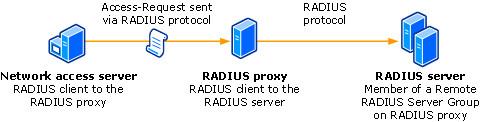

# Connection Request Processing

>Applies to: Windows Server (Semi-Annual Channel), Windows Server 2016

You can use this topic to learn about connection request processing in Network Policy Server in Windows Server 2016.

>[!NOTE]
>In addition to this topic, the following connection request processing documentation is available.
> - [Connection Request Policies](nps-crp-crpolicies.md)
> - [Realm Names](nps-crp-realm-names.md)
> - [Remote RADIUS Server Groups](nps-crp-rrsg.md)

You can use connection request processing to specify where the authentication of connection requests is performed - on the local computer or at a remote RADIUS server that is a member of a remote RADIUS server group. 

If you want the local server running Network Policy Server (NPS) to perform authentication for connection requests, you can use the default connection request policy without additional configuration. Based on the default policy, NPS authenticates users and computers that have an account in the local domain and in trusted domains.

If you want to forward connection requests to a remote NPS or other RADIUS server, create a remote RADIUS server group and then configure a connection request policy that forwards requests to that remote RADIUS server group. With this configuration, NPS can forward authentication requests to any RADIUS server, and users with accounts in untrusted domains can be authenticated.

The following illustration shows the path of an Access-Request message from a network access server to a RADIUS proxy, and then on to a RADIUS server in a remote RADIUS server group. On the RADIUS proxy, the network access server is configured as a RADIUS client; and on each RADIUS server, the RADIUS proxy is configured as a RADIUS client.

>[!NOTE]
>The network access servers that you use with NPS can be gateway devices that are compliant with the RADIUS protocol, such as 802.1X wireless access points and authenticating switches, servers running Remote Access that are configured as VPN or dial-up servers, or other RADIUS compatible devices.

If you want NPS to process some authentication requests locally while forwarding other requests to a remote RADIUS server group, configure more than one connection request policy.

To configure a connection request policy that specifies which NPS or RADIUS server group processes authentication requests, see Connection Request Policies.

To specify NPS or other RADIUS servers to which authentication requests are forwarded, see Remote RADIUS Server Groups.

## NPS as a RADIUS server connection request processing

When you use NPS as a RADIUS server, RADIUS messages provide authentication, authorization, and accounting for network access connections in the following way:

1. Access servers, such as dial-up network access servers, VPN servers, and wireless access points, receive connection requests from access clients. 

2. The access server, configured to use RADIUS as the authentication, authorization, and accounting protocol, creates an Access-Request message and sends it to the NPS. 

3. The NPS evaluates the Access-Request message. 

4. If required, the NPS sends an Access-Challenge message to the access server. The access server processes the challenge and sends an updated Access-Request to the NPS. 

5. The user credentials are checked and the dial-in properties of the user account are obtained by using a secure connection to a domain controller. 

6. The connection attempt is authorized with both the dial-in properties of the user account and network policies. 

7. If the connection attempt is both authenticated and authorized, the NPS sends an Access-Accept message to the access server. If the connection attempt is either not authenticated or not authorized, the NPS sends an Access-Reject message to the access server. 

8. The access server completes the connection process with the access client and sends an Accounting-Request message to the NPS, where the message is logged. 

9. The NPS sends an Accounting-Response to the access server. 

>[!NOTE]
>The access server also sends Accounting-Request messages during the time in which the connection is established, when the access client connection is closed, and when the access server is started and stopped.

## NPS as a RADIUS proxy connection request processing

When NPS is used as a RADIUS proxy between a RADIUS client and a RADIUS server, RADIUS messages for network access connection attempts are forwarded in the following way:

1. Access servers, such as dial-up network access servers, virtual private network (VPN) servers, and wireless access points, receive connection requests from access clients.

2. The access server, configured to use RADIUS as the authentication, authorization, and accounting protocol, creates an Access-Request message and sends it to the NPS that is being used as the NPS RADIUS proxy.

3. The NPS RADIUS proxy receives the Access-Request message and, based on the locally configured connection request policies, determines where to forward the Access-Request message.

4. The NPS RADIUS proxy forwards the Access-Request message to the appropriate RADIUS server.

5. The RADIUS server evaluates the Access-Request message.

6. If required, the RADIUS server sends an Access-Challenge message to the NPS RADIUS proxy, where it is forwarded to the access server. The access server processes the challenge with the access client and sends an updated Access-Request to the NPS RADIUS proxy, where it is forwarded to the RADIUS server.

7. The RADIUS server authenticates and authorizes the connection attempt.

8. If the connection attempt is both authenticated and authorized, the RADIUS server sends an Access-Accept message to the NPS RADIUS proxy, where it is forwarded to the access server. If the connection attempt is either not authenticated or not authorized, the RADIUS server sends an Access-Reject message to the NPS RADIUS proxy, where it is forwarded to the access server.

9. The access server completes the connection process with the access client and sends an Accounting-Request message to the NPS RADIUS proxy. The NPS RADIUS proxy logs the accounting data and forwards the message to the RADIUS server.

10. The RADIUS server sends an Accounting-Response to the NPS RADIUS proxy, where it is forwarded to the access server.

For more information about NPS, see [Network Policy Server (NPS)](nps-top.md).
