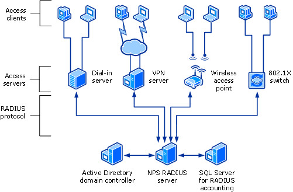
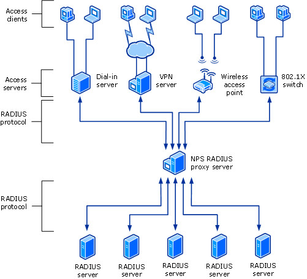

# Network Policy Server (NPS)

>Applies to: Windows Server (Semi-Annual Channel), Windows Server 2016, Windows Server 2019

You can use this topic for an overview of Network Policy Server in Windows Server 2016 and Windows Server 2019. NPS is installed when you install the Network Policy and Access Services (NPAS) feature in Windows Server 2016 and Server 2019.

> [!NOTE]
> In addition to this topic, the following NPS documentation is available.
> - [Network Policy Server Best Practices](nps-best-practices.md)
> - [Getting Started with Network Policy Server](nps-getstart-top.md)
> - [Plan Network Policy Server](nps-plan-top.md)
> - [Deploy Network Policy Server](nps-deploy.md)
> - [Manage Network Policy Server](nps-manage-top.md)
> - [Network Policy Server (NPS) Cmdlets in Windows PowerShell](https://technet.microsoft.com/library/jj872739.aspx) for Windows Server 2016 and Windows 10
> - [Network Policy Server (NPS) Cmdlets in Windows PowerShell](https://technet.microsoft.com/library/jj872739.aspx) for Windows Server 2012 R2 and Windows 8.1
> - [NPS Cmdlets in Windows PowerShell](https://technet.microsoft.com/library/jj872739.aspx) for Windows Server 2012 and Windows 8

Network Policy Server (NPS) allows you to create and enforce organization-wide network access policies for connection request authentication and authorization.

You can also configure NPS as a Remote Authentication Dial-In User Service (RADIUS) proxy to forward connection requests to a remote NPS or other RADIUS server so that you can load balance connection requests and forward them to the correct domain for authentication and authorization.

NPS allows you to centrally configure and manage network access authentication, authorization, and accounting with the following features:

- **RADIUS server**. NPS performs centralized authentication, authorization, and accounting for wireless, authenticating switch, remote access dial-up and virtual private network (VPN) connections. When you use NPS as a RADIUS server, you configure network access servers, such as wireless access points and VPN servers, as RADIUS clients in NPS. You also configure network policies that NPS uses to authorize connection requests, and you can configure RADIUS accounting so that NPS logs accounting information to log files on the local hard disk or in a Microsoft SQL Server database. For more information, see [RADIUS server](#radius-server).
- **RADIUS proxy**. When you use NPS as a RADIUS proxy, you configure connection request policies that tell the NPS which connection requests to forward to other RADIUS servers and to which RADIUS servers you want to forward connection requests. You can also configure NPS to forward accounting data to be logged by one or more computers in a remote RADIUS server group. To configure NPS as a RADIUS proxy server, see the following topics. For more information, see [RADIUS proxy](#radius-proxy).
	- [Configure Connection Request Policies](nps-crp-configure.md)
- **RADIUS accounting**. You can configure NPS to log events to a local log file or to a local or remote instance of Microsoft SQL Server. For more information, see [NPS logging](#nps-logging).

> [!IMPORTANT]
> Network Access Protection \(NAP\), Health Registration Authority \(HRA\), and Host Credential Authorization Protocol \(HCAP\) were deprecated in Windows Server 2012 R2, and are not available in Windows Server 2016. If you have a NAP deployment using operating systems earlier than Windows Server 2016, you cannot migrate your NAP deployment to Windows Server 2016.

You can configure NPS with any combination of these features. For example, you can configure one NPS as a RADIUS server for VPN connections and also as a RADIUS proxy to forward some connection requests to members of a remote RADIUS server group for authentication and authorization in another domain.

## Windows Server Editions and NPS

NPS provides different functionality depending on the edition of Windows Server that you install.

### Windows Server 2016 or Windows Server 2019 Standard/Datacenter Edition

With NPS in Windows Server 2016 Standard or Datacenter, you can configure an unlimited number of RADIUS clients and remote RADIUS server groups. In addition, you can configure RADIUS clients by specifying an IP address range.

> [!NOTE]
> The WIndows Network Policy and Access Services feature is not available on systems installed with a Server Core installation option.

The following sections provide more detailed information about NPS as a RADIUS server and proxy.

## RADIUS server and proxy

You can use NPS as a RADIUS server, a RADIUS proxy, or both.

### RADIUS server

NPS is the Microsoft implementation of the RADIUS standard specified by the Internet Engineering Task Force \(IETF\) in RFCs 2865 and 2866. As a RADIUS server, NPS performs centralized connection authentication, authorization, and accounting for many types of network access, including wireless, authenticating switch, dial-up and virtual private network \(VPN\) remote access, and router-to-router connections.

> [!NOTE]
> For information on deploying NPS as a RADIUS server, see [Deploy Network Policy Server](nps-deploy.md).

NPS enables the use of a heterogeneous set of wireless, switch, remote access, or VPN equipment. You can use NPS with the Remote Access service, which is available in Windows Server 2016.

NPS uses an Active Directory Domain Services \(AD DS\) domain or the local Security Accounts Manager (SAM) user accounts database to authenticate user credentials for connection attempts. When a server running NPS is a member of an AD DS domain, NPS uses the directory service as its user account database and is part of a single sign-on solution. The same set of credentials is used for network access control \(authenticating and authorizing access to a network\) and to log on to an AD DS domain.

> [!NOTE]
> NPS uses the dial-in properties of the user account and network policies to authorize a connection.

Internet service providers \(ISPs\) and organizations that maintain network access have the increased challenge of managing all types of network access from a single point of administration, regardless of the type of network access equipment used. The RADIUS standard supports this functionality in both homogeneous and heterogeneous environments. RADIUS is a client-server protocol that enables network access equipment (used as RADIUS clients) to submit authentication and accounting requests to a RADIUS server.

A RADIUS server has access to user account information and can check network access authentication credentials. If user credentials are authenticated and the connection attempt is authorized, the RADIUS server authorizes user access on the basis of specified conditions, and then logs the network access connection in an accounting log. The use of RADIUS allows the network access user authentication, authorization, and accounting data to be collected and maintained in a central location, rather than on each access server.

#### Using NPS as a RADIUS server

You can use NPS as a RADIUS server when:

- You are using an AD DS domain or the local SAM user accounts database as your user account database for access clients. 
- You are using Remote Access on multiple dial-up servers, VPN servers, or demand-dial routers and you want to centralize both the configuration of network policies and connection logging and accounting. 
- You are outsourcing your dial-up, VPN, or wireless access to a service provider. The access servers use RADIUS to authenticate and authorize connections that are made by members of your organization.
- You want to centralize authentication, authorization, and accounting for a heterogeneous set of access servers.

The following illustration shows NPS as a RADIUS server for a variety of access clients. 

### RADIUS proxy

As a RADIUS proxy, NPS forwards authentication and accounting messages to NPS and other RADIUS servers. You can use NPS as a RADIUS proxy to provide the routing of RADIUS messages between RADIUS clients \(also called network access servers\) and RADIUS servers that perform user authentication, authorization, and accounting for the connection attempt. 

When used as a RADIUS proxy, NPS is a central switching or routing point through which RADIUS access and accounting messages flow. NPS records information in an accounting log about the messages that are forwarded.

#### Using NPS as a RADIUS proxy

You can use NPS as a RADIUS proxy when:

- You are a service provider who offers outsourced dial-up, VPN, or wireless network access services to multiple customers. Your NASs send connection requests to the NPS RADIUS proxy. Based on the realm portion of the user name in the connection request, the NPS RADIUS proxy forwards the connection request to a RADIUS server that is maintained by the customer and can authenticate and authorize the connection attempt.
- You want to provide authentication and authorization for user accounts that are not members of either the domain in which the NPS is a member or another domain that has a two-way trust with the domain in which the NPS is a member. This includes accounts in untrusted domains, one-way trusted domains, and other forests. Instead of configuring your access servers to send their connection requests to an NPS RADIUS server, you can configure them to send their connection requests to an NPS RADIUS proxy. The NPS RADIUS proxy uses the realm name portion of the user name and forwards the request to an NPS in the correct domain or forest. Connection attempts for user accounts in one domain or forest can be authenticated for NASs in another domain or forest.
- You want to perform authentication and authorization by using a database that is not a Windows account database. In this case, connection requests that match a specified realm name are forwarded to a RADIUS server, which has access to a different database of user accounts and authorization data. Examples of other user databases include Novell Directory Services (NDS) and Structured Query Language (SQL) databases.
- You want to process a large number of connection requests. In this case, instead of configuring your RADIUS clients to attempt to balance their connection and accounting requests across multiple RADIUS servers, you can configure them to send their connection and accounting requests to an NPS RADIUS proxy. The NPS RADIUS proxy dynamically balances the load of connection and accounting requests across multiple RADIUS servers and increases the processing of large numbers of RADIUS clients and authentications per second.
- You want to provide RADIUS authentication and authorization for outsourced service providers and minimize intranet firewall configuration. An intranet firewall is between your perimeter network (the network between your intranet and the Internet) and intranet. By placing an NPS on your perimeter network, the firewall between your perimeter network and intranet must allow traffic to flow between the NPS and multiple domain controllers. By replacing the NPS with an NPS proxy, the firewall must allow only RADIUS traffic to flow between the NPS proxy and one or multiple NPSs within your intranet.

The following illustration shows NPS as a RADIUS proxy between RADIUS clients and RADIUS servers.

With NPS, organizations can also outsource remote access infrastructure to a service provider while retaining control over user authentication, authorization, and accounting.

NPS configurations can be created for the following scenarios:

- Wireless access
- Organization dial-up or virtual private network (VPN) remote access
- Outsourced dial-up or wireless access
- Internet access
- Authenticated access to extranet resources for business partners

## RADIUS server and RADIUS proxy configuration examples

The following configuration examples demonstrate how you can configure NPS as a RADIUS server and a RADIUS proxy.

**NPS as a RADIUS server**. In this example, NPS is configured as a RADIUS server, the default connection request policy is the only configured policy, and all connection requests are processed by the local NPS. The NPS can authenticate and authorize users whose accounts are in the domain of the NPS and in trusted domains.

**NPS as a RADIUS proxy**. In this example, the NPS is configured as a RADIUS proxy that forwards connection requests to remote RADIUS server groups in two untrusted domains. The default connection request policy is deleted, and two new connection request policies are created to forward requests to each of the two untrusted domains. In this example, NPS does not process any connection requests on the local server. 

**NPS as both RADIUS server and RADIUS proxy**. In addition to the default connection request policy, which designates that connection requests are processed locally, a new connection request policy is created that forwards connection requests to an NPS or other RADIUS server in an untrusted domain. This second policy is named the Proxy policy. In this example, the Proxy policy appears first in the ordered list of policies. If the connection request matches the Proxy policy, the connection request is forwarded to the RADIUS server in the remote RADIUS server group. If the connection request does not match the Proxy policy but does match the default connection request policy, NPS processes the connection request on the local server. If the connection request does not match either policy, it is discarded.

**NPS as a RADIUS server with remote accounting servers**. In this example, the local NPS is not configured to perform accounting and the default connection request policy is revised so that RADIUS accounting messages are forwarded to an NPS or other RADIUS server in a remote RADIUS server group. Although accounting messages are forwarded, authentication and authorization messages are not forwarded, and the local NPS performs these functions for the local domain and all trusted domains.

**NPS with remote RADIUS to Windows user mapping**. In this example, NPS acts as both a RADIUS server and as a RADIUS proxy for each individual connection request by forwarding the authentication request to a remote RADIUS server while using a local Windows user account for authorization. This configuration is implemented by configuring the Remote RADIUS to Windows User Mapping attribute as a condition of the connection request policy. \(In addition, a user account must be created locally on the RADIUS server that has the same name as the remote user account against which authentication is performed by the remote RADIUS server.\)

## Configuration

To configure NPS as a RADIUS server, you can use either standard configuration or advanced configuration in the NPS console or in Server Manager. To configure NPS as a RADIUS proxy, you must use advanced configuration.

### Standard configuration

With standard configuration, wizards are provided to help you configure NPS for the following scenarios:

- RADIUS server for dial-up or VPN connections
- RADIUS server for 802.1X wireless or wired connections

To configure NPS using a wizard, open the NPS console, select one of the preceding scenarios, and then click the link that opens the wizard.

### Advanced configuration

When you use advanced configuration, you manually configure NPS as a RADIUS server or RADIUS proxy. 

To configure NPS by using advanced configuration, open the NPS console, and then click the arrow next to **Advanced Configuration** to expand this section.

The following advanced configuration items are provided.

#### Configure RADIUS server

To configure NPS as a RADIUS server, you must configure RADIUS clients, network policy, and RADIUS accounting.

For instructions on making these configurations, see the following topics.

- [Configure RADIUS Clients](nps-radius-clients-configure.md)
- [Configure Network Policies](nps-np-configure.md)
- [Configure Network Policy Server Accounting](nps-accounting-configure.md)

#### Configure RADIUS proxy

To configure NPS as a RADIUS proxy, you must configure RADIUS clients, remote RADIUS server groups, and connection request policies.

For instructions on making these configurations, see the following topics.

- [Configure RADIUS Clients](nps-radius-clients-configure.md)
- [Configure Remote RADIUS Server Groups](nps-crp-rrsg-configure.md)
- [Configure Connection Request Policies](nps-crp-configure.md)

## NPS logging

NPS logging is also called RADIUS accounting. Configure NPS logging to your requirements whether NPS is used as a RADIUS server, proxy, or any combination of these configurations.

To configure NPS logging, you must configure which events you want logged and viewed with Event Viewer, and then determine which other information you want to log. In addition, you must decide whether you want to log user authentication and accounting information to text log files stored on the local computer or to a SQL Server database on either the local computer or a remote computer.

For more information, see [Configure Network Policy Server Accounting](nps-accounting-configure.md).
