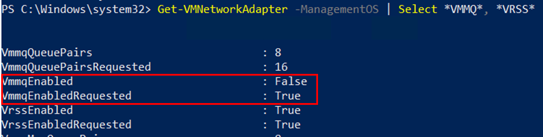

## Resolve vRSS issues

If you have completed all of the preparation steps and you still do not see vRSS load balancing traffic to the VM LPs, there are different possible issues.

1. Before you performed preparation steps, vRSS was disabled - and now must be enabled. You can run **Set-VMNetworkAdapter** to enable vRSS for the VM.

   ```PowerShell
   Set-VMNetworkAdapter <VMname> -VrssEnabled $TRUE
   Set-VMNetworkAdapter -ManagementOS -VrssEnabled $TRUE
   ```

2. RSS was disabled in the VM or on the host vNIC. Windows Server 2016 enables RSS by default; someone might have disabled it. 

   - Enabled = **True**

   **View the current settings:** 

   Run the following PowerShell cmdlet in the VM\(for vRSS in a VM\) or on the host \(for host vNIC vRSS\).

   ```PowerShell
   Get-NetAdapterRss
   ```

   **Enable the feature:** 

   To change the value from False to True, run the following PowerShell cmdlet.

   ```PowerShell
   Enable-NetAdapterRss *
   ```
   
   Another system-wide way to configure RSS is using netsh. Use 
   
    ```cmd
   netsh int tcp show global
   ```
   
   to make sure that RSS isn't disabled globally. And enable it if necessary. This setting isn't touched by *-NetAdapterRSS.

3. If you find VMMQ is not enabled after you configure vRSS, verify the following settings on each adapter attached to the virtual switch:

   - VmmqEnabled = **False**
   - VmmqEnabledRequested = **True**

   

   **View the current settings:** 

   ```PowerShell
   Get-NetAdapterAdvancedProperty -Name NICName -DisplayName 'Virtual Switch RSS'
   ```

   **Enable the feature:** 

   ```PowerShell
   Set-NetAdapterAdvancedProperty -Name NICName -DisplayName 'Virtual Switch RSS' -DisplayValue Enabled”
   ```
 
4. _(Windows Server 2019)_ You cannot enable VMMQ (VmmqEnabled = False) while setting **VrssQueueSchedulingMode** to **Dynamic**. The VrssQueueSchedulingMode does not change to Dynamic once VMMQ is enabled.<p>The **VrssQueueSchedulingMode** of **Dynamic** requires driver support when VMMQ is enabled.  VMMQ is an offload of the packet placement on logical processors and as such, requires driver support to leverage the dynamic algorithm.  Please install the NIC vendor’s driver and firmware that supports Dynamic VMMQ.


---
