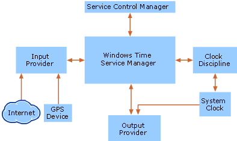

# How the Windows Time Service Works

>Applies to: Windows Server 2016, Windows Server 2012 R2, Windows Server 2012, Windows 10 or later

**In this section**  
  
-   [Windows Time Service Architecture](#windows-time-service-architecture)  
  
-   [Windows Time Service Time Protocols](#windows-time-service-time-protocols)  
  
-   [Windows Time Service Processes and Interactions](#windows-time-service-processes-and-interactions)  
  
-   [Network Ports Used by Windows Time Service](#network-ports-used-by-windows-time-service)  
  
> [!NOTE]  
> This topic explains only how the Windows Time service (W32Time) works. For information about how to configure Windows Time service, see [Configuring Systems for High Accuracy](configuring-systems-for-high-accuracy.md).
  
> [!NOTE]  
> In Windows Server 2003 and Microsoft Windows 2000 Server, the directory service is named Active Directory directory service. In  Windows Server 2008  and later versions, the directory service is named Active Directory Domain Services (AD DS). The rest of this topic refers to AD DS, but the information is also applicable to Active Directory.  
  
Although the Windows Time service is not an exact implementation of the Network Time Protocol (NTP), it uses the complex suite of algorithms that is defined in the NTP specifications to ensure that clocks on computers throughout a network are as accurate as possible. Ideally, all computer clocks in an AD DS domain are synchronized with the time of an authoritative computer. Many factors can affect time synchronization on a network. The following factors often affect the accuracy of synchronization in AD DS:  
  
-   Network conditions  
  
-   The accuracy of the computer's hardware clock  
  
-   The amount of CPU and network resources available to the Windows Time service  
  
> [!IMPORTANT]  
> Prior to Windows Server 2016, the W32Time service was not designed to meet time-sensitive application needs.  However, updates to Windows Server 2016 now allow you to implement a solution for 1ms accuracy in your domain.  See [Windows 2016 Accurate Time](accurate-time.md) and  [Support boundary to configure the Windows Time service for high-accuracy environments](support-boundary.md) for more information.  
  
Computers that synchronize their time less frequently or are not joined to a domain are configured, by default, to synchronize with time.windows.com.  Therefore, it is impossible to guarantee time accuracy on computers that have intermittent or no network connections.  
  
An AD DS forest has a predetermined time synchronization hierarchy. The Windows Time service synchronizes time between computers within the hierarchy, with the most accurate reference clocks at the top. If more than one time source is configured on a computer, Windows Time uses NTP algorithms to select the best time source from the configured sources based on the computer's ability to synchronize with that time source. The Windows Time service does not support network synchronization from broadcast or multicast peers. For more information about these NTP features, see RFC 1305 in the IETF RFC Database.  
  
Every computer that is running the Windows Time service uses the service to maintain the most accurate time. Computers that are members of a domain act as a time client by default, therefore, in most cases it is not necessary to configure the Windows Time Service. However, the Windows Time Service can be configured to request time from a designated reference time source, and can also provide time to clients.
  
The degree to which a computer's time is accurate is called a stratum. The most accurate time source on a network (such as a hardware clock) occupies the lowest stratum level, or stratum one. This accurate time source is called a reference clock. An NTP server that acquires its time directly from a reference clock occupies a stratum that is one level higher than that of the reference clock. Resources that acquire time from the NTP server are two steps away from the reference clock, and therefore occupy a stratum that is two higher than the most accurate time source, and so on. As a computer's stratum number increases, the time on its system clock may become less accurate. Therefore, the stratum level of any computer is an indicator of how closely that computer is synchronized with the most accurate time source.  
  
When the W32Time Manager receives time samples, it uses special algorithms in NTP to determine which of the time samples is the most appropriate for use. The time service also uses another set of algorithms to determine which of the configured time sources is the most accurate. When the time service has determined which time sample is best, based on the above criteria, it adjusts the local clock rate to allow it to converge toward the correct time. If the time difference between the local clock and the selected accurate time sample (also called the time skew) is too large to correct by adjusting the local clock rate, the time service sets the local clock to the correct time. This adjustment of clock rate or direct clock time change is known as clock discipline.  
  
## Windows Time Service Architecture  
The Windows Time service consists of the following components:  
  
-   Service Control Manager  
  
-   Windows Time Service Manager  
  
-   Clock Discipline  
  
-   Time providers  
  
The following figure shows the architecture of the Windows Time service.  
  
**Windows Time Service Architecture**  
  

  
The Service Control Manager is responsible for starting and stopping the Windows Time service. The Windows Time Service Manager is responsible for initiating the action of the NTP time providers included with the operating system. The Windows Time Service Manager controls all functions of the Windows Time service and the coalescing of all time samples. In addition to providing information about the current system state, such as the current time source or the last time the system clock was updated, the Windows Time Service Manager is also responsible for creating events in the event log.  
  
The time synchronization process involves the following steps:  
  
-   Input providers request and receive time samples from configured NTP time sources.  
  
-   These time samples are then passed to the Windows Time Service Manager, which collects all the samples and passes them to the clock discipline subcomponent.  
  
-   The clock discipline subcomponent applies the NTP algorithms which results in the selection of the best time sample.  
  
-   The clock discipline subcomponent adjusts the time of the system clock to the most accurate time by either adjusting the clock rate or directly changing the time.  
  
If a computer has been designated as a time server, it can send the time on to any computer requesting time synchronization at any point in this process.  
  
## Windows Time Service Time Protocols  

Time protocols determine how closely two computers' clocks are synchronized. A time protocol is responsible for determining the best available time information and converging the clocks to ensure that a consistent time is maintained on separate systems.  
  
The Windows Time service uses the Network Time Protocol (NTP) to help synchronize time across a network. NTP is an Internet time protocol that includes the discipline algorithms necessary for synchronizing clocks. NTP is a more accurate time protocol than the Simple Network Time Protocol (SNTP) that is used in some versions of Windows; however W32Time continues to support SNTP to enable backward compatibility with computers running SNTP-based time services, such as Windows 2000.  
  
### Network Time Protocol  
Network Time Protocol (NTP) is the default time synchronization protocol used by the Windows Time service in the operating system. NTP is a fault-tolerant, highly scalable time protocol and is the protocol used most often for synchronizing computer clocks by using a designated time reference.  
  
NTP time synchronization takes place over a period of time and involves the transfer of NTP packets over a network. NTP packets contain time stamps that include a time sample from both the client and the server participating in time synchronization.  
  
NTP relies on a reference clock to define the most accurate time to be used and synchronizes all clocks on a network to that reference clock. NTP uses Coordinated Universal Time (UTC) as the universal standard for current time. UTC is independent of time zones and enables NTP to be used anywhere in the world regardless of time zone settings.  
  
#### NTP Algorithms  
NTP includes two algorithms, a clock-filtering algorithm and a clock-selection algorithm, to assist the Windows Time service in determining the best time sample. The clock-filtering algorithm is designed to sift through time samples that are received from queried time sources and determine the best time samples from each source. The clock-selection algorithm then determines the most accurate time server on the network. This information is then passed to the clock discipline algorithm, which uses the information gathered to correct the local clock of the computer, while compensating for errors due to network latency and computer clock inaccuracy.  
  
The NTP algorithms are most accurate under conditions of light-to-moderate network and server loads. As with any algorithm that takes network transit time into account, NTP algorithms might perform poorly under conditions of extreme network congestion. For more information about the NTP algorithms, see RFC 1305 in the IETF RFC Database.  
  
#### NTP Time Provider  
The Windows Time service is a complete time synchronization package that can support a variety of hardware devices and time protocols. To enable this support, the service uses pluggable time providers. A time provider is responsible for either obtaining accurate time stamps (from the network or from hardware) or for providing those time stamps to other computers over the network.  
  
The NTP provider is the standard time provider included with the operating system. The NTP provider follows the standards specified by NTP version 3 for a client and server, and can interact with SNTP clients and servers for backward compatibility with Windows 2000 and other SNTP clients. The NTP provider in the Windows Time service consists of the following two parts:  
  
-   **NtpServer output provider.** This is a time server that responds to client time requests on the network.  
  
-   **NtpClient input provider.** This is a time client that obtains time information from another source, either a hardware device or an NTP server, and can return time samples that are useful for synchronizing the local clock.  
  
Although the actual operations of these two providers are closely related, they appear independent to the time service. Starting with Windows 2000 Server, when a Windows computer is connected to a network, it is configured as an NTP client. Also, computers running the Windows Time service only attempt to synchronize time with a domain controller or a manually specified time source by default. These are the preferred time providers because they are automatically available, secure sources of time.  
  
#### NTP Security  

Within an AD DS forest, the Windows Time service relies on standard domain security features to enforce the authentication of time data. The security of NTP packets that are sent between a domain member computer and a local domain controller that is acting as a time server is based on shared key authentication. The Windows Time service uses the computer's Kerberos session key to create authenticated signatures on NTP packets that are sent across the network. NTP packets are not transmitted inside the Net Logon secure channel. Instead, when a computer requests the time from a domain controller in the domain hierarchy, the Windows Time service requires that the time be authenticated. The domain controller then returns the required information in the form of a 64-bit value that has been authenticated with the session key from the Net Logon service. If the returned NTP packet is not signed with the computer's session key or is signed incorrectly, the time is rejected. All such authentication failures are logged in the Event Log. In this way, the Windows Time service provides security for NTP data in an AD DS forest.  
  
Generally, Windows time clients automatically obtain accurate time for synchronization from domain controllers in the same domain. In a forest, the domain controllers of a child domain synchronize time with domain controllers in their parent domains. When a time server returns an authenticated NTP packet to a client that requests the time, the packet is signed by means of a Kerberos session key defined by an interdomain trust account. The interdomain trust account is created when a new AD DS domain joins a forest, and the Net Logon service manages the session key. In this way, the domain controller that is configured as reliable in the forest root domain becomes the authenticated time source for all of the domain controllers in both the parent and child domains, and indirectly for all computers located in the domain tree.  
  
The Windows Time service can be configured to work between forests, but it is important to note that this configuration is not secure. For example, an NTP server might be available in a different forest. However, because that computer is in a different forest, there is no Kerberos session key with which to sign and authenticate NTP packets. To obtain accurate time synchronization from a computer in a different forest, the client needs network access to that computer and the time service must be configured to use a specific time source located in the other forest. If a client is manually configured to access time from an NTP server outside of its own domain hierarchy, the NTP packets sent between the client and the time server are not authenticated, and therefore are not secure. Even with the implementation of forest trusts, the Windows Time service is not secure across forests. Although the Net Logon secure channel is the authentication mechanism for the Windows Time service, authentication across forests is not supported.  
  
#### Hardware Devices That Are Supported by the Windows Time Service  
Hardware-based clocks such as GPS or radio clocks are often used as highly accurate reference clock devices. By default, the Windows Time service NTP time provider does not support the direct connection of a hardware device to a computer, although it is possible to create a software-based independent time provider that supports this type of connection. This type of provider, in conjunction with the Windows Time service, can provide a reliable, stable time reference.  
  
Hardware devices, such as a cesium clock or a Global Positioning System (GPS) receiver, provide accurate current time by following a standard to obtain an accurate definition of time. Cesium clocks are extremely stable and are unaffected by factors such as temperature, pressure, or humidity, but are also very expensive. A GPS receiver is much less expensive to operate and is also an accurate reference clock. GPS receivers obtain their time from satellites that obtain their time from a cesium clock. Without the use of an independent time provider, Windows time servers can acquire their time by connecting to an external NTP server, which is connected to a hardware device by means of a telephone or the Internet. Organizations such as the United States Naval Observatory provide NTP servers that are connected to extremely reliable reference clocks.  
  
Many GPS receivers and other time devices can function as NTP servers on a network. You can configure your AD DS forest to synchronize time from these external hardware devices only if they are also acting as NTP servers on your network. To do so, configure the domain controller functioning as the primary domain controller (PDC) emulator in your forest root to synchronize with the NTP server provided by the GPS device. To do so, see [Configure the Windows Time service on the PDC emulator in the Forest Root Domain](https://docs.microsoft.com/previous-versions/windows/it-pro/windows-server-2008-R2-and-2008/cc731191%28v=ws.10%29).  
  
### Simple Network Time Protocol  
The Simple Network Time Protocol (SNTP) is a simplified time protocol that is intended for servers and clients that do not require the degree of accuracy that NTP provides. SNTP, a more rudimentary version of NTP, is the primary time protocol that is used in Windows 2000. Because the network packet formats of SNTP and NTP are identical, the two protocols are interoperable. The primary difference between the two is that SNTP does not have the error management and complex filtering systems that NTP provides. For more information about the Simple Network Time Protocol, see RFC 1769 in the IETF RFC Database.  
  
### Time Protocol Interoperability  
The Windows Time service can operate in a mixed environment of computers running Windows 2000, Windows XP, and Windows Server 2003, because the SNTP protocol used in Windows 2000 is interoperable with the NTP protocol in Windows XP and Windows Server 2003.  
  
The time service in Windows NT Server 4.0, called TimeServ, synchronizes time across a Windows NT 4.0 network. TimeServ is an add-on feature available as part of the *Microsoft Windows NT 4.0 Resource Kit* and does not provide the degree of reliability of time synchronization that is required by Windows Server 2003.  
  
The Windows Time service can interoperate with computers running Windows NT 4.0 because they can synchronize time with computers running Windows 2000 or Windows Server 2003; however, a computer running Windows 2000 or Windows Server 2003 does not automatically discover Windows NT 4.0 time servers. For example, if your domain is configured to synchronize time by using the domain hierarchy-based method of synchronization and you want computers in the domain hierarchy to synchronize time with a Windows NT 4.0 domain controller, you have to configure those computers manually to synchronize with the Windows NT 4.0 domain controllers.  
  
Windows NT 4.0 uses a simpler mechanism for time synchronization than the Windows Time service uses. Therefore, to ensure accurate time synchronization across your network, it is recommended that you upgrade any Windows NT 4.0 domain controllers to Windows 2000 or Windows Server 2003.  
  
## Windows Time Service Processes and Interactions  

The Windows Time service is designed to synchronize the clocks of computers on a network. The network time synchronization process, also called time convergence, occurs throughout a network as each computer accesses time from a more accurate time server. Time convergence involves a process by which an authoritative server provides the current time to client computers in the form of NTP packets. The information provided within a packet indicates whether an adjustment needs to be made to the computer's current clock time so that it is synchronized with the more accurate server.  
  
As part of the time convergence process, domain members attempt to synchronize time with any domain controller located in the same domain. If the computer is a domain controller, it attempts to synchronize with a more authoritative domain controller.  
  
Computers running Windows XP Home Edition or computers that are not joined to a domain do not attempt to synchronize with the domain hierarchy, but are configured by default to obtain time from time.windows.com.  
  
To establish a computer running Windows Server 2003 as authoritative, the computer must be configured to be a reliable time source. By default, the first domain controller that is installed on a Windows Server 2003 domain is automatically configured to be a reliable time source. Because it is the authoritative computer for the domain, it must be configured to synchronize with an external time source rather than with the domain hierarchy. Also by default, all other Windows Server 2003 domain members are configured to synchronize with the domain hierarchy.  
  
After you have established a Windows Server 2003 network, you can configure the Windows Time service to use one of the following options for synchronization:  
  
-   Domain hierarchy-based synchronization  
  
-   A manually-specified synchronization source  
  
-   All available synchronization mechanisms  
  
-   No synchronization.  
  
Each of these synchronization types is discussed in the following section.  
  
### Domain Hierarchy-Based Synchronization  

Synchronization that is based on a domain hierarchy uses the AD DS domain hierarchy to find a reliable source with which to synchronize time. Based on domain hierarchy, the Windows Time service determines the accuracy of each time server. In a Windows Server 2003 forest, the computer that holds the primary domain controller (PDC) emulator operations master role, located in the forest root domain, holds the position of best time source, unless another reliable time source has been configured. The following figure illustrates a path of time synchronization between computers in a domain hierarchy.  
  
**Time Synchronization in an AD DS Hierarchy**  

  
#### Reliable Time Source Configuration  
A computer that is configured to be a reliable time source is identified as the root of the time service. The root of the time service is the authoritative server for the domain and typically is configured to retrieve time from an external NTP server or hardware device. A time server can be configured as a reliable time source to optimize how time is transferred throughout the domain hierarchy. If a domain controller is configured to be a reliable time source, Net Logon service announces that domain controller as a reliable time source when it logs on to the network. When other domain controllers look for a time source to synchronize with, they choose a reliable source first if one is available.  
  
#### Time Source Selection  
The time source selection process can create two problems on a network:  
  
-   Additional synchronization cycles.  
  
-   Increased volume in network traffic.  
  
A cycle in the synchronization network occurs when time remains consistent between a group of domain controllers and the same time is shared between them continuously without a resynchronization with another reliable time source. The Windows Time service's time source selection algorithm is designed to protect against these types of problems.  
  
A computer uses one of the following methods to identify a time source to synchronize with:  
  
-   If the computer is not a member of a domain, it must be configured to synchronize with a specified time source.  
  
-   If the computer is a member server or workstation within a domain, by default, it follows the AD DS hierarchy and synchronizes its time with a domain controller in its local domain that is currently running the Windows Time service.  
  
If the computer is a domain controller, it makes up to six queries to locate another domain controller to synchronize with. Each query is designed to identify a time source with certain attributes, such as a type of domain controller, a particular location, and whether or not it is a reliable time source. The time source must also adhere to the following constraints:  
  
-   A reliable time source can only synchronize with a domain controller in the parent domain.  
  
-   A PDC emulator can synchronize with a reliable time source in its own domain or any domain controller in the parent domain.  
  
If the domain controller is not able to synchronize with the type of domain controller that it is querying, the query is not made. The domain controller knows which type of computer it can obtain time from before it makes the query. For example, a local PDC emulator does not attempt to query numbers three or six because a domain controller does not attempt to synchronize with itself.  
  
The following table lists the queries that a domain controller makes to find a time source and the order in which the queries are made.  
  
**Domain Controller Time Source Queries**  
  
|Query Number|Domain Controller|Location|Reliability of Time Source|  
|----------------|---------------------|------------|------------------------------|  
|1|Parent domain controller|In-site|Prefers a reliable time source but it can synchronize with a non-reliable time source if that is all that is available.|  
|2|Local domain controller|In-site|Only synchronizes with a reliable time source.|  
|3|Local PDC emulator|In-site|Does not apply.  A domain controller does not attempt to synchronize with itself.|  
|4|Parent domain controller|Out-of-site|Prefers a reliable time source but it can synchronize with a non-reliable time source if that is all that is available.|  
|5|Local domain controller|Out-of-site|Only synchronizes with a reliable time source.|  
|6|Local PDC emulator|Out-of-site|Does not apply.  A domain controller does not attempt to synchronize with itself.| 
  
**Note**  
  
-   A computer never synchronizes with itself. If the computer attempting synchronization is the local PDC emulator, it does not attempt Queries 3 or 6.  
  
Each query returns a list of domain controllers that can be used as a time source. Windows Time assigns each domain controller that is queried a score based on the reliability and location of the domain controller. The following table lists the scores assigned by Windows Time to each type of domain controller.  
  
**Score Determination**  
  
|Domain Controller Status|Score|  
|----------------------------|---------|  
|Domain controller located in same site|8|  
|Domain controller marked as a reliable time source|4|  
|Domain controller located in the parent domain|2|  
|Domain controller that is a PDC emulator|1|  
  
When the Windows Time service determines that it has identified the domain controller with the best possible score, no more queries are made. The scores assigned by the time service are cumulative, which means that a PDC emulator located in the same site receives a score of nine.  
  
If the root of the time service is not configured to synchronize with an external source, the internal hardware clock of the computer governs the time.  
  
### Manually-Specified Synchronization  
Manually-specified synchronization enables you to designate a single peer or list of peers from which a computer obtains time. If the computer is not a member of a domain, it must be manually configured to synchronize with a specified time source. A computer that is a member of a domain is configured by default to synchronize from the domain hierarchy, manually-specified synchronization is most useful for the forest root of the domain or for computers that are not joined to a domain. Manually specifying an external NTP server to synchronize with the authoritative computer for your domain provides reliable time. However, configuring the authoritative computer for your domain to synchronize with a hardware clock is actually a better solution for providing the most accurate, secure time to your domain.  
  
Manually-specified time sources are not authenticated unless a specific time provider is written for them, and they are therefore vulnerable to attackers. Also, if a computer synchronizes with a manually-specified source rather than its authenticating domain controller, the two computers might be out of synchronization, causing Kerberos authentication to fail. This might cause other actions requiring network authentication to fail, such as printing or file sharing. If only the forest root is configured to synchronize with an external source, all other computers within the forest remain synchronized with each other, making replay attacks difficult.  
  
### All Available Synchronization Mechanisms  

The "all available synchronization mechanisms" option is the most valuable synchronization method for users on a network. This method allows synchronization with the domain hierarchy and may also provide an alternate time source if the domain hierarchy becomes unavailable, depending on the configuration. If the client is unable to synchronize time with the domain hierarchy, the time source automatically falls back to the time source specified by the **NtpServer** setting. This method of synchronization is most likely to provide accurate time to clients.  

### Stopping Time Synchronization  
There are certain situations in which you will want to stop a computer from synchronizing its time. For example, if a computer attempts to synchronize from a time source on the Internet or from another site over a WAN by means of a dial-up connection, it can incur costly telephone charges. When you disable synchronization on that computer, you prevent the computer from attempting to access a time source over a dial-up connection.  
  
You can also disable synchronization to prevent the generation of errors in the event log. Each time a computer attempts to synchronize with a time source that is unavailable, it generates an error in the Event Log. If a time source is taken off of the network for scheduled maintenance and you do not intend to reconfigure the client to synchronize from another source, you can disable synchronization on the client to prevent it from attempting synchronization while the time server is unavailable.  
  
It is useful to disable synchronization on the computer that is designated as the root of the synchronization network. This indicates that the root computer trusts its local clock. If the root of the synchronization hierarchy is not set to **NoSync** and if it is unable to synchronize with another time source, clients do not accept the packet that this computer sends out because its time cannot be trusted.
  
The only time servers that are trusted by clients even if they have not synchronized with another time source are those that have been identified by the client as reliable time servers.  
  
### Disabling the Windows Time Service  
The Windows Time service (W32Time) can be completely disabled. If you choose to implement a third-party time synchronization product that uses NTP, you must disable the Windows Time service. This is because all NTP servers need access to User Datagram Protocol (UDP) port 123, and as long as the Windows Time service is running on the Windows Server 2003 operating system, port 123 remains reserved by Windows Time.  
  
## Network Ports Used by Windows Time Service  
The Windows Time service communicates on a network to identify reliable time sources, obtain time information, and provide time information to other computers. It performs this communication as defined by the NTP and SNTP RFCs.  
  
**Port Assignments for the Windows Time Service**  
  
|Service name|UDP|TCP|  
|----------------|-------|-------|  
|NTP|123|N/A|  
|SNTP|123|N/A|  
  
## See Also  
[Windows Time Service Technical Reference](windows-time-service-tech-ref.md)
[Windows Time Service Tools and Settings](Windows-Time-Service-Tools-and-Settings.md)
[Microsoft Knowledge Base article 902229](https://go.microsoft.com/fwlink/?LinkId=186066)